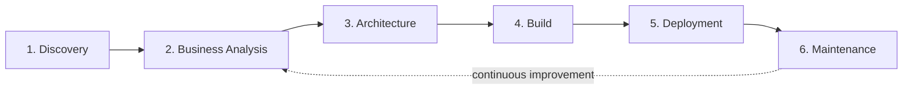

# Consulting Methodology

> Status: **Populated**

## Purpose

This document defines the six-phase delivery methodology applied to every engagement in this portfolio. It exists so that any SOP, architecture doc, or case study can reference a shared, consistent process rather than re-explaining "how we work" each time.

## The Six Phases

### Phase 1 — Discovery

**Objective:** Establish ground truth on current-state process, systems, and pain points before proposing any solution.

**Activities:**
- Stakeholder interviews (Ops leadership, front-line users, IT/Security)
- Current-state process walkthroughs, recorded and time-stamped
- Systems inventory: every tool touched by the process, its owner, its API/webhook capability, its contract/licensing constraints
- Data audit: source systems, data quality, duplication, retention

**Exit criteria:** A documented current-state process map and systems inventory, signed off by the process owner.

**Where this lives in the repo:** [`02 Discovery/`](../02%20Discovery/README.md)

### Phase 2 — Business Analysis

**Objective:** Translate discovery findings into quantified business requirements.

**Activities:**
- Cost-of-inaction modeling (labor hours × loaded cost × error rate)
- Gap analysis against target-state capability
- Requirements traceability matrix (business requirement → functional requirement → technical requirement)
- Risk register (data risk, compliance risk, change-management risk)

**Exit criteria:** A prioritized requirements backlog with quantified ROI hypothesis for each item.

**Where this lives in the repo:** [`03 Business Analysis/`](../03%20Business%20Analysis/README.md)

### Phase 3 — Architecture

**Objective:** Design the target-state system before writing any workflow logic.

**Activities:**
- Platform selection against the decision framework in [`04 Automation Framework/`](../04%20Automation%20Framework/README.md)
- Data modeling (canonical schema, normalization rules, system-of-record designation)
- Integration design (webhook vs. polling, sync direction, conflict resolution)
- Security review (auth model, secret management, PII handling)
- Architecture Decision Records (ADRs) for any non-obvious tradeoff

**Exit criteria:** An architecture diagram set (flowchart, sequence, ER) and ADR log, reviewed by a second architect.

### Phase 4 — Build

**Objective:** Implement against the SOP standard so the system is documented as it is built, not after.

**Activities:**
- SOP authored in parallel with implementation, using [`41 Templates/sop-master-template.md`](../41%20Templates/sop-master-template.md)
- Unit and integration testing per [`37 Testing/`](../37%20Testing/README.md)
- Code review against [`49 Internal Standards/`](../49%20Internal%20Standards/README.md)

**Exit criteria:** Passing test suite, complete SOP draft, peer-reviewed code/configuration.

### Phase 5 — Deployment

**Objective:** Move the system into production with a rollback path.

**Activities:**
- Staged rollout (shadow mode → partial traffic → full cutover)
- Monitoring and alerting wired per [`36 Monitoring/`](../36%20Monitoring/README.md)
- Deployment runbook per [`38 Deployment/`](../38%20Deployment/README.md)

**Exit criteria:** System live in production, monitored, with a documented rollback procedure.

### Phase 6 — Maintenance

**Objective:** Keep the system reliable and improving after go-live.

**Activities:**
- SLA-bound maintenance schedule (see [`39 Maintenance/`](../39%20Maintenance/README.md))
- Quarterly architecture review — feeds back into Phase 2 for the next iteration
- Incident postmortems logged as Lessons Learned in the relevant SOP

**Exit criteria:** n/a — this phase is continuous for the life of the system.

## Governance Artifacts Produced at Each Phase

| Phase | Primary Artifact | Owner |
|---|---|---|
| Discovery | Current-state process map | Business Analyst |
| Business Analysis | Requirements traceability matrix | Business Analyst |
| Architecture | Architecture diagram set + ADR log | Solutions Architect |
| Build | SOP + test suite | Automation Engineer |
| Deployment | Deployment runbook | DevOps / Automation Engineer |
| Maintenance | Maintenance schedule + incident log | Operations |

## Related Documentation

- [`02 Discovery/`](../02%20Discovery/README.md)
- [`03 Business Analysis/`](../03%20Business%20Analysis/README.md)
- [`04 Automation Framework/`](../04%20Automation%20Framework/README.md)
- [`41 Templates/`](../41%20Templates/README.md)

---
*Part of the Enterprise Automation Portfolio. See root [README.md](../README.md) for navigation.*
