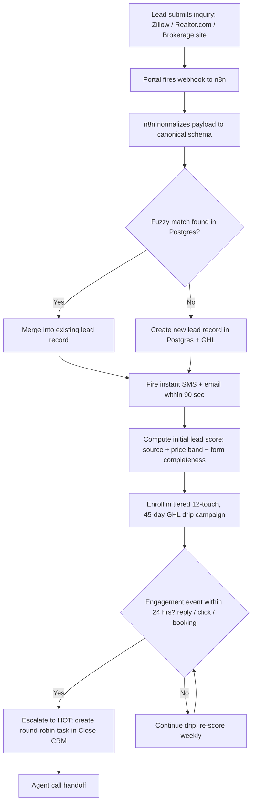
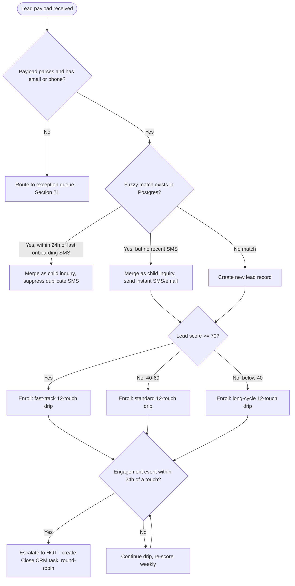
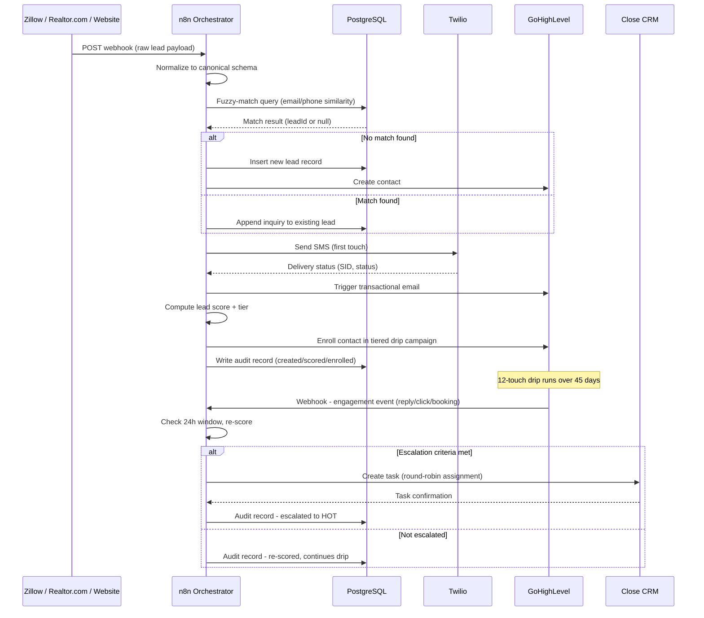

# SOP: Speed-to-Lead Response & Multi-Channel Drip Nurture Engine

**Reference Deployment Context:** Harborview Realty Partners
**Industry:** Residential Real Estate Brokerage
**Owning Section:** 07 Real Estate
**SOP ID:** RE-01
**Version:** 1.0
**Last Updated:** 2026-06-30
**Author:** Automation Architecture Consultant
**Classification:** Client-Facing
**Video Walkthrough:** _Pending recording — see script in this SOP's project folder._
**Real Build Artifacts:** [Importable n8n workflow, runnable automation script, and executable database schema →](build/README.md)

> **Video requirement:** Every SOP in this portfolio links a recorded walkthrough of the live automation (screen recording + narration), per [`49 Internal Standards`](../../49%20Internal%20Standards/README.md#8-video-walkthroughs).
>
> **Reference context note:** The client/industry framing below is an illustrative reference scenario, not a documented real client engagement. What makes this project real is the working build in [`/build`](build/README.md) — an importable n8n workflow, a runnable automation script, and executable SQL — which can be deployed and exercised independent of any specific client.

## Table of Contents

1. [Purpose](#1-purpose)
2. [Business Problem](#2-business-problem)
3. [Business Goals](#3-business-goals)
4. [Business Requirements](#4-business-requirements)
5. [Functional Requirements](#5-functional-requirements)
6. [Technical Requirements](#6-technical-requirements)
7. [Dependencies](#7-dependencies)
8. [Systems Used](#8-systems-used)
9. [Roles](#9-roles)
10. [Responsibilities](#10-responsibilities)
11. [Workflow Overview](#11-workflow-overview)
12. [Detailed Workflow Steps](#12-detailed-workflow-steps)
13. [Decision Tree](#13-decision-tree)
14. [Automation Logic](#14-automation-logic)
15. [Trigger Conditions](#15-trigger-conditions)
16. [Data Validation](#16-data-validation)
17. [Error Handling](#17-error-handling)
18. [Retry Logic](#18-retry-logic)
19. [Fallback Procedures](#19-fallback-procedures)
20. [Manual Override](#20-manual-override)
21. [Exception Handling](#21-exception-handling)
22. [Notifications](#22-notifications)
23. [Audit Logs](#23-audit-logs)
24. [Security](#24-security)
25. [Permissions](#25-permissions)
26. [Compliance](#26-compliance)
27. [Performance Metrics](#27-performance-metrics)
28. [KPIs](#28-kpis)
29. [Testing Procedure](#29-testing-procedure)
30. [Deployment](#30-deployment)
31. [Maintenance](#31-maintenance)
32. [Version History](#32-version-history)
33. [Future Improvements](#33-future-improvements)
34. [Appendix](#34-appendix)
35. [Troubleshooting](#35-troubleshooting)
36. [Recovery Procedure](#36-recovery-procedure)
37. [Frequently Asked Questions](#37-frequently-asked-questions)
38. [Technical Notes](#38-technical-notes)
39. [Business Notes](#39-business-notes)
40. [Estimated Time Savings](#40-estimated-time-savings)
41. [ROI Analysis](#41-roi-analysis)
42. [Risk Assessment](#42-risk-assessment)
43. [Lessons Learned](#43-lessons-learned)
44. [Related SOPs](#44-related-sops)

---

## 1. Purpose

This workflow captures every inbound buyer and seller lead generated across Harborview Realty Partners' three lead-generation surfaces — Zillow Premier Agent, Realtor.com, and the brokerage's own website — and guarantees a first-touch response (SMS and email) within 90 seconds of capture, regardless of which office, agent, or portal the lead originated from. It replaces a manual, agent-dependent follow-up process with a centralized intake, deduplication, scoring, and nurture layer that keeps every lead in active cultivation for 45 days and automatically escalates the leads most likely to convert to a human agent for live call handoff. The workflow exists because response speed and follow-up consistency are the two single largest controllable levers on lead-to-appointment conversion in residential real estate lead generation, and neither can be reliably delivered by a 140-agent, 6-office brokerage relying on manual triage.

## 2. Business Problem

Prior to this engagement, Harborview leads generated by third-party portals landed in each office's shared GoHighLevel inbox or, in two offices, a raw email alias, where they waited for whichever agent was on floor duty to notice, qualify, and respond. Instrumentation pulled from three months of pre-engagement CRM data showed:

- **Average time-to-first-touch: 4 hours 12 minutes** across all sources, with a long tail — 22% of leads received no human response within 24 hours.
- **Lead-to-appointment conversion rate: 4.1%** on portal-sourced leads (Zillow and Realtor.com combined), against a stated brokerage target of 8–10%, which is achievable when first response lands inside the first few minutes.
- **No deduplication layer.** The same buyer frequently submitted inquiries to multiple listings across multiple portals, generating duplicate CRM records and, in several documented cases, two different agents cold-calling the same household in the same week.
- **No structured nurture cadence.** Leads that weren't reached on the first call attempt received, at best, sporadic manual follow-up. There was no systematic multi-week cultivation for the large percentage of leads who are 60–120 days from being ready to transact.
- **No source-based prioritization.** A high-intent Zillow "request a showing" lead was treated identically to a low-intent "just curious" website form fill, consuming the same agent attention for very different conversion odds.

This SOP documents the system built to close that gap: sub-90-second automated first response, deduplicated and normalized lead intake across three structurally different data sources, and a scored, tiered, 45-day nurture sequence that surfaces engaged leads to agents in real time while keeping cold leads in cultivation without consuming agent hours.

## 3. Business Goals

- Reduce time-to-first-touch on every inbound lead, from every source, to under 90 seconds at the P95 level.
- Eliminate duplicate lead records and duplicate agent outreach caused by the same prospect appearing across multiple portals or submitting multiple inquiries.
- Increase portal-sourced lead-to-appointment conversion from the 4.1% baseline toward the brokerage's 8–10% target range within two full quarters of operation.
- Ensure no lead is abandoned after a single unanswered call attempt — every lead remains in active, source-appropriate nurture for a minimum of 45 days.
- Concentrate the 140-agent team's limited attention on the leads statistically most likely to convert (the "hot" tier) rather than spreading effort evenly across all inbound volume.
- Produce a defensible, auditable record of every lead touch for brokerage compliance and agent performance review.

## 4. Business Requirements

- **BR-1:** The system must capture leads from Zillow Premier Agent, Realtor.com, and the brokerage website form without requiring any of those three sources to change their existing lead-delivery format.
- **BR-2:** The system must send an automated SMS and email response to every net-new lead within 90 seconds of capture, 24 hours a day, 7 days a week, without human involvement.
- **BR-3:** The system must prevent the same person (matched on email or phone, allowing for common formatting variance) from being created as a duplicate lead record or from triggering duplicate outbound contact.
- **BR-4:** The system must place every lead into a nurture cadence appropriate to its source and estimated price band, running for at least 45 days, without requiring an agent to manually enroll the lead.
- **BR-5:** The system must detect when a lead demonstrates real engagement (SMS reply, email click, appointment booking) and route that lead to a live agent for call handoff within minutes of the engagement event, not at the next business day.
- **BR-6:** The system must distribute escalated "hot" leads across available agents fairly (round-robin), rather than allowing lead hoarding by any single agent or office.
- **BR-7:** The system must retain a complete, queryable audit trail of every lead's source, normalization, scoring, and touch history for a minimum of 24 months.
- **BR-8:** The system must allow an operations manager to manually re-route, re-score, or withdraw any lead from automated nurture without requiring engineering support.

## 5. Functional Requirements

- **FR-1:** n8n exposes three distinct webhook endpoints (or a shared endpoint with source-detection logic) capable of ingesting the native payload formats of Zillow, Realtor.com, and the brokerage's website form builder.
- **FR-2:** n8n normalizes all three source payloads into a single canonical lead schema before any downstream processing occurs.
- **FR-3:** Prior to CRM creation, n8n queries PostgreSQL for a fuzzy match against existing leads on normalized phone number and normalized email address; matches above the similarity threshold are merged rather than duplicated.
- **FR-4:** On successful normalization and dedup-check, n8n triggers a Twilio SMS send and a GoHighLevel transactional email send, both initiated within 90 seconds of the originating webhook call, and writes a timestamped record to PostgreSQL confirming delivery attempt.
- **FR-5:** n8n computes an initial lead score from source type, listing price band, and form-fill completeness, and writes that score to the GoHighLevel contact record as a custom field, which determines drip campaign enrollment.
- **FR-6:** GoHighLevel executes a 12-touch, 45-day multi-channel drip campaign (SMS + email, with call-task reminders to agents at defined milestones), branched by the lead's source and price band.
- **FR-7:** GoHighLevel workflow triggers (SMS reply received, email link clicked, appointment booked) fire an outbound webhook to n8n, which re-scores the lead, and — if the engagement occurred within 24 hours of the triggering touch — creates a task in Close CRM assigned via round-robin to the next available agent.
- **FR-8:** n8n writes every state transition (created, deduplicated, scored, enrolled, escalated, re-scored) to the PostgreSQL audit table with a timestamp, source workflow execution ID, and resulting system state.

| BR ID | FR ID | Description |
|---|---|---|
| BR-1 | FR-1 | Multi-source webhook intake without requiring portal-side changes |
| BR-1 | FR-2 | Canonical schema normalization across all three sources |
| BR-3 | FR-3 | Fuzzy-match deduplication against PostgreSQL lead store |
| BR-2 | FR-4 | Sub-90-second SMS + email first response |
| BR-5, BR-6 | FR-5 | Initial lead scoring driving drip tier assignment |
| BR-4 | FR-6 | 12-touch, 45-day tiered drip campaign in GoHighLevel |
| BR-5, BR-6 | FR-7 | Engagement-triggered escalation and round-robin Close CRM handoff |
| BR-7 | FR-8 | Full audit trail of state transitions in PostgreSQL |

## 6. Technical Requirements

- **n8n:** self-hosted, version 1.4x LTS branch or later; webhook nodes must support concurrent execution with a minimum throughput of 50 requests/minute sustained (peak portal syndication windows can burst above steady-state volume).
- **Twilio:** Programmable SMS API, US A2P 10DLC registered sender ID (required for real estate marketing SMS at brokerage volume); target delivery-to-carrier latency under 15 seconds under normal load.
- **GoHighLevel:** sub-account provisioned per brokerage (not per office) with API v2 access; workflow webhook triggers enabled on the sub-account; custom fields provisioned for lead score, source, price band, and drip tier.
- **Close CRM:** API key–scoped integration user with task-creation and lead-assignment permissions only (least privilege — see Section 24).
- **PostgreSQL:** version 14+, `pg_trgm` extension enabled for trigram-based fuzzy text matching on email/phone fields; minimum 99.5% monthly uptime target for the lead-audit instance.
- **Latency budget:** end-to-end from portal webhook receipt to SMS-send API call must not exceed 90 seconds at P95, 150 seconds at P99, measured from n8n execution start timestamp to Twilio API acknowledgment timestamp.
- **Data residency:** all lead PII is stored within US-region infrastructure for all four systems (n8n host, GoHighLevel, Twilio, Close, PostgreSQL) — no cross-border data transfer, consistent with brokerage data handling policy and TCPA considerations for SMS consent records.

## 7. Dependencies

- Active, credentialed API/webhook integrations must exist on the Zillow Premier Agent and Realtor.com accounts before this workflow can receive traffic — both require the brokerage to complete portal-side lead-delivery configuration independent of this SOP.
- Twilio A2P 10DLC brand and campaign registration must be approved prior to go-live; unregistered numbers are subject to aggressive carrier filtering and will silently fail to deliver at scale.
- GoHighLevel sub-account must have its calling area code and messaging service already provisioned; this workflow does not provision GHL account infrastructure.
- PostgreSQL instance must be reachable from the n8n host with the `pg_trgm` extension already installed — this is a one-time DBA task outside this workflow's automated scope.
- Close CRM round-robin assignment depends on an accurate, current active-agent roster; a stale roster (e.g., an agent on leave not removed from rotation) is an upstream data-quality dependency, not something this workflow detects.

## 8. Systems Used

| System | Role in Workflow | Auth Method |
|---|---|---|
| GoHighLevel | CRM system of record; executes the 12-touch, 45-day drip campaign engine | OAuth2 (sub-account level) |
| n8n | Webhook intake, payload normalization, deduplication orchestration, scoring, and cross-system routing | API Key (per-node credential) |
| Twilio | Sends the instant SMS first-touch within ~90 seconds of lead capture | API Key (Account SID / Auth Token) |
| Close CRM | Destination for "hot" leads that engage within 24 hours; hosts the agent call-handoff task queue | API Key |
| PostgreSQL | Lead audit trail and fuzzy-match deduplication store, keyed on normalized email/phone | Username/Password (network-restricted) |

## 9. Roles

- **Business Owner:** VP of Sales, Harborview Realty Partners — owns conversion targets, drip messaging approval, and agent round-robin policy.
- **Technical Owner:** Director of RevOps / Marketing Automation Lead — owns the n8n workflow, GoHighLevel campaign configuration, and PostgreSQL schema.
- **Escalation Contact (Tier 1):** Office Managing Broker on duty — first point of contact for agent-facing issues (missed hot-lead tasks, incorrect routing).
- **Escalation Contact (Tier 2):** Automation Architecture Consultant (engagement owner) — engaged for platform-level failures (webhook outages, integration breakage, schema changes from portal partners).

## 10. Responsibilities

| Role | Responsibility |
|---|---|
| VP of Sales | Approves drip cadence content, scoring weights, and round-robin agent roster policy |
| Director of RevOps | Owns and maintains the n8n workflow, GHL campaign builder, and PostgreSQL audit schema |
| Managing Broker (per office) | First-line triage for agent complaints about missed or misrouted hot leads |
| On-call Agent (round-robin) | Responds to Close CRM call-handoff tasks within the defined SLA (15 minutes during business hours) |
| Automation Architecture Consultant | Maintains integration health, handles portal-side schema changes, quarterly performance review |

## 11. Workflow Overview

At a system level: a lead submits an inquiry on any of the three source surfaces, the receiving portal fires a webhook to n8n, n8n normalizes and deduplicates the lead, fires the instant SMS/email response, scores and enrolls the lead into GoHighLevel's drip engine, and then continuously monitors for engagement signals that would promote the lead to the hot-lead queue in Close CRM for live agent handoff.



## 12. Detailed Workflow Steps

**Step 1 — Webhook receipt (n8n).**
*Tool:* n8n Webhook node.
*Trigger:* HTTP POST from Zillow, Realtor.com, or Harborview's website form handler.
*Input schema:* varies by source — see raw payload examples below.
*Transformation:* none at this stage; payload is passed to the Normalization sub-workflow with a `source` tag attached based on the receiving endpoint URL or a source-detection field match.
*Output schema:* raw payload + `source` metadata field.
*Condition branches:* if the payload fails basic JSON parsing, route immediately to the malformed-payload exception path (Section 21).
*Error handling reference:* Section 17, Scenario 2 (malformed webhook payload).

**Raw Zillow Premier Agent payload (representative):**
```json
{
  "leadSource": "Zillow Premier Agent",
  "inquiryType": "Contact Request",
  "propertyAddress": "482 Harborview Ln, Unit 3B",
  "listingId": "zpid-994211837",
  "listPrice": 615000,
  "person": {
    "firstName": "Dana",
    "lastName": "Whitfield",
    "emailAddress": "dana.whitfield@example.com",
    "phoneNumber": "(555) 214-7783"
  },
  "message": "Is this still available? Would like to see it this weekend.",
  "createdAt": "2026-06-30T14:02:11Z"
}
```

**Raw Realtor.com payload (representative — note different field shape):**
```json
{
  "lead_type": "buyer_inquiry",
  "source_name": "realtor.com",
  "listing": {
    "mls_id": "MLS-3387245",
    "address_line1": "482 Harborview Ln",
    "address_line2": "Unit 3B",
    "price": "615000"
  },
  "contact": {
    "full_name": "Dana Whitfield",
    "email": "Dana.Whitfield@example.com",
    "phone": "555.214.7783"
  },
  "comments": "Interested in scheduling a tour.",
  "submitted_at": "2026-06-30T14:03:47.000Z"
}
```

**Step 2 — Payload normalization (n8n).**
*Tool:* n8n Function/Code node, one branch per source.
*Trigger:* completion of Step 1.
*Input schema:* raw source-specific payload.
*Transformation:* maps source fields into the canonical schema below — splits/joins names, strips phone formatting to E.164, lowercases and trims email, converts price strings to integers, derives a `priceBand` bucket.
*Output schema:* canonical lead object (below).
*Condition branches:* if required fields (email OR phone, plus a name) are entirely absent after mapping, route to exception handling (Section 21) rather than creating a partial record.
*Error handling reference:* Section 17, Scenario 2.

**Canonical normalized schema (both examples above resolve to this):**
```json
{
  "leadId": null,
  "source": "zillow",
  "sourceLeadType": "buyer_inquiry",
  "firstName": "Dana",
  "lastName": "Whitfield",
  "email": "dana.whitfield@example.com",
  "phone": "+15552147783",
  "propertyAddress": "482 Harborview Ln, Unit 3B",
  "listingRef": "zpid-994211837",
  "listPrice": 615000,
  "priceBand": "500k-750k",
  "inquiryNote": "Is this still available? Would like to see it this weekend.",
  "capturedAt": "2026-06-30T14:02:11Z",
  "dedupeKeyEmail": "dana.whitfield@example.com",
  "dedupeKeyPhone": "15552147783"
}
```

**Step 3 — Deduplication check (n8n + PostgreSQL).**
*Tool:* n8n Postgres node executing a `pg_trgm` similarity query.
*Trigger:* completion of Step 2.
*Input schema:* `dedupeKeyEmail`, `dedupeKeyPhone` from canonical object.
*Transformation:* queries `leads` table for rows where `similarity(email, $1) > 0.85 OR similarity(phone, $2) > 0.92`; phone threshold is higher because phone numbers should match near-exactly once normalized to E.164, while email allows for minor typos/casing.
*Output schema:* either a matched `leadId` (merge path) or null (create path).
*Condition branches:* match → append new inquiry as a child event on the existing lead, do not re-fire onboarding SMS if one was sent in the last 24 hours (see Section 17, Scenario 3 for the race-condition variant); no match → proceed to lead creation.
*Error handling reference:* Section 17, Scenario 3 (duplicate lead race condition).

**Step 4 — Instant response (Twilio + GoHighLevel).**
*Tool:* Twilio SMS API (n8n HTTP node) and GHL transactional email trigger.
*Trigger:* lead record created or merged with new-inquiry flag.
*Input schema:* canonical lead object.
*Transformation:* renders SMS/email templates with lead first name, property address, and assigned/rotating office phone number.
*Output schema:* Twilio message SID + delivery status; GHL email send confirmation.
*Condition branches:* invalid or undeliverable phone → email-only fallback (Section 19); Twilio rate-limited → queued retry (Section 18).
*Error handling reference:* Section 17, Scenarios 1 and 5.

**Step 5 — Lead scoring (n8n).**
*Tool:* n8n Function node implementing the scoring function (Section 14).
*Trigger:* successful first-touch send.
*Input schema:* canonical lead object + engagement history (initially empty).
*Transformation:* computes a 0–100 score from source weight, price band, and form completeness.
*Output schema:* lead object with `score` and `tier` fields populated; written back to GHL contact custom fields.
*Condition branches:* score ≥ 70 → fast-track tier; 40–69 → standard tier; <40 → long-cycle tier. Tier determines which of the three drip variants is enrolled in Step 6.
*Error handling reference:* N/A — scoring failure defaults to standard tier rather than blocking the workflow (fail-safe default, see Section 21).

**Step 6 — Drip enrollment (GoHighLevel).**
*Tool:* GHL Workflow/Campaign engine.
*Trigger:* tier assignment from Step 5.
*Input schema:* contact ID + tier + source + price band.
*Transformation:* enrolls contact into the corresponding 12-touch, 45-day campaign variant (Section 14 details touch cadence).
*Output schema:* GHL workflow enrollment confirmation, written to Postgres audit log.
*Condition branches:* none at enrollment; branching occurs downstream on engagement events.
*Error handling reference:* Section 17, Scenario 4 (GHL API timeout).

**Step 7 — Engagement monitoring and escalation (GoHighLevel → n8n → Close CRM).**
*Tool:* GHL workflow webhook trigger → n8n → Close CRM API.
*Trigger:* SMS reply received, tracked email link clicked, or appointment booked via GHL calendar.
*Input schema:* GHL engagement event payload (contact ID, event type, timestamp).
*Transformation:* n8n checks whether the triggering touch occurred within the last 24 hours; if so, re-scores the lead upward, marks it `hot`, and creates a Close CRM task via round-robin assignment logic.
*Output schema:* Close CRM task object with assigned agent, lead context, and source touch that triggered escalation.
*Condition branches:* engagement outside the 24-hour window from the last send → re-score only, no escalation, remains in drip.
*Error handling reference:* Section 17, Scenario 4; Section 18 (retry on Close API failure).

## 13. Decision Tree



## 14. Automation Logic

The sequence diagram below traces the cross-system message flow from initial webhook capture through to agent handoff in Close CRM.



Core scoring and routing logic, implemented as an n8n Function node:

```python
from dataclasses import dataclass
from datetime import datetime, timedelta, timezone

SOURCE_WEIGHTS = {"zillow": 30, "realtor_com": 25, "brokerage_site": 20}
PRICE_BAND_WEIGHTS = {"under_300k": 10, "300k-500k": 15, "500k-750k": 20, "750k-plus": 25}


@dataclass
class CanonicalLead:
    source: str
    price_band: str
    form_completeness: float  # 0.0-1.0, share of optional fields populated
    last_touch_at: datetime | None
    engagement_event_at: datetime | None


def score_lead(lead: CanonicalLead) -> int:
    """Compute a 0-100 lead score from source quality, price band, and form completeness.

    Fails safe: any missing weight lookup defaults to the lowest tier weight
    rather than raising, so a scoring gap never blocks enrollment.
    """
    source_score = SOURCE_WEIGHTS.get(lead.source, 15)
    price_score = PRICE_BAND_WEIGHTS.get(lead.price_band, 10)
    completeness_score = round(lead.form_completeness * 25)
    return min(100, source_score + price_score + completeness_score)


def assign_tier(score: int) -> str:
    """Map a numeric score to a drip campaign tier."""
    if score >= 70:
        return "fast_track"
    if score >= 40:
        return "standard"
    return "long_cycle"


def should_escalate_to_hot(lead: CanonicalLead, now: datetime | None = None) -> bool:
    """A lead escalates to the hot queue only if it engaged within 24 hours
    of its most recent outbound touch — engagement outside that window
    is treated as passive re-scoring, not urgent handoff.
    """
    now = now or datetime.now(timezone.utc)
    if lead.engagement_event_at is None or lead.last_touch_at is None:
        return False
    return (now - lead.last_touch_at) <= timedelta(hours=24) and lead.engagement_event_at >= lead.last_touch_at
```

**Drip cadence structure (12 touches over 45 days, GoHighLevel workflow):**

| Day | Touch | Channel | Varies by |
|---|---|---|---|
| 0 | Instant response | SMS + Email | Source (property/listing reference) |
| 1 | Value-add follow-up (market snapshot) | Email | Price band |
| 2 | Personal check-in | SMS | Tier |
| 5 | Listing alert / similar properties | Email | Source, price band |
| 8 | Soft CTA — book a call | SMS | Tier |
| 12 | Educational content (buying/selling process) | Email | Lead type (buyer/seller) |
| 16 | Agent video intro | Email | Office/agent assignment |
| 22 | Re-engagement SMS | SMS | Tier |
| 28 | Market update | Email | Price band |
| 34 | Direct CTA — availability this week | SMS | Tier |
| 40 | Testimonial / social proof | Email | Source |
| 45 | Final-touch, re-scoring checkpoint | SMS + Email | All — triggers weekly re-score cadence thereafter |

## 15. Trigger Conditions

The workflow has two classes of triggers:

**Inbound capture trigger:** an HTTP POST webhook call from Zillow Premier Agent, Realtor.com, or the Harborview website form handler, received on the n8n intake endpoint. There is no polling — all three sources push in near real time by design.

**Trigger payload schema (post-normalization, this is what downstream steps consume):**
```json
{
  "source": "zillow | realtor_com | brokerage_site",
  "sourceLeadType": "buyer_inquiry | seller_inquiry | showing_request | valuation_request",
  "firstName": "string",
  "lastName": "string",
  "email": "string | null",
  "phone": "string (E.164) | null",
  "propertyAddress": "string | null",
  "listingRef": "string | null",
  "listPrice": "integer | null",
  "inquiryNote": "string | null",
  "capturedAt": "ISO 8601 timestamp"
}
```

**Engagement trigger:** a GoHighLevel workflow webhook firing on one of three defined events — inbound SMS reply on a drip thread, tracked link click in a drip email, or appointment booked via the GHL calendar embedded in drip content. This trigger carries `contactId`, `eventType`, and `eventTimestamp`, and is what drives the escalation decision in Section 14.

## 16. Data Validation

| Field | Rule | Failure Action |
|---|---|---|
| email OR phone | At least one must be present and non-empty after normalization | Route to exception queue (Section 21); no lead record created |
| phone | Must normalize to valid E.164 US format (10 digits + country code) | Flag `phoneInvalid = true`; suppress SMS send, proceed with email-only touch |
| email | Must match RFC 5322 basic pattern after trim/lowercase | Flag `emailInvalid = true`; suppress email send, proceed with SMS-only touch |
| listPrice | Must be a positive integer if present; strip currency symbols/commas before cast | If cast fails, set `priceBand = "unknown"` and default to standard scoring weight |
| capturedAt | Must parse as a valid ISO 8601 timestamp | If missing or unparseable, substitute n8n execution timestamp and flag `timestampInferred = true` |
| source | Must match one of the three known enum values | If unrecognized, tag `source = "other"` and route to standard-tier drip (never fast-track an unknown source) |
| dedupeKeyEmail / dedupeKeyPhone | Must be populated before the Postgres similarity query executes | If both are null post-normalization, this is unreachable given the email/phone rule above — defensive check only, logs a warning if hit |

## 17. Error Handling

**Scenario 1 — Twilio rate limit / throughput cap exceeded.**
*Detection:* Twilio API returns HTTP 429 or error code 20429 on the SMS send call.
*Response:* n8n catches the error, writes the message to an in-memory retry queue with exponential backoff (Section 18), and does not fail the overall execution — the email send proceeds independently on schedule so the lead still receives a first touch inside the 90-second window even if SMS is delayed.

**Scenario 2 — Malformed or incomplete webhook payload.**
*Detection:* JSON parse failure, or successful parse but missing both email and phone after normalization mapping.
*Response:* the execution branches to the exception path — the raw payload is written verbatim to a `lead_exceptions` table in PostgreSQL with a `reason` code, and a Slack notification fires to the RevOps channel (Section 22). No partial or malformed lead record is created in GoHighLevel.

**Scenario 3 — Duplicate lead race condition.**
*Detection:* two webhook calls for the same underlying person arrive within milliseconds of each other (common when a buyer submits inquiries on the same listing syndicated across Zillow and the brokerage's own site simultaneously), and both execute the Postgres fuzzy-match query before either has committed its insert — both see "no match" and both attempt to create a record.
*Response:* the `leads` table enforces a unique constraint on normalized phone (where not null); the second insert fails at the database level, n8n catches the constraint violation, re-runs the fuzzy-match query (which now finds the just-committed row), and merges into it instead. This is treated as an expected race, not a fatal error — it is logged at `info` severity, not escalated.

**Scenario 4 — GoHighLevel API timeout during enrollment or contact update.**
*Detection:* GHL API call exceeds the configured 10-second timeout without a response.
*Response:* n8n retries per the backoff policy in Section 18. If all retries exhaust, the lead record and score are already durably stored in PostgreSQL (write-ahead pattern — Postgres is written before the GHL call is attempted), so no lead data is lost; the failed enrollment is written to the dead-letter queue for manual reconciliation (Section 19).

**Scenario 5 — Invalid or undeliverable phone number.**
*Detection:* Twilio returns a delivery status of `undelivered` or `failed` with an error code indicating an invalid/landline number (e.g., 21211, 21614), either synchronously or via Twilio's async status callback.
*Response:* n8n flags the contact record `smsUndeliverable = true` in GoHighLevel, removes the contact from any SMS-channel drip steps going forward (email-only for the remainder of the 45-day cycle), and does not treat this as a workflow failure — it is a data-quality condition on the lead itself, logged and surfaced in the weekly ops digest rather than triggering an incident alert.

**Additional scenario — Close CRM assignment failure.**
*Detection:* Close API returns a non-2xx response when creating the hot-lead task, or the round-robin roster resolves to zero available agents (e.g., all agents marked out-of-office).
*Response:* n8n retries per Section 18; if still unresolved, the task is written to the dead-letter queue and a high-severity Slack alert fires to the on-duty Managing Broker, since a hot lead not reaching a human agent inside its engagement window is the single highest-cost failure mode in this workflow.

## 18. Retry Logic

All outbound API calls (Twilio, GoHighLevel, Close CRM) use exponential backoff with jitter: retry attempts at 2s, 8s, 30s, and a final attempt at 120s — four attempts total before the call is considered exhausted. Each retry carries an idempotency key derived from a deterministic hash of `{leadId}:{eventType}:{touchSequenceNumber}` so that a retried call cannot cause a duplicate SMS send, duplicate GHL enrollment, or duplicate Close task even if an earlier attempt actually succeeded but the success response was lost in transit (e.g., a network timeout after Twilio accepted the message but before n8n received the 200). Database writes to PostgreSQL are wrapped in transactions and are themselves idempotent on the audit table's composite key of `(lead_id, event_type, occurred_at)`, so a retried audit write cannot double-count a state transition.

## 19. Fallback Procedures

When retries exhaust for a given call, the failed operation is written to a PostgreSQL-backed dead-letter table (`lead_dlq`) with the full request payload, the error detail from the final attempt, and a `resolved` boolean defaulted to false. The dead-letter queue is polled every 15 minutes by a lightweight n8n monitoring workflow that attempts a single re-processing pass; items that fail a second time are left for manual review rather than retried indefinitely, to avoid masking a systemic outage (e.g., a GHL account-level API key rotation) behind endless silent retries. Degraded-mode behavior is channel-specific: if Twilio is unreachable but GHL email is healthy, the lead still receives a first touch by email alone inside the 90-second window, and SMS is queued for delivery once Twilio recovers rather than blocking the entire first-touch sequence on a single channel's availability.

## 20. Manual Override

The Director of RevOps and any Managing Broker have standing access to the operations console (a lightweight internal view backed by the PostgreSQL audit table and GHL's own contact UI) to: re-assign a lead's tier manually, pull a lead out of automated drip entirely (e.g., on a Do-Not-Contact request), force an immediate escalation to the hot queue regardless of the 24-hour engagement window, or manually resolve a dead-letter queue item. Manual overrides are themselves written to the audit log with the acting user's identity and a required free-text reason, so an override is never silent. Overrides do not require engineering support for the common cases listed above; engineering involvement is only required for schema-level changes (e.g., adding a new lead source) or for resolving DLQ items caused by upstream integration failures rather than lead-specific decisions.

## 21. Exception Handling

Malformed payloads (Section 17, Scenario 2) and partial data (a lead with only a first name and no other identifying field) are both routed to the same `lead_exceptions` table rather than being force-fit into the canonical schema — this preserves the raw data for manual reconstruction without ever creating a low-quality or unreachable lead record downstream. Unexpected states — for example, an engagement webhook arriving for a `contactId` that no longer resolves to a known lead in PostgreSQL (possible if a lead was manually deleted from GHL directly, bypassing this workflow) — are logged as orphaned-event warnings and do not raise an operational alert on their own; if the volume of orphaned events crosses a threshold (more than 5 in a rolling 24-hour window), that is treated as a signal of a broader sync problem and does escalate to the RevOps Slack channel.

## 22. Notifications

| Event | Channel | Severity | Recipient |
|---|---|---|---|
| Malformed payload / lead exception | Slack | Medium | #revops-alerts |
| Twilio/GHL/Close retry exhausted → DLQ write | Slack | High | #revops-alerts + on-call Director of RevOps |
| Zero available agents for round-robin assignment | Slack | Critical | #revops-alerts + on-duty Managing Broker (paged) |
| Hot-lead escalation created in Close CRM | Close CRM native notification + SMS | Standard | Assigned agent |
| Weekly re-score digest | Email | Informational | VP of Sales, Director of RevOps |
| Orphaned-event threshold breached (>5 in 24h) | Slack | High | #revops-alerts |

## 23. Audit Logs

Every state transition — lead creation, dedup merge, score computed, drip enrollment, engagement event received, escalation decision (and its rationale), and manual override — is written to a PostgreSQL `lead_audit_log` table containing the lead ID, event type, resulting state, the n8n workflow execution ID that produced it, and a UTC timestamp. This table is append-only; no row is ever updated or deleted, which makes it usable both for operational debugging (reconstructing exactly why a given lead did or didn't escalate) and for brokerage-side compliance review (demonstrating that TCPA consent and response-time commitments were met on a per-lead basis). Retention is set at 24 months per Section 4 (BR-7), after which records are archived to cold storage rather than deleted, in case of later dispute review.

## 24. Security

Authentication to GoHighLevel uses OAuth2 at the sub-account level with scopes limited to contacts, workflows, and custom fields — no billing or account-administration scope is granted to the integration credential. Twilio uses an Account SID/Auth Token pair stored in n8n's encrypted credential store, never inlined in workflow JSON. Close CRM's integration API key is scoped to task-creation and lead-read/write only; it cannot delete leads or modify billing. PostgreSQL is network-restricted to the n8n host's IP range only — it is not publicly reachable — and connections are enforced over TLS. All PII (names, emails, phone numbers, property addresses) is encrypted at rest at the storage-volume level on the PostgreSQL host and in transit via TLS 1.2+ on every API call between systems. No credential of any kind is logged; audit log entries reference lead and event IDs only, never raw credential material.

## 25. Permissions

| Role | View Lead Data | Edit Drip Config | Trigger Manual Override | Access Raw Credentials |
|---|---|---|---|---|
| Agent | Yes (assigned leads only) | No | No | No |
| Managing Broker | Yes (office-wide) | No | Yes | No |
| Director of RevOps | Yes (brokerage-wide) | Yes | Yes | Yes (n8n/GHL only) |
| VP of Sales | Yes (brokerage-wide, reporting view) | Approval only, not direct edit | No | No |
| Automation Architecture Consultant | Yes (brokerage-wide, for support) | Yes | Yes | Yes (all systems, time-boxed) |

## 26. Compliance

This workflow is subject to the Telephone Consumer Protection Act (TCPA) given its use of automated SMS to consumers who have not necessarily granted prior express written consent at the moment of a portal-sourced inquiry; the first-touch SMS template is written to qualify as informational/transactional in response to the consumer's own inquiry, and every drip-tier SMS includes a compliant opt-out instruction, with opt-outs enforced at the Twilio and GHL level simultaneously so a "STOP" reply suppresses all future SMS regardless of which system would have triggered the next send. CAN-SPAM requirements are satisfied on the email side through GoHighLevel's built-in unsubscribe handling. No health, financial account, or payment card data passes through this workflow, so HIPAA and PCI-DSS are out of scope. The brokerage's data handling policy requires US-only data residency, satisfied by all four systems' hosting configuration as noted in Section 6.

## 27. Performance Metrics

| Metric | Target |
|---|---|
| Time-to-first-touch (webhook receipt → SMS API acknowledgment), P95 | ≤ 90 seconds |
| Time-to-first-touch, P99 | ≤ 150 seconds |
| Webhook intake success rate (valid payloads processed without exception) | ≥ 99.5% |
| Deduplication accuracy (false-merge rate) | < 0.5% of processed leads |
| GHL enrollment success rate on first attempt | ≥ 98% |
| Engagement-to-escalation latency (webhook receipt → Close task created) | ≤ 3 minutes, P95 |
| Dead-letter queue resolution time | ≤ 4 business hours |

## 28. KPIs

| KPI | Baseline (pre-engagement) | Target (post-engagement, steady state) |
|---|---|---|
| Average time-to-first-touch | 4 hours 12 minutes | Under 90 seconds |
| Portal lead-to-appointment conversion rate | 4.1% | 8.5%+ |
| Duplicate lead/agent-collision incidents per month | ~18 (estimated from CRM review) | Near zero |
| Leads receiving zero response within 24 hours | 22% | 0% (all leads receive automated first touch) |
| Hot-lead-to-agent-contact SLA compliance (agent contacts within 15 min of task creation) | Not tracked previously | ≥ 90% |
| 45-day drip completion rate (leads that stay enrolled without opt-out) | N/A (no structured drip existed) | ≥ 70% |

## 29. Testing Procedure

Unit-level tests validate the normalization mapping for each of the three source payload shapes independently, confirming canonical schema output matches expected field values for a representative sample payload per source, including edge cases (missing optional fields, malformed price strings, international-format phone numbers that should be rejected as out-of-scope for a domestic brokerage). Integration tests exercise the full chain against sandbox credentials for Twilio, GHL, and Close — verifying that a synthetic lead triggers an SMS within the 90-second budget, enrolls in the correct drip tier, and that a simulated engagement event correctly triggers Close task creation only within the 24-hour window and correctly does not escalate outside it. UAT is run with the RevOps team and a sample of agents across two offices, submitting real (test) inquiries through the actual Zillow and Realtor.com test-lead tooling where available, and validating agent-side experience of the Close CRM task queue. Full methodology and environment setup reference [`37 Testing/`](../../37%20Testing/README.md).

## 30. Deployment

Deployment follows a phased rollout: the n8n workflow and PostgreSQL schema are deployed first in a shadow mode where leads are captured, normalized, and scored but no outbound SMS/email fires, to validate normalization and dedup accuracy against real production traffic without any consumer-facing risk. After a one-week shadow period with clean results, one office is cut over to live outbound (first touch + drip), followed by the remaining five offices over a subsequent two-week window. Rollback at any phase is a single feature-flag toggle in n8n that reverts affected offices to shadow mode (data capture continues, outbound suppressed) without requiring a redeploy. Full environment and rollback detail reference [`38 Deployment/`](../../38%20Deployment/README.md).

## 31. Maintenance

Recurring maintenance includes a monthly review of the fuzzy-match similarity thresholds against observed false-merge and missed-merge rates, a quarterly review of drip content and cadence performance (open/click/reply rates per touch, to prune underperforming touches), and semi-annual verification of the Twilio A2P 10DLC registration status, since carrier compliance requirements are revised periodically and lapses silently degrade SMS deliverability rather than producing an obvious error. Reference [`39 Maintenance/`](../../39%20Maintenance/README.md) for the standard maintenance cadence this engagement follows.

## 32. Version History

| Version | Date | Author | Change |
|---|---|---|---|
| 1.0 | 2026-06-30 | Automation Architecture Consultant | Initial release |

## 33. Future Improvements

- Introduce AI-driven intent scoring on inbound inquiry free-text (see RE-03) to refine the initial score beyond source/price-band/completeness heuristics.
- Add a predictive best-time-to-call model per lead, informed by historical engagement timestamps, to improve agent contact rates on hot-lead tasks.
- Extend deduplication matching to include property-address proximity as a secondary signal for households inquiring on multiple listings in the same building or development.
- Build a self-service drip-content editor for the VP of Sales so cadence copy changes do not require RevOps or engineering involvement.

## 34. Appendix

Full API specifications for Zillow Premier Agent lead delivery, Realtor.com ConnectionsSM lead delivery, and GoHighLevel's Workflow Webhook Actions are maintained outside this document by the respective platform vendors and are versioned separately from this SOP; the payload examples in Section 12 reflect the field shapes current as of this SOP's last update and should be reverified against vendor documentation before any structural change to the normalization mapping. A glossary term worth flagging: "hot lead" in this SOP refers exclusively to the 24-hour engagement-triggered escalation tier, and should not be conflated with the "fast_track" scoring tier from Section 14, which is a pre-engagement classification based on source and price band alone — a lead can be fast_track-scored and never go hot, and a long_cycle-scored lead can still go hot if it engages promptly.

## 35. Troubleshooting

| Symptom | Likely Cause | Fix |
|---|---|---|
| Leads from one portal stop arriving entirely | Portal-side webhook URL misconfigured or credential expired | Verify webhook delivery log on portal side; re-issue n8n webhook URL if rotated |
| SMS first-touch consistently delayed beyond 90 seconds | Twilio throughput throttling during a volume spike, or n8n worker queue backlog | Check Twilio rate-limit dashboard and n8n execution queue depth; scale n8n worker concurrency if queue-bound |
| Duplicate leads appearing despite dedup logic | Fuzzy-match threshold set too conservative, or phone/email normalization missing an edge case (e.g., extension digits) | Review recent false-negative merges in audit log; adjust `pg_trgm` similarity threshold or normalization regex |
| Hot leads not reaching Close CRM | Round-robin roster empty/stale, or GHL webhook trigger misconfigured | Verify active-agent roster in Close; confirm GHL workflow webhook action is still enabled after any campaign edit |
| Agents report receiving leads with no context | Close task creation succeeded but lead context payload truncated | Check Close API payload size against field limits; verify n8n mapping includes full inquiry note and source |

## 36. Recovery Procedure

If the n8n orchestrator is down entirely, portal webhooks will queue at the portal/n8n network boundary for a limited window (portal-dependent, typically minutes not hours) before the sending system marks delivery as failed — leads submitted during an extended outage may be permanently lost from automated capture and require manual pull from each portal's own lead dashboard as a stopgap. On recovery, first validate PostgreSQL integrity (no partial transactions left open), then replay any leads recovered from portal-side dashboards through the normal webhook endpoint manually, then resume live traffic. If GoHighLevel or Close CRM experiences an extended outage, n8n continues capturing, normalizing, and deduplicating leads into PostgreSQL (the write-ahead store), queuing the downstream calls in the dead-letter queue for automatic replay once the dependent system recovers — no lead data is lost in this scenario, only outbound timing is delayed.

## 37. Frequently Asked Questions

**Q: What happens if a lead replies "STOP" to a drip SMS but later submits a new inquiry through a different portal?**
A: The opt-out is keyed to the phone number at the Twilio/GHL level, not to the specific lead record, so SMS remains suppressed for that phone number across all future inquiries unless the consumer explicitly re-opts-in; email touches are unaffected unless a separate unsubscribe was recorded.

**Q: Can an agent manually add a lead into the drip campaign that came in through a channel this workflow doesn't cover, e.g., a walk-in or referral?**
A: Yes, via manual override (Section 20) — the operations console allows manual lead creation with a `source = "manual"` tag, which defaults to standard-tier scoring.

**Q: Why 45 days and not longer or shorter?**
A: See Section 39 — this was a deliberate business tradeoff, not a platform limitation.

**Q: Does the system ever stop nurturing a lead entirely?**
A: Yes — after the 45-day, 12-touch sequence completes without escalation, the lead exits active drip and moves to the weekly re-score cadence indefinitely, but no further scheduled touches fire unless re-scoring pushes it back into an active tier or a human manually re-engages it.

## 38. Technical Notes

The write-before-call ordering in Section 17 (Scenario 4) — always durably persisting lead state to PostgreSQL before attempting the corresponding GHL/Twilio/Close API call — is the single most important architectural decision in this workflow, since it guarantees that no external API outage can result in silent lead loss; every downstream failure degrades to "delayed" rather than "lost." A subtlety worth flagging for future engineers: the `pg_trgm` similarity function is not symmetric in practical effect when phone numbers contain formatting artifacts (e.g., a lead source occasionally includes an extension suffix), so the E.164 normalization step in Section 12 must run before, never after, the similarity comparison — an earlier internal draft of this workflow ran normalization and dedup in the wrong order and produced a measurable false-negative merge rate during shadow-mode testing.

## 39. Business Notes

The 45-day, 12-touch cadence length was a deliberate compromise between VP of Sales' initial preference (90 days, to match average buyer research-to-offer cycles observed in brokerage data) and agent feedback that leads older than 45 days without engagement were rarely worth the CRM noise of continued tracking; 45 days was selected as the point capturing roughly the top three quartiles of eventual converters while keeping the active-lead pool manageable for weekly re-score review. The decision to escalate on any of three engagement types (reply, click, booking) rather than requiring multiple signals was intentionally permissive — the cost of a false-positive hot-lead task (an agent makes one unnecessary call) was judged far lower than the cost of a false negative (a genuinely ready buyer left in passive drip), and this tradeoff should be revisited if agent capacity becomes the binding constraint rather than lead volume.

## 40. Estimated Time Savings

Pre-engagement, each of the 6 offices relied on a rotating floor-duty agent spending an estimated 15 minutes per inbound lead on manual triage alone (reviewing the raw inquiry, checking for existing CRM records, drafting and sending a first response) before any qualification call — separate from the qualification call itself, which is unaffected by this workflow. At an average observed volume of approximately 340 portal-sourced leads per month brokerage-wide:

- Manual triage time eliminated: 340 leads × 15 minutes = 5,100 minutes/month = **85 hours/month**.
- Manual dedup/lookup checking (estimated 5 minutes per lead, previously performed inconsistently and often skipped, contributing to the ~18/month collision incidents): 340 × 5 minutes = 1,700 minutes/month = **28.3 hours/month**.
- Combined direct labor-hours saved: **~113 hours/month**, or roughly 0.68 FTE reallocated from manual triage to selling activity across the brokerage.

## 41. ROI Analysis

**Build cost inputs:**
- Automation architecture and build (n8n workflows, GHL campaign build, Postgres schema, Twilio/Close integration): 120 consulting hours at a blended rate of $175/hour = **$21,000**.
- One-time platform setup (Twilio A2P 10DLC registration, GHL sub-account configuration, Postgres provisioning): **$1,500**.
- **Total one-time build cost: $22,500.**

**Recurring monthly run cost inputs:**
- n8n hosting (self-hosted VM, sized for this workload): **$120/month**.
- Twilio SMS spend at ~340 leads × 12 touches (not all touches are SMS, roughly 5 of 12 are SMS) × $0.0079/segment, plus reply volume: approximately **$110/month**.
- GoHighLevel sub-account subscription: **$297/month**.
- Close CRM seats (allocated share attributable to this workflow's hot-lead task volume): **$180/month**.
- PostgreSQL hosting (small managed instance): **$45/month**.
- **Total recurring cost: $752/month, or $9,024/year.**

**Quantified benefit inputs:**
- Labor-hours saved: 113 hours/month × a fully-loaded administrative labor rate of $32/hour = **$3,616/month** in direct labor cost avoidance.
- Conversion lift: baseline 4.1% lead-to-appointment conversion on 340 monthly portal leads = 13.9 appointments/month at baseline. At a conservative post-engagement target of 8.5% (Section 28), that becomes 28.9 appointments/month — a gain of **15 additional appointments/month**. At the brokerage's observed appointment-to-close rate of approximately 22%, that is **3.3 additional closed transactions/month**. At an average commission-side revenue to the brokerage of $6,800 per transaction (blended across price bands), that is **$22,440/month** in incremental gross revenue attributable to the conversion lift.
- **Total quantified monthly benefit: $3,616 (labor) + $22,440 (revenue) = $26,056/month.**

**Payback period:**
Net monthly benefit after run cost: $26,056 − $752 = $25,304/month.
Payback period = $22,500 build cost ÷ $25,304/month ≈ **0.89 months** — under one month to recover the full build investment once the system is at steady-state performance.

**Annualized ROI:**
Annual net benefit: ($26,056 × 12) − $9,024 (annual run cost) − $22,500 (amortized one-time build, year 1 only) = $312,672 − $9,024 − $22,500 = **$281,148** net benefit in year 1.
Year 1 ROI% = net benefit ÷ total cost = $281,148 ÷ ($22,500 + $9,024) = $281,148 ÷ $31,524 ≈ **892% ROI in year 1.**
From year 2 onward (no amortized build cost), annual net benefit rises to $312,672 − $9,024 = $303,648 against a $9,024 run cost, or approximately **3,264% ongoing annual ROI.**

These figures are deliberately conservative on the revenue side (using the low end of the 8.5–10% conversion target range) and should be re-validated against actual post-deployment appointment and closing data at the 90-day mark; the labor-savings component is the more certain of the two inputs and alone would produce a payback period under 7 months even if the conversion-lift benefit were excluded entirely.

## 42. Risk Assessment

| Risk | Likelihood | Impact | Mitigation |
|---|---|---|---|
| Portal changes webhook payload shape without notice | Medium | High (silent normalization failures) | Schema validation on intake with alerting on unexpected field absence; quarterly vendor doc review |
| Twilio A2P registration lapses or carrier filtering tightens | Low | High (SMS deliverability collapses silently) | Semi-annual registration audit (Section 31); delivery-rate monitoring dashboard |
| Over-aggressive dedup merges two distinct people sharing a household phone | Low | Medium (one lead's activity attributed to another) | Conservative similarity thresholds tuned from shadow-mode data; manual override to split merged records |
| Round-robin roster goes stale (departed agent still in rotation) | Medium | Medium (leads assigned to unavailable agent) | Roster sync tied to HR offboarding checklist; weekly roster audit |
| TCPA exposure from SMS to a number that never consented | Low | High (regulatory/legal exposure) | First-touch SMS scoped to direct-response-to-inquiry framing; opt-out enforced at both Twilio and GHL |
| Agent over-reliance on automation reduces manual QA of odd leads | Medium | Low | Weekly digest surfaces exception-queue volume to RevOps for spot review |

## 43. Lessons Learned

Shadow-mode deployment (Section 30) proved essential rather than optional — the initial normalization mapping for Realtor.com's nested `listing`/`contact` object structure had an early bug that silently dropped the `mls_id` reference, which would have gone unnoticed in production without a no-outbound-risk validation window. Separately, the decision to make lead scoring fail-safe to a default tier (Section 14) rather than blocking enrollment on a scoring error was added only after an early test run where a single malformed price string caused the entire enrollment step to throw, which would have suppressed a first-touch SMS in production had it not been caught in testing — this reinforced a general principle for this portfolio's automations: no downstream convenience feature (scoring, personalization) should ever be allowed to block a core commitment (first-touch response time).

## 44. Related SOPs

- [RE-02: Transaction Coordination & Compliance Automation](../RE-02%20Transaction%20Coordination%20and%20Compliance%20Automation/SOP.md) — this workflow's hot leads eventually feed into RE-02 once a lead moves from active nurture into an accepted contract.
- [RE-03: AI-Powered Lead Qualification & Scoring Engine](../RE-03%20AI-Powered%20Lead%20Qualification%20and%20Scoring%20Engine/SOP.md) — sits downstream of this workflow's capture and normalization layer, adding AI-driven qualification on top of the heuristic scoring described in Section 14.
- [RE-04: CRE Deal Pipeline & Comp Analysis Automation](../RE-04%20CRE%20Deal%20Pipeline%20and%20Comp%20Analysis%20Automation/SOP.md) — a separate commercial real estate division engagement; referenced here only as a sibling engagement within the same portfolio section, with no direct dependency on this workflow.

---
*Part of the Enterprise Automation Portfolio. See [`07 Real Estate`](../README.md) for section navigation.*
