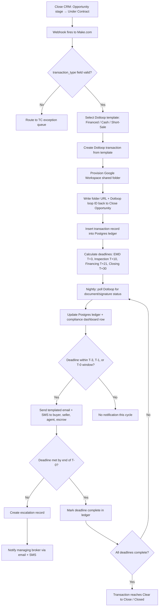
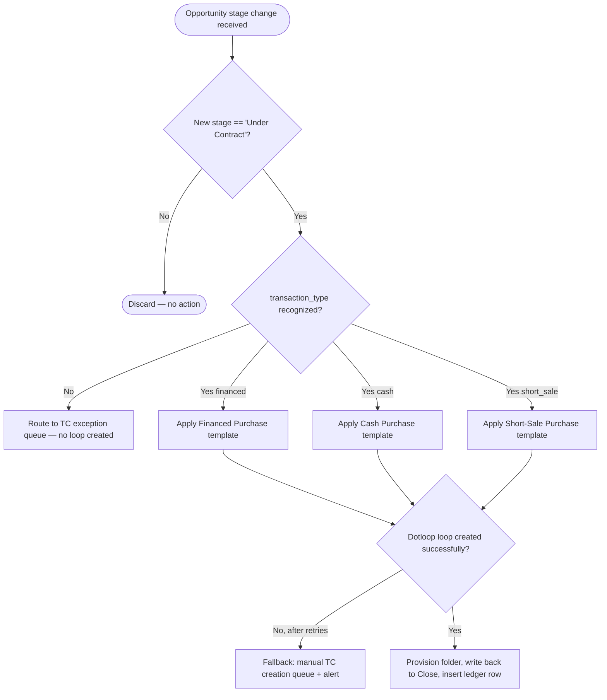
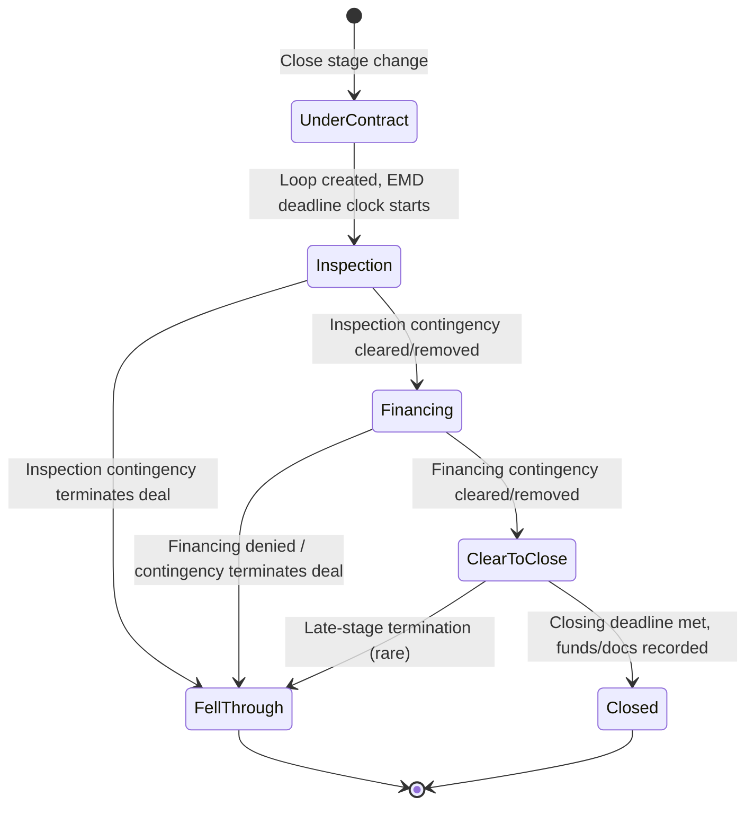
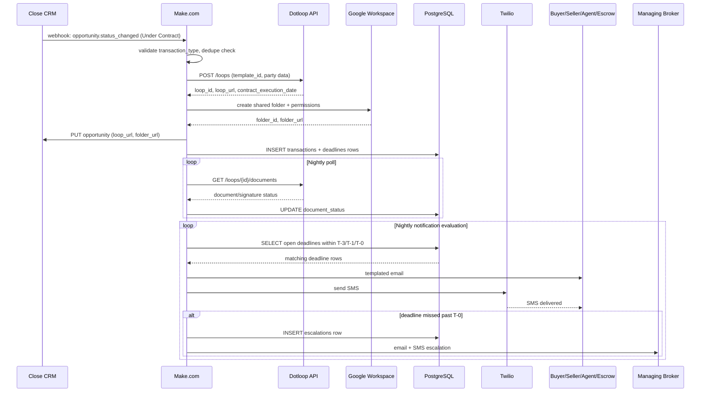

# SOP: Transaction Coordination & Compliance Document Automation

**Reference Deployment Context:** Harborview Realty Partners
**Industry:** Residential Real Estate Brokerage
**Owning Section:** 07 Real Estate
**SOP ID:** RE-02
**Version:** 1.0
**Last Updated:** 2026-06-30
**Author:** Automation Architecture Lead
**Classification:** Client-Facing
**Video Walkthrough:** _Pending recording — see script in this SOP's project folder._
**Real Build Artifacts:** [Importable n8n workflow, runnable automation script, and executable database schema →](build/README.md)

## Table of Contents

1. [Purpose](#1-purpose)
2. [Business Problem](#2-business-problem)
3. [Business Goals](#3-business-goals)
4. [Business Requirements](#4-business-requirements)
5. [Functional Requirements](#5-functional-requirements)
6. [Technical Requirements](#6-technical-requirements)
7. [Dependencies](#7-dependencies)
8. [Systems Used](#8-systems-used)
9. [Roles](#9-roles)
10. [Responsibilities](#10-responsibilities)
11. [Workflow Overview](#11-workflow-overview)
12. [Detailed Workflow Steps](#12-detailed-workflow-steps)
13. [Decision Tree](#13-decision-tree)
14. [Automation Logic](#14-automation-logic)
15. [Trigger Conditions](#15-trigger-conditions)
16. [Data Validation](#16-data-validation)
17. [Error Handling](#17-error-handling)
18. [Retry Logic](#18-retry-logic)
19. [Fallback Procedures](#19-fallback-procedures)
20. [Manual Override](#20-manual-override)
21. [Exception Handling](#21-exception-handling)
22. [Notifications](#22-notifications)
23. [Audit Logs](#23-audit-logs)
24. [Security](#24-security)
25. [Permissions](#25-permissions)
26. [Compliance](#26-compliance)
27. [Performance Metrics](#27-performance-metrics)
28. [KPIs](#28-kpis)
29. [Testing Procedure](#29-testing-procedure)
30. [Deployment](#30-deployment)
31. [Maintenance](#31-maintenance)
32. [Version History](#32-version-history)
33. [Future Improvements](#33-future-improvements)
34. [Appendix](#34-appendix)
35. [Troubleshooting](#35-troubleshooting)
36. [Recovery Procedure](#36-recovery-procedure)
37. [Frequently Asked Questions](#37-frequently-asked-questions)
38. [Technical Notes](#38-technical-notes)
39. [Business Notes](#39-business-notes)
40. [Estimated Time Savings](#40-estimated-time-savings)
41. [ROI Analysis](#41-roi-analysis)
42. [Risk Assessment](#42-risk-assessment)
43. [Lessons Learned](#43-lessons-learned)
44. [Related SOPs](#44-related-sops)

---

## 1. Purpose

This workflow automates transaction coordination and compliance documentation for Harborview Realty Partners from the moment a deal moves to "Under Contract" through closing or fall-through. It replaces six office-specific spreadsheets and ad hoc reminder systems with a single orchestration layer that creates the transaction file, calculates every contractual deadline from the contract execution date, notifies all transaction parties on a fixed cadence, and gives brokerage leadership a live, centralized compliance ledger across all offices. The system does not replace the transaction coordinator (TC) — it removes the clerical burden of tracking dates and chasing signatures so the TC's time is spent on judgment calls and exception handling rather than spreadsheet maintenance.

## 2. Business Problem

Harborview operates 6 offices and roughly 140 agents, each generating transactions that, once under contract, are handed to one of 5 transaction coordinators (roughly 1 TC per 1.2 offices, with TCs floating across offices during peak season). Prior to this engagement, each office maintained its own closing-checklist spreadsheet, deadlines were calculated manually from the contract date, and signature status was checked by logging into Dotloop transaction-by-transaction. Pre-automation baseline, measured across the two quarters preceding this engagement:

- **41% of transactions** had at least one missed internal deadline (defined as a checklist milestone — earnest money receipt, inspection contingency removal, financing contingency removal, or clear-to-close — not completed by its contractual date without an escalation having occurred).
- **Average active TC caseload:** 38–46 concurrent transactions per coordinator during peak months (April–August), against an internally estimated sustainable caseload of ~30.
- **Average time from a missed deadline to management awareness:** 4.6 business days — brokers typically learned of a lapse only when a buyer's agent or escrow officer called to ask why nothing had happened.
- **Document retention was inconsistent** across offices; two offices stored signed disclosures in local Dotloop folders only, with no shared, retrievable backup, creating audit exposure during a state licensing board file request.

The root cause was not TC competence — it was the absence of a system that automatically translates a contract date into a deadline schedule and pushes notifications without a human remembering to check a spreadsheet.

## 3. Business Goals

- Eliminate deadline tracking as a manual, memory-dependent task for TCs across all 6 offices.
- Produce a single, brokerage-wide, real-time view of every active transaction's compliance status for managing brokers and the compliance officer.
- Reduce the rate of missed internal deadlines from 41% to a sustained single-digit rate.
- Standardize the checklist and document set applied per transaction type (financed, cash, short-sale) so no office improvises its own checklist.
- Reduce average TC caseload pressure by removing non-judgment work, enabling the existing 5-TC team to absorb growth without additional headcount.
- Establish a defensible, timestamped audit trail for every transaction sufficient to satisfy a licensing board or E&O carrier inquiry.

## 4. Business Requirements

- **BR-1:** The system must detect the moment a deal is contractually "Under Contract" without requiring a TC to manually initiate anything.
- **BR-2:** The system must apply the correct checklist and document template based on transaction type (financed, cash, short-sale).
- **BR-3:** The system must calculate every compliance deadline from the actual contract execution date, not the date the deal entered the CRM.
- **BR-4:** The system must notify buyer, seller, agent, and escrow automatically as each deadline approaches, without TC intervention, for the common case.
- **BR-5:** The system must give managing brokers visibility into every transaction's status without requiring them to open Dotloop or a spreadsheet.
- **BR-6:** The system must escalate to the managing broker automatically when a deadline is missed, not rely on a TC to notice and report it.
- **BR-7:** The system must preserve a durable, centralized record of every transaction's documents and deadline history for compliance and audit purposes.
- **BR-8:** TCs and brokers must retain the ability to manually correct or override a deadline or checklist when a contract amendment changes the facts.

## 5. Functional Requirements

- **FR-1:** A Make.com scenario subscribes to a Close CRM webhook fired on Opportunity stage change and filters for transitions into the "Under Contract" stage.
- **FR-2:** The scenario reads a `transaction_type` custom field on the Opportunity and selects one of three Dotloop templates (Financed Purchase, Cash Purchase, Short-Sale Purchase) accordingly.
- **FR-3:** The scenario calls the Dotloop API to create a transaction (loop) from the selected template, populating party and property fields from the Close Opportunity payload.
- **FR-4:** The scenario calls the Google Workspace Drive API to provision a shared folder named per a fixed convention and shares it with the buyer's agent, listing agent, and TC; the folder URL is written back to a custom field on the Close Opportunity.
- **FR-5:** A scheduled Make.com scenario polls the Dotloop API daily per active loop for document and e-signature status and writes normalized results to PostgreSQL.
- **FR-6:** A deadline calculation module derives earnest money (T+3), inspection contingency (T+10), financing contingency (T+21), and closing (T+30) dates from the contract execution date returned by Dotloop, storing each as a row in the Postgres transaction ledger.
- **FR-7:** A scheduled notification scenario evaluates every open deadline daily and fires templated email (via Google Workspace / Gmail API) and SMS (via Twilio) at T-3, T-1, and T-0 to buyer, seller, agent, and escrow.
- **FR-8:** If a deadline's status is not marked complete as of end-of-day T-0, the workflow creates an escalation record and notifies the transaction's managing broker via email and SMS.
- **FR-9:** Every transaction has one row in a Postgres compliance dashboard table, updated on every status change, queryable by office, TC, and deadline status.

| BR ID | FR ID | Description |
|---|---|---|
| BR-1 | FR-1 | Webhook-driven detection of Under Contract stage change |
| BR-2 | FR-2 | Template selection by transaction type |
| BR-3 | FR-6 | Deadline calculation from contract execution date |
| BR-4 | FR-7 | Automated multi-channel notifications at T-3/T-1/T-0 |
| BR-5 | FR-9 | Centralized Postgres compliance dashboard |
| BR-6 | FR-8 | Automatic managing-broker escalation on missed T-0 |
| BR-7 | FR-4, FR-5 | Shared folder provisioning and daily document status capture |
| BR-8 | FR-3, FR-6 | Manual override paths layered onto template and deadline creation (see Section 20) |

## 6. Technical Requirements

- Make.com Team plan or higher, with scenario execution history retention of at least 30 days for audit tracing.
- Dotloop API v2 access under a Dotloop Business+ or Premium account with template-library and webhook/polling entitlements; documented rate limit of 100 requests/minute per account — the daily polling scenario is designed to stay under 20% of that ceiling at current transaction volume.
- Close CRM webhook delivery on Opportunity stage-change events; Close's webhook retry policy (3 attempts over roughly 20 minutes) is treated as a given, not something this workflow re-implements.
- Twilio programmable SMS with a registered 10DLC campaign for A2P compliance (required for U.S. SMS delivery at this volume without carrier filtering).
- Google Workspace domain-wide delegation for a service account authorized to create Drive folders and send templated Gmail messages on behalf of the brokerage's transactions@harborviewrealtypartners.example mailbox.
- PostgreSQL 14+ (managed instance), reachable from Make.com via a whitelisted static-IP connector; all timestamps stored in UTC with the transaction's local office timezone stored alongside for display and deadline-boundary calculation.
- Target uptime for the orchestration layer: 99.5% monthly, consistent with Make.com's platform SLA; this is a business-hours-tolerant workflow (a few hours of scenario downtime does not itself cause a missed contractual deadline, but is treated as urgent given downstream SMS timing).
- Latency budget: webhook-to-loop-creation under 5 minutes end-to-end under normal load; daily polling batch completes within a 45-minute window run once nightly.

## 7. Dependencies

- Close CRM must have a `transaction_type` custom field populated on the Opportunity before or at the moment of stage change; this field is populated during earlier pipeline stages by the listing/buyer's agent, not by this workflow.
- Dotloop template library must contain current, legally reviewed Financed / Cash / Short-Sale checklist templates maintained by Harborview's compliance officer — this workflow consumes those templates but does not author or legally validate their content.
- Google Workspace shared drive quota and folder-naming convention must be provisioned and stable; a change to the shared drive's root structure requires a corresponding change to this workflow's folder-creation logic.
- Escrow/title contact data must exist on the Opportunity (or be captured during the Under Contract handoff) for notification delivery — this is the single most common source of exception handling (see Section 17).
- Upstream lead-to-deal workflows (RE-01, RE-03) determine what data arrives on the Opportunity by the time it reaches Under Contract; this SOP assumes those fields are already populated and does not re-validate lead-source data.

## 8. Systems Used

| System | Role in Workflow | Auth Method |
|---|---|---|
| Close CRM | System of record for the sales pipeline; Opportunity stage change to "Under Contract" is the trigger event | OAuth2 |
| Make.com | Orchestration engine — webhook intake, template selection, API calls to Dotloop/Google/Twilio, scheduled polling, deadline calculation | API Key (per-connection) |
| Dotloop | Transaction document creation, checklist templates, e-signature collection, status polling | OAuth2 |
| Twilio | SMS deadline alerts to buyer, seller, agent, escrow, and managing broker | API Key (Account SID / Auth Token) |
| PostgreSQL | Transaction ledger — deadlines, statuses, escalation history, compliance dashboard rows | Username/Password over TLS, static-IP allowlist |
| Google Workspace | Auto-provisioned shared closing folder per transaction; templated email notifications | OAuth2 (domain-wide delegated service account) |

## 9. Roles

- **Business owner:** Harborview VP of Brokerage Operations — accountable for the transaction coordination process and its compliance outcomes across all 6 offices.
- **Technical owner:** Automation Architecture Lead (this engagement's delivery team) — owns the Make.com scenarios, Postgres schema, and integration configuration.
- **Process owner:** Lead Transaction Coordinator — owns the Dotloop template library content and the checklist logic, in coordination with the compliance officer.
- **Escalation contact (business):** Office Managing Broker (one per office) — receives T-0 escalations for transactions in their office.
- **Escalation contact (technical):** On-call automation engineer, reachable via the brokerage's existing IT support channel, for platform-level failures (Make.com scenario errors, API outages).
- **Compliance owner:** Harborview Compliance Officer — approves template content, retention policy, and reviews the audit log on a quarterly cadence.

## 10. Responsibilities

| Role | Responsibility |
|---|---|
| Transaction Coordinator | Monitors the compliance dashboard for exceptions flagged for human review; corrects misclassified transaction types; manually re-triggers notifications when a party's contact info changes |
| Managing Broker | Responds to T-0 escalations within one business day; has authority to grant deadline extensions when a contract amendment is executed |
| Compliance Officer | Maintains the Dotloop template library; reviews quarterly audit exports; sets document retention policy |
| Automation Architecture Lead | Owns scenario uptime, API credential rotation, and schema changes to the Postgres ledger |
| Listing/Buyer's Agent | Ensures `transaction_type` and escrow/title contact fields are accurate on the Close Opportunity before the Under Contract transition |
| VP of Brokerage Operations | Reviews aggregate KPI reporting monthly; approves changes to default deadline offsets (T+3/T+10/T+21/T+30) |

## 11. Workflow Overview

The workflow begins the instant a Close CRM Opportunity's stage changes to "Under Contract" and runs continuously — via scheduled polling and notification scenarios — until the transaction reaches a terminal state (Closed or Fell Through). At a high level: Close fires a webhook, Make.com creates the Dotloop transaction and shared folder, a nightly poller keeps document/signature status current in Postgres, and a nightly notifier evaluates every open deadline against that status and fires alerts or escalations.



## 12. Detailed Workflow Steps

1. **Tool:** Close CRM. **Trigger:** Opportunity `status_changed` webhook event. **Input:** Close webhook payload (see Section 15). **Transformation:** Make.com's webhook module filters for `data.status_label == "Under Contract"` and deduplicates on `data.id` + timestamp (see Section 17, duplicate webhook scenario). **Output:** filtered Opportunity payload passed to the next module. **Condition branch:** non-matching stage changes are discarded with no further action. **Error reference:** Section 17, scenario 3 (duplicate firing).

2. **Tool:** Make.com. **Action:** Validate `transaction_type` custom field against an enumerated set (`financed`, `cash`, `short_sale`). **Input:** Opportunity custom fields. **Transformation:** map value to a Dotloop template ID via a static lookup table maintained in a Make.com data store. **Output:** `template_id`. **Condition branch:** if the field is missing, null, or unrecognized, route to the TC exception queue (Section 21) rather than defaulting silently. **Error reference:** Section 17, scenario 2 (misclassification).

3. **Tool:** Dotloop API. **Action:** `POST /loops` using `template_id`, seeded with property address, buyer/seller names and emails, agent name, and brokerage office from the Close payload. **Input:** normalized transaction fields. **Transformation:** Close field names are mapped to Dotloop's loop-creation schema (e.g., `opportunity.address` → `loop.property.street_address`). **Output:** `loop_id`, `loop_url`, initial checklist item set. **Condition branch:** on a non-2xx response, retry per Section 18; on persistent failure, fall back per Section 19.

4. **Tool:** Google Workspace Drive API. **Action:** `files.create` (folder) under the brokerage's shared "Active Transactions" drive, named `{office_code}-{property_address}-{loop_id}`, then `permissions.create` to share with the TC, listing agent, and buyer's agent at Editor/Commenter levels respectively. **Input:** `loop_id`, office code, address, party emails. **Output:** `folder_id`, `folder_url`.

5. **Tool:** Close CRM API. **Action:** `PUT` on the Opportunity to write `dotloop_loop_url` and `closing_folder_url` custom fields. **Input:** `loop_url`, `folder_url`. **Output:** confirmation of field update; this closes the loop back to the system of record so agents never need to leave Close to find either link.

6. **Tool:** Make.com + PostgreSQL. **Action:** `INSERT` into `transactions` table. **Input:** all fields gathered in steps 1–5 plus the Dotloop-reported `contract_execution_date`. **Transformation:** deadline calculation module (Section 14) computes four deadline dates. **Output:** one `transactions` row and four `deadlines` rows (see schema, Section 34).

7. **Tool:** Make.com (scheduled, nightly at 02:00 office-local time per office cluster). **Action:** `GET /loops/{loop_id}/documents` and `GET /loops/{loop_id}/participants` for every loop with status not in (`closed`, `fell_through`). **Output:** per-document signature status, participant sign-off timestamps. **Transformation:** normalized into a status enum (`pending`, `partially_signed`, `fully_executed`) written to `document_status` in Postgres.

8. **Tool:** Make.com (scheduled, nightly at 06:00 office-local). **Action:** evaluate every open row in `deadlines` against today's date; for rows where `today == deadline_date - 3`, `- 1`, or `- 0`, fire the corresponding notification template. **Output:** Gmail API send + Twilio SMS send per recipient role (buyer, seller, agent, escrow). **Condition branch:** T-0 rows not marked `complete` by the following morning's run trigger the escalation branch (step 9).

9. **Tool:** Make.com + PostgreSQL. **Action:** on missed T-0, `INSERT` into `escalations` table and send managing-broker notification. **Output:** escalation record visible on the compliance dashboard, timestamped, with the TC and broker both notified.

## 13. Decision Tree



## 14. Automation Logic

```python
from dataclasses import dataclass
from datetime import date, timedelta
from enum import Enum


class TransactionType(str, Enum):
    FINANCED = "financed"
    CASH = "cash"
    SHORT_SALE = "short_sale"


# Illustrative default offsets in calendar days from contract execution date.
# Configurable per office via the `deadline_offsets` Postgres table; these are
# the brokerage-wide defaults absent an office-specific override.
DEFAULT_OFFSETS_DAYS: dict[str, int] = {
    "earnest_money": 3,
    "inspection_contingency": 10,
    "financing_contingency": 21,
    "closing": 30,
}

# Short-sale transactions do not carry a financing contingency milestone in
# Harborview's checklist model; lender approval is tracked separately by the
# short-sale specialist outside this deadline set.
SHORT_SALE_EXCLUDED_MILESTONES = {"financing_contingency"}


@dataclass
class Deadline:
    milestone: str
    due_date: date


def select_template_id(transaction_type: str) -> str:
    """Map a validated transaction_type value to a Dotloop template ID.

    Raises ValueError for any value outside the enumerated set so the
    calling scenario routes to the exception queue rather than guessing.
    """
    mapping = {
        TransactionType.FINANCED: "tmpl_financed_purchase_v3",
        TransactionType.CASH: "tmpl_cash_purchase_v2",
        TransactionType.SHORT_SALE: "tmpl_short_sale_purchase_v4",
    }
    try:
        return mapping[TransactionType(transaction_type)]
    except ValueError as exc:
        raise ValueError(
            f"Unrecognized transaction_type '{transaction_type}'; "
            "routing to TC exception queue."
        ) from exc


def calculate_deadlines(
    contract_execution_date: date,
    transaction_type: str,
    office_offsets: dict[str, int] | None = None,
) -> list[Deadline]:
    """Derive the deadline schedule from the contract execution date.

    office_offsets, if provided, overrides DEFAULT_OFFSETS_DAYS for the
    calling office (see Section 20, manual override of deadline offsets).
    """
    offsets = office_offsets or DEFAULT_OFFSETS_DAYS
    excluded = (
        SHORT_SALE_EXCLUDED_MILESTONES
        if transaction_type == TransactionType.SHORT_SALE
        else set()
    )
    return [
        Deadline(milestone=name, due_date=contract_execution_date + timedelta(days=days))
        for name, days in offsets.items()
        if name not in excluded
    ]


def notification_windows(deadline: Deadline, today: date) -> str | None:
    """Return which notification window (if any) today falls into for a deadline."""
    delta = (deadline.due_date - today).days
    if delta == 3:
        return "T-3"
    if delta == 1:
        return "T-1"
    if delta == 0:
        return "T-0"
    return None
```

## 15. Trigger Conditions

The workflow's primary trigger is a Close CRM webhook fired on any Opportunity `status_changed` event, filtered downstream in Make.com to only act on transitions where the new status label equals `"Under Contract"`. Secondary triggers are two scheduled Make.com scenarios: the document/status poller (daily, 02:00 office-local) and the deadline/notification evaluator (daily, 06:00 office-local), both of which run against every transaction in an open state regardless of when it entered that state.

**Close CRM Opportunity webhook payload (illustrative):**

```json
{
  "event": "opportunity.status_changed",
  "data": {
    "id": "oppo_9f3c2a1b7d",
    "lead_id": "lead_4b2e9910aa",
    "organization_id": "org_harborview_01",
    "name": "412 Cedarwood Ln — Buyer: J. Alvarado",
    "status_id": "stat_under_contract",
    "status_label": "Under Contract",
    "previous_status_label": "Offer Submitted",
    "value": 487500,
    "custom": {
      "transaction_type": "financed",
      "office_code": "HV-04",
      "listing_agent_email": "d.reyes@harborviewrealtypartners.example",
      "buyer_agent_email": "m.oyelaran@harborviewrealtypartners.example",
      "buyer_name": "Jasmine Alvarado",
      "buyer_email": "jasmine.alvarado@example.com",
      "buyer_phone": "+15035550142",
      "seller_name": "Robert Chen",
      "seller_email": "robert.chen@example.com",
      "seller_phone": "+15035550198",
      "escrow_officer_name": "Priya Natarajan",
      "escrow_officer_email": "priya.natarajan@harborviewtitle.example",
      "escrow_officer_phone": "+15035550267",
      "property_address": "412 Cedarwood Ln, Beaverhaven, OR 97006"
    },
    "date_updated": "2026-06-30T14:22:07Z"
  }
}
```

## 16. Data Validation

| Field | Rule | Failure Action |
|---|---|---|
| `custom.transaction_type` | Must be one of `financed`, `cash`, `short_sale` | Route to TC exception queue; no Dotloop loop created; TC notified via Make.com alert |
| `custom.property_address` | Non-empty string; must resolve to a single, unambiguous property | If empty or ambiguous, hold for manual TC confirmation before loop creation |
| `custom.buyer_email`, `custom.seller_email` | Valid email syntax | If invalid, create loop anyway (documents still needed) but flag notification delivery as degraded for that party in the dashboard |
| `custom.escrow_officer_email` / `phone` | At least one valid contact method present | If both missing, escrow is excluded from notifications and a warning row is written to `exceptions`; TC is prompted to add contact info |
| `date_updated` (contract execution proxy) | Must be a parseable ISO-8601 timestamp not in the future | If unparseable, fall back to Dotloop's own `contract_execution_date` once the loop is created rather than blocking loop creation |
| `office_code` | Must match one of the 6 known office codes | If unrecognized, default routing to the compliance officer's queue rather than silently assigning an office |
| Deadline offsets (per office, if overridden) | Must be positive integers, `earnest_money < inspection_contingency < financing_contingency < closing` | If the ordering constraint is violated, override is rejected and default offsets are used, with an alert to the automation engineer |

## 17. Error Handling

1. **Dotloop API downtime during a status poll.** *Detection:* nightly poller receives a non-2xx response or timeout from `GET /loops/{loop_id}/documents`. *Response:* Make.com's error handler logs the failure per loop, retries per Section 18, and if still failing after the retry budget, marks that loop's `document_status` as `stale` rather than overwriting it with a false value; the compliance dashboard visually flags any transaction whose status hasn't refreshed in over 24 hours so a TC knows to check manually.

2. **Contract type misclassification causing the wrong checklist template.** *Detection:* either caught at intake by the enum validation in Section 16, or discovered later when a TC notices a short-sale transaction has a financing-contingency deadline it shouldn't. *Response:* TC uses the manual override path (Section 20) to regenerate the correct checklist; the original loop's documents are not discarded — Dotloop supports moving existing signed documents into a corrected loop, and the Postgres ledger row is updated with a `template_corrected_at` timestamp and the correcting user's ID for audit purposes.

3. **Duplicate webhook firing on rapid stage changes.** *Detection:* Close CRM (like most CRMs) can fire multiple webhook events in quick succession if an Opportunity is edited multiple times in one user action (e.g., a stage change plus a field update saved together), or on webhook redelivery after a slow acknowledgment. Make.com's filter deduplicates on `data.id` combined with a 10-minute idempotency window held in a Make.com data store keyed on `oppo_id + status_label`. *Response:* the second and subsequent matching events within the window are logged as duplicates and discarded before reaching the Dotloop creation step, preventing duplicate loops for the same transaction.

4. **Escrow contact missing or invalid.** *Detection:* Section 16 validation flags a missing or malformed `escrow_officer_email`/`phone` at intake. *Response:* the transaction still proceeds (escrow contact is not a blocker for loop creation), but an `exceptions` row is created and the TC receives a one-time prompt to supply the missing contact; until resolved, escrow-directed notifications are silently skipped (not sent to a null address) rather than erroring the entire notification batch for that transaction.

5. **Timezone miscalculation of a deadline.** *Detection:* Harborview's 6 offices sit across two time zones in its metro market's broader service area (a corridor covering both an urban core and outlying suburbs that cross a time-zone-adjacent county line in edge cases); a deadline calculated in UTC and displayed without conversion can appear to fall a day early or late to a party in the field. *Response:* every date stored in Postgres carries both the UTC instant and the `office_timezone` field; all deadline-boundary comparisons (T-3/T-1/T-0 evaluation) are performed in office-local time, not server UTC, and the nightly notification scenario is explicitly scheduled per office-timezone cluster rather than as one global run, so a T-0 notification always fires on the office's actual local T-0 morning.

6. **Google Workspace folder provisioning failure (quota or permission error).** *Detection:* Drive API returns a quota-exceeded or permission-denied error during `files.create` or `permissions.create`. *Response:* loop creation is not rolled back (the Dotloop transaction is more time-sensitive than the folder); the scenario retries folder creation per Section 18, and if it still fails, creates the transaction ledger row with `folder_url = null` and flags it in the exception queue for manual folder creation by the TC, who receives a direct alert rather than discovering the gap when a party asks for the folder link.

## 18. Retry Logic

- **Dotloop API calls (loop creation, status polling):** exponential backoff starting at 30 seconds, doubling up to a maximum of 3 retries (30s → 60s → 120s), with a total retry window under 4 minutes so as not to stall the scenario queue. Idempotency is enforced via a client-generated `request_id` (UUID) passed in the loop-creation request; if Dotloop's API supports idempotency keys natively, that mechanism is used directly, otherwise Make.com checks the ledger for an existing `loop_id` tied to the same `oppo_id` before creating a second one.
- **Google Workspace API calls (folder creation, email send):** exponential backoff, 3 retries, 15s/45s/120s, consistent with Google API client library defaults; email sends specifically use Gmail API's built-in message ID to avoid duplicate sends on retry.
- **Twilio SMS sends:** 2 retries at 10s/30s intervals, since Twilio's own delivery pipeline already handles carrier-level retries; Make.com's retry here only covers the initial API submission failing, not downstream carrier delivery.
- **PostgreSQL writes:** wrapped in a transaction per logical unit (e.g., one transaction record plus its four deadline rows insert together or not at all); on connection failure, 3 retries at 5s intervals given the low expected failure rate of a well-provisioned managed database connection.
- **Nightly polling and notification scenarios as a whole:** if a scenario run fails outright (not just an individual API call within it), Make.com's built-in scenario-level retry re-runs the entire scenario once, 30 minutes later, before falling back to Section 19.

## 19. Fallback Procedures

- If Dotloop loop creation exhausts all retries, the scenario writes a `pending_manual_creation` row to the `exceptions` table and sends an immediate alert (email + Slack-equivalent channel used internally by the automation team) to the on-call automation engineer and the assigned TC; the TC creates the loop manually in Dotloop's UI using the correct template, and once created, updates the `loop_id` field via the manual override path (Section 20) so the rest of the automation resumes normally from that point forward.
- If the nightly document-status poller fails for an entire batch (not just one loop), the scenario does not silently skip the night — it logs a `poll_run_failed` event, and the compliance dashboard displays a "Last refreshed" timestamp per transaction so degraded freshness is visible rather than hidden; the run is retried automatically 30 minutes later per Section 18, and if still failing, alerts the automation engineer for manual intervention before the next scheduled run.
- If the notification evaluator scenario fails on a given morning, it is treated as high-severity because a missed T-0 notification is functionally equivalent to a missed deadline from the client's perspective. The fallback is an automatic re-run 30 minutes after failure, and if that also fails, an immediate page to the automation engineer plus a manual-check alert to all TCs listing which office-timezone cluster's notifications may not have gone out that morning.
- For Google Workspace folder failures that cannot be resolved automatically, the fallback is manual folder creation by the TC following a documented naming convention, with the resulting URL entered via the manual override path.

## 20. Manual Override

TCs and managing brokers are the only two roles authorized to manually override workflow state, through a lightweight internal override form (a Make.com-triggered webhook behind the brokerage's internal admin portal, not directly editing Postgres).

- **Overriding a deadline date:** used when a signed contract amendment moves a contingency date. The TC submits the loop ID, the milestone name, and the new date with a required free-text reason. This writes an `override` row referencing the original deadline row (the original is not deleted, preserving audit history) and recalculates any dependent notification schedule from the new date. A managing broker's approval is required (a second-party confirmation step in the override form) for any override that moves the closing date itself, given its downstream financial and audit significance; earnest money, inspection, and financing contingency date overrides can be entered by the TC alone.
- **Re-triggering a notification:** used when a party's contact information was wrong and has since been corrected, or when a notification is confirmed not to have been delivered. The TC selects the loop ID and the specific deadline/window combination (e.g., "412 Cedarwood Ln, Financing Contingency, T-1") from the dashboard, and the override form calls the same Make.com notification sub-scenario used by the nightly job, bypassing the "already sent" idempotency flag for that one specific send.
- **Correcting a misclassified transaction type:** the TC selects the correct type from the dashboard; this does not delete the existing Dotloop loop but flags it for template correction (see Section 17, scenario 2) and recalculates the deadline set, excluding or including the financing contingency milestone as appropriate.
- **Overriding default deadline offsets per office:** reserved for the VP of Brokerage Operations and the compliance officer jointly (not TCs), since this changes the brokerage-wide or office-wide default rather than a single transaction; enforced by requiring both a business-owner and compliance-owner sign-off recorded in the `deadline_offsets` change log before a new default takes effect.

Every override is logged with the acting user's ID, timestamp, prior value, new value, and stated reason — this log is part of the audit trail described in Section 23 and is the first place a compliance review looks when investigating a disputed deadline.

## 21. Exception Handling

Beyond the standard error scenarios in Section 17, the workflow routes several classes of malformed or incomplete data to a human-reviewed exception queue rather than attempting to guess:

- **Missing or unrecognized `transaction_type`:** no loop is created; the transaction sits in the exception queue until a TC assigns a type, at which point normal processing resumes from loop creation forward.
- **Partial party data** (e.g., a buyer with no email and no phone on file): the loop is still created since the document workflow itself is more urgent than notification completeness, but the transaction is flagged `notification_degraded` on the dashboard so a TC understands why a party isn't receiving alerts.
- **An Opportunity that moves to Under Contract and then back to an earlier stage within the same day** (a data-entry correction, not a real fall-through): the deduplication window in Section 17 scenario 3 typically absorbs this, but if it occurs outside that window, the created loop is not automatically deleted — deleting Dotloop transactions destroys signed documents — and instead the TC is alerted to determine whether the deal is genuinely dead (routing to the "Fell Through" state, Section 13/14 of the state model) or was a data-entry error.
- **A transaction with no matching office code:** routed to the compliance officer's queue rather than the TC exception queue, since an unrecognized office code more often indicates a CRM configuration issue than a per-transaction data problem.
- **Concurrent overrides on the same deadline by two different users:** the override form uses optimistic locking (a version number on the deadline row) — the second submission is rejected with a message showing the first change, requiring the second user to re-review before resubmitting, preventing silent overwrite of one broker's correction by another's.

## 22. Notifications

| Event | Recipients | Channel | Severity |
|---|---|---|---|
| Loop created / folder provisioned | TC, listing agent, buyer's agent | Email | Informational |
| Deadline approaching (T-3) | Buyer, seller, agent, escrow | Email + SMS | Informational |
| Deadline approaching (T-1) | Buyer, seller, agent, escrow | Email + SMS | Warning |
| Deadline due today (T-0) | Buyer, seller, agent, escrow | Email + SMS | Warning |
| Deadline missed past T-0 | Managing broker, TC | Email + SMS | Critical |
| Transaction routed to exception queue | Assigned TC | Email + internal dashboard flag | Warning |
| Scenario-level failure (poller or notifier) | Automation engineer (on-call) | Email + internal alert channel | Critical |
| Manual override submitted | TC or broker who submitted it (confirmation), plus audit log | Email | Informational |

## 23. Audit Logs

Every state-changing event is written to an `audit_log` table in Postgres with the acting principal (a system service account for automated events, a named user for manual overrides), the event type, before/after values where applicable, and a UTC timestamp. This includes: loop creation, folder provisioning, every document status change detected by the nightly poller, every notification sent (with delivery channel and recipient), every deadline override, every escalation created, and every exception-queue entry and its resolution. Audit log retention is a minimum of 7 years from transaction close, aligned with the longer end of typical real estate transaction document retention expectations (see Section 26); logs are append-only at the application layer (the Make.com and application service accounts have `INSERT`-only grants on `audit_log`, with `UPDATE`/`DELETE` reserved for a separate database-administrator role used only for approved data-correction procedures). The compliance officer's quarterly review draws directly from this table, filtered by office and date range, to spot-check escalation handling and override justification quality.

## 24. Security

- All API credentials (Close, Dotloop, Twilio, Google Workspace, Postgres) are stored in Make.com's encrypted connection vault, never in scenario blueprints or shared documents; rotation follows a 90-day cadence for API keys and immediate rotation on any suspected exposure.
- OAuth2 is used wherever the platform supports it (Close, Dotloop, Google Workspace); Twilio and Postgres use credential-based auth over TLS given those platforms' supported auth models.
- PII in transit (buyer/seller names, contact info, financial figures) is protected by TLS 1.2+ on every API call in the chain; PII at rest in Postgres is protected by the managed database provider's disk-level encryption, with no PII stored in Make.com's own persistent data stores beyond the transient idempotency-window records described in Section 17, which are purged after 24 hours.
- Google Workspace shared folders are permissioned per-transaction (not brokerage-wide), so a buyer's agent on one deal cannot browse another deal's closing folder; folder sharing links are never set to "anyone with the link."
- Twilio SMS content avoids embedding sensitive financial figures (loan amounts, purchase price) in the message body, limiting exposure if a message is viewed on a locked screen notification preview; full detail lives behind the authenticated folder/dashboard link included in the message.

## 25. Permissions

| Role | View Dashboard | Edit Deadlines | Trigger Manual Override | Access Postgres Directly | Modify Dotloop Templates |
|---|---|---|---|---|---|
| Transaction Coordinator | Yes | Own assigned transactions | Yes (except closing-date/offset overrides) | No | No |
| Managing Broker | Yes (own office) | Yes (own office, incl. closing-date approval) | Yes | No | No |
| VP of Brokerage Operations | Yes (all offices) | Yes (all offices) | Yes (incl. default offset changes, jointly with compliance) | No | No |
| Compliance Officer | Yes (all offices) | View + offset-change approval only | No (approval role, not direct edit) | Read-only, audit exports | Yes |
| Automation Architecture Lead | Yes (all offices) | No (technical owner, not process owner) | No | Yes | No |
| Agents (buyer's/listing) | No dashboard access; receive notifications and folder access only | No | No | No | No |

## 26. Compliance

Residential real estate transactions are subject to state-level disclosure, contingency-notice, and document-retention requirements that vary by jurisdiction; this workflow is designed to be jurisdiction-agnostic at the automation layer while enforcing whatever specific rules a given office's state requires at the content layer. Concretely: the Dotloop template library (owned by the compliance officer, not by this automation) is where jurisdiction-specific disclosure forms and required signatures live — the automation's role is to ensure the correct template is applied consistently and that every required document's signature status is tracked and escalated, not to interpret disclosure law itself. Document retention is configured to the longer of (a) the applicable state real estate commission's minimum retention period or (b) Harborview's internal 7-year policy, whichever the compliance officer determines is more conservative for a given office's jurisdiction; the Postgres audit log and the underlying Dotloop-stored documents both persist for that period, with the Google Workspace shared folder serving as the collaborative working copy and Dotloop/Postgres serving as the systems of record for the frozen, signed artifact and its status history. The automation does not make disclosure-timing decisions on its own — it enforces whatever deadline schedule the compliance officer configures per transaction type, which is expected to reflect that jurisdiction's contingency and disclosure timing rules. Any change to the checklist template set is logged and requires compliance-officer sign-off before deployment.

## 27. Performance Metrics

| Metric | Target |
|---|---|
| Webhook-to-loop-creation latency | Under 5 minutes, 95th percentile |
| Nightly document-status poll completion | Within a 45-minute window, 99% of scheduled runs |
| Notification send success rate (delivered to provider) | 99.5% for email, 98% for SMS (accounting for carrier filtering variance) |
| Scenario error rate (unhandled failures reaching the exception path) | Under 1% of total scenario executions monthly |
| Dashboard data freshness | No transaction's `document_status` older than 26 hours under normal operation |
| Manual override turnaround (TC-initiated) | Applied within 10 minutes of submission |

## 28. KPIs

| KPI | Baseline | Target Post-Automation |
|---|---|---|
| % of transactions with at least one missed internal deadline | 41% | Under 8% |
| Average active TC caseload (peak season) | 38–46 | Sustainable at 30–35 with current headcount, absorbing volume growth without new hires |
| Time from missed deadline to management awareness | 4.6 business days | Same business day (automatic T-0 escalation) |
| % of deadlines met without escalation | Not previously tracked | 90%+ |
| Average time-to-document-completion (loop creation to fully executed checklist) | Not previously tracked centrally; estimated 12–15 days informally | Tracked centrally; target median under 11 days |
| Audit-readiness (documents retrievable within 1 business day of a request) | Inconsistent; 2 of 6 offices lacked centralized backup | 100% of transactions retrievable same-day via Dotloop + Postgres record |

## 29. Testing Procedure

Unit tests cover the deadline calculation module (Section 14) against a matrix of transaction types, offset configurations, and edge dates (month-end boundaries, leap years) to confirm date arithmetic correctness independent of any live API. Integration tests run against Dotloop's and Close's sandbox/test environments: a synthetic Opportunity is moved to Under Contract, and the test suite verifies loop creation, folder provisioning, write-back to Close, and ledger insertion end-to-end, including deliberately malformed payloads (missing `transaction_type`, missing escrow contact) to confirm exception routing behaves as documented in Sections 16 and 21. UAT is conducted with two pilot offices for one full transaction cycle (approximately 30–45 days) before brokerage-wide rollout, with TCs and managing brokers from those offices explicitly asked to attempt manual overrides and confirm the dashboard reflects reality. See [`37 Testing/`](../../37%20Testing/README.md) for the portfolio-wide test plan template this engagement followed.

## 30. Deployment

Deployment followed a phased rollout: pilot in 2 of 6 offices for one full transaction cycle, incorporating UAT feedback, followed by a staged rollout to the remaining 4 offices over two weeks (2 offices per week) rather than a single brokerage-wide cutover, to limit blast radius if an office-specific data quirk (e.g., a nonstandard office code or legacy Close custom field) surfaced. Rollback plan: because the workflow writes back to Close (folder URL, loop URL) and to Dotloop (which remains the durable system of record for documents regardless of automation state), disabling the Make.com scenarios at any point does not orphan or corrupt existing transactions — TCs simply resume manual tracking for transactions already in flight while the automation is paused, using the same spreadsheet fallback that predated the engagement. See [`38 Deployment/`](../../38%20Deployment/README.md) for the portfolio's standard deployment and rollback framework.

## 31. Maintenance

Recurring maintenance includes: quarterly review of the Dotloop template library by the compliance officer (aligned with the audit log review in Section 23); monthly review of the office-code and transaction-type lookup tables to catch any drift from Close CRM configuration changes; API credential rotation on the 90-day cycle described in Section 24; and a semi-annual load check on the Postgres ledger (index health, table growth) given the accumulating multi-year audit retention requirement. See [`39 Maintenance/`](../../39%20Maintenance/README.md) for the standard maintenance cadence this engagement follows.

## 32. Version History

| Version | Date | Author | Change |
|---|---|---|---|
| 1.0 | 2026-06-30 | Automation Architecture Lead | Initial release covering all 6 Harborview offices following phased pilot rollout |

## 33. Future Improvements

- Extend the deadline model to support multi-party contingency chains (e.g., a buyer's sale-of-current-home contingency) beyond the four illustrative default milestones.
- Add a TC-facing mobile notification (push, not just email/SMS) for T-0 escalations to reduce broker response latency further.
- Integrate a lender-status webhook (where available from preferred lender partners) to reduce reliance on manual financing-contingency status entry.
- Explore automatic checklist-completeness scoring using Dotloop's document metadata to flag likely-missing signatures before they become T-0 escalations.

## 34. Appendix

**Transaction lifecycle state diagram:**



**Sequence diagram — Close → Make.com → Dotloop → notification flow:**



**Postgres transaction record schema (normalized):**

```json
{
  "transaction": {
    "id": "txn_8a41f0c2",
    "close_opportunity_id": "oppo_9f3c2a1b7d",
    "dotloop_loop_id": "loop_772104",
    "office_code": "HV-04",
    "office_timezone": "America/Los_Angeles",
    "transaction_type": "financed",
    "property_address": "412 Cedarwood Ln, Beaverhaven, OR 97006",
    "contract_execution_date": "2026-06-28",
    "buyer": {
      "name": "Jasmine Alvarado",
      "email": "jasmine.alvarado@example.com",
      "phone": "+15035550142"
    },
    "seller": {
      "name": "Robert Chen",
      "email": "robert.chen@example.com",
      "phone": "+15035550198"
    },
    "agent_email": "m.oyelaran@harborviewrealtypartners.example",
    "escrow_officer": {
      "name": "Priya Natarajan",
      "email": "priya.natarajan@harborviewtitle.example",
      "phone": "+15035550267"
    },
    "closing_folder_url": "https://drive.example.com/folders/HV04-412CedarwoodLn-loop772104",
    "lifecycle_state": "financing",
    "created_at": "2026-06-28T18:04:11Z",
    "updated_at": "2026-06-30T06:00:03Z"
  },
  "deadlines": [
    {
      "id": "dl_001",
      "transaction_id": "txn_8a41f0c2",
      "milestone": "earnest_money",
      "due_date": "2026-07-01",
      "status": "complete",
      "completed_at": "2026-06-30T16:12:44Z"
    },
    {
      "id": "dl_002",
      "transaction_id": "txn_8a41f0c2",
      "milestone": "inspection_contingency",
      "due_date": "2026-07-08",
      "status": "pending",
      "completed_at": null
    },
    {
      "id": "dl_003",
      "transaction_id": "txn_8a41f0c2",
      "milestone": "financing_contingency",
      "due_date": "2026-07-19",
      "status": "pending",
      "completed_at": null
    },
    {
      "id": "dl_004",
      "transaction_id": "txn_8a41f0c2",
      "milestone": "closing",
      "due_date": "2026-07-28",
      "status": "pending",
      "completed_at": null
    }
  ]
}
```

**Glossary:** *Loop* — Dotloop's term for a transaction workspace. *EMD* — earnest money deposit. *T-0/T-3/T-1* — notification windows relative to a deadline date. *Clear to Close* — lifecycle state once all contingencies are removed and only the closing milestone remains open.

## 35. Troubleshooting

| Symptom | Likely Cause | Fix |
|---|---|---|
| Transaction never appears on dashboard after Under Contract | Webhook filter didn't match, or `transaction_type` invalid | Check Make.com execution history for the webhook; check exception queue for a misclassification entry |
| Dashboard shows stale document status (>26 hrs) | Nightly poller failed for that batch | Check scenario run history; manually trigger a single-loop poll if urgent |
| Party reports never receiving an SMS | Invalid phone format, carrier filtering, or missing contact data | Check `exceptions` table for `notification_degraded` flag; verify E.164 phone format; use manual re-trigger override |
| Two loops exist for one transaction | Deduplication window missed a rapid double-fire outside the 10-minute idempotency window | Merge documents into the earlier loop via Dotloop, mark the duplicate loop closed, log the correction in `audit_log` |
| Deadline dates look "off by one day" for a specific office | Timezone boundary miscalculation | Confirm `office_timezone` value on the transaction row; recalculate using office-local date, not UTC date |
| Escalation fired but broker says nothing was actually missed | TC completed the milestone in Dotloop but the nightly poller hadn't refreshed yet before the notifier ran | Confirm poll and notifier run order/timing for that office cluster; treat as a false-positive escalation, not a real miss, and log accordingly |

## 36. Recovery Procedure

If the Make.com account or a critical scenario is disabled or corrupted (e.g., accidental deletion of a scenario, connection credential expiry): (1) confirm Dotloop and Close CRM data are unaffected — both remain authoritative and unmodified by an orchestration-layer outage; (2) restore the affected scenario from Make.com's version history (scenarios are versioned automatically on each save) or from the engagement's exported blueprint backup; (3) re-establish any expired connection credentials per Section 24's rotation procedure; (4) run the nightly poller and notifier manually for the affected date range to backfill any missed status updates and notifications, clearly marking backfilled notifications as such in the message body so recipients understand a delay occurred; (5) reconcile the `exceptions` table for any transactions that fell into a queue during the outage window before resuming fully automated operation.

## 37. Frequently Asked Questions

**Q: What happens if a deal falls through after documents are already signed?**
A: The loop is not deleted. The TC (or the system, on a future enhancement) transitions the transaction to the `Fell Through` lifecycle state; all documents and audit history remain retrievable for the retention period in Section 26.

**Q: Can a TC change which office a transaction belongs to?**
A: No — office reassignment is a Close CRM data correction, not a workflow override, since office code drives timezone-sensitive notification scheduling; a TC should correct it in Close and allow the next sync to pick up the change, or contact the automation engineer for an urgent manual correction.

**Q: Does the system ever auto-extend a deadline on its own?**
A: No. Deadline extensions always require a human-submitted override with a stated reason (Section 20); the system calculates and enforces schedules but does not infer contract amendments on its own.

**Q: What happens during a brokerage-wide Dotloop outage?**
A: Loop creation and status polling queue up retries per Section 18; if the outage exceeds the retry window, new transactions fall to the manual-creation fallback (Section 19) and existing transactions simply show stale status with a visible "last refreshed" timestamp rather than an incorrect one.

## 38. Technical Notes

- Dotloop's API models contingency removal as a document/checklist-item state, not a first-class "deadline" object — this workflow's deadline model is intentionally a Make.com/Postgres construct layered on top of Dotloop's document status, not a native Dotloop feature, which is why the nightly poll-then-evaluate two-stage design exists rather than relying on a single Dotloop webhook for deadline events.
- Close CRM's webhook retry behavior (roughly 3 attempts over ~20 minutes per Close's platform documentation) is a contributing factor in the duplicate-webhook scenario (Section 17); the idempotency window was sized to exceed Close's total retry window with margin.
- Twilio 10DLC registration processing time (historically 1–3 weeks for campaign vetting) should be planned for well ahead of go-live; SMS sending without a completed registration is subject to aggressive carrier filtering that can silently drop messages, which would otherwise look identical to a code-level delivery failure.
- Google Workspace domain-wide delegation scopes should be limited to Drive file/folder creation and Gmail send — broader scopes (e.g., full Drive read across the domain) are unnecessary and increase the blast radius of a compromised service account credential.

## 39. Business Notes

The T+3/T+10/T+21/T+30 offsets are explicitly illustrative defaults reflecting typical contingency timing patterns Harborview's compliance officer selected during template design; they are not universal constants and are configurable per office to accommodate local market or brokerage-standard contract forms. The decision to exclude the financing-contingency milestone from short-sale transactions reflects Harborview's specific internal process (short-sale lender approval is tracked by a specialist outside this deadline set), not a general industry rule, and should be revisited if that internal process changes. The two-tier override authorization (TC-level for contingency dates, broker-approval-required for closing-date changes) reflects a deliberate tradeoff: closing-date slippage has outsized downstream scheduling and vendor-coordination impact (movers, walk-throughs, wire transfers), so the extra approval friction was judged worth the loss of TC autonomy on that one field specifically.

## 40. Estimated Time Savings

Worked example based on Harborview's actual transaction volume (approximately 950 closed transactions annually across 6 offices, roughly 79 per month):

- **Manual deadline tracking and status-checking time saved per transaction:** prior to automation, TCs spent an estimated 25 minutes per transaction per week on manual deadline calculation, spreadsheet updates, and Dotloop status checks, across an average 5-week transaction lifecycle (Under Contract to Closed) — approximately 125 minutes (2.08 hours) per transaction.
- **Manual notification drafting/sending time saved per transaction:** an estimated 45 minutes per transaction previously spent drafting and sending reminder emails/texts to buyer, seller, agent, and escrow across the lifecycle (0.75 hours).
- **Total labor hours saved per transaction:** 2.08 + 0.75 = **2.83 hours**.
- **Annual transaction volume:** 950 transactions.
- **Total annual labor hours saved:** 950 × 2.83 = **2,688.5 hours/year**, or approximately **224 hours/month** across the 5-TC team, roughly 45 hours per TC per month — consistent with the caseload reduction described in Section 28.

## 41. ROI Analysis

Using the time savings from Section 40 and a loaded TC hourly cost of **$34/hour** (fully loaded, including benefits and overhead, consistent with a brokerage-support-staff role in this market):

- **Annual labor cost avoided:** 2,688.5 hours × $34/hour = **$91,409/year**.
- **Build cost (one-time):** engagement scoped at approximately **$38,000** (discovery, Make.com scenario build, Dotloop template configuration support, Postgres schema and dashboard, Twilio 10DLC registration support, phased-rollout UAT across 2 pilot offices plus staged rollout to remaining 4).
- **Run cost (annual):** Make.com Team-tier plan, Twilio SMS volume at estimated 950 transactions × ~9 SMS sends per transaction (3 windows × up to 4 recipients, with some skipped per Section 21) ≈ 8,000 SMS/year, managed Postgres hosting, and Google Workspace incremental storage — combined estimated at **$9,600/year**.
- **Year 1 net benefit:** $91,409 − $38,000 (build) − $9,600 (run) = **$43,809**.
- **Year 2+ net benefit (steady state, no build cost):** $91,409 − $9,600 = **$81,809/year**.
- **Payback period:** build cost of $38,000 ÷ (monthly labor savings of $91,409/12 ≈ $7,617) ≈ **5.0 months**.

This calculation is conservative in that it excludes the harder-to-quantify but material value of reduced audit exposure (Section 26) and the avoided cost of a missed-deadline dispute or E&O claim, either of which could exceed the entire annual run cost in a single incident. See [`44 ROI/`](../../44%20ROI/README.md) for the portfolio-wide ROI calculation methodology this analysis follows.

## 42. Risk Assessment

| Risk | Likelihood | Impact | Mitigation |
|---|---|---|---|
| Dotloop template library drifts out of compliance with a jurisdiction's disclosure requirements | Low | High | Quarterly compliance officer review (Section 26, 31); template changes require sign-off before deployment |
| SMS delivery degraded by carrier filtering due to 10DLC registration lapse | Low | Medium | Registration renewal tracked on maintenance calendar (Section 31); email remains a parallel channel so no notification is SMS-only |
| Escrow/title contact data quality remains poor across offices despite exception flagging | Medium | Medium | Track `notification_degraded` rate as a secondary KPI; escalate recurring offenders to office-level process training |
| Managing broker alert fatigue from escalations, leading to slower response over time | Medium | Medium | Track escalation response time (Section 27); review escalation volume trend quarterly, tune root causes rather than tolerating rising volume |
| Postgres ledger becomes a single point of failure for compliance reporting | Low | High | Managed instance with automated backups; Dotloop remains the independent system of record for signed documents even if the ledger were lost |
| Office-specific process exceptions accumulate informally outside the documented override paths | Medium | Medium | Section 20/21 override paths are the only sanctioned exception mechanism; audit log review (Section 23) surfaces any pattern of workaround behavior |

## 43. Lessons Learned

The pilot phase surfaced that escrow/title contact data completeness was the single largest source of exception-queue volume — considerably more than transaction-type misclassification, which had been the anticipated top risk going into UAT. This shifted a portion of the rollout's change-management effort toward training agents to capture escrow contact info earlier in the pipeline (during RE-01/RE-03-driven stages, before the deal reaches Under Contract) rather than treating it as purely a TC-side data-entry gap. A second lesson: office-timezone-aware scheduling of the nightly notifier (rather than a single global run) was added after pilot feedback identified that a single fixed UTC schedule produced T-0 notifications that felt "late in the day" to one office's local morning routine — a reminder that even a technically correct global schedule can create a perceived service-quality gap across a multi-office footprint.

## 44. Related SOPs

- [RE-01: Speed-to-Lead Response & Drip Nurture Engine](../RE-01%20Speed-to-Lead%20Response%20and%20Drip%20Nurture%20Engine/SOP.md) — upstream workflow; leads that convert eventually reach this workflow when their Close Opportunity moves to Under Contract.
- [RE-03: AI-Powered Lead Qualification & Scoring Engine](../RE-03%20AI-Powered%20Lead%20Qualification%20and%20Scoring%20Engine/SOP.md) — sibling engagement for the same client, upstream in the pipeline.
- [RE-04: CRE Deal Pipeline & Comp Analysis Automation](../RE-04%20CRE%20Deal%20Pipeline%20and%20Comp%20Analysis%20Automation/SOP.md) — separate commercial real estate division; referenced as a sibling engagement, not directly integrated with this workflow.

---
*Part of the Enterprise Automation Portfolio. See root [07 Real Estate README.md](../README.md) for navigation.*
