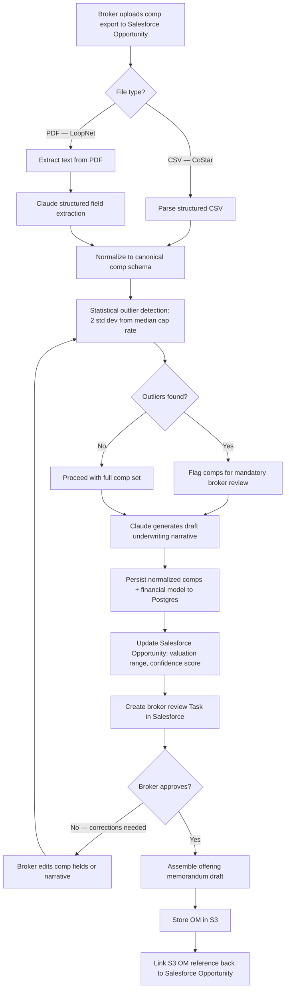
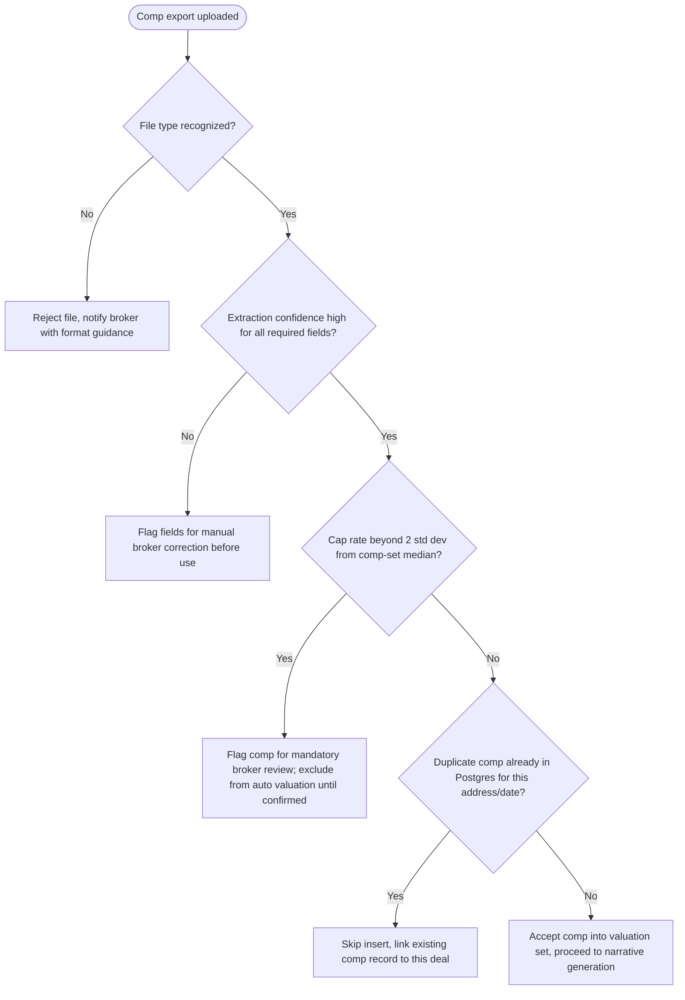
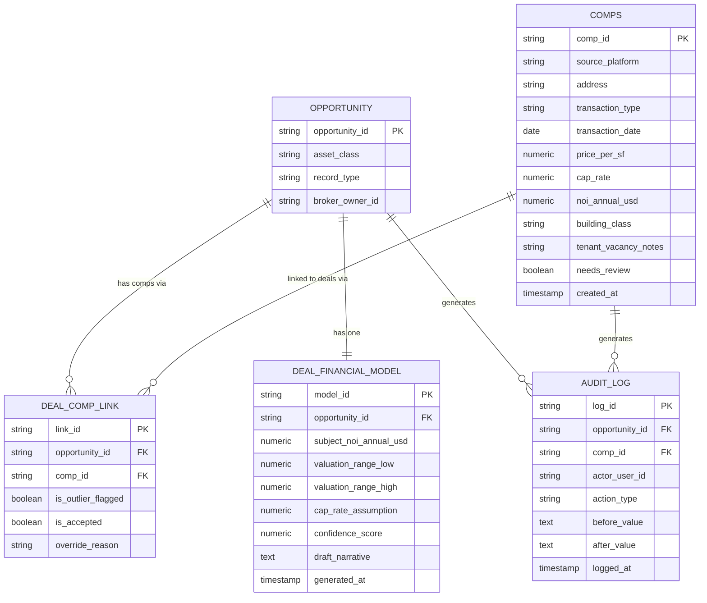
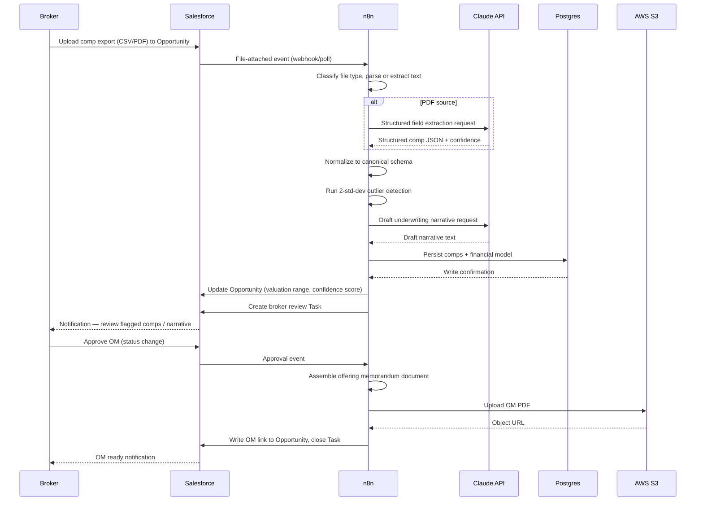

# SOP: Commercial Real Estate Deal Pipeline & AI Comp Analysis Automation

**Reference Deployment Context:** Harborview Commercial Advisors (a division of Harborview Realty Partners)
**Industry:** Commercial Real Estate — Office, Industrial, Retail Brokerage
**Owning Section:** 07 Real Estate
**SOP ID:** RE-04
**Version:** 1.0
**Last Updated:** 2026-06-30
**Author:** Automation Architecture Lead
**Classification:** Client-Facing
**Video Walkthrough:** _Pending recording — see script in this SOP's project folder._
**Real Build Artifacts:** [Importable n8n workflow, runnable automation script, and executable database schema →](build/README.md)

## Table of Contents

1. [Purpose](#1-purpose)
2. [Business Problem](#2-business-problem)
3. [Business Goals](#3-business-goals)
4. [Business Requirements](#4-business-requirements)
5. [Functional Requirements](#5-functional-requirements)
6. [Technical Requirements](#6-technical-requirements)
7. [Dependencies](#7-dependencies)
8. [Systems Used](#8-systems-used)
9. [Roles](#9-roles)
10. [Responsibilities](#10-responsibilities)
11. [Workflow Overview](#11-workflow-overview)
12. [Detailed Workflow Steps](#12-detailed-workflow-steps)
13. [Decision Tree](#13-decision-tree)
14. [Automation Logic](#14-automation-logic)
15. [Trigger Conditions](#15-trigger-conditions)
16. [Data Validation](#16-data-validation)
17. [Error Handling](#17-error-handling)
18. [Retry Logic](#18-retry-logic)
19. [Fallback Procedures](#19-fallback-procedures)
20. [Manual Override](#20-manual-override)
21. [Exception Handling](#21-exception-handling)
22. [Notifications](#22-notifications)
23. [Audit Logs](#23-audit-logs)
24. [Security](#24-security)
25. [Permissions](#25-permissions)
26. [Compliance](#26-compliance)
27. [Performance Metrics](#27-performance-metrics)
28. [KPIs](#28-kpis)
29. [Testing Procedure](#29-testing-procedure)
30. [Deployment](#30-deployment)
31. [Maintenance](#31-maintenance)
32. [Version History](#32-version-history)
33. [Future Improvements](#33-future-improvements)
34. [Appendix](#34-appendix)
35. [Troubleshooting](#35-troubleshooting)
36. [Recovery Procedure](#36-recovery-procedure)
37. [Frequently Asked Questions](#37-frequently-asked-questions)
38. [Technical Notes](#38-technical-notes)
39. [Business Notes](#39-business-notes)
40. [Estimated Time Savings](#40-estimated-time-savings)
41. [ROI Analysis](#41-roi-analysis)
42. [Risk Assessment](#42-risk-assessment)
43. [Lessons Learned](#43-lessons-learned)
44. [Related SOPs](#44-related-sops)

---

## 1. Purpose

This SOP documents the automation architecture that ingests raw comparable-sale and comparable-lease exports from CoStar and LoopNet, normalizes them into a canonical comp schema, applies statistical outlier detection and AI-assisted narrative drafting, and produces a broker-reviewable offering memorandum (OM) draft — all tied to a Salesforce Opportunity record. The workflow exists to compress the underwriting cycle for Harborview Commercial Advisors' 18 brokers from a manual, spreadsheet-driven process measured in hours to a reviewable first draft measured in minutes, while enforcing a consistent, auditable methodology for cap rate and valuation assumptions across the brokerage's office, industrial, and retail deal teams.

## 2. Business Problem

Harborview Commercial Advisors brokers historically built underwriting packages by hand: exporting comp sets from CoStar and LoopNet, pasting them into Excel, manually filtering for relevance, and constructing a valuation narrative and cap rate assumption set from scratch for every offering memorandum. This process averaged **6.4 hours per OM** across a sample of 40 offering memoranda pulled from the prior two quarters, with a range of 4.8 to 10.1 hours depending on asset class complexity (industrial being fastest, multi-tenant office and mixed-use retail being slowest due to lease-abstraction overhead).

More materially, the manual process produced no standardization. A deal-desk audit of 12 comparable office dispositions in the same submarket, underwritten by six different brokers, found cap rate assumptions ranging from 5.6% to 7.1% for functionally similar assets — a **150-basis-point spread** with no documented methodology explaining the variance. This inconsistency undermines deal-desk credibility with institutional sellers and buyers who expect defensible, comp-supported valuation logic, and it exposes the brokerage to reputational risk when two brokers on the same deal team present materially different valuation ranges for comparable assets in the same pitch cycle.

## 3. Business Goals

- Compress the time from comp export upload to a broker-reviewable OM draft from a multi-hour manual exercise to a same-session automated turnaround.
- Standardize cap rate and valuation methodology across all 18 brokers by routing every deal through the same normalization, outlier-detection, and narrative-generation logic.
- Create a durable, queryable comp database (Postgres) that compounds in value with every deal processed, rather than losing broker-built comp analysis in disconnected spreadsheets.
- Preserve broker judgment as the final authority on valuation — the system drafts and flags, brokers approve and correct.
- Establish Salesforce as the single system of record for CRE deal status, valuation range, and confidence scoring, replacing ad hoc spreadsheet tracking.

## 4. Business Requirements

- **BR-1:** The system must accept comp exports in both CoStar's CSV export format and LoopNet's PDF export format without requiring the broker to reformat the source file.
- **BR-2:** The system must normalize heterogeneous comp data into a single canonical schema regardless of source platform.
- **BR-3:** The system must statistically flag comps that are inconsistent with the broader comp set for a given subject property, so brokers review outliers before they contaminate a valuation range.
- **BR-4:** The system must generate a draft underwriting narrative that a broker can edit rather than write from a blank page.
- **BR-5:** The system must write a comp-derived valuation range and confidence score back to the Salesforce Opportunity so deal status is visible to the full deal team without opening a spreadsheet.
- **BR-6:** The system must require explicit broker approval before any offering memorandum is finalized and distributed — no fully autonomous OM issuance.
- **BR-7:** The system must retain a durable, structured record of every comp ever ingested, independent of the deal it was originally uploaded for, so comps are reusable across future deals in the same submarket.

## 5. Functional Requirements

- **FR-1:** n8n exposes a file-drop trigger (Salesforce file upload event or direct upload endpoint) that accepts `.csv` and `.pdf` attachments linked to an Opportunity record.
- **FR-2:** n8n routes CSV files through a structured parser and PDF files through a text-extraction step (OCR fallback for scanned exports) followed by a Claude API structured-extraction call.
- **FR-3:** A normalization module maps source-specific field names and units (CoStar and LoopNet use different column naming and, occasionally, different NOI reporting conventions) into the canonical comp schema defined in Section 34 (Appendix).
- **FR-4:** A statistical module computes the median and standard deviation of cap rates across the normalized comp set and flags any comp more than 2 standard deviations from the median for mandatory broker review before inclusion in the valuation range.
- **FR-5:** A Claude API call generates a draft underwriting narrative section referencing the accepted comps, the subject property's financials, and the computed valuation range.
- **FR-6:** n8n writes the normalized comps and the resulting deal financial model to PostgreSQL, keyed to both the comp's own identity and the Salesforce Opportunity ID.
- **FR-7:** n8n updates the Salesforce Opportunity with the valuation range, confidence score, and a link to the supporting comp set, and creates a broker review Task.
- **FR-8:** Upon broker approval (a Salesforce status field change or an n8n-exposed approval action), n8n assembles the offering memorandum document, stores it in S3, and writes the S3 reference back to the Opportunity.

**Traceability table:**

| BR ID | FR ID | Description |
|---|---|---|
| BR-1 | FR-1, FR-2 | Accept CSV and PDF comp exports without reformatting |
| BR-2 | FR-3 | Normalize source-specific fields into canonical schema |
| BR-3 | FR-4 | Flag statistical outlier comps for broker review |
| BR-4 | FR-5 | Generate draft underwriting narrative via Claude |
| BR-5 | FR-7 | Write valuation range and confidence score to Salesforce |
| BR-6 | FR-8 | Require broker approval before OM finalization |
| BR-7 | FR-6 | Persist normalized comps and financial model in Postgres |

## 6. Technical Requirements

- **n8n:** self-hosted instance, version 1.4x or later, minimum 4 vCPU / 8 GB RAM worker node given the PDF text-extraction and Claude API round trips involved per document.
- **Claude API:** model tier suitable for structured extraction and narrative generation (Claude Sonnet-class); requests are made with `temperature` fixed low (0.1–0.2) for extraction calls and moderate (0.4) for narrative drafting, per Section 14.
- **Salesforce:** API version 59.0 or later; custom fields provisioned on the Opportunity object (see Section 8); REST API used for record updates, Bulk API not required at current deal volume.
- **PostgreSQL:** version 14+, with the `pgcrypto` extension enabled for at-rest field-level encryption of sensitive financial columns (see Section 24).
- **AWS S3:** versioning enabled on the comp-document and OM-document buckets; lifecycle policy transitions source documents to Infrequent Access after 90 days.
- **Latency budget:** CSV comp ingestion and normalization target under 90 seconds per file; PDF ingestion (text extraction + Claude structured extraction) targets under 4 minutes per file, accounting for multi-page LoopNet flyer PDFs.
- **Uptime target:** 99.5% for the n8n orchestration layer during business hours (7:00 AM–7:00 PM local, Monday–Saturday), consistent with brokerage working patterns rather than a 24/7 consumer SLA.
- **Data residency:** all comp data, deal financials, and generated OMs remain in AWS `us-east-1`, consistent with Harborview's existing Salesforce data residency election.
- **Claude API rate limits:** workflow enforces a per-Opportunity queuing discipline so concurrent broker uploads for the same deal do not exceed Anthropic's per-minute token budget for the provisioned tier; see Section 18 for backoff behavior.

## 7. Dependencies

- **CoStar and LoopNet export formats:** the workflow depends on both platforms' export layouts remaining reasonably stable release-to-release. CoStar CSV exports are structurally reliable; LoopNet PDF flyers vary in layout by listing template, which is the primary driver of PDF-extraction fragility (see Section 17).
- **Salesforce CRE object model:** depends on the custom fields defined in Section 8 already existing on the Opportunity object before this workflow is deployed to a given Salesforce org.
- **Broker upload discipline:** depends on brokers tagging uploads to the correct Opportunity record at upload time; misattributed uploads are handled per Section 21.
- **Claude API availability:** the narrative-generation and PDF-extraction steps are hard dependencies on Anthropic API availability; there is no fully offline fallback for PDF field extraction (see Section 19).
- **Upstream RE-03 lead qualification workflow:** Opportunities entering this workflow are assumed to already exist as qualified Salesforce records; RE-04 does not create Opportunities, it operates on existing ones.

## 8. Systems Used

| System | Role in Workflow | Auth Method |
|---|---|---|
| n8n | ETL orchestration — file ingestion, parsing, normalization, routing between Claude, Postgres, Salesforce, and S3 | API Key (per-node credential store) |
| CoStar / LoopNet exports | Source comp data — CSV (CoStar) or PDF (LoopNet), file-drop trigger via broker upload or scheduled export pull | N/A (file ingestion, not a live API integration) |
| Claude API | Comp normalization from unstructured PDF layouts, statistical outlier cross-reference support, draft underwriting narrative generation | API Key |
| Salesforce | System of record for the CRE deal pipeline — Opportunity object with custom fields for asset class, cap rate, NOI, valuation range, confidence score | OAuth2 (Connected App, JWT bearer flow for server-to-server) |
| PostgreSQL | Structured comp database and deal financial model store | Username/password over TLS, credentials in secrets manager |
| AWS S3 | Storage for source comp documents and generated offering memoranda | IAM Role (scoped, workflow-specific) |

## 9. Roles

- **Business Owner:** Harborview Commercial Advisors Managing Director — owns the underwriting methodology standard this workflow enforces and signs off on any change to the outlier threshold or valuation logic.
- **Technical Owner:** Automation Architecture Lead (engagement consultant) — owns the n8n workflow, Claude prompt versions, and the Postgres schema.
- **Deal-Desk Reviewer:** Senior broker or deal-desk analyst — reviews flagged outlier comps and approves draft OMs before distribution.
- **Salesforce Administrator:** Harborview IT — owns the Opportunity object schema, field-level security, and Connected App credentials.
- **Escalation Contact:** Automation Architecture Lead during the engagement window; transitions to Harborview IT post-handoff per Section 31.

## 10. Responsibilities

| Role | Responsibility |
|---|---|
| Broker | Uploads comp exports tied to the correct Opportunity; reviews flagged outliers; corrects misextracted fields; approves draft OM before distribution |
| Deal-Desk Reviewer | Spot-checks valuation methodology consistency across brokers; escalates systemic cap rate drift to the Business Owner |
| Automation Architecture Lead | Maintains n8n workflow, Claude prompt versions, Postgres schema, and monitors error queues |
| Salesforce Administrator | Maintains custom field schema, field-level security, and Connected App health |
| Harborview IT (post-handoff) | Owns infrastructure monitoring, credential rotation, and incident response after engagement handoff |

## 11. Workflow Overview

The workflow begins when a broker uploads a comp export against a Salesforce Opportunity. n8n classifies the file type, routes it through the appropriate parsing path, normalizes the extracted data into the canonical comp schema, and runs statistical outlier detection against the subject property's comp set. Claude generates a draft underwriting narrative referencing the accepted comps. The normalized comps and financial model persist to Postgres, and Salesforce is updated with a valuation range, confidence score, and a broker review task. Only after explicit broker approval does the system assemble the offering memorandum, store it in S3, and link it back to the Opportunity.



## 12. Detailed Workflow Steps

1. **Tool:** Salesforce / n8n webhook — **Trigger:** File attached to an Opportunity record (comp export upload) — **Input schema:** file binary, MIME type, Opportunity ID, uploading broker's Salesforce user ID — **Transformation:** n8n receives the file-attached event and downloads the binary — **Output:** file staged in a temporary n8n binary buffer, tagged with Opportunity ID — **Condition branches:** MIME type `text/csv` → Step 2; MIME type `application/pdf` → Step 3 — **Error handling ref:** Section 17, Scenario 1.

2. **Tool:** n8n (CSV parser node) — **Trigger:** upstream Step 1 branch — **Input schema:** raw CoStar CSV — **Transformation:** parses rows into key-value objects using the known CoStar column header set; applies unit normalization (price/SF, cap rate as decimal) — **Output:** array of raw comp row objects — **Condition branches:** header set matches known CoStar template → proceed; unrecognized headers → Section 17, Scenario 1 — **Error handling ref:** Section 17, Scenario 1.

3. **Tool:** n8n (text extraction node, e.g., PDF-to-text with OCR fallback) — **Trigger:** upstream Step 1 branch — **Input schema:** raw LoopNet PDF binary — **Transformation:** extracts raw text layer; if the text layer is empty or sparse (scanned image PDF), routes through an OCR step first — **Output:** raw unstructured text blob per page — **Condition branches:** text density above threshold → Step 4 directly; below threshold → OCR pass first, then Step 4 — **Error handling ref:** Section 17, Scenario 1.

4. **Tool:** Claude API — **Trigger:** upstream Step 3 output — **Input schema:** raw text blob + structured-extraction prompt (Section 14) — **Transformation:** Claude extracts address, sale/lease date, price/SF, cap rate, NOI, building class, and tenant/vacancy notes into a JSON object matching the canonical schema — **Output:** structured comp JSON with a per-field confidence indicator — **Condition branches:** all required fields extracted with high confidence → Step 5; one or more fields low-confidence or missing → Section 17, Scenario 2 (flagged for broker correction, Section 20) — **Error handling ref:** Section 17, Scenario 2.

5. **Tool:** n8n (normalization function node) — **Trigger:** Step 2 or Step 4 output — **Input schema:** raw comp row (CSV path) or structured comp JSON (PDF path) — **Transformation:** maps both paths into the single canonical comp schema (Section 34), resolves unit and terminology differences between CoStar and LoopNet conventions — **Output:** canonical comp object(s) — **Condition branches:** duplicate address + sale date already in Postgres → Section 17, Scenario 4; otherwise → Step 6 — **Error handling ref:** Section 17, Scenario 4.

6. **Tool:** n8n (statistical function node) — **Trigger:** Step 5 output, full comp set for the subject property — **Input schema:** array of canonical comp objects — **Transformation:** computes median and standard deviation of cap rates; flags comps beyond 2 standard deviations (Section 14 logic) — **Output:** comp set partitioned into `accepted` and `flagged_for_review` — **Condition branches:** any flagged comps → broker review task created in parallel with narrative drafting; none flagged → proceed directly — **Error handling ref:** Section 17, Scenario 2 (insufficient comp count for meaningful statistics).

7. **Tool:** Claude API — **Trigger:** Step 6 output — **Input schema:** accepted comp set + subject property financials + narrative-generation prompt (Section 14) — **Transformation:** generates a draft underwriting narrative section discussing comp support for the valuation range — **Output:** draft narrative text block — **Condition branches:** none (always produced, always broker-editable) — **Error handling ref:** Section 17, Scenario 3 (API timeout/rate limit).

8. **Tool:** n8n → PostgreSQL — **Trigger:** Step 6 and Step 7 outputs — **Input schema:** canonical comps, statistical summary, draft financial model — **Transformation:** upserts comps into the `comps` table, writes the deal financial model into the `deal_financial_model` table, both keyed to the Opportunity ID — **Output:** persisted rows with generated primary keys — **Condition branches:** insert conflict on unique constraint → update path (see ER diagram, Section 34) — **Error handling ref:** Section 17, Scenario 4.

9. **Tool:** n8n → Salesforce REST API — **Trigger:** Step 8 completion — **Input schema:** Opportunity ID + valuation range + confidence score + comp count — **Transformation:** PATCH to the Opportunity record's custom fields — **Output:** updated Opportunity record; creation of a Task record assigned to the deal's broker of record — **Condition branches:** API success → notify broker (Section 22); API governor limit/timeout → Section 17, Scenario 3 — **Error handling ref:** Section 17, Scenario 3.

10. **Tool:** Broker (manual, in Salesforce) — **Trigger:** broker reviews the Task, the flagged comps, and the draft narrative — **Input schema:** broker decision (approve / request correction) — **Transformation:** broker either approves the draft OM path or corrects specific comp fields (Section 20) and re-triggers Step 6 — **Output:** approval status field change on the Opportunity — **Condition branches:** approved → Step 11; correction requested → loop back to Step 6 — **Error handling ref:** Section 21.

11. **Tool:** n8n (document assembly node) — **Trigger:** Salesforce approval status change (polling or platform event) — **Input schema:** approved comp set, financial model, approved narrative — **Transformation:** assembles the structured OM document (cover page, subject property summary, comp grid, valuation narrative, disclosures) — **Output:** rendered OM document (PDF) — **Condition branches:** assembly success → Step 12; template/rendering failure → Section 17, Scenario 5 — **Error handling ref:** Section 17, Scenario 5.

12. **Tool:** n8n → AWS S3 — **Trigger:** Step 11 output — **Input schema:** rendered OM binary + Opportunity ID + version tag — **Transformation:** uploads to the OM bucket under a deterministic key path (`/oms/{opportunity_id}/{version}/OM.pdf`) — **Output:** S3 object URL — **Condition branches:** upload success → Step 13; upload failure mid-transfer → Section 17, Scenario 5 — **Error handling ref:** Section 17, Scenario 5.

13. **Tool:** n8n → Salesforce REST API — **Trigger:** Step 12 output — **Input schema:** Opportunity ID + S3 object URL — **Transformation:** writes the OM link to the Opportunity's `OM_Document_Link__c` field and closes the broker review Task — **Output:** finalized Opportunity state, workflow complete — **Condition branches:** none — **Error handling ref:** Section 17, Scenario 3.

## 13. Decision Tree



## 14. Automation Logic

**Outlier-flagging statistical logic.** The comp set for a subject property must contain at least five accepted comps before the 2-standard-deviation rule is considered statistically meaningful; below that threshold, all comps are surfaced for broker review rather than auto-accepted, since a standard deviation computed on fewer than five points is unstable and can silently mask a genuinely bad comp as "within range."

```python
from __future__ import annotations
from dataclasses import dataclass
from statistics import mean, stdev

MIN_COMPS_FOR_STATISTICS = 5
OUTLIER_THRESHOLD_STD_DEV = 2.0


@dataclass
class Comp:
    """Canonical comp record used for outlier detection."""
    comp_id: str
    address: str
    cap_rate: float  # decimal, e.g., 0.062 for 6.2%
    price_per_sf: float
    building_class: str


def flag_outlier_comps(comps: list[Comp]) -> dict[str, list[Comp]]:
    """Partition a comp set into accepted and flagged-for-review buckets.

    Applies a 2-standard-deviation rule against the comp set's cap rate
    median. Comps beyond the threshold are not discarded — they are
    routed to mandatory broker review before they can influence the
    valuation range (see Section 20, Manual Override).

    Args:
        comps: Normalized comp records for a single subject property's
            comparison set.

    Returns:
        A dict with keys "accepted" and "flagged_for_review", each
        mapping to a list of Comp objects.
    """
    if len(comps) < MIN_COMPS_FOR_STATISTICS:
        return {"accepted": [], "flagged_for_review": list(comps)}

    cap_rates = sorted(c.cap_rate for c in comps)
    mid = len(cap_rates) // 2
    median_cap_rate = (
        cap_rates[mid]
        if len(cap_rates) % 2 == 1
        else (cap_rates[mid - 1] + cap_rates[mid]) / 2
    )
    cap_rate_stdev = stdev(cap_rates)

    accepted: list[Comp] = []
    flagged: list[Comp] = []

    for comp in comps:
        deviation = abs(comp.cap_rate - median_cap_rate)
        if cap_rate_stdev > 0 and deviation > OUTLIER_THRESHOLD_STD_DEV * cap_rate_stdev:
            flagged.append(comp)
        else:
            accepted.append(comp)

    return {"accepted": accepted, "flagged_for_review": flagged}
```

**Claude prompt construction — PDF structured field extraction.** The extraction prompt is deliberately narrow in scope (single responsibility: extract, do not interpret or editorialize) and requires the model to self-report confidence per field so low-confidence extractions route to broker review rather than silently entering the valuation pipeline.

```python
def build_extraction_prompt(raw_pdf_text: str) -> str:
    """Construct the Claude prompt for LoopNet PDF structured extraction."""
    return f"""You are extracting structured comparable-property data from a
commercial real estate listing flyer. The source text was extracted from a
PDF and may contain OCR artifacts, inconsistent spacing, or table layouts
flattened into plain text.

Extract the following fields into a JSON object matching this exact schema:
- address (string)
- transaction_type ("sale" or "lease")
- transaction_date (ISO 8601 date string, or null if not present)
- price_per_sf (number, USD, or null)
- cap_rate (number, decimal form e.g. 0.062 for 6.2%, or null)
- noi_annual (number, USD, or null)
- building_class ("A", "B", or "C")
- tenant_vacancy_notes (string, brief, or null)

For each field, also return a confidence value: "high", "medium", or "low".
If a field cannot be determined from the text with reasonable certainty,
set its value to null and its confidence to "low" — do not guess or infer
a plausible-sounding value.

Return only the JSON object, no commentary.

SOURCE TEXT:
---
{raw_pdf_text}
---"""
```

**Claude prompt construction — draft underwriting narrative generation.** The narrative prompt is explicitly instructed to cite which comps support the stated range and to flag its own output as a draft requiring broker sign-off, reinforcing the human-in-the-loop posture required by BR-6.

```python
def build_narrative_prompt(
    subject_property: dict,
    accepted_comps: list[dict],
    valuation_range: dict,
) -> str:
    """Construct the Claude prompt for draft underwriting narrative generation."""
    return f"""You are drafting the valuation narrative section of a commercial
real estate offering memorandum. This is a DRAFT for broker review — do not
present conclusions as final. Write in the register of an institutional
underwriting memo: precise, comp-supported, no marketing language.

Subject property:
{subject_property}

Accepted comparable set (outliers already excluded):
{accepted_comps}

Computed valuation range (cap rate derived):
{valuation_range}

Write a 3-5 paragraph narrative that:
1. States the valuation range and the cap rate assumption driving it.
2. Explicitly references which comps support the range and why they were
   judged comparable (asset class, submarket, building class, recency).
3. Notes any comps that were excluded as statistical outliers and the
   reason (cap rate deviation), without asserting they were factually wrong.
4. Ends with a one-line flag: "Draft narrative — pending broker review and
   approval prior to distribution."

Do not state the valuation range as final or guaranteed."""
```

## 15. Trigger Conditions

The workflow triggers on a file-attachment event against a Salesforce Opportunity record where the attachment MIME type is `text/csv` or `application/pdf` and the Opportunity's record type is `CRE_Deal`. n8n polls Salesforce's `ContentDocumentLink` object on a 60-second interval (platform event subscription is the preferred production configuration where the org tier supports it, with polling as the fallback).

**Trigger payload schema:**

```json
{
  "event": "content_document_linked",
  "content_document_id": "069Rx0000004C92IAE",
  "linked_entity_id": "006Rx000005N9x1IAC",
  "linked_entity_type": "Opportunity",
  "file_name": "233_Harrison_St_CompSet_CoStar.csv",
  "file_extension": "csv",
  "content_size_bytes": 48213,
  "uploaded_by_user_id": "005Rx000001b3ZKQA0",
  "uploaded_at": "2026-06-30T15:42:11Z"
}
```

A secondary trigger — the broker approval action described in Step 10 — fires the OM-assembly sub-workflow (Steps 11–13) when the Opportunity's `OM_Approval_Status__c` field transitions to `Approved`.

## 16. Data Validation

| Field | Rule | Failure Action |
|---|---|---|
| `address` | Non-empty string, minimum 5 characters | Reject comp row, flag for broker manual entry |
| `transaction_date` | Valid ISO 8601 date, not in the future | Reject comp row, log to error queue (Section 17) |
| `cap_rate` | Numeric, between 0.01 and 0.20 (1%–20%) | Flag as likely extraction error, route to broker review rather than hard reject |
| `price_per_sf` | Positive numeric | Reject comp row if null or negative |
| `noi_annual` | Numeric if present; may be null for lease comps | Allow null; do not compute cap rate for that comp if NOI missing |
| `building_class` | Must be one of `A`, `B`, `C` | Default to `null`, flag for broker classification |
| `linked_entity_id` (Opportunity ID) | Must resolve to an existing Salesforce Opportunity with record type `CRE_Deal` | Reject upload, notify uploading broker of misattached file |
| Duplicate detection | `(address, transaction_date, transaction_type)` tuple must not already exist in `comps` table | Do not duplicate-insert; link existing record to the new deal (Section 17, Scenario 4) |

## 17. Error Handling

**Scenario 1 — Malformed or corrupted PDF export.** *Detection:* the text-extraction node returns an empty or near-empty text blob, or the OCR fallback also fails to produce usable text density above threshold. *Response:* the file is moved to a `failed_extraction` queue in n8n, the broker is notified via Salesforce Chatter and email with the specific file name and a request to re-export or provide the comp manually, and no partial comp record is created from the failed file.

**Scenario 2 — Claude misextracts a field from an ambiguous PDF layout.** *Detection:* the Claude extraction response reports `confidence: "low"` for one or more required fields, or a post-extraction sanity check (Section 16) finds a value outside plausible range (e.g., a cap rate of 45%). *Response:* the comp record is persisted with the affected field(s) marked `needs_review = true` and excluded from the automatic outlier-detection and valuation-range calculation until a broker confirms or corrects the value (Section 20).

**Scenario 3 — Salesforce API governor limit or timeout.** *Detection:* the Salesforce REST API returns a `REQUEST_LIMIT_EXCEEDED` error or the request exceeds the configured timeout (15 seconds). *Response:* the update is queued for retry per the backoff policy in Section 18; if retries exhaust, the Opportunity update is written to a local dead-letter table in Postgres and a Slack alert is sent to the Automation Architecture Lead so the update can be replayed manually once the governor limit window resets.

**Scenario 4 — Duplicate comp upload for the same property.** *Detection:* the normalization step's duplicate check (Section 16) matches an existing `(address, transaction_date, transaction_type)` tuple already in the `comps` table. *Response:* no new comp row is inserted; instead, a join record is written to `deal_comp_link` associating the existing comp with the current Opportunity, and the broker is informed the comp was already on file (with a link to which prior deal originally sourced it) rather than silently deduplicated without visibility.

**Scenario 5 — S3 upload failure mid-OM-generation.** *Detection:* the S3 PUT request returns a non-2xx response or the connection drops mid-transfer, detected via a checksum mismatch on the multipart upload completion call. *Response:* the OM assembly step retries the upload per Section 18; if it continues to fail, the rendered OM binary is retained in n8n's temporary storage for up to 24 hours and the broker review Task is annotated with a "document pending storage" status rather than being marked complete, preventing the Opportunity from showing a broken or missing OM link.

**Scenario 6 (additional) — CoStar/LoopNet template drift.** *Detection:* the CSV parser encounters column headers that do not match any known CoStar template version, or the PDF layout diverges enough that Claude's extraction confidence is uniformly low across most fields, suggesting a source template change rather than a one-off bad file. *Response:* the file is flagged for the Automation Architecture Lead specifically (not just the broker) since this may indicate the parsing/extraction logic itself needs a version update, and the individual comp upload is held in the review queue pending that assessment.

## 18. Retry Logic

- **Salesforce API calls:** exponential backoff starting at 2 seconds, doubling to a maximum of 5 attempts (2s, 4s, 8s, 16s, 32s), respecting the `Retry-After` header when Salesforce returns one on a governor-limit response. Each Salesforce write carries an idempotency key derived from `{opportunity_id}_{operation_type}_{content_hash}` so a retried request that actually succeeded server-side but timed out client-side does not create a duplicate Task or double-apply a field update.
- **S3 uploads:** the AWS SDK's built-in retry policy is used (exponential backoff, 3 attempts) for transient network errors; multipart upload integrity is verified via checksum before the workflow proceeds to the next step, and a failed multipart upload is aborted cleanly rather than left as an orphaned incomplete upload (S3 lifecycle policy also garbage-collects incomplete multipart uploads after 7 days as a backstop).
- **Claude API calls:** retry on `429` (rate limit) and `5xx` responses with exponential backoff (1s, 2s, 4s, 8s), maximum 4 attempts; a persistent `429` after all retries triggers a queuing delay of the remaining batch (relevant when a broker uploads several comps in quick succession) rather than a hard failure.
- **PostgreSQL writes:** wrapped in a transaction per comp batch; a failed transaction rolls back cleanly and retries the whole batch up to 3 times before routing to the dead-letter table, since partial comp-set writes would corrupt the statistical outlier calculation.

## 19. Fallback Procedures

When retries exhaust on any external system call, the affected record — whether a comp, a Salesforce update, or an OM document — is written to a dead-letter table in Postgres (`workflow_dead_letter`) with the original payload, the failure reason, and a timestamp. The Automation Architecture Lead reviews this queue daily during the active engagement window (transitioning to Harborview IT post-handoff per Section 31) and replays entries manually once the underlying issue (API outage, governor limit reset, malformed source file corrected by the broker) is resolved. There is no fully autonomous "degraded mode" for Claude API unavailability specifically — PDF field extraction has no offline fallback, so a Claude outage pauses PDF-sourced comp processing entirely while CSV-sourced comp processing (which does not depend on Claude for extraction) continues unaffected.

## 20. Manual Override

Brokers are the authorized party to manually correct a misextracted comp field before it is used in any valuation calculation. The correction flow: a comp flagged `needs_review = true` (Scenario 2, Section 17) surfaces in a Salesforce-embedded review list tied to the Opportunity; the broker opens the flagged comp, sees the Claude-extracted value alongside the source document (linked from S3), and either confirms the extracted value or overwrites it with the correct value. Any manual override is written to Postgres with an `overridden_by` user ID and `override_reason` free-text field, and the corrected comp re-enters the statistical outlier calculation (Section 14) on its next run. Deal-Desk Reviewers are additionally authorized to override the *outlier flag itself* — i.e., to accept a statistically flagged comp into the valuation set with a documented justification (e.g., "comp is correct; submarket genuinely repriced this quarter") — but this override is logged distinctly from a field-value correction, since it is a judgment call rather than a data-accuracy fix.

## 21. Exception Handling

Malformed payloads (e.g., a CSV with only partial columns present, or a PDF with an unreadable encrypted layer) are caught at the parsing step and routed to the `failed_extraction` queue rather than allowed to propagate a partially-populated comp object downstream. Partial data — for example, a LoopNet flyer that includes price/SF but omits NOI — is handled by allowing the comp to persist with the missing field as `null` rather than rejecting the whole record, since a comp missing NOI is still useful for price-per-SF benchmarking even if it cannot contribute to cap-rate statistics. Unexpected states, such as an Opportunity being deleted or reassigned to a different record type mid-workflow (between upload and OM approval), are detected by a pre-write existence and record-type check immediately before every Salesforce write; if the check fails, the workflow halts that Opportunity's pipeline and alerts the Automation Architecture Lead rather than writing to a now-invalid or reassigned record.

## 22. Notifications

| Event | Channel | Severity | Recipient |
|---|---|---|---|
| Comp upload successfully processed, no outliers | Salesforce Chatter post on Opportunity | Info | Broker of record |
| Comp(s) flagged as statistical outliers | Salesforce Task + email | Warning | Broker of record, Deal-Desk Reviewer |
| Field extraction low-confidence, needs correction | Salesforce Task | Warning | Broker of record |
| Salesforce API failure after retry exhaustion | Slack alert | High | Automation Architecture Lead |
| S3 upload failure after retry exhaustion | Slack alert | High | Automation Architecture Lead |
| Draft OM successfully assembled and approved | Salesforce Chatter post + email with S3 link | Info | Broker of record, Deal-Desk Reviewer |
| CoStar/LoopNet template drift suspected | Slack alert | High | Automation Architecture Lead |

## 23. Audit Logs

Every comp ingestion, field correction, outlier override, Salesforce write, and OM generation event is logged to a Postgres `audit_log` table capturing the actor (system or specific Salesforce user ID), the action type, the before/after value for any field-level change, and a timestamp. Logs are retained for 7 years, aligned with typical commercial real estate transaction record-retention practice and Harborview's brokerage document-retention policy, and are queryable by Opportunity ID so a deal-desk audit (of the kind described in Section 2) can reconstruct exactly which comps, overrides, and narrative drafts informed a given valuation range. Audit log entries are append-only at the application layer — no update or delete path is exposed to end users, only to the Automation Architecture Lead for exceptional, logged corrections.

## 24. Security

Authentication to Salesforce uses OAuth2 JWT bearer flow via a scoped Connected App rather than a shared username/password, avoiding credential storage for a human user account. Claude API and PostgreSQL credentials are stored in n8n's encrypted credential store, never in plaintext workflow JSON. Data in transit uses TLS 1.2+ for all API calls (Salesforce, Claude, S3, Postgres). Data at rest: S3 buckets use SSE-S3 server-side encryption by default with SSE-KMS available for the OM bucket given it contains client-facing valuation documents; Postgres columns holding deal financials (NOI, cap rate, valuation range) use `pgcrypto` column-level encryption in addition to disk-level encryption, since these fields are the most commercially sensitive data the workflow touches. No comp data, deal financials, or PII is logged in plaintext in n8n execution logs beyond what is necessary for debugging; execution logs older than 30 days are purged.

## 25. Permissions

| Role | Salesforce Access | Postgres Access | S3 Access |
|---|---|---|---|
| Broker (own deals) | Read/write on own Opportunities and related comps/tasks | No direct access (system-mediated only) | Read-only, own deal's OM and source documents (pre-signed URL) |
| Broker (other brokers' deals) | Read-only (deal-team visibility per Salesforce sharing rules) | No direct access | No access unless added to deal team |
| Deal-Desk Reviewer | Read/write across all CRE Opportunities | Read-only via reporting view | Read-only across all deals |
| Automation Architecture Lead | Admin (engagement window only) | Full read/write | Full read/write (workflow service role) |
| Salesforce Administrator | Admin | No access | No access |
| n8n service account | API-scoped Connected App (Opportunity, Task, ContentDocument objects only) | Full read/write (workflow-dedicated role) | Read/write (workflow-dedicated IAM role) |

## 26. Compliance

This workflow does not process consumer PII at meaningful scale — the data in question is commercial property and transaction data, not individual consumer records — so GDPR/CCPA exposure is limited primarily to broker and tenant contact fields incidentally present in some comp notes, which are handled under Harborview's existing Salesforce data-processing agreement rather than a bespoke framework for this workflow. The more material compliance consideration is **data-licensing usage rights**: CoStar and LoopNet data is licensed to Harborview under commercial terms that govern redistribution and reuse, and this workflow's design — deliberately normalizing and storing comp data in Harborview's own Postgres instance rather than merely caching source exports — should be reviewed against the specific terms of Harborview's CoStar/LoopNet license agreements before broad rollout. This SOP flags the concern for legal review; it is not itself a legal determination that current usage is compliant with those license terms, and the Automation Architecture Lead should confirm with Harborview's legal counsel that internal storage, cross-deal reuse, and inclusion of comp data in client-facing offering memoranda fall within the licensed use case before the workflow processes comps at production volume.

## 27. Performance Metrics

| Metric | Target |
|---|---|
| CSV comp ingestion + normalization latency | Under 90 seconds per file |
| PDF comp ingestion + extraction latency | Under 4 minutes per file |
| Claude extraction field-level accuracy (spot-audited against source PDF) | 95%+ high-confidence fields correct on audit |
| Salesforce write success rate (first attempt, pre-retry) | 98%+ |
| Workflow end-to-end uptime (business hours) | 99.5% |
| Dead-letter queue age (time to manual resolution) | Under 24 hours during business days |

## 28. KPIs

| KPI | Baseline (pre-automation) | Target (post-automation) |
|---|---|---|
| Average hours to first-draft OM | 6.4 hours | Under 45 minutes broker-active time (system processing time excluded, since it runs largely unattended) |
| Cap rate assumption variance across brokers on comparable deals | 150 bps spread observed | Under 40 bps spread on comparable asset class/submarket deals within 2 quarters of rollout |
| Comp normalization accuracy (canonical schema, spot-audited) | N/A (manual process, no standard schema existed) | 95%+ fields correctly normalized without broker correction |
| Broker adoption rate (comp uploads routed through workflow vs. off-system) | 0% (new capability) | 90%+ of CRE comp uploads within 90 days of rollout |
| Outlier-flag precision (flagged comps that brokers agree warranted review) | N/A | 80%+ agreement rate, tracked via override reasons in Section 20 |

## 29. Testing Procedure

Testing follows the portfolio-standard three-tier plan defined in [`37 Testing/`](../../37%20Testing/README.md): unit tests cover the normalization mapping functions and the outlier-detection statistical logic (Section 14) against fixed synthetic comp sets with known expected outputs; integration tests exercise the full n8n workflow against sandboxed Salesforce and Postgres instances using representative CoStar CSV and LoopNet PDF samples (including at least one deliberately malformed file per source type to exercise Section 17's error paths); user acceptance testing is conducted with two Harborview brokers processing three real historical deals each through the workflow in parallel with their existing manual process, comparing the automated valuation range and narrative draft against the broker's independently-produced manual OM for methodology consistency before go-live sign-off.

## 30. Deployment

Deployment follows the standard environment progression defined in [`38 Deployment/`](../../38%20Deployment/README.md): the workflow is built and validated in a sandboxed Salesforce org and a staging Postgres instance, then promoted to Harborview's production Salesforce org via a scheduled cutover window outside business hours to avoid disrupting active deal uploads. Rollback plan: the prior manual process remains fully available and undisturbed during a 30-day parallel-run period, so any production issue with the automated workflow results in brokers reverting to manual OM building for affected deals without data loss, since Salesforce Opportunity records and uploaded source files are unaffected by an n8n-side rollback.

## 31. Maintenance

Recurring maintenance follows the cadence defined in [`39 Maintenance/`](../../39%20Maintenance/README.md): weekly review of the dead-letter queue and error notification volume during the first 90 days post-launch, tapering to biweekly thereafter; quarterly review of Claude prompt performance (extraction confidence distribution, narrative quality spot-checks) with prompt version updates as needed; and an annual review of the CoStar/LoopNet export template compatibility given both platforms periodically revise their export layouts. Ownership of day-to-day maintenance transitions from the Automation Architecture Lead to Harborview IT at engagement handoff, with a documented runbook covering credential rotation, the dead-letter replay procedure, and Claude prompt version control.

## 32. Version History

| Version | Date | Author | Change |
|---|---|---|---|
| 1.0 | 2026-06-30 | Automation Architecture Lead | Initial release |

## 33. Future Improvements

- Extend the canonical comp schema to capture lease-specific fields (escalation schedule, TI allowance, free-rent concessions) with the same rigor currently applied to sale comps, since lease comps are presently normalized at a coarser grain.
- Add a submarket-level comp database view so brokers can query historical comps independent of any specific active deal, turning the Postgres comp store into a standing research tool rather than a deal-scoped byproduct.
- Introduce a confidence-weighted valuation range (rather than a single point estimate plus range) that reflects the proportion of high- versus low-confidence extracted fields feeding the calculation.
- Explore a direct CoStar API integration to replace the manual CSV export step where Harborview's CoStar license tier permits programmatic access, removing the file-drop step entirely for that source.

## 34. Appendix

**Canonical comp schema (normalized JSON):**

```json
{
  "comp_id": "cmp_2c9a1f3e",
  "source_platform": "CoStar",
  "source_document_s3_key": "comps/source/006Rx000005N9x1IAC/233_Harrison_St_CompSet.csv",
  "address": "233 Harrison St, Oakland, CA 94607",
  "asset_class": "office",
  "building_class": "B",
  "transaction_type": "sale",
  "transaction_date": "2026-03-14",
  "price_total_usd": 18750000,
  "price_per_sf": 312.50,
  "building_sf": 60000,
  "cap_rate": 0.061,
  "noi_annual_usd": 1143750,
  "tenant_vacancy_notes": "92% leased at close; single ground-floor retail vacancy",
  "extraction_confidence": {
    "cap_rate": "high",
    "noi_annual_usd": "high",
    "tenant_vacancy_notes": "medium"
  },
  "needs_review": false,
  "linked_opportunity_ids": ["006Rx000005N9x1IAC"],
  "created_at": "2026-06-30T15:44:02Z"
}
```

**Raw CoStar-style CSV row (source format, pre-normalization):**

```csv
Property Address,City,State,Zip,Sale Date,Sale Price,Building SF,Price/SF,Cap Rate,NOI,Building Class,Occupancy %
233 Harrison St,Oakland,CA,94607,03/14/2026,"$18,750,000",60000,"$312.50",6.10%,"$1,143,750",B,92%
```

**Salesforce Opportunity update payload (custom fields):**

```json
{
  "Id": "006Rx000005N9x1IAC",
  "CRE_Valuation_Range_Low__c": 17200000,
  "CRE_Valuation_Range_High__c": 19400000,
  "CRE_Cap_Rate_Assumption__c": 0.062,
  "CRE_Comp_Count__c": 9,
  "CRE_Comps_Flagged_For_Review__c": 1,
  "CRE_Valuation_Confidence_Score__c": 0.87,
  "CRE_OM_Approval_Status__c": "Pending Broker Review",
  "CRE_Comp_Database_Link__c": "https://internal.harborview.example/comps?opp=006Rx000005N9x1IAC"
}
```

**PostgreSQL ER diagram (comp and deal financial model schema):**



**Sequence diagram (upload through OM storage):**



**Glossary:**

- **OM (Offering Memorandum):** the structured marketing and underwriting document presented to prospective buyers/tenants for a commercial property.
- **NOI (Net Operating Income):** gross income less operating expenses, before debt service, used as the numerator in cap rate calculations.
- **Cap rate (Capitalization Rate):** NOI divided by property value/price, expressed as a percentage; the primary valuation shorthand used in comp-based commercial underwriting.
- **Comp (Comparable):** a prior sale or lease transaction used as a benchmark for valuing the subject property.

## 35. Troubleshooting

| Symptom | Likely Cause | Fix |
|---|---|---|
| Comp upload accepted but no fields populated | CSV header row does not match known CoStar template (Section 17, Scenario 6) | Check parser mapping config for template version drift; update column-header mapping table |
| Cap rate field extracted as an implausible value (e.g., 0.6 instead of 0.06) | Claude misread a percentage-formatted source value as a decimal | Confirm via Section 16 range validation; correct manually per Section 20, review extraction prompt for percentage-format handling |
| Salesforce Opportunity not updating after successful Postgres write | Salesforce API governor limit hit; update queued in dead-letter table | Check dead-letter table for pending entries; replay manually or wait for governor window reset |
| Broker cannot see OM link on Opportunity after approval | S3 upload failed silently or Salesforce write step failed after S3 success | Check n8n execution log for the OM-assembly sub-workflow; verify S3 object exists at expected key before assuming a full failure |
| Same comp appears to duplicate across two deals with slightly different values | Two brokers uploaded slightly different versions of the same underlying comp (e.g., updated NOI) before deduplication matched them | Review `deal_comp_link` for both records; deal-desk reviewer determines canonical value, corrected via Section 20 override |
| Outlier flags seem excessive for a submarket | Comp set genuinely has high dispersion (thin submarket, few transactions) rather than a data error | Confirm comp count meets `MIN_COMPS_FOR_STATISTICS`; if met, this is expected behavior, not a bug — document via override reasons |

## 36. Recovery Procedure

If the n8n orchestration layer becomes unavailable, no data loss occurs to already-persisted comps or Salesforce records — recovery consists of restarting the n8n service and replaying any workflow executions that were mid-flight at the time of the outage, identifiable via n8n's execution history showing an `error` or `waiting` terminal state. If Postgres becomes unavailable, incoming comp writes queue in n8n's retry logic (Section 18) rather than being dropped; once Postgres recovers, queued writes drain automatically, and the dead-letter table is checked for any writes that exhausted retries during the outage window for manual replay. If the Claude API experiences an extended outage, PDF-sourced comp processing pauses (Section 19) while CSV-sourced processing continues; upon Claude API recovery, paused PDF files in the `failed_extraction`/pending queue are automatically reprocessed on the next scheduled n8n polling cycle. In the event of a Salesforce-side incident affecting the Connected App or org availability, all comp normalization, statistical analysis, and Postgres persistence continue independently, with Salesforce writes queuing until connectivity restores — the workflow is designed so Salesforce is a downstream consumer of the comp pipeline, not a blocking dependency for the analytical work itself.

## 37. Frequently Asked Questions

**Q: Can a broker upload a comp export before the Opportunity exists in Salesforce?**
A: No. The workflow requires an existing Opportunity of record type `CRE_Deal` (Section 16); uploads against a non-existent or wrong-record-type Opportunity are rejected at validation with guidance to the broker.

**Q: What happens if two brokers on the same deal team upload conflicting comp sets for the same property?**
A: Both comp sets are ingested and normalized; the duplicate-detection logic (Section 17, Scenario 4) links genuinely identical comps rather than double-counting them, but if the two uploads represent different underlying data for the same address (e.g., different sale dates), both persist as distinct comps and the outlier-detection and Deal-Desk Reviewer processes (Section 20) surface any resulting inconsistency for human resolution.

**Q: Does the system ever finalize and send an OM without broker approval?**
A: No. Section 12, Step 10 and BR-6 make broker approval a hard gate; the OM-assembly sub-workflow (Steps 11–13) only fires on an explicit approval status change.

**Q: Why Salesforce for this division when the residential division runs on Close/GoHighLevel?**
A: See Section 39 and Section 44 — the short answer is transaction complexity and deal-team collaboration requirements specific to CRE brokerage.

**Q: How far back does the comp database go once this workflow launches?**
A: Only comps processed through the workflow after go-live populate the Postgres store automatically; historical comp backfill from brokers' existing spreadsheets is a one-time migration task scoped separately from this SOP's ongoing workflow.

## 38. Technical Notes

LoopNet PDF flyers are the primary source of extraction fragility in this workflow — unlike CoStar's structurally consistent CSV export, LoopNet listing flyers vary layout by listing agent's template choice, occasionally place financial data in image-based tables that defeat straightforward text-layer extraction and require the OCR fallback path, and sometimes omit NOI entirely in favor of an asking cap rate that may not reflect in-place financials. Treat any LoopNet-sourced cap rate as lower-trust than a CoStar-sourced one until a broker confirms it — this is reflected in the `extraction_confidence` field persisted per comp rather than being flattened away during normalization. The Claude extraction prompt's instruction to return `null` rather than a guessed value for uncertain fields is load-bearing: earlier prompt iterations that allowed the model more latitude to "best-guess" a value from context produced plausible-looking but occasionally wrong cap rates that passed range validation (Section 16) yet were factually incorrect — the null-and-flag behavior trades a small amount of automation completeness for a much lower silent-error rate, which is the correct tradeoff given these numbers feed client-facing valuation documents.

## 39. Business Notes

The decision to run Harborview Commercial Advisors on Salesforce, rather than extending the residential division's Close/GoHighLevel stack (see [RE-01](../RE-01%20Speed-to-Lead%20Response%20and%20Drip%20Nurture%20Engine/SOP.md)), was a deliberate platform-selection call rather than an inherited default. CRE brokerage transactions involve materially more deal-team collaboration than residential transactions — a single office disposition may have a listing broker, a tenant-rep broker, a deal-desk reviewer, and occasionally a capital markets specialist all needing visibility into the same Opportunity with different edit permissions, which maps far more naturally onto Salesforce's object-level sharing rules, role hierarchy, and custom object model than onto a pipeline tool built around a single-agent-per-lead residential workflow. Close and GoHighLevel are well-suited to high-volume, single-owner residential pipelines with drip nurture as the dominant motion (see RE-01); CRE deals are lower-volume, higher-dollar, and collaboration-heavy, which is the deciding factor, not a preference for one vendor's brand. This is a useful pattern for any multi-division real estate client: the CRM choice should follow the transaction and collaboration model, not be standardized across divisions for its own sake.

The 2-standard-deviation outlier threshold (Section 14) was chosen after reviewing Harborview's historical comp sets rather than derived from a generic statistical convention — it was validated against the deal-desk audit referenced in Section 2 to confirm it would have flagged the comps that actually drove the 150-bps cap rate spread across brokers, without flagging so many comps that brokers would be routinely overriding the system (which would erode trust in the flag itself). This threshold should be revisited if Harborview expands into asset classes (e.g., hospitality, specialty industrial) with inherently higher cap rate dispersion, where 2 standard deviations may prove too sensitive.

## 40. Estimated Time Savings

Baseline manual process: 6.4 hours per OM (Section 2), of which the automated workflow eliminates the bulk of the comp-gathering, normalization, and first-draft-narrative labor — the broker-active time in the automated process (reviewing flagged outliers, correcting any low-confidence fields, reading and lightly editing the draft narrative, and approving the OM) is estimated at 40 minutes per deal based on UAT sessions described in Section 29.

**Per-OM time savings calculation:**

- Manual baseline: 6.4 hours = 384 minutes
- Automated broker-active time: 40 minutes
- Time saved per OM: 384 − 40 = **344 minutes (5.73 hours) per OM**

**Monthly time savings at current deal volume:**

Harborview Commercial Advisors' 18 brokers collectively produce an estimated 22 offering memoranda per month across office, industrial, and retail asset classes (based on historical deal-flow volume).

- 22 OMs/month × 5.73 hours saved per OM = **126 broker-hours saved per month**
- Annualized: 126 × 12 = **1,512 broker-hours saved per year**

## 41. ROI Analysis

Per the portfolio-standard ROI methodology in [`44 ROI/`](../../44%20ROI/README.md), this section models fully loaded broker cost against the build and run cost of the automation.

**Inputs:**

- Fully loaded broker cost: $95/hour (blended commission-adjusted opportunity cost of broker time across the 18-broker team)
- Monthly broker-hours saved: 126 hours (Section 40)
- Monthly labor value recovered: 126 × $95 = **$11,970/month**
- Annualized labor value recovered: $11,970 × 12 = **$143,640/year**

**Build cost (one-time):**

- Discovery, workflow design, n8n build (ingestion, normalization, outlier logic), Claude prompt engineering and testing, Salesforce custom field/Connected App setup, Postgres schema build, UAT with two brokers: estimated at **$38,000** for an Advanced-tier engagement of this scope.

**Run cost (ongoing, monthly):**

- n8n hosting (dedicated worker node sized for PDF/Claude round trips): ~$180/month
- Claude API usage (estimated at ~50 extraction calls + 22 narrative-generation calls/month at current volume): ~$140/month
- PostgreSQL managed instance: ~$90/month
- AWS S3 storage and transfer (source documents + OMs, versioned): ~$35/month
- Total estimated run cost: **~$445/month, ~$5,340/year**

**Net ROI (Year 1):**

- Year 1 labor value recovered: $143,640
- Year 1 total cost: $38,000 (build) + $5,340 (run) = $43,340
- Year 1 net benefit: $143,640 − $43,340 = **$100,300**
- Year 1 ROI: $100,300 / $43,340 ≈ **231%**

**Net ROI (Year 2 onward, build cost already amortized):**

- Annual labor value recovered: $143,640
- Annual run cost: $5,340
- Year 2+ net benefit: $143,640 − $5,340 = **$138,300**
- Year 2+ ROI: $138,300 / $5,340 ≈ **2,590%**

This calculation isolates broker time value only; it does not attempt to quantify the harder-to-model but strategically significant benefit of reduced cap rate variance (Section 2, Section 28) on deal-desk credibility and pitch-win rate, which the Business Owner should track qualitatively alongside these hours-based figures.

## 42. Risk Assessment

| Risk | Likelihood | Impact | Mitigation |
|---|---|---|---|
| CoStar/LoopNet export template changes break parsing | Medium | Medium | Section 17 Scenario 6 detection; quarterly template compatibility review (Section 31) |
| Claude extraction silently produces a plausible-but-wrong financial value | Low (mitigated by design) | High | Null-and-flag prompt behavior (Section 38), range validation (Section 16), mandatory broker review of low-confidence fields |
| CoStar/LoopNet data-licensing terms restrict this storage/reuse pattern | Medium | High | Legal review flagged explicitly in Section 26 prior to production scale-up |
| Broker adoption resistance (preference for familiar Excel workflow) | Medium | Medium | UAT-driven rollout with broker-in-the-loop design (Section 29); OM quality parity demonstrated before mandating adoption |
| Salesforce governor limits constrain scale as deal volume grows | Low at current volume | Medium | Retry/backoff logic (Section 18); migration path to Bulk API if volume materially increases |
| Outlier threshold miscalibrated for a new asset class (e.g., hospitality) | Low at current scope | Medium | Documented as a known limitation (Section 39); threshold revisited before expanding asset class coverage |
| Single point of failure on Automation Architecture Lead during engagement window | Medium | Medium | Documented runbook and handoff plan to Harborview IT (Section 31) |

## 43. Lessons Learned

The null-and-flag extraction behavior (Section 38) was not the initial design — early prompt iterations optimized for extraction completeness, and the resulting occasional confidently-wrong cap rate values were a more dangerous failure mode than an incomplete extraction, since a broker is far more likely to catch and query a missing field than to catch a wrong-but-plausible one. The lesson generalizes beyond this engagement: any LLM-based structured extraction feeding a financial or valuation calculation should be prompted and evaluated for calibrated uncertainty, not just field-level accuracy, and the UAT plan (Section 29) should specifically test for this failure mode rather than only testing for successful extractions. Separately, validating the outlier threshold against Harborview's own historical deal-desk audit (Section 39) before hard-coding a generic statistical convention proved essential — a threshold that looked reasonable in the abstract needed calibration against how this specific brokerage's comps actually distribute across its submarkets and asset classes.

## 44. Related SOPs

- [RE-01: Speed-to-Lead Response & Drip Nurture Engine](../RE-01%20Speed-to-Lead%20Response%20and%20Drip%20Nurture%20Engine/SOP.md) — sibling engagement on Harborview's residential division; referenced in Section 39 for platform-selection contrast between Close/GoHighLevel (high-volume, single-owner residential pipeline) and Salesforce (collaboration-heavy CRE deal teams).
- [RE-02: Transaction Coordination & Compliance Automation](../RE-02%20Transaction%20Coordination%20and%20Compliance%20Automation/SOP.md) — sibling engagement on Harborview's residential division, covering post-contract compliance automation for a comparable brokerage operating model.
- [RE-03: AI-Powered Lead Qualification & Scoring Engine](../RE-03%20AI-Powered%20Lead%20Qualification%20and%20Scoring%20Engine/SOP.md) — sibling engagement; both RE-03 and this workflow use the Claude API for structured extraction from unstructured or semi-structured source material, and the shared pattern of confidence-scored, human-reviewable LLM extraction (Section 14 and Section 38 here) is directly comparable to RE-03's lead-qualification extraction logic.

---
*Part of the Enterprise Automation Portfolio. See [`07 Real Estate`](../README.md) README for navigation.*
