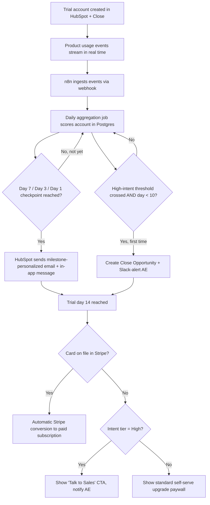
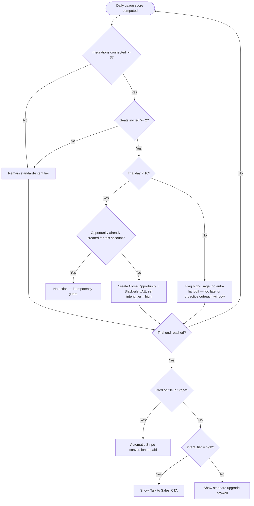
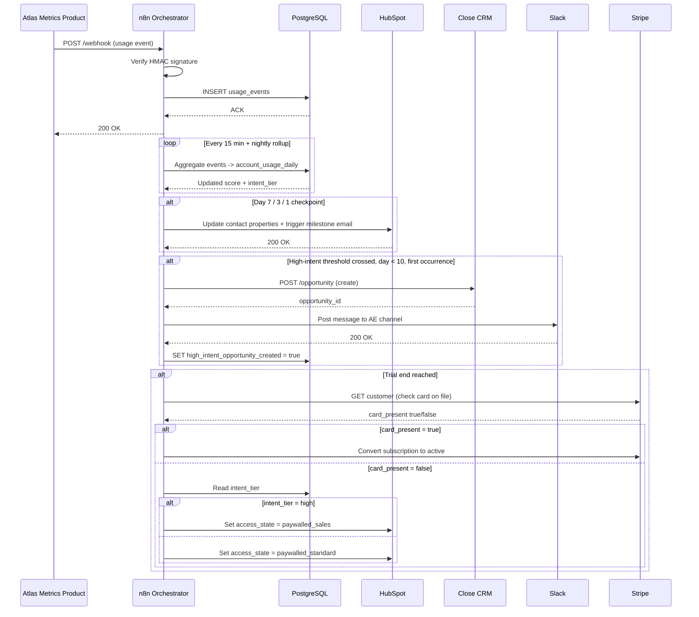

# SOP: Trial-to-Paid Conversion & Usage-Triggered Nurture Engine

**Reference Deployment Context:** Atlas Metrics
**Industry:** B2B Product Analytics SaaS
**Owning Section:** 14 SaaS
**SOP ID:** SAAS-01
**Version:** 1.0
**Last Updated:** 2026-06-30
**Author:** Automation Architecture Lead
**Classification:** Client-Facing
**Video Walkthrough:** _Pending recording — see script in this SOP's project folder._
**Real Build Artifacts:** [Importable n8n workflow, runnable automation script, and executable database schema →](build/README.md)

## Table of Contents

1. [Purpose](#1-purpose)
2. [Business Problem](#2-business-problem)
3. [Business Goals](#3-business-goals)
4. [Business Requirements](#4-business-requirements)
5. [Functional Requirements](#5-functional-requirements)
6. [Technical Requirements](#6-technical-requirements)
7. [Dependencies](#7-dependencies)
8. [Systems Used](#8-systems-used)
9. [Roles](#9-roles)
10. [Responsibilities](#10-responsibilities)
11. [Workflow Overview](#11-workflow-overview)
12. [Detailed Workflow Steps](#12-detailed-workflow-steps)
13. [Decision Tree](#13-decision-tree)
14. [Automation Logic](#14-automation-logic)
15. [Trigger Conditions](#15-trigger-conditions)
16. [Data Validation](#16-data-validation)
17. [Error Handling](#17-error-handling)
18. [Retry Logic](#18-retry-logic)
19. [Fallback Procedures](#19-fallback-procedures)
20. [Manual Override](#20-manual-override)
21. [Exception Handling](#21-exception-handling)
22. [Notifications](#22-notifications)
23. [Audit Logs](#23-audit-logs)
24. [Security](#24-security)
25. [Permissions](#25-permissions)
26. [Compliance](#26-compliance)
27. [Performance Metrics](#27-performance-metrics)
28. [KPIs](#28-kpis)
29. [Testing Procedure](#29-testing-procedure)
30. [Deployment](#30-deployment)
31. [Maintenance](#31-maintenance)
32. [Version History](#32-version-history)
33. [Future Improvements](#33-future-improvements)
34. [Appendix](#34-appendix)
35. [Troubleshooting](#35-troubleshooting)
36. [Recovery Procedure](#36-recovery-procedure)
37. [Frequently Asked Questions](#37-frequently-asked-questions)
38. [Technical Notes](#38-technical-notes)
39. [Business Notes](#39-business-notes)
40. [Estimated Time Savings](#40-estimated-time-savings)
41. [ROI Analysis](#41-roi-analysis)
42. [Risk Assessment](#42-risk-assessment)
43. [Lessons Learned](#43-lessons-learned)
44. [Related SOPs](#44-related-sops)

---

## 1. Purpose

This workflow converts Atlas Metrics' 14-day free trial from a flat, calendar-driven email sequence into a usage-aware conversion engine. It ingests real-time product usage events, computes a daily per-account intent score, personalizes trial-lifecycle messaging against each account's actual behavior, and routes high-intent accounts to sales-assist outreach before the trial expires. At trial end, it enforces conversion or paywall logic conditioned on card-on-file status and intent tier. The system exists to replace guesswork — "send the same three emails to everyone on day 7, day 10, day 13" — with a data-driven nurture and handoff mechanism that treats a trial account that has connected three integrations and invited a team fundamentally differently than one that has never logged in twice.

## 2. Business Problem

Atlas Metrics runs a hybrid product-led-growth and sales-assist motion across roughly 1,800 active accounts at any given time, with a 14-day free trial as the primary top-of-funnel conversion mechanism. Prior to this engagement, the trial nurture sequence was a static, time-boxed HubSpot workflow: three emails sent on fixed days (day 3, day 7, day 12) with identical copy regardless of what the account had actually done in the product. There was no usage-based personalization, no segmentation of trial accounts by product engagement depth, and no mechanism to identify which trial accounts were exhibiting buying signals versus which were dormant. Sales had no visibility into trial activity at all — Account Executives learned an account had gone quiet only when it failed to convert. The measured trial-to-paid conversion rate under this static sequence was **15.1%** (trailing 90-day average prior to this engagement, calculated on trial accounts that reached day 14 without cancelling access). Because Atlas Metrics' trial volume and average contract value are large enough that even small conversion-rate movements compound into material annual recurring revenue, this flat-sequence approach was leaving a quantifiable and recoverable amount of revenue on the table — the exact figure is modeled in Section 41.

## 3. Business Goals

- Increase trial-to-paid conversion rate by personalizing lifecycle messaging to each account's actual product usage rather than elapsed calendar time.
- Give sales visibility into trial accounts exhibiting high purchase intent early enough (by trial day 10) to intervene before the trial lapses.
- Reduce the number of trial accounts that convert on autopilot via card-on-file billing without ever being touched by a human, while simultaneously reducing the number of high-intent accounts that silently churn out at the paywall for lack of a sales conversation.
- Establish a reusable usage-scoring data pipeline that downstream systems (churn prediction, expansion signals) can consume without re-instrumenting product event ingestion.
- Make the trial-to-paid motion auditable: every message sent and every Opportunity created must be traceable to the specific usage signal that triggered it.

## 4. Business Requirements

- **BR-1:** The system must personalize trial lifecycle emails based on an account's actual usage milestones, not solely on elapsed trial days.
- **BR-2:** The system must identify trial accounts exhibiting high purchase intent before trial day 10 and route them to a human Account Executive.
- **BR-3:** The system must not require manual data entry by Customer Success, Sales, or Marketing to determine an account's usage state — the scoring must be fully automated.
- **BR-4:** The system must convert trial accounts with a card on file to paid automatically at trial end without human involvement.
- **BR-5:** The system must present high-intent trial accounts without a card on file a sales conversation path rather than a generic self-serve upgrade page at trial end.
- **BR-6:** The system must allow Customer Success or Sales leadership to manually override an account's computed intent tier when the automated score misrepresents actual buying signal.
- **BR-7:** The system must preserve a full audit trail of usage scores, messages sent, and Opportunities created for every trial account, for at least one full fiscal quarter.

## 5. Functional Requirements

- **FR-1:** n8n consumes real-time usage events from Atlas Metrics' internal event API and aggregates them into a daily per-account usage score persisted in PostgreSQL.
- **FR-2:** A scheduled n8n workflow evaluates each active trial account's usage score at trial day 7, day 3, and day 1 remaining, and triggers a HubSpot email + in-app message referencing the account's specific milestones hit or missed.
- **FR-3:** A separate, continuously-evaluated n8n workflow checks each trial account against the high-intent threshold (≥3 integrations connected AND ≥2 seats invited) once per usage-score update cycle; the first time an account crosses this threshold before day 10, n8n creates a Close CRM Opportunity and posts a Slack alert to the assigned AE's channel.
- **FR-4:** At trial expiration (hour 0 of day 15), n8n checks Stripe for a card on file; if present, it initiates the trial-to-subscription conversion via Stripe; if absent, it checks the account's intent tier and routes to either a "talk to sales" CTA (high-intent) or a standard upgrade paywall (standard-intent).
- **FR-5:** Customer Success or Sales leads can manually override an account's intent tier via an internal override endpoint, which re-runs the day-10 routing logic on demand.
- **FR-6:** All state transitions (score updates, messages sent, Opportunities created, overrides applied) are written to an audit log table in PostgreSQL with timestamp, triggering event ID, and resulting action.

| BR ID | FR ID | Description |
|---|---|---|
| BR-1 | FR-2 | Usage-milestone-personalized lifecycle messaging at day 7/3/1 |
| BR-2 | FR-3 | High-intent threshold detection and AE handoff before day 10 |
| BR-3 | FR-1 | Automated daily usage scoring with no manual data entry |
| BR-4 | FR-4 | Automatic Stripe conversion for card-on-file accounts at trial end |
| BR-5 | FR-4 | Sales CTA routing for high-intent, no-card accounts at trial end |
| BR-6 | FR-5 | Manual intent-tier override with re-triggered routing |
| BR-7 | FR-6 | Full audit trail of scores, messages, and Opportunities |

## 6. Technical Requirements

- n8n self-hosted instance, version 1.6x or later, with queue mode enabled to handle concurrent webhook bursts from the event API.
- Product usage event API must support webhook delivery (or event-stream consumption) with at-least-once delivery semantics; Atlas Metrics' internal event API emits at roughly 40–120 events/minute at current account volume, with bursts up to 400/minute during business hours.
- PostgreSQL 14+ instance dedicated to usage aggregation and scoring, sized for append-heavy write patterns (raw event log) plus a compact daily-rollup table; target write latency under 50ms p95 for the rollup upsert.
- HubSpot Marketing Hub Professional tier or higher (required for custom-triggered workflows and API-driven contact property updates at the volume this workflow generates).
- Close CRM with API access sufficient to create Opportunities and update custom fields programmatically.
- Stripe account configured for trial-with-card and trial-without-card flows, with webhook endpoints for `customer.subscription.trial_will_end` and `invoice.payment_succeeded`.
- Slack workspace with a bot token scoped to post into AE-specific channels or DMs.
- API rate-limit budgets: HubSpot (Professional tier ceiling of 150 requests/10 seconds burst, 250,000/day), Close CRM (roughly 1,500 requests per rolling 15 minutes depending on plan), Stripe (100 read + 100 write requests/second in live mode, well above this workflow's needs).
- End-to-end latency budget from usage event ingestion to updated Postgres score: under 5 minutes, to keep the score fresh enough for same-day threshold-crossing alerts.
- Uptime target for the n8n orchestration layer: 99.5%, consistent with Atlas Metrics' broader operational tooling SLA, with alerting on any sustained ingestion gap over 15 minutes.

## 7. Dependencies

- **Upstream:** Atlas Metrics' product engineering team owns the internal event API; any schema change to event names or payload shape (e.g., renaming `feature_activated` or restructuring the `metadata` object) is a breaking change to this workflow and requires coordinated release.
- **Upstream:** Account and trial-start metadata (trial start date, plan tier, assigned AE) must already exist in HubSpot and Close before this workflow can compute day-relative triggers or route Slack alerts to the correct AE.
- **Internal:** The daily usage-scoring rollup job depends on the raw event table being current; if event ingestion is delayed, scoring for that day is delayed downstream.
- **Internal:** The trial-end conversion logic depends on Stripe's `trial_will_end` webhook firing reliably three days before trial expiration, per Stripe's default behavior, as a redundant check against the day-1 internal trigger.
- **External SLA:** HubSpot, Close CRM, Stripe, and Slack API availability; none of these are Atlas Metrics-controlled, and each has its own status page monitored by the on-call rotation (see Section 22).
- **Cross-workflow:** This workflow shares the Postgres usage-event pipeline with [SAAS-03 (Churn Prediction & Proactive CS Intervention System)](../SAAS-03%20Churn%20Prediction%20and%20Proactive%20CS%20Intervention%20System/SOP.md); schema changes to the event ingestion or scoring tables must be coordinated across both.

## 8. Systems Used

| System | Role in Workflow | Auth Method |
|---|---|---|
| n8n | Orchestration engine — event ingestion, scoring aggregation, scheduled trigger evaluation, cross-system routing | API Key (internal), stored in n8n credential vault |
| Internal Event API (Atlas Metrics product) | Source of real-time usage events (`feature_activated`, `integration_connected`, `workflow_created`, `seat_invited`) via webhook | HMAC-signed webhook secret |
| PostgreSQL | Daily usage aggregation and account intent-scoring store; audit log | Password-authenticated service account, network-restricted |
| HubSpot | Marketing automation, lifecycle email personalization, in-app message trigger | OAuth2 (private app token) |
| Close CRM | Sales-assist handoff — Opportunity creation for high-intent trial accounts | API Key |
| Stripe | Trial-to-subscription conversion, card-on-file billing, paywall enforcement | API Key (restricted, write-scoped to subscriptions/customers) |
| Slack | Real-time AE alerting on high-intent detection | OAuth2 (bot token), scoped to `chat:write` |

## 9. Roles

- **Business Owner:** VP of Growth, Atlas Metrics — owns the conversion-rate KPI and approves changes to the intent-threshold definition.
- **Technical Owner:** Marketing Automation Engineer (client-side), supported by the consulting engagement's automation architect during build and stabilization.
- **Escalation Contact (Product/Event API):** Atlas Metrics Platform Engineering on-call, for any event-schema or API availability issue upstream of n8n.
- **Escalation Contact (Sales Process):** Head of Sales, for disputes over intent-tier accuracy or AE handoff SLA.
- **Operational Owner (day-to-day):** Revenue Operations, who monitors dashboards, triages override requests, and owns the weekly threshold-tuning review.

## 10. Responsibilities

| Role | Responsibility |
|---|---|
| VP of Growth | Owns conversion KPI target, approves threshold changes, reviews monthly performance |
| Marketing Automation Engineer | Maintains n8n workflows, HubSpot templates, and Postgres scoring logic |
| Revenue Operations | Monitors daily dashboards, triages manual override requests, runs weekly threshold review |
| Account Executives | Respond to Slack high-intent alerts within SLA, action Close Opportunities |
| Customer Success Lead | Can override intent tier for accounts with known context (e.g., active support escalation) |
| Platform Engineering (client) | Maintains event API schema stability, notifies automation team of upstream changes |
| Automation Architect (consulting) | Designed and delivered the workflow; retained for quarterly tuning review per Section 31 |

## 11. Workflow Overview

The engine runs on two time horizons that intersect at trial end. Continuously, product usage events stream in and roll up into a daily account score. On a scheduled cadence, that score drives personalized nurture messaging at day 7, day 3, and day 1 remaining, and drives a one-time high-intent handoff to sales any time before day 10. At trial expiration, a single decision point — card on file, yes or no, intent tier, high or standard — determines whether the account converts automatically, hits a self-serve paywall, or is routed to a sales conversation.



## 12. Detailed Workflow Steps

**Step 1 — Event ingestion.**
Tool: n8n (Webhook node) ← Internal Event API.
Trigger: Atlas Metrics' product emits an event (`feature_activated`, `integration_connected`, `workflow_created`, `seat_invited`) the moment a user performs the corresponding action.
Input schema: see Section 34 for full payload. Key fields: `event_type`, `account_id`, `user_id`, `timestamp`, `metadata`.
Transformation: n8n validates the HMAC signature, normalizes `timestamp` to UTC, and writes the raw event to the `usage_events` append-only table in Postgres.
Output: row inserted into `usage_events`; no synchronous response required beyond a 200 ACK to the event API.
Condition branches: malformed signature → reject with 401, log to `usage_events_rejected`. See Section 17, Scenario 2.
Error handling reference: Section 17, Scenarios 1 and 2.

**Step 2 — Daily aggregation and scoring.**
Tool: n8n (Schedule Trigger, 02:00 account-local aggregate, plus a lightweight near-real-time incremental pass every 15 minutes) → PostgreSQL.
Trigger: cron schedule.
Input: all `usage_events` rows for each active trial account since the last rollup checkpoint.
Transformation: computes cumulative counts per account — integrations connected, seats invited, workflows created, features activated — and derives a weighted intent score (see Section 14 for the scoring function). Upserts into `account_usage_daily`.
Output: one row per account per day in `account_usage_daily`, plus an updated `current_intent_tier` field on the account's master record.
Condition branches: account with zero events in the lookback window → scored as baseline/dormant, flagged for Section 17 Scenario 5 handling.
Error handling reference: Section 17, Scenarios 2 and 5.

**Step 3 — Lifecycle checkpoint evaluation (day 7 / day 3 / day 1).**
Tool: n8n (Schedule Trigger, hourly sweep) → PostgreSQL (read) → HubSpot (write).
Trigger: hourly job checks each active trial account's `trial_end_date` against current time to detect accounts crossing the 7-days-remaining, 3-days-remaining, or 1-day-remaining boundary.
Input: account's latest `account_usage_daily` row plus trial metadata.
Transformation: n8n builds a personalization payload identifying which milestones are hit vs. missed (e.g., `integrations_connected: 0` → "you haven't connected an integration yet" branch; `seats_invited: 4` → "you've invited 4 teammates" branch) and calls the HubSpot API to update contact properties and enroll the contact in the corresponding single-send email + in-app message trigger.
Output: HubSpot contact properties updated (`trial_checkpoint_stage`, `usage_milestones_hit`), transactional email dispatched, in-app message flag set for the product frontend to render on next login.
Condition branches: contact not found in HubSpot (sync lag) → retry per Section 18; email dispatch failure → Section 17 Scenario 4.
Error handling reference: Section 17, Scenario 4; Section 18.

**Step 4 — High-intent detection and sales handoff.**
Tool: n8n (triggered on every `account_usage_daily` upsert) → Close CRM (write) → Slack (write).
Trigger: score update where `integrations_connected >= 3 AND seats_invited >= 2` evaluates true for the first time, and `trial_day < 10`.
Input: account record, assigned AE (from Close or HubSpot ownership field), current usage snapshot.
Transformation: n8n checks an idempotency flag (`high_intent_opportunity_created`) to ensure this fires exactly once per account; if unset, it creates a Close Opportunity (see Section 34 for payload) and posts a Slack message to the AE's channel with account context and a deep link to the Close record.
Output: Close Opportunity created in "Trial — High Intent" status; Slack message delivered; `high_intent_opportunity_created` flag set true in Postgres.
Condition branches: AE unassigned → route to Slack `#sales-assist-unassigned` for round-robin pickup. Duplicate trigger due to replayed event → blocked by idempotency flag.
Error handling reference: Section 17, Scenario 3; Section 21.

**Step 5 — Trial-end resolution.**
Tool: n8n (Schedule Trigger at trial hour-0, reconciled against Stripe webhook) → Stripe (read/write) → HubSpot / product frontend (write).
Trigger: `trial_end_date` reached, confirmed by both the internal schedule and the Stripe `customer.subscription.trial_will_end` webhook as a cross-check.
Input: account's Stripe customer object, current `intent_tier`.
Transformation: branches per the decision tree in Section 13 — card on file converts automatically via Stripe subscription transition; no card on file routes to either the sales CTA (high intent) or standard paywall (standard intent) rendered by the product frontend, driven by a flag n8n sets on the account record.
Output: Stripe subscription status updated to `active`, or `access_state` flag set to `paywalled_sales` / `paywalled_standard` for frontend consumption.
Condition branches: Stripe webhook race condition (webhook and internal schedule disagree) → Section 17, Scenario 3.
Error handling reference: Section 17, Scenario 3; Section 19.

## 13. Decision Tree



## 14. Automation Logic

**Sequence diagram — event ingestion through downstream systems:**



**Scoring and routing logic (representative implementation):**

```python
from dataclasses import dataclass
from datetime import date


@dataclass
class UsageSnapshot:
    """Cumulative usage counts for a trial account as of a given date."""
    account_id: str
    trial_day: int
    integrations_connected: int
    seats_invited: int
    workflows_created: int
    features_activated: int
    last_event_at: date | None


def compute_intent_score(snapshot: UsageSnapshot) -> float:
    """Compute a weighted 0-100 intent score from usage counts.

    Weights reflect observed correlation with historical conversions:
    integration depth and team expansion are the strongest predictors,
    workflow creation is a moderate predictor, raw feature activation
    is a weak but non-zero predictor of engagement.
    """
    if snapshot.last_event_at is None:
        return 0.0  # No usage data at all — treated as dormant, not zero-scored by omission.

    score = (
        min(snapshot.integrations_connected, 5) * 12
        + min(snapshot.seats_invited, 6) * 8
        + min(snapshot.workflows_created, 10) * 3
        + min(snapshot.features_activated, 20) * 1
    )
    return min(score, 100.0)


def classify_intent_tier(snapshot: UsageSnapshot) -> str:
    """Classify an account as high-intent or standard-intent.

    High-intent requires crossing both the integration and seat
    thresholds — a single strong signal (e.g., 5 integrations, 0
    seats invited) intentionally does not qualify, since the
    combination of technical adoption AND team expansion is the
    pattern most correlated with a multi-stakeholder buying process.
    """
    meets_integration_threshold = snapshot.integrations_connected >= 3
    meets_seat_threshold = snapshot.seats_invited >= 2
    if meets_integration_threshold and meets_seat_threshold and snapshot.trial_day < 10:
        return "high"
    return "standard"
```

## 15. Trigger Conditions

- **Real-time event trigger:** any usage event (`feature_activated`, `integration_connected`, `workflow_created`, `seat_invited`) POSTed to the n8n webhook endpoint by the internal event API, at the moment the action occurs in-product.
- **Scheduled aggregation trigger:** cron-based, incremental pass every 15 minutes, full nightly rollup at 02:00 account-region time.
- **Scheduled checkpoint trigger:** hourly sweep comparing `trial_end_date - current_time` against the 7-day, 3-day, and 1-day boundaries.
- **Score-update trigger:** fired internally by n8n immediately after each `account_usage_daily` upsert, to evaluate the high-intent threshold without waiting for the next scheduled sweep.
- **Trial-end trigger:** the internal scheduled check at `trial_end_date` hour-0, cross-verified against Stripe's `customer.subscription.trial_will_end` webhook (fired 3 days prior by Stripe as a standard lifecycle event, used here as a redundant sanity check rather than the primary trigger).

Representative trigger payload (real-time usage event, arriving at the n8n webhook):

```json
{
  "event_type": "integration_connected",
  "account_id": "acct_8H2K9QzM",
  "user_id": "usr_44F1Lp",
  "timestamp": "2026-06-24T15:42:11Z",
  "metadata": {
    "integration_name": "segment",
    "integration_category": "data_source",
    "connected_via": "onboarding_wizard"
  },
  "source": "atlas-product-event-api",
  "event_id": "evt_01J8XG3P7N9Q2R5S"
}
```

## 16. Data Validation

| Field | Rule | Failure Action |
|---|---|---|
| `event_type` | Must be one of the four enumerated event types | Reject event, log to `usage_events_rejected`, alert if rejection rate exceeds 2% over 15 min |
| `account_id` | Must match an active trial account in Postgres | Route to `orphaned_events` table for manual review; do not block ingestion |
| `timestamp` | Must be a valid ISO 8601 timestamp, not more than 24h in the future or 30 days in the past | Reject event, flag for investigation (likely clock skew upstream) |
| `event_id` | Must be unique (deduplication key) | If duplicate, discard silently — see Section 17 Scenario 2 |
| HMAC signature | Must validate against shared webhook secret | Reject with 401, log source IP, alert Platform Engineering if sustained |
| `metadata` object | Must be valid JSON, schema-checked per `event_type` | Store raw payload regardless; flag `metadata_schema_valid = false` for scoring exclusion if malformed |
| Trial account `trial_end_date` | Must be present and in the future for any account entering checkpoint logic | If missing, exclude from checkpoint sweep, alert Revenue Operations |

## 17. Error Handling

**Scenario 1 — Event stream backpressure / dropped events during a traffic spike.**
Detection: n8n queue-mode worker lag metric exceeds 3 minutes, or webhook response latency to the event API exceeds 2 seconds sustained over 5 minutes.
Response: n8n autoscales queue workers per configured concurrency ceiling; if lag persists, the event API's own retry/buffer layer holds events for redelivery. n8n additionally polls a reconciliation endpoint on the event API hourly to backfill any events whose delivery receipt was never acknowledged, closing the gap between webhook delivery and guaranteed ingestion.

**Scenario 2 — Duplicate event delivery inflating usage score.**
Detection: the event API guarantees at-least-once delivery, so duplicate `event_id` values are expected under normal operation, particularly during retries after transient network failures.
Response: `event_id` is enforced as a unique constraint on the `usage_events` table; n8n's insert step uses an `INSERT ... ON CONFLICT (event_id) DO NOTHING` pattern, so duplicates never reach the aggregation layer. The aggregation job additionally validates that computed counts do not exceed sane upper bounds (e.g., no single account should show 40 "integration_connected" events when Atlas Metrics only offers 12 integrations) and flags anomalies for manual review rather than silently scoring them.

**Scenario 3 — Stripe webhook race condition on trial-end day.**
Detection: the internal scheduled trial-end check and the Stripe `trial_will_end` / subscription-status webhook can arrive within seconds of each other and, in rare cases, out of order — risking a double-conversion attempt or a state where n8n reads a stale `card_present` value.
Response: n8n treats Stripe as the system of record for card-on-file status and subscription state; all trial-end conversion writes are gated behind a Stripe idempotency key derived from `account_id + trial_end_date`, so a duplicate or out-of-order trigger produces a no-op rather than a duplicate charge or conflicting state write. The internal schedule always re-reads live Stripe state at execution time rather than relying on a cached flag.

**Scenario 4 — HubSpot API rate limit hit during a bulk checkpoint send.**
Detection: HubSpot returns HTTP 429 during the hourly checkpoint sweep, typically when a large cohort of trial accounts crosses the same day-boundary simultaneously (common when Atlas Metrics runs a marketing push that starts many trials on the same day).
Response: n8n's HubSpot node is configured with exponential backoff (see Section 18) and the checkpoint sweep is batched with a throttle of no more than 100 contact updates per 10-second window, intentionally under HubSpot's burst ceiling. Accounts that still fail after retry exhaustion are queued to a dead-letter table and re-attempted on the next hourly sweep rather than being dropped.

**Scenario 5 — Account with no usage data at all skewing the score.**
Detection: `account_usage_daily` rollup finds zero rows in `usage_events` for an account across its entire trial lifetime — either a legitimately dormant trial or, occasionally, a failed product-instrumentation issue (e.g., the account signed up but the client-side event SDK failed to initialize).
Response: the scoring function (Section 14) explicitly checks for `last_event_at is None` and returns a score of 0.0 with a distinct `no_usage_data` flag, rather than allowing a null/missing aggregation to be misinterpreted as a valid low score. This distinction matters operationally: a "zero usage" account triggers the standard low-engagement nurture path, while a "no usage data at all" account is separately flagged to Revenue Operations as a possible instrumentation failure, since a account that never even logged in is a different problem than one that logged in and did nothing.

## 18. Retry Logic

- All outbound API calls (HubSpot, Close, Stripe, Slack) use exponential backoff: initial retry after 2 seconds, doubling up to a ceiling of 60 seconds, maximum 5 attempts before routing to the fallback queue.
- Idempotency keys: Stripe calls use `account_id + trial_end_date` as the idempotency key; Close Opportunity creation uses `account_id + "trial-high-intent"` as a client-generated dedupe key checked against existing Opportunities before creation; HubSpot property updates are naturally idempotent (last-write-wins on a property field) but the triggering email send is gated by the `high_intent_opportunity_created`-style per-checkpoint flags to prevent re-sending the same milestone email on retry.
- Webhook ingestion retries are the responsibility of the upstream event API per its own delivery guarantee; n8n's role is limited to acknowledging successfully-processed events and returning a non-200 for anything that should be redelivered (e.g., transient Postgres connection failure).
- Retry attempts and outcomes are logged to the audit table (Section 23) with attempt count and final status, so a Postgres connection blip that self-resolves on retry 2 is distinguishable from a persistent failure that exhausted retries.

## 19. Fallback Procedures

- **Dead-letter queue:** any operation exhausting its retry budget (Section 18) is written to a `workflow_dead_letter` table in Postgres with the full payload, target system, error detail, and timestamp, rather than being discarded.
- **Degraded mode — HubSpot unavailable:** if HubSpot is unreachable for longer than 30 minutes, checkpoint emails queue in the dead-letter table and n8n sends a single Slack notification to Revenue Operations rather than repeatedly alerting on the same outage; queued sends are replayed automatically once HubSpot health checks pass again.
- **Degraded mode — Close CRM unavailable:** if Close is unreachable when a high-intent threshold is crossed, n8n still sends the Slack alert to the AE immediately (time-sensitive) with a note that the Opportunity record could not be created, and queues the Opportunity-creation call for retry; this ensures the AE is never blocked from acting on a hot lead by a CRM outage.
- **Degraded mode — Stripe unavailable at trial end:** if Stripe cannot be reached at the exact trial-end trigger time, the account's access state defaults to a temporary "grace period" flag (48 hours) rather than an incorrect hard paywall or an incorrect free conversion; the trial-end check retries hourly until Stripe responds, and Revenue Operations is alerted if the grace period is about to expire without resolution.
- Fallback events are surfaced on the operational dashboard (Section 27) as a distinct "queued / degraded" status so they are visible without requiring someone to inspect raw logs.

## 20. Manual Override

- Customer Success Leads and Sales leadership have access to an internal override tool (a thin admin UI backed by the same Postgres store) that allows setting an account's `intent_tier` directly, with a required free-text justification field (e.g., "CS flagged active multi-stakeholder eval on support call, usage lagging due to IT security review").
- Setting a manual override immediately re-runs the day-10 routing logic for that account: if the override sets `intent_tier = high` and no Opportunity yet exists, it triggers Close Opportunity creation and the Slack AE alert exactly as the automated path would, tagged with `trigger_source = manual_override`.
- Overrides are time-bound to the current trial cycle — they do not persist as a permanent account property, since intent should be re-evaluated fresh on any future trial (e.g., a lapsed-and-restarted trial).
- Only Revenue Operations, Customer Success Leads, and Sales Managers (not individual AEs or CS reps) are authorized to apply an override, to keep the intent signal consistent and prevent every AE from manually promoting their own pipeline.
- All overrides are logged in the audit table with actor identity, timestamp, prior tier, new tier, and justification text (Section 23).

## 21. Exception Handling

- **Malformed event payload:** events with unparseable `metadata` JSON are still persisted to `usage_events` in raw form (for forensic review) but excluded from the scoring aggregation with a `metadata_schema_valid = false` flag, so a malformed payload degrades gracefully rather than crashing the nightly rollup job.
- **Partial account data (missing AE assignment):** if a high-intent account has no AE assigned in Close or HubSpot at the moment of threshold-crossing, the Slack alert routes to a shared `#sales-assist-unassigned` channel instead of failing silently, and Revenue Operations is tagged for manual AE assignment.
- **Account state ambiguity (trial extended or paused):** Atlas Metrics occasionally grants manual trial extensions for strategic accounts outside this workflow's normal 14-day window. The trial-end trigger checks a `trial_extended_until` override field before firing; if present, all day-relative logic (7/3/1 checkpoints and the day-10 high-intent window) recalculates against the extended date rather than the original one.
- **Concurrent trial restart:** if an account's trial is reset (e.g., a sales-approved trial restart after an initial lapse), the workflow requires an explicit reset of `high_intent_opportunity_created` and all checkpoint-sent flags for that account, performed by the override tool, to avoid either re-spamming checkpoint emails already sent in the prior cycle or failing to re-evaluate high intent in the new cycle.

## 22. Notifications

| Event | Channel | Recipient | Severity |
|---|---|---|---|
| High-intent threshold crossed | Slack | Assigned AE (or `#sales-assist-unassigned`) | High — actionable, time-sensitive |
| Checkpoint email dispatch failure (post-retry) | Slack | Revenue Operations channel | Medium |
| Event ingestion gap > 15 min | Slack + PagerDuty | Automation on-call | High |
| Stripe conversion failure at trial end | Slack + Email | Revenue Operations + Billing | High |
| Account flagged `no_usage_data` | Weekly digest email | Customer Success Lead | Low |
| Manual override applied | Slack (audit channel) | Revenue Operations | Informational |
| Dead-letter queue depth exceeds 25 items | Slack + PagerDuty | Automation on-call | High |

## 23. Audit Logs

- Every state-changing action (event ingested, score updated, checkpoint email sent, Opportunity created, Stripe conversion executed, manual override applied) writes a row to `workflow_audit_log` with: timestamp, `account_id`, action type, triggering event or actor ID, previous state, new state, and outcome (success/failure/retried).
- Raw usage events are retained in `usage_events` for 180 days, after which they are rolled up into permanent daily aggregates and archived to cold storage; the aggregates themselves (`account_usage_daily`) are retained indefinitely for trend analysis and shared use by SAAS-03.
- Audit logs are retained for a minimum of one full fiscal quarter (per BR-7), and in practice retained for 12 months to support annual conversion-rate trend analysis.
- Audit log access is read-only for Revenue Operations and Sales Managers; write access is restricted to the workflow's service account — no direct manual edits to audit rows are permitted, only new override rows that reference the original.

## 24. Security

- All inbound webhook traffic from the internal event API is HMAC-signed; n8n validates the signature before any processing occurs, and requests failing validation are rejected without touching the database.
- API credentials for HubSpot, Close, Stripe, and Slack are stored in n8n's encrypted credential vault, never hard-coded in workflow definitions or logged in plaintext.
- Stripe API key used by this workflow is scoped to subscription and customer read/write only — it does not have access to payout or account-settings scopes, limiting blast radius if the key were ever compromised.
- PII exposure is minimized: usage event payloads carry `account_id` and `user_id` (internal identifiers) rather than email addresses or names; personally identifying contact data lives only in HubSpot and Close, which the scoring pipeline never needs to read.
- Data in transit is encrypted via TLS for all API calls (n8n ↔ HubSpot/Close/Stripe/Slack, event API ↔ n8n). Data at rest in PostgreSQL is encrypted at the volume level per the hosting provider's standard disk encryption.
- The internal override tool (Section 20) requires SSO authentication and is access-restricted by role; override actions require re-authentication if the session is older than 4 hours.

## 25. Permissions

| Role | View Dashboards | Trigger Manual Override | Edit Workflow Logic | View Raw Audit Log |
|---|---|---|---|---|
| AE | Yes (own accounts) | No | No | No |
| Sales Manager | Yes (team) | Yes | No | Yes |
| Customer Success Lead | Yes (all) | Yes | No | Yes |
| Revenue Operations | Yes (all) | Yes | No | Yes |
| Marketing Automation Engineer | Yes (all) | No | Yes | Yes |
| VP of Growth | Yes (all) | Yes | No | Yes |
| Automation Architect (consulting, retained) | Yes (all) | No | Yes | Yes |

## 26. Compliance

- Atlas Metrics operates under standard SOC 2 Type II controls for its own product; this workflow inherits those controls by running on the same governed infrastructure rather than introducing a separate compliance boundary.
- GDPR/CCPA relevance is limited: the workflow processes account-level usage counts and internal identifiers, not sensitive personal data categories. Where trial contacts are EU-resident, the underlying HubSpot and Close records (which do carry PII) remain governed by Atlas Metrics' existing data processing agreements with those vendors; this workflow does not introduce new PII storage beyond what those systems already hold.
- Data retention (Section 23) aligns with Atlas Metrics' documented data retention policy; the 180-day raw event window followed by aggregation is specifically designed to balance forensic debugging needs against unnecessary long-term storage of granular behavioral data.
- No payment card data flows through n8n or Postgres at any point — Stripe's hosted card-on-file mechanism means this workflow only ever reads a boolean-equivalent "card present" status and a customer ID, keeping the workflow out of PCI DSS scope entirely.

## 27. Performance Metrics

| Metric | Target |
|---|---|
| Event ingestion latency (webhook receipt to Postgres write) | < 5 seconds p95 |
| Usage score freshness (event to reflected score) | < 15 minutes (incremental pass), < 24 hours worst case (nightly rollup catch-up) |
| Checkpoint sweep completion time (all eligible accounts) | < 10 minutes per hourly run |
| HubSpot API error rate during bulk sends | < 1% |
| Dead-letter queue clearance time | < 4 hours during business hours |
| n8n orchestration layer uptime | 99.5% |
| Stripe trial-end resolution accuracy (correct branch taken) | 99.9% |

## 28. KPIs

| KPI | Baseline (pre-engagement) | Target |
|---|---|---|
| Trial-to-paid conversion rate | 15.1% | 19.5%+ (see Section 41 for ARR modeling) |
| High-intent detection precision (Opportunity converts within 60 days) | N/A (no prior mechanism) | ≥ 55% |
| AE response SLA on Slack high-intent alert | N/A | ≥ 80% of alerts actioned (viewed + Close record touched) within 4 business hours |
| Percentage of trial accounts receiving personalized (vs. generic) checkpoint messaging | 0% | 100% |
| Manual override rate (overrides / total high-intent classifications) | N/A | < 15% (a high override rate signals the automated threshold needs recalibration) |
| Card-on-file autoconversion rate among eligible accounts | Not tracked | ≥ 90% (validates the automatic Stripe path is not silently failing) |

## 29. Testing Procedure

Full unit, integration, and UAT methodology follows the portfolio-standard testing framework in [`37 Testing/`](../../37%20Testing/README.md). For this workflow specifically: unit tests cover the scoring function (Section 14) against a fixture set of usage snapshots, including the zero-usage and no-usage-data edge cases; integration tests exercise the full n8n workflow against sandboxed HubSpot, Close, Stripe, and Slack accounts using synthetic event streams that simulate a 14-day trial lifecycle compressed into minutes; UAT is performed by Revenue Operations and one AE per sales pod, who validate that a controlled test account produces the expected checkpoint emails, the expected Close Opportunity and Slack alert on crossing the high-intent threshold, and the expected trial-end branch (tested against all four permutations of card-on-file × intent-tier).

## 30. Deployment

Deployment follows the standard staged rollout defined in [`38 Deployment/`](../../38%20Deployment/README.md): the workflow is first deployed against a shadow environment where it computes scores and would-be actions without actually sending emails, creating Opportunities, or touching Stripe, allowing a two-week parallel comparison against the legacy static sequence. Following sign-off from the VP of Growth, the workflow is promoted to production behind a feature flag that initially routes only 20% of new trial starts through the new engine (the remainder continue on the legacy static sequence as a control group), before ramping to 100% over three weeks once the conversion-rate lift is statistically observable. Rollback is a single feature-flag toggle back to the legacy sequence; no data migration is required since the scoring pipeline runs independently of the messaging trigger.

## 31. Maintenance

Recurring maintenance follows the cadence defined in [`39 Maintenance/`](../../39%20Maintenance/README.md). Specific to this workflow: Revenue Operations runs a weekly review of the intent-threshold's precision (Section 28) and flags to the Automation Architect if drift suggests the ≥3 integrations / ≥2 seats threshold needs recalibration (e.g., if Atlas Metrics ships a new integration that becomes trivially easy to connect, inflating the integration count without reflecting real intent). A quarterly tuning review, retained as part of the consulting engagement, re-validates the scoring weights in Section 14 against the latest cohort of closed-won and closed-lost trial accounts. Any change to the event API schema by Platform Engineering triggers an immediate compatibility review of the ingestion step (Section 12, Step 1) before the change ships to production.

## 32. Version History

| Version | Date | Author | Change |
|---|---|---|---|
| 1.0 | 2026-06-30 | Automation Architecture Lead | Initial release — full trial-to-paid engine covering ingestion, scoring, checkpoint messaging, high-intent handoff, and trial-end resolution |

## 33. Future Improvements

- Incorporate negative usage signals (e.g., login frequency decline, support ticket sentiment) into the intent score rather than relying solely on positive milestone counts.
- Extend the day-7/3/1 checkpoint cadence to a continuous, event-driven messaging model rather than fixed calendar checkpoints, so a account that crosses a milestone on day 5 gets an immediate reaction rather than waiting for the day-3 sweep.
- Build a self-serve threshold-tuning dashboard for Revenue Operations so the ≥3 integrations / ≥2 seats threshold can be adjusted without an engineering change request.
- Introduce a multi-tier intent score (e.g., low/medium/high) rather than a binary high/standard split, to support more nuanced nurture segmentation ahead of the day-10 sales handoff cutoff.
- Feed high-intent detection precision outcomes (Section 28) back into the scoring weights automatically via a periodic retraining job rather than manual quarterly review.

## 34. Appendix

**Raw usage event payload (as received by the n8n webhook):**

```json
{
  "event_type": "seat_invited",
  "account_id": "acct_8H2K9QzM",
  "user_id": "usr_44F1Lp",
  "timestamp": "2026-06-25T09:14:03Z",
  "metadata": {
    "invited_email_domain": "example-corp.com",
    "seat_role": "editor",
    "invited_by_user_id": "usr_44F1Lp"
  },
  "source": "atlas-product-event-api",
  "event_id": "evt_01J8XH0K2M4N7P1Q"
}
```

**Daily aggregated account-score record persisted to Postgres (`account_usage_daily`):**

```json
{
  "account_id": "acct_8H2K9QzM",
  "score_date": "2026-06-25",
  "trial_day": 6,
  "integrations_connected": 3,
  "seats_invited": 4,
  "workflows_created": 2,
  "features_activated": 11,
  "last_event_at": "2026-06-25T09:14:03Z",
  "no_usage_data": false,
  "intent_score": 100.0,
  "intent_tier": "high",
  "high_intent_opportunity_created": true,
  "checkpoint_stage_sent": ["day_7"],
  "updated_at": "2026-06-25T02:03:47Z"
}
```

**Close CRM Opportunity-creation payload for a high-intent trial account:**

```json
{
  "lead_id": "lead_9Z3q7XvB2K",
  "status_id": "stat_trial_high_intent",
  "note": "Auto-created by trial intent engine. Account crossed high-intent threshold on trial day 6: 3 integrations connected, 4 seats invited. Assigned AE: Dana Whitfield.",
  "value": 14400,
  "value_period": "annual",
  "confidence": 60,
  "custom": {
    "trigger_source": "usage_intent_engine",
    "trial_day_at_creation": 6,
    "integrations_connected": 3,
    "seats_invited": 4,
    "account_id_external": "acct_8H2K9QzM"
  }
}
```

**Glossary:**
- **Intent score:** a 0–100 weighted composite of usage counts, computed daily per trial account.
- **Intent tier:** the binary classification (`high` / `standard`) derived from the intent score and threshold rules.
- **Checkpoint:** one of the three scheduled evaluation points in the trial lifecycle (day 7, day 3, day 1 remaining).
- **High-intent window:** the period before trial day 10 during which crossing the usage threshold triggers automatic sales handoff.

## 35. Troubleshooting

| Symptom | Likely Cause | Fix |
|---|---|---|
| Account's usage score not updating | Event ingestion gap or account_id mismatch between product and Postgres | Check `usage_events` for recent rows on that account_id; verify account_id mapping between product DB and Postgres |
| AE did not receive Slack alert for a high-intent account | AE unassigned in Close/HubSpot at time of crossing, or Slack channel misconfigured | Check `#sales-assist-unassigned` for the alert; verify AE-to-channel mapping table |
| Duplicate checkpoint email sent to same contact | Checkpoint-sent flag failed to persist before a retry fired | Check `checkpoint_stage_sent` array in `account_usage_daily`; manually reconcile and file a bug against the flag-write step |
| Account converted via Stripe despite being flagged high-intent with no card | Card was added by the customer between threshold-crossing and trial end (legitimate) | Verify in Stripe dashboard — this is expected behavior, not a defect, since card-on-file always takes precedence |
| Intent score is 0 despite visible product usage | Account flagged `no_usage_data` incorrectly due to an event-schema mismatch on a newer event type | Check `usage_events_rejected` and `metadata_schema_valid` flags for that account; likely a schema validation issue |
| Dead-letter queue growing steadily | Sustained downstream outage (HubSpot/Close/Stripe) not yet resolved | Check target system status page; confirm fallback mode (Section 19) is active and queue is draining once resolved |

## 36. Recovery Procedure

1. Confirm the scope of the incident: check the operational dashboard (Section 27) for which stage failed — ingestion, scoring, checkpoint messaging, high-intent handoff, or trial-end resolution.
2. If ingestion is affected, verify the event API's own buffering has held events for redelivery; do not manually re-trigger ingestion until confirmed, to avoid duplicate-delivery amplification (mitigated by the idempotency key in Section 18, but still best avoided).
3. If scoring is affected (stale `account_usage_daily` rows), manually trigger the nightly rollup job for the affected date range once the underlying event data is confirmed complete.
4. If checkpoint messaging or high-intent handoff failed for a window of accounts, use the dead-letter queue (Section 19) to identify affected accounts and replay the specific action (email trigger or Opportunity creation) rather than re-running the full sweep, to avoid duplicate side effects on accounts that processed successfully.
5. If trial-end resolution failed for any account during the incident window, prioritize those accounts first — the grace-period fallback (Section 19) buys 48 hours, but every affected account should be manually resolved (correct Stripe/paywall state confirmed) before the grace period expires.
6. Document the incident in the audit log with a `recovery_action` tag and notify the VP of Growth if the incident affected conversion-critical logic (checkpoint messaging or trial-end resolution) for more than 25 accounts or more than 2 hours.

## 37. Frequently Asked Questions

**Why is the high-intent threshold both integrations AND seats, rather than either/or?**
Historical analysis of closed-won trials showed that accounts exhibiting only one of the two signals converted at a rate close to the standard-intent baseline, while accounts exhibiting both converted at a materially higher rate — the combination indicates a multi-stakeholder evaluation in progress, which is the strongest predictor of an imminent buying decision.

**Why cut off high-intent detection at day 10 rather than continuing through day 14?**
An AE needs a realistic runway to schedule a call, understand the account's use case, and influence the outcome before the trial lapses. Detecting high intent on day 13 leaves no time for proactive outreach to matter; those late-crossing accounts are still flagged (Section 13, "LateHighUsage") for CS awareness but do not trigger the sales-assist mechanism.

**What happens if an account both has a card on file and is high-intent?**
Card-on-file status always takes precedence at trial end — the account converts automatically via Stripe. The high-intent flag still matters operationally (it likely already triggered an AE conversation before trial end), but it does not override or delay the automatic billing conversion.

**Can Marketing change the checkpoint email copy without touching the workflow?**
Yes — the personalization logic only determines which HubSpot template variant and property values are used; the templates themselves are maintained independently in HubSpot by the marketing team.

**Does this workflow apply to accounts that sign up through a partner/reseller channel?**
No — partner-sourced trials follow a separate provisioning path with different trial terms and are explicitly excluded from this workflow's account-eligibility filter; see [SAAS-04](../SAAS-04%20Usage-Based%20Billing%20Reconciliation%20and%20RevRec%20Pipeline/SOP.md) for how partner billing is reconciled.

## 38. Technical Notes

- The 15-minute incremental scoring pass and the 02:00 nightly full rollup intentionally overlap in responsibility: the incremental pass keeps same-day high-intent detection responsive, while the nightly rollup is the authoritative reconciliation pass that corrects for any incremental-pass drift (e.g., events that arrived out of order). Do not remove the nightly rollup as a "redundant" optimization — it is the correctness backstop.
- The `high_intent_opportunity_created` and `checkpoint_stage_sent` flags live on the account record specifically so a full re-run of the scoring job is always safe (idempotent) — engineers extending this workflow should preserve that property rather than introducing side effects that fire on every scoring pass.
- Postgres `account_usage_daily` is intentionally a wide, denormalized table rather than a normalized event-count schema, to keep the checkpoint sweep's read query a single indexed lookup rather than a join-heavy aggregation at read time; the aggregation cost is paid once at write time in the rollup job instead.
- The scoring weights in Section 14 are calibrated against Atlas Metrics' specific product surface (integrations, seats, workflows, feature activations) and are not a generic template — porting this pattern to another SaaS product requires re-deriving weights from that product's own historical conversion data.

## 39. Business Notes

- The ≥3 integrations / ≥2 seats threshold was chosen deliberately conservative at launch — Revenue Operations preferred a smaller number of high-precision alerts over a noisier, higher-recall threshold, on the reasoning that AE trust in the signal would erode quickly if the first several Slack alerts turned out to be low-quality leads. The threshold is expected to loosen over time as precision data accumulates (Section 33).
- The day-10 cutoff for sales-assist eligibility was a negotiated tradeoff between Sales (who wanted the widest possible window) and Marketing (who did not want the self-serve motion undermined by sales inserting itself into every trial). Day 10 was set as the point that preserves at least 4 days of AE runway while still protecting the majority of the trial as self-serve-first.
- Stripe's card-on-file precedence over intent tier at trial end was a deliberate business choice, not a technical default: Atlas Metrics decided that interrupting an already-converting, already-paying customer with a sales conversation they did not ask for would create friction, even for accounts that also look high-intent by usage.

## 40. Estimated Time Savings

This workflow is not primarily a labor-automation play — its value is conversion-rate lift, not headcount reduction — but it does eliminate real manual effort that existed informally before the engagement. Prior to this workflow, Revenue Operations manually pulled a weekly CSV export of trial account activity from the product database, cross-referenced it against the HubSpot trial list, and manually flagged candidates for AE follow-up in a shared spreadsheet. This process consumed approximately 6 hours per week of Revenue Operations analyst time. At a fully-loaded cost of $55/hour, that is:

6 hours/week × 52 weeks × $55/hour = **$17,160/year** in reclaimed analyst time.

Additionally, AEs previously spent an estimated 2 hours per week each (across a 6-person sales-assist pod) manually checking in on trial accounts without any usage signal to prioritize which accounts were worth their time — effectively spraying attention evenly across all trials rather than concentrating it on high-intent accounts. Post-implementation, that same 2 hours per week per AE is redirected toward acting on the pre-qualified Slack alerts rather than searching for signal, which is a reallocation of time rather than a pure reduction, but it materially raises the value-per-hour of AE trial engagement.

## 41. ROI Analysis

ROI Analysis follows the standard model defined in [`44 ROI/README.md`](../../44%20ROI/README.md). Worked example below.

**Conversion-rate lift and ARR impact.**

Assumptions: ~1,800 active accounts at any time; trial volume runs at approximately 220 new trials/month (2,640/year) at current growth rate; average annual contract value (ACV) for a converted account is $2,400 (blended across Atlas Metrics' plan tiers).

- Baseline conversion rate: 15.1% → 2,640 trials/year × 15.1% = **399 conversions/year** at baseline.
- Target conversion rate: 19.5% (a 4.4 percentage-point lift, consistent with the KPI target in Section 28) → 2,640 × 19.5% = **515 conversions/year**.
- Incremental conversions: 515 − 399 = **116 additional paid accounts/year**.
- Incremental ARR: 116 × $2,400 = **$278,400 in incremental ARR/year**.

Even a more conservative 2-percentage-point lift (17.1% conversion) yields 2,640 × 2.0% = 53 incremental conversions × $2,400 = **$127,200 incremental ARR/year** — illustrating that this workflow's economics are robust even under a materially discounted assumption of its own effectiveness.

**Build and run cost.**

- Build cost (consulting engagement — discovery, n8n workflow build, Postgres schema and scoring logic, HubSpot/Close/Stripe integration, testing, staged rollout): **$38,000** one-time.
- Annual run cost: n8n hosting and Postgres infrastructure (~$3,600/year), incremental HubSpot/Close API usage within existing plan tiers (~$0 incremental, already provisioned), quarterly tuning review retainer (~$6,000/year) = **$9,600/year** total run cost.

**Payback period and ROI.**

Using the conservative 2-point lift scenario ($127,200 incremental ARR/year) against total first-year cost ($38,000 build + $9,600 run = $47,600):

Payback period = $47,600 ÷ ($127,200 / 12 months) ≈ **4.5 months**.

Year-1 net return = $127,200 − $47,600 = $79,600.
Year-1 ROI% = $79,600 / $47,600 × 100 ≈ **167%**.

Using the target-case lift ($278,400 incremental ARR/year) against the same first-year cost:

Year-1 net return = $278,400 − $47,600 = $230,800.
Year-1 ROI% = $230,800 / $47,600 × 100 ≈ **485%**.

From year 2 onward, with build cost already amortized, annual ROI on the $9,600 run cost alone against either ARR scenario exceeds 1,200%, underscoring that the economics of this workflow are dominated by the one-time build investment rather than ongoing operating cost — the marginal cost of sustaining a percentage-point conversion lift indefinitely is small relative to the compounding ARR it protects.

## 42. Risk Assessment

| Risk | Likelihood | Impact | Mitigation |
|---|---|---|---|
| Intent threshold miscalibrated, generating low-quality AE alerts and eroding sales trust in the signal | Medium | High | Weekly precision review (Section 31); manual override path (Section 20) as a pressure release |
| Event API schema change breaks ingestion without warning | Low | High | Coordinated release process with Platform Engineering (Section 7); schema validation with graceful degradation (Section 21) |
| Stripe race condition causes incorrect trial-end billing state | Low | High | Idempotency keys, Stripe-as-source-of-truth pattern, grace-period fallback (Sections 17, 19) |
| Over-reliance on usage score displaces qualitative CS/Sales judgment on ambiguous accounts | Medium | Medium | Manual override mechanism explicitly designed as a first-class path, not an afterthought (Section 20) |
| Duplicate event delivery inflates scores at scale during a traffic spike, mass-misclassifying accounts as high-intent | Low | Medium | Unique constraint + dedupe on `event_id`, anomaly bounds checking (Section 17, Scenario 2) |
| Vendor API rate limits throttle bulk operations during marketing-driven trial surges | Medium | Medium | Throttled batching under published ceilings, dead-letter queue with automatic replay (Sections 17, 19) |

## 43. Lessons Learned

The single most consequential design decision in this engagement was requiring both integrations AND seats for high-intent classification rather than either signal alone — early prototyping with an either/or threshold produced a false-positive rate high enough that the pilot AE pod started ignoring Slack alerts within the first two weeks, which would have been fatal to the mechanism's credibility if it had shipped that way to the full sales team. The lesson generalizes: an intent-detection system's real failure mode is rarely "misses some good leads" — it is "cries wolf enough times that humans stop trusting it," and it is worth spending disproportionate design time protecting precision even at some cost to recall. A second lesson: building the manual override path as a first-class, well-logged mechanism from day one (rather than treating it as an edge case) turned out to be essential for change management — Sales and CS adoption of the automated signal was measurably faster once they trusted that they retained the ability to correct it.

## 44. Related SOPs

- [SAAS-02: Automated Dunning & Failed-Payment Recovery Engine](../SAAS-02%20Automated%20Dunning%20and%20Failed-Payment%20Recovery%20Engine/SOP.md) — downstream of this workflow once an account converts to paid; handles the failed-payment and dunning lifecycle that begins where this workflow's Stripe conversion step ends.
- [SAAS-03: Churn Prediction & Proactive CS Intervention System](../SAAS-03%20Churn%20Prediction%20and%20Proactive%20CS%20Intervention%20System/SOP.md) — shares the same usage-event ingestion and Postgres scoring pipeline described in Sections 12 and 14, applied to the post-conversion customer base instead of the pre-conversion trial population.
- [SAAS-04: Usage-Based Billing Reconciliation & RevRec Pipeline](../SAAS-04%20Usage-Based%20Billing%20Reconciliation%20and%20RevRec%20Pipeline/SOP.md) — a sibling engagement for the same client, addressing billing reconciliation and revenue recognition rather than trial conversion; referenced here for how partner-channel and usage-based billing accounts are handled outside this workflow's scope.

---
*Part of the Enterprise Automation Portfolio. See [`14 SaaS`](../README.md) for section overview.*
