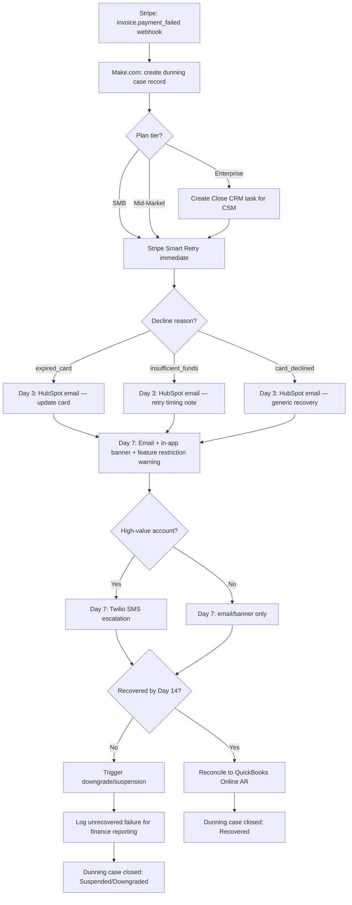
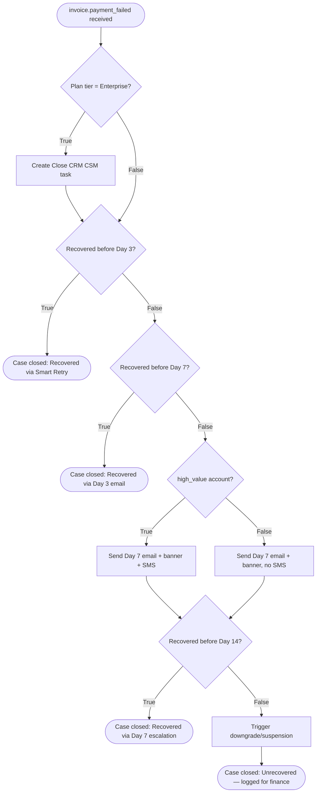

# SOP: Automated Dunning & Failed-Payment Recovery Engine

**Reference Deployment Context:** Atlas Metrics
**Industry:** B2B Product Analytics SaaS
**Owning Section:** 14 SaaS
**SOP ID:** SAAS-02
**Version:** 1.0
**Last Updated:** 2026-06-30
**Author:** Automation Architecture Team
**Classification:** Client-Facing
**Video Walkthrough:** _Pending recording — see script in this SOP's project folder._
**Real Build Artifacts:** [Importable n8n workflow, runnable automation script, and executable database schema →](build/README.md)

## Table of Contents

1. [Purpose](#1-purpose)
2. [Business Problem](#2-business-problem)
3. [Business Goals](#3-business-goals)
4. [Business Requirements](#4-business-requirements)
5. [Functional Requirements](#5-functional-requirements)
6. [Technical Requirements](#6-technical-requirements)
7. [Dependencies](#7-dependencies)
8. [Systems Used](#8-systems-used)
9. [Roles](#9-roles)
10. [Responsibilities](#10-responsibilities)
11. [Workflow Overview](#11-workflow-overview)
12. [Detailed Workflow Steps](#12-detailed-workflow-steps)
13. [Decision Tree](#13-decision-tree)
14. [Automation Logic](#14-automation-logic)
15. [Trigger Conditions](#15-trigger-conditions)
16. [Data Validation](#16-data-validation)
17. [Error Handling](#17-error-handling)
18. [Retry Logic](#18-retry-logic)
19. [Fallback Procedures](#19-fallback-procedures)
20. [Manual Override](#20-manual-override)
21. [Exception Handling](#21-exception-handling)
22. [Notifications](#22-notifications)
23. [Audit Logs](#23-audit-logs)
24. [Security](#24-security)
25. [Permissions](#25-permissions)
26. [Compliance](#26-compliance)
27. [Performance Metrics](#27-performance-metrics)
28. [KPIs](#28-kpis)
29. [Testing Procedure](#29-testing-procedure)
30. [Deployment](#30-deployment)
31. [Maintenance](#31-maintenance)
32. [Version History](#32-version-history)
33. [Future Improvements](#33-future-improvements)
34. [Appendix](#34-appendix)
35. [Troubleshooting](#35-troubleshooting)
36. [Recovery Procedure](#36-recovery-procedure)
37. [Frequently Asked Questions](#37-frequently-asked-questions)
38. [Technical Notes](#38-technical-notes)
39. [Business Notes](#39-business-notes)
40. [Estimated Time Savings](#40-estimated-time-savings)
41. [ROI Analysis](#41-roi-analysis)
42. [Risk Assessment](#42-risk-assessment)
43. [Lessons Learned](#43-lessons-learned)
44. [Related SOPs](#44-related-sops)

---

## 1. Purpose

This workflow automates the detection, communication, and recovery sequence for failed recurring charges on Atlas Metrics' subscription base, and routes the subset of failures that warrant human judgment — enterprise accounts — to the account's CSM instead of a generic email queue. The system exists to convert a payment failure from a silent churn trigger into a tracked, time-boxed recovery case with a deterministic outcome: recovered, downgraded, or suspended, with every step logged for finance reconciliation.

## 2. Business Problem

Atlas Metrics processes recurring charges against roughly 1,800 active accounts under a hybrid seat-plus-usage pricing model. Of those monthly charges, 6–8% fail on first attempt — expired cards, insufficient funds, and issuer declines are the dominant reasons, consistent with published SaaS benchmarks for card-based recurring billing. Before this workflow, failed-charge follow-up was handled manually by a finance analyst who exported a weekly failed-payment report from Stripe and worked through it by email, in whatever order the spreadsheet happened to be sorted. That process recovered under 10% of failed charges within the billing period, meaning the large majority of failed charges resulted in either a delinquent invoice carried indefinitely or a silent cancellation the company only noticed at the next MRR review. Because involuntary churn (customers who did not choose to leave but whose payment method simply failed) is indistinguishable from voluntary churn in most reporting, this also meant Atlas Metrics' churn dashboards were overstating genuine product-driven attrition and understating a solvable billing-operations problem.

## 3. Business Goals

- Recover the majority of failed recurring charges without finance staff manually triaging individual accounts.
- Eliminate involuntary churn caused purely by billing-operations lag rather than genuine cancellation intent.
- Preserve white-glove, human-led outreach for Enterprise-tier accounts where a templated email is reputationally inappropriate for the contract value at stake.
- Produce a clean, auditable AR trail so finance can distinguish "recovered," "written off," and "in progress" at any point without reconciling spreadsheets by hand.
- Feed payment-failure signal into the broader customer-health model so repeated failures are treated as a churn-risk indicator, not just a billing nuisance.

## 4. Business Requirements

- **BR-1:** The system must detect every failed recurring charge within seconds of Stripe reporting the failure, with no dependency on a human checking a report.
- **BR-2:** The system must apply a different recovery cadence and channel mix depending on plan tier (SMB, Mid-Market, Enterprise) and, where relevant, the specific decline reason.
- **BR-3:** Enterprise-tier failures must generate a task for the account's assigned CSM rather than being resolved purely through automated email/SMS.
- **BR-4:** High-value accounts must receive SMS escalation in addition to email once a failure crosses a defined recovery-risk threshold.
- **BR-5:** The system must enforce a bounded grace period (14 days) after which unrecovered accounts are automatically downgraded or suspended per contract terms.
- **BR-6:** Every recovered or written-off charge must be reconciled into QuickBooks Online AR without manual re-entry.
- **BR-7:** Finance must be able to manually pause, resume, or reset an in-flight dunning case (e.g., a known card-migration event) without engineering involvement.
- **BR-8:** No raw payment card data may be handled, stored, or transmitted by any system other than Stripe.

## 5. Functional Requirements

- **FR-1:** Make.com scenario subscribes to the Stripe `invoice.payment_failed` webhook and creates a dunning case record within 5 seconds of receipt.
- **FR-2:** The scenario reads the account's plan tier and MRR from the Stripe customer/subscription metadata (synced from Atlas Metrics' billing system) and the `decline_code`/`failure_code` from the charge object, then routes to the corresponding branch.
- **FR-3:** For Enterprise-tier accounts, the scenario calls the Close CRM API to create a task assigned to the account's CSM (owner field sourced from a HubSpot-Close synced property) within the same execution.
- **FR-4:** For accounts flagged `high_value` (MRR above a configured threshold, default $1,500/mo), the scenario triggers a Twilio SMS in addition to the standard email sequence at the Day 7 escalation step.
- **FR-5:** HubSpot workflows send the Day 3 and Day 7 recovery emails using account-specific merge fields (amount due, card brand/last4 masked, update-payment-method link) pulled from the dunning case record, not directly from Stripe.
- **FR-6:** On Day 14 without recovery, the scenario calls the internal subscription-management API to apply the downgrade/suspension action defined by the account's plan tier and writes the terminal state to the dunning case.
- **FR-7:** On successful recovery (Stripe `invoice.payment_succeeded` or `charge.succeeded` referencing the same invoice), the scenario updates the dunning case to `recovered` and pushes a reconciliation entry to QuickBooks Online.
- **FR-8:** All state transitions are logged with timestamp, triggering event ID, and actor (system or named human) to the dunning case audit trail.

| BR ID | FR ID | Description |
|---|---|---|
| BR-1 | FR-1 | Webhook-driven case creation within seconds of failure |
| BR-2 | FR-2 | Tier- and reason-code-based branching |
| BR-3 | FR-3 | Close CRM task creation for Enterprise CSM outreach |
| BR-4 | FR-4 | Twilio SMS escalation for high-value accounts |
| BR-2 | FR-5 | HubSpot-driven recovery email sequence with dynamic merge fields |
| BR-5 | FR-6 | Automated downgrade/suspension at Day 14 |
| BR-6 | FR-7 | QuickBooks Online AR reconciliation on recovery |
| BR-7 | FR-8 | Full audit trail supporting manual override |
| BR-8 | FR-2 | No card data traverses Make.com; only tokenized references and decline metadata are read |

## 6. Technical Requirements

- Make.com Team plan with webhook, HTTP, data store, and error-handler modules enabled; minimum scenario execution allowance sized for peak billing-run volume (Atlas Metrics bills primarily on the 1st and 15th, producing a bimodal failure spike).
- Stripe API version pinned (2024-06-20 or later) with Smart Retries enabled at the account level and webhook signing secret rotated quarterly.
- HubSpot Marketing Hub Professional tier or higher (required for workflow branching on custom properties and transactional email send API).
- Close CRM API v1 access with a service-account API key scoped to task creation and lead/opportunity read on the Enterprise pipeline only.
- Twilio programmable SMS with a verified sender ID; message volume budgeted at fewer than 50 sends/month based on the high-value account population.
- QuickBooks Online API (Accounting v3) OAuth2 app with `com.intuit.quickbooks.accounting` scope; token refresh handled by a scheduled Make.com scenario (see Section 24).
- End-to-end latency budget: webhook receipt to first customer-facing action (Smart Retry trigger) under 30 seconds; Day 3/Day 7 email sends occur within a 15-minute window of the scheduled offset, not to the minute, to smooth send-volume spikes.
- Uptime target for the orchestration layer: 99.5% monthly, consistent with Make.com's platform SLA; the workflow has no in-house compute to independently guarantee beyond that.
- Data residency: all systems in this workflow operate in US data regions; no card data or customer PII is replicated outside the continental US.

## 7. Dependencies

- **Upstream:** An account must exist as a paying subscriber, meaning it has already passed through [SAAS-01: Trial-to-Paid Conversion & Usage Nurture Engine](../SAAS-01%20Trial-to-Paid%20Conversion%20and%20Usage%20Nurture%20Engine/SOP.md). This workflow has no trial-account branch.
- Stripe must have accurate plan-tier metadata synced onto each customer/subscription object; if Atlas Metrics' internal billing system falls out of sync with Stripe metadata, tier-based branching in this workflow degrades silently (see Section 17, Scenario 5 analog risk noted in Section 42).
- HubSpot must have a live, deliverable contact record for the billing contact on the account; a bounced or missing contact defeats the Day 3/Day 7 email steps and falls back to the escalation path described in Section 19.
- Close CRM must have an active CSM assignment for every Enterprise account; unassigned accounts are handled per Section 21.
- QuickBooks Online's API availability is a hard dependency for reconciliation completing in real time; an outage does not block the customer-facing recovery sequence but does delay AR accuracy (Section 17, Scenario 5).
- Twilio delivery depends on the billing contact's mobile number being present and SMS-consented; absent that, the escalation silently degrades to email-only (documented, not a failure state).

## 8. Systems Used

| System | Role in Workflow | Auth Method |
|---|---|---|
| Stripe | Source of truth for billing events; fires `invoice.payment_failed` / `charge.failed` webhooks; executes Smart Retries; confirms recovery via `invoice.payment_succeeded` | API Key (restricted, webhook-signing secret for verification) |
| Make.com | Orchestration engine; receives webhooks, branches by tier/reason code, sequences the 14-day cadence, calls all downstream APIs | API Key / OAuth2 (per-connection) |
| HubSpot | Sends customer-facing recovery emails (Day 3, Day 7), manages in-app banner trigger property, tracks email engagement | OAuth2 |
| Twilio | Sends SMS escalation to high-value account billing contacts at Day 7 | API Key (Account SID + Auth Token) |
| Close CRM | Creates and assigns a CSM task for Enterprise-tier failures requiring white-glove outreach | API Key |
| QuickBooks Online | Reconciles recovered charges and write-offs into AR aging | OAuth2 (refresh-token managed) |

## 9. Roles

- **Business Owner:** VP of Finance — owns the recovery-rate target and the downgrade/suspension policy thresholds.
- **Technical Owner:** Revenue Operations Engineer — owns the Make.com scenario, API integrations, and dunning-case data model.
- **Escalation Contact (Automation):** Automation Architecture Team (this engagement) for scenario logic defects.
- **Escalation Contact (CS):** Director of Customer Success — owns the Close CRM task SLA and CSM accountability for Enterprise outreach.
- **Escalation Contact (Billing Ops):** Finance Analyst — day-to-day monitor of the dunning dashboard and manual-override authority for individual cases.

## 10. Responsibilities

| Role | Responsibility |
|---|---|
| VP of Finance | Approves recovery cadence, grace-period length, and downgrade/suspension policy; reviews monthly recovery-rate report |
| Revenue Operations Engineer | Maintains Make.com scenario, API credentials, dunning-case data store schema, and reconciliation logic |
| Finance Analyst | Monitors the dunning dashboard, executes manual pause/reset for known exceptions (e.g., card migrations), reviews Day-14 write-offs |
| CSM (per Enterprise account) | Acts on Close CRM tasks within SLA; documents outreach outcome; can request a case pause via Finance Analyst |
| Director of Customer Success | Owns CSM adherence to the Enterprise outreach SLA; escalates repeat non-response |
| Automation Architecture Team | Maintains scenario logic, monitors error queue, ships fixes for platform-level failures |

## 11. Workflow Overview

The workflow begins the instant Stripe reports a failed charge and ends when the case reaches one of three terminal states: recovered, downgraded/suspended with the loss logged, or manually resolved outside the automated path. Every account tier passes through the same skeleton — retry, notify, escalate, expire — but the specific actions taken (email only vs. email + SMS vs. CSM task) vary by tier and, at the first branch, by decline reason.



## 12. Detailed Workflow Steps

1. **Tool:** Stripe → **Trigger:** `invoice.payment_failed` webhook fires on the account's recurring invoice. **Input:** Stripe event payload (Section 15). **Transformation:** none at source. **Output:** raw webhook POST to Make.com's inbound webhook URL. **Condition branch:** none — every failure event is received. **Error handling ref:** Section 17, Scenario 1 (duplicate delivery).

2. **Tool:** Make.com → **Trigger:** webhook module receives the POST. **Input:** Stripe event JSON. **Transformation:** validates signature (Section 24), extracts `customer_id`, `invoice_id`, `amount_due`, `decline_code`. **Output:** parsed bundle passed to the case-creation module. **Condition branch:** if signature invalid, route to error handler and discard. **Error handling ref:** Section 17, Scenario 1.

3. **Tool:** Make.com data store → **Action:** create dunning case record keyed on `invoice_id` (idempotency key). **Input:** parsed bundle from Step 2. **Transformation:** normalizes into the internal dunning-case schema (Section 15). **Output:** case record with status `new`. **Condition branch:** if a case already exists for this `invoice_id`, update instead of duplicate-create. **Error handling ref:** Section 17, Scenario 1.

4. **Tool:** Make.com → **Action:** look up plan tier and MRR from Stripe customer metadata. **Input:** `customer_id`. **Transformation:** maps Stripe metadata field `plan_tier` to internal enum (`smb`/`mid_market`/`enterprise`); flags `high_value` if MRR ≥ $1,500. **Output:** enriched case record. **Condition branch:** tier unresolved → default to SMB cadence and flag for manual review. **Error handling ref:** Section 21.

5. **Tool:** Make.com → **Condition:** tier == `enterprise`. **Action (if true):** Close CRM API call, `POST /task/`, assigns task to the account's CSM. **Input:** account name, CSM owner ID, invoice amount, failure reason. **Output:** Close task ID written back to the dunning case. **Condition branch:** CSM unassigned → route to Director of CS queue (Section 21). **Error handling ref:** Section 17, Scenario 4.

6. **Tool:** Stripe → **Action:** Smart Retry executes automatically per Stripe's own retry schedule (Stripe-managed, not Make.com-scheduled) starting immediately after the initial failure. **Input:** original charge attempt. **Output:** either `charge.succeeded` (case resolves early) or continued failure. **Condition branch:** success at this stage short-circuits the remaining sequence and jumps to Step 11.

7. **Tool:** Make.com scheduled scenario (Day 3 check) → **Action:** if case status is still `retrying`/`failed`, trigger HubSpot workflow via API to send the Day 3 recovery email. **Input:** case record, decline reason. **Transformation:** decline reason maps to one of three email templates (expired card / insufficient funds / generic decline). **Output:** HubSpot send confirmation logged to case. **Condition branch:** contact undeliverable → Section 19 fallback. **Error handling ref:** Section 17, Scenario 3.

8. **Tool:** Make.com scheduled scenario (Day 7 check) → **Action:** if still unresolved, trigger HubSpot Day 7 email, set in-app banner flag (via internal app API), and apply feature-restriction warning flag. **Input:** case record. **Output:** three parallel state updates: email sent, banner active, restriction-warning active. **Condition branch:** `high_value` == true → also fire Twilio SMS. **Error handling ref:** Section 17, Scenario 3.

9. **Tool:** Twilio → **Action (high-value only):** send SMS escalation to billing contact's verified mobile number. **Input:** account name, amount due, payment link. **Output:** delivery receipt logged to case. **Condition branch:** no verified mobile number → skip silently, log as `sms_skipped_no_number`.

10. **Tool:** Make.com scheduled scenario (Day 14 check) → **Condition:** case status still unresolved. **Action:** call internal subscription API to apply downgrade (Mid-Market/SMB) or suspension (per contract terms for Enterprise, generally suspension is deferred pending CSM sign-off — see Section 20). **Output:** case status set to `suspended` or `downgraded`; entry logged to finance report queue. **Error handling ref:** Section 17, Scenario 5 pattern; Section 21.

11. **Tool:** Stripe → **Trigger:** `invoice.payment_succeeded` (or `charge.succeeded` referencing the same invoice) fires at any point in the sequence. **Action:** Make.com marks case `recovered`, halts all remaining scheduled steps for that case, and pushes a reconciliation entry to QuickBooks Online AR. **Output:** QBO invoice/payment record updated; case closed. **Error handling ref:** Section 17, Scenario 5.

## 13. Decision Tree



## 14. Automation Logic

```python
from dataclasses import dataclass
from datetime import datetime, timedelta
from enum import Enum


class PlanTier(str, Enum):
    SMB = "smb"
    MID_MARKET = "mid_market"
    ENTERPRISE = "enterprise"


class DeclineReason(str, Enum):
    CARD_DECLINED = "card_declined"
    INSUFFICIENT_FUNDS = "insufficient_funds"
    EXPIRED_CARD = "expired_card"
    UNKNOWN = "unknown"


@dataclass
class DunningCase:
    invoice_id: str
    customer_id: str
    plan_tier: PlanTier
    decline_reason: DeclineReason
    amount_due_cents: int
    mrr_cents: int
    failed_at: datetime
    status: str = "new"


HIGH_VALUE_MRR_THRESHOLD_CENTS = 150_000  # $1,500/mo


def is_high_value(case: DunningCase) -> bool:
    """High-value accounts receive SMS escalation at Day 7 in addition to email."""
    return case.mrr_cents >= HIGH_VALUE_MRR_THRESHOLD_CENTS


def requires_csm_task(case: DunningCase) -> bool:
    """Enterprise-tier failures bypass pure automation and get a human-owned task."""
    return case.plan_tier == PlanTier.ENTERPRISE


def email_template_for(reason: DeclineReason) -> str:
    """Map decline reason to the HubSpot template most likely to drive self-service resolution."""
    mapping = {
        DeclineReason.EXPIRED_CARD: "dunning_update_card_v2",
        DeclineReason.INSUFFICIENT_FUNDS: "dunning_retry_timing_v2",
        DeclineReason.CARD_DECLINED: "dunning_generic_recovery_v2",
        DeclineReason.UNKNOWN: "dunning_generic_recovery_v2",
    }
    return mapping[reason]


def next_action(case: DunningCase, now: datetime) -> str:
    """Determine the next sequence action based on elapsed time since failure.

    This mirrors the Make.com scheduled-check logic; the platform runs this
    evaluation on a recurring scenario tick rather than a single continuous
    process, so `now` is always the tick time, not real-time streaming.
    """
    elapsed = now - case.failed_at
    if case.status == "recovered":
        return "no_action_case_closed"
    if elapsed < timedelta(days=3):
        return "await_smart_retry"
    if elapsed < timedelta(days=7):
        return f"send_day3_email:{email_template_for(case.decline_reason)}"
    if elapsed < timedelta(days=14):
        action = "send_day7_email_and_banner_and_restriction_warning"
        if is_high_value(case):
            action += "+sms_escalation"
        return action
    return "trigger_downgrade_or_suspension"
```

## 15. Trigger Conditions

The workflow is triggered exclusively by Stripe webhook events; there is no polling and no manually initiated run in normal operation.

**Primary trigger:** `invoice.payment_failed`
**Secondary triggers (case-lifecycle events):** `charge.failed` (redundant signal, deduplicated against `invoice_id`), `invoice.payment_succeeded` (resolves a case), `charge.succeeded` (resolves a case if it references a tracked invoice)

Example Stripe `invoice.payment_failed` webhook payload (abridged, illustrative — not real customer or card data):

```json
{
  "id": "evt_1PdXk92eZvKYlo2CqTn9k3Rf",
  "type": "invoice.payment_failed",
  "created": 1751270400,
  "data": {
    "object": {
      "id": "in_1PdXk82eZvKYlo2CQb6mZzZa",
      "object": "invoice",
      "customer": "cus_QwErTyUiOpAsDf",
      "subscription": "sub_1P9fGh2eZvKYlo2CxYzAbCde",
      "amount_due": 49900,
      "currency": "usd",
      "attempt_count": 1,
      "next_payment_attempt": 1751529600,
      "billing_reason": "subscription_cycle",
      "charge": "ch_3PdXk82eZvKYlo2C0aB1cDe2",
      "metadata": {
        "plan_tier": "mid_market",
        "account_id": "acct_atlas_00841"
      }
    }
  },
  "last_payment_error": {
    "code": "card_declined",
    "decline_code": "insufficient_funds",
    "payment_method": {
      "card": {
        "brand": "visa",
        "last4": "4242",
        "exp_month": 8,
        "exp_year": 2026
      }
    }
  }
}
```

Normalized internal "dunning case" record created from the payload above:

```json
{
  "dunning_case_id": "dc_20260630_00841_01",
  "invoice_id": "in_1PdXk82eZvKYlo2CQb6mZzZa",
  "stripe_customer_id": "cus_QwErTyUiOpAsDf",
  "account_id": "acct_atlas_00841",
  "plan_tier": "mid_market",
  "decline_reason": "insufficient_funds",
  "card_last4": "4242",
  "card_brand": "visa",
  "amount_due_cents": 49900,
  "currency": "usd",
  "mrr_cents": 89000,
  "high_value": false,
  "failed_at": "2026-06-30T08:00:00Z",
  "status": "retrying",
  "sequence_stage": "smart_retry",
  "csm_task_id": null,
  "recovered_at": null,
  "terminal_action": null,
  "audit_trail": [
    {
      "ts": "2026-06-30T08:00:03Z",
      "event": "case_created",
      "actor": "system",
      "source_event_id": "evt_1PdXk92eZvKYlo2CqTn9k3Rf"
    }
  ]
}
```

## 16. Data Validation

| Field | Rule | Failure Action |
|---|---|---|
| `invoice_id` | Must be present and non-empty | Discard event, log to error queue (cannot create a case without an idempotency key) |
| `customer_id` | Must resolve to an existing Stripe customer | Flag case `unresolved_customer`, route to Finance Analyst manual queue |
| `plan_tier` | Must be one of `smb` / `mid_market` / `enterprise` | Default to `smb` cadence, flag case for manual tier confirmation |
| `amount_due` | Must be a positive integer (cents) | Discard event as malformed; log raw payload for engineering review |
| `decline_reason` | Should map to a known enum value | Default to `unknown`, use generic recovery email template |
| `billing_contact_email` (HubSpot lookup) | Must be a valid, non-bounced email address | Skip email step, escalate directly to SMS (if high-value) or manual queue |
| Webhook signature | Must verify against Stripe signing secret | Reject request with 400, do not create or update a case |

## 17. Error Handling

**Scenario 1 — Duplicate webhook delivery from Stripe.** Stripe's own delivery guarantees are at-least-once, and network retries on Stripe's side can cause the same `invoice.payment_failed` event to arrive twice. **Detection:** the case-creation module checks for an existing dunning case keyed on `invoice_id` before creating a new one. **Response:** if found, the module updates the existing case's audit trail with a `duplicate_event_received` entry and takes no further action, preventing a second parallel sequence (and a second CSM task or SMS) from spinning up.

**Scenario 2 — Customer updates their card mid-sequence, racing a scheduled email.** A customer might update their payment method on Day 6, Stripe auto-charges successfully within minutes, but the Day 7 scheduled scenario tick was already queued before the `invoice.payment_succeeded` event was processed. **Detection:** the Day 7 scenario re-checks case status immediately before executing any send action, not just at scenario trigger time. **Response:** if status has flipped to `recovered` since the tick was scheduled, the scenario aborts the send and logs `send_aborted_case_recovered`. This check-before-send pattern is applied at every scheduled stage, not only Day 7.

**Scenario 3 — HubSpot send failure (API error, rate limit, or template render error).** **Detection:** Make.com's HTTP/HubSpot module returns a non-2xx response, captured by the scenario's error handler. **Response:** the module retries per the backoff cadence in Section 18; if retries exhaust, the case is flagged `email_send_failed` and a fallback plain-text email is sent via a secondary transactional path (Make.com's built-in email module) so the customer is not silently skipped, and the case is added to the Finance Analyst's manual-review queue for that day.

**Scenario 4 — Close CRM task creation failure for an Enterprise account.** Because this is the sole mechanism preventing an Enterprise failure from being handled purely by automated email, a silent failure here is treated as high severity. **Detection:** the Close API call is wrapped in an explicit error handler; a non-2xx response or timeout is caught immediately rather than allowed to fail the whole scenario run. **Response:** the scenario retries per Section 18; if still unsuccessful, it sends an immediate Slack/email alert to the Director of Customer Success (not just a log entry) and creates a fallback record in the Finance Analyst's manual queue, because an Enterprise account left with no CSM awareness is the single worst outcome this workflow can produce.

**Scenario 5 — QuickBooks Online API auth token expiry during reconciliation.** QBO uses short-lived OAuth2 access tokens with a longer-lived refresh token; if the refresh cycle (Section 24) fails or lags, reconciliation calls return a 401. **Detection:** the reconciliation module checks for a 401/`AuthenticationFailed` response specifically (distinct from other 4xx errors). **Response:** the scenario triggers an out-of-band token-refresh sub-scenario immediately, then retries the original reconciliation call once the new token is confirmed valid. The customer-facing recovery sequence itself is never blocked by this failure — only the AR write is delayed — and any invoice that can't be reconciled within 1 hour is added to a manual reconciliation queue reviewed daily by Finance.

**Scenario 6 (additional) — Stripe Smart Retry succeeds but the webhook confirming it is delayed or lost.** **Detection:** a daily reconciliation job cross-checks all `retrying`/`failed`-status dunning cases against live Stripe invoice status via a direct API pull (not webhook-dependent), catching any case where Stripe already shows `paid` but the internal case hasn't been updated. **Response:** the job force-closes the case as `recovered` and back-dates the recovery timestamp to the actual Stripe payment time, then triggers the QuickBooks reconciliation retroactively. This job is the safety net for any missed webhook, not just this specific race.

## 18. Retry Logic

- **Stripe Smart Retry:** managed by Stripe's own machine-learning retry schedule, not by Make.com; Atlas Metrics uses Stripe's default Smart Retry configuration, which times retry attempts based on the specific decline reason and card issuer patterns rather than a fixed interval.
- **Make.com → HubSpot / Close / Twilio / QuickBooks API calls:** exponential backoff, 3 attempts total — immediate, then +30 seconds, then +120 seconds — before the call is treated as failed and routed to the appropriate error-handling path in Section 17.
- **Idempotency key strategy:** every outbound action that creates a record downstream (Close task, QuickBooks reconciliation entry) is tagged with a deterministic key derived from `dunning_case_id` + action type (e.g., `dc_20260630_00841_01:qbo_reconcile`), so a retried call after a timeout cannot create a duplicate record even if the original call actually succeeded server-side but the response was lost.
- **Sequence-level cadence (not retry, but the governing schedule):** Day 0 (Smart Retry), Day 3 (email), Day 7 (email + banner + restriction warning + conditional SMS), Day 14 (grace period expiration). These offsets are configurable per plan tier but default to the same schedule across SMB/Mid-Market; Enterprise adds the CSM task at Day 0 in parallel, it does not replace any step.

## 19. Fallback Procedures

- If HubSpot email delivery is confirmed failed after retries exhaust (Section 17, Scenario 3), the fallback is a plain-text transactional email sent directly via Make.com's email module, bypassing HubSpot's template engine entirely, so the customer still receives a recovery link.
- If no billing contact email or mobile number exists at all, the case is routed directly to the Finance Analyst's manual queue at the point that would have been the Day 3 email — the system does not wait until Day 14 to surface a contact-less account.
- If Close CRM is unreachable (platform outage, not just a single failed call) for longer than the retry window, the fallback is a direct email alert to the Director of Customer Success listing the affected Enterprise accounts, so outreach isn't lost even though the structured task wasn't created.
- If QuickBooks Online reconciliation cannot complete within 24 hours of recovery, the case remains marked `recovered` on the customer-facing side (no degraded experience for the customer) while the reconciliation entry sits in a manual queue; finance closes it by hand during the next AR review, and the audit trail records the delay reason.

## 20. Manual Override

Finance Analysts and the Revenue Operations Engineer are authorized to intervene directly in an in-flight dunning case. The most common override scenario is a known payment-method migration — for example, an account informs Atlas Metrics in advance that its finance team is switching card processors or updating a corporate card program across multiple accounts, which will predictably trigger a wave of `expired_card` failures that are not genuine churn risk.

- **Pause:** setting a case's `status` to `paused` in the data store halts all scheduled sends (email, SMS, banner, restriction warning) and suspends the Day-14 countdown clock until resumed. The Smart Retry itself (Stripe-managed) is not pausable from this system, since it happens outside Make.com's control; pausing affects only the Make.com-orchestrated communication and downgrade steps.
- **Resume:** resuming a case restarts the countdown from the point it was paused, not from Day 0, preserving the original `failed_at` reference for reporting accuracy while adjusting the internal "clock" field used for scheduling.
- **Reset:** a full reset (rare, used when a case was created in error or against a resolved false-positive) clears the sequence stage back to `new` and re-runs tier/reason evaluation; this requires Revenue Operations Engineer sign-off, not just a Finance Analyst action, because it can re-trigger a Close CRM task or SMS that already fired once.
- **Enterprise CSM override:** a CSM can request (through the Director of CS, not directly) that automated email/SMS steps be suspended for an account they are actively working personally, so the customer doesn't receive an automated email minutes after a live phone conversation. This is logged as a pause with reason code `csm_personal_outreach_active`.
- Every manual override action is written to the case's audit trail with the actor's name and reason code — there is no override path that does not produce an audit entry.

## 21. Exception Handling

- **Malformed webhook payload** (missing expected fields, unexpected schema version): the event is not silently dropped; it is routed to an error queue with the full raw payload preserved for engineering review, since a malformed payload from Stripe is rare enough to warrant investigation rather than assumption of transience.
- **Unresolved plan tier:** as noted in Section 16, defaults to SMB cadence but is explicitly flagged, since misclassifying a Mid-Market or Enterprise account as SMB means it misses the CSM task or SMS escalation it should have received.
- **Enterprise account with no assigned CSM:** rather than failing the Close CRM task creation silently, the scenario detects the missing owner field and routes the task to a shared "Unassigned Enterprise" queue monitored by the Director of Customer Success, ensuring the account isn't lost between the cracks of an org-chart gap.
- **Partial data state — case exists but tier or MRR data is missing** (e.g., Stripe metadata sync from the billing system lagged): the scenario treats this as "insufficient data to branch confidently" and applies the most conservative path (SMB cadence, no SMS, flagged for review) rather than guessing toward the more aggressive Enterprise/high-value path, since over-escalating (unnecessary CSM task, unnecessary SMS) has a real cost and reputational risk that under-escalating during a flagged, reviewed case does not.
- **Account already in a downgrade/suspension state from a prior unrelated case** (e.g., a second failure fires while the account is still working through suspension from an earlier one): the scenario checks for an existing non-terminal or recently-terminal case on the same `customer_id` before creating a new independent sequence, and if found, merges the new failure event into the existing case's audit trail rather than running two parallel dunning sequences against the same account.

## 22. Notifications

| Event | Channel | Recipient | Severity |
|---|---|---|---|
| New Enterprise dunning case created | Close CRM task + Slack | Assigned CSM | Standard |
| Close CRM task creation failure (Enterprise) | Slack + Email | Director of Customer Success | High |
| HubSpot send failure after retries exhausted | Slack | Revenue Operations Engineer | Medium |
| Case reaches Day 14 unrecovered | Email (batched daily digest) | Finance Analyst, VP of Finance | Standard |
| QuickBooks reconciliation delayed >24h | Email | Finance Analyst | Medium |
| QuickBooks auth token refresh failure | Slack (immediate) | Revenue Operations Engineer | High |
| Manual override applied to a case (pause/resume/reset) | Audit log entry (no push notification) | N/A — reviewable, not urgent | Low |
| Webhook signature verification failure | Slack (immediate) | Revenue Operations Engineer | High |

## 23. Audit Logs

Every dunning case maintains an `audit_trail` array (see Section 15 payload example) recording each state transition, the triggering event or actor, and a timestamp. This includes: case creation, every scheduled-stage evaluation (even ones that result in no action, e.g., "case already recovered, skipping Day 7"), every outbound send (email/SMS/task) with delivery confirmation status, every manual override with actor and reason code, and the terminal state (recovered/downgraded/suspended) with resolution timestamp. Logs are retained for 24 months in the Make.com data store with a monthly export to cold storage, aligned to the retention period finance needs for AR audit purposes and consistent with the retention pattern used in [SAAS-04](../SAAS-04%20Usage-Based%20Billing%20Reconciliation%20and%20RevRec%20Pipeline/SOP.md). Audit entries are append-only; corrections are made by adding a new entry, never by editing history.

## 24. Security

- **Auth model:** Stripe webhook payloads are verified against the account's webhook signing secret on every request; unsigned or incorrectly signed requests are rejected before any case logic executes. All outbound API calls (HubSpot, Close, Twilio, QuickBooks) use per-connection OAuth2 or scoped API keys stored in Make.com's encrypted connection vault, never in scenario variables or logs.
- **Secret storage:** no credential is hardcoded in scenario logic; all keys/tokens are referenced through Make.com's connection objects. QuickBooks Online's refresh token is stored in the same vault and rotated via a dedicated scheduled scenario that runs every 55 minutes (ahead of the 60-minute access-token expiry) to keep the access token perpetually fresh rather than reactively refreshing on 401.
- **Encryption:** all traffic between Stripe, Make.com, HubSpot, Close, Twilio, and QuickBooks is TLS 1.2+ in transit; at-rest encryption is handled by each platform vendor's native storage encryption (Make.com data store, HubSpot database, QBO's own infrastructure).
- **PII handling:** the dunning case record stores billing-relevant PII (account name, contact email, masked card brand/last4) but never full card numbers, CVV, or any PAN data. Card display data is limited to what Stripe already exposes as non-sensitive (`last4`, `brand`, `exp_month`, `exp_year`) — this is explicitly not "cardholder data" under PCI DSS scope definitions.

## 25. Permissions

| Role | View Case Data | Edit/Override Case | Configure Scenario Logic | Manage API Credentials |
|---|---|---|---|---|
| Finance Analyst | Yes | Yes (pause/resume) | No | No |
| VP of Finance | Yes (reporting view) | No | No | No |
| CSM (Enterprise accounts) | Yes (own accounts only) | No (requests via Director of CS) | No | No |
| Director of Customer Success | Yes (Enterprise accounts) | Yes (via Finance Analyst channel) | No | No |
| Revenue Operations Engineer | Yes | Yes (all actions incl. reset) | Yes | Yes |
| Automation Architecture Team | Yes | Yes (support engagements only) | Yes | Yes (initial build; handed off post-launch) |

## 26. Compliance

Payment card data handling stays entirely within Stripe's PCI DSS Level 1 certified environment; no raw card number, CVV, or full PAN ever reaches Make.com, HubSpot, Close, Twilio, or QuickBooks Online. What flows through this workflow is limited to Stripe's already-tokenized, non-sensitive display metadata (`last4`, `brand`, expiry) and decline-reason codes, which keeps Atlas Metrics' own PCI compliance scope narrow — the company is not handling cardholder data anywhere in its own infrastructure or its Make.com orchestration layer, consistent with a SAQ A-level scope rather than anything broader.

On communication frequency and consent: the recovery sequence sends a bounded number of customer-facing touches per failure (one Smart Retry notification indirectly via Stripe, one email at Day 3, one email plus banner at Day 7, and conditionally one SMS at Day 7) rather than a daily nag cadence, which keeps the workflow well inside reasonable transactional-communication norms and avoids the unsubscribe/consent complications that apply to marketing email — these are dunning notices tied to an existing contractual obligation, not promotional content, and are treated as transactional under HubSpot's sending policies accordingly. SMS escalation is limited to accounts where a mobile number was affirmatively provided as a billing contact method; the workflow does not SMS a number sourced from any other context (e.g., a support ticket), and does not send SMS to accounts without a captured consent-supporting relationship in Close/HubSpot.

## 27. Performance Metrics

| Metric | Target |
|---|---|
| Webhook-to-case-creation latency | Under 5 seconds, 99th percentile |
| Webhook signature validation success rate | 100% for legitimate Stripe traffic |
| Scenario execution error rate | Under 1% of monthly runs |
| Close CRM task creation success rate (Enterprise) | 99.5%+, with 100% eventual delivery via fallback alerting |
| HubSpot email send success rate | 98%+ on first attempt, 99.9% including fallback path |
| QuickBooks reconciliation completion within 1 hour of recovery | 95%+ |
| Twilio SMS delivery confirmation rate | 97%+ |

## 28. KPIs

| KPI | Baseline (pre-automation) | Target (post-automation) |
|---|---|---|
| % of failed charges recovered within 14 days | Under 10% | 65–75% |
| Involuntary churn rate (as % of total MRR churn) | Not separately tracked; assumed to be the dominant undocumented driver | Reduced to a residual, clearly attributable rate, isolated from voluntary churn in reporting |
| Average time-to-recovery (failure to successful charge) | Untracked; anecdotally 2–4 weeks when it happened at all | Under 5 days median |
| Finance analyst hours/month on manual dunning follow-up | ~25–30 hours | Under 5 hours (exception handling only) |
| Enterprise-tier failures reaching CSM within SLA | N/A (no formal process existed) | 100% within 1 business hour |

## 29. Testing Procedure

Unit-level tests validate the branching logic in Section 14 in isolation (tier resolution, decline-reason-to-template mapping, high-value threshold evaluation) using representative payload fixtures for each plan tier and decline code. Integration testing runs the full scenario against Stripe's test-mode webhooks, using Stripe CLI to simulate `invoice.payment_failed` events with each of the three tracked decline codes across all three plan tiers, verifying the correct downstream calls fire (Close task only for Enterprise, SMS only for flagged high-value accounts) and that no cross-branch leakage occurs (e.g., an SMB account never gets a CSM task). UAT is conducted with Finance and a designated CSM using anonymized production-shaped test accounts in Stripe test mode, walking the full 14-day sequence compressed into an accelerated test schedule (offsets set to minutes instead of days in a sandboxed scenario copy) so testers can observe every stage without waiting two weeks. Full methodology and environment setup reference [`37 Testing/README.md`](../../37%20Testing/README.md).

## 30. Deployment

The scenario is deployed first in Stripe test mode against the Make.com sandbox environment, validated per Section 29, then promoted to production by swapping the Stripe connection to the live API key and re-pointing the webhook endpoint to the production Make.com scenario URL, at which point the sandbox scenario is deactivated (not deleted, retained for future regression testing). Initial production rollout is staged: enabled first for SMB-tier accounts only for one full billing cycle to validate email deliverability and case-closure accuracy at low blast-radius, then expanded to Mid-Market, then Enterprise (given the CSM task dependency requires Close CRM owner-mapping to be fully populated first). Rollback plan: disabling the production webhook endpoint immediately halts new case creation without affecting in-flight cases, which continue to be tracked; a full rollback additionally requires reverting Finance's process back to the manual weekly export temporarily, which is why staged rollout — not a single cutover — was chosen. Full environment and rollback conventions reference [`38 Deployment/README.md`](../../38%20Deployment/README.md).

## 31. Maintenance

- Quarterly review of the Smart Retry configuration in Stripe against actual recovery-rate data, since Stripe periodically updates its retry-timing models and Atlas Metrics should confirm the default schedule still outperforms a custom one.
- Quarterly rotation of the Stripe webhook signing secret and Close CRM API key, per the credential-rotation cadence in [`39 Maintenance/README.md`](../../39%20Maintenance/README.md).
- Monthly review of the "Unassigned Enterprise" CSM queue (Section 21) to confirm no accounts are persistently falling into that exception path due to an unmaintained CSM roster mapping.
- Ongoing monitoring of the HubSpot template performance (open/click rates on Day 3 vs. Day 7 emails) to inform template refreshes; template content is a business-owned artifact, not something this SOP prescribes verbatim.
- Annual review of the high-value MRR threshold ($1,500/mo) against pricing changes, since a stale threshold either over- or under-includes accounts for SMS escalation as ARPU shifts.

## 32. Version History

| Version | Date | Author | Change |
|---|---|---|---|
| 1.0 | 2026-06-30 | Automation Architecture Team | Initial release |

## 33. Future Improvements

- Introduce a machine-learning-informed retry-timing layer on top of Stripe Smart Retries that incorporates Atlas Metrics' own historical recovery data by decline reason and account tier, rather than relying solely on Stripe's generic model.
- Add a self-service "update payment method" one-click flow embedded directly in the Day 3/Day 7 emails using Stripe's hosted payment update links, reducing the friction currently requiring customers to log into the app.
- Extend the high-value SMS escalation logic to a graduated threshold (e.g., three tiers of urgency) rather than a single binary flag, allowing more nuanced escalation for the accounts just below the current $1,500/mo cutoff.
- Build a predictive pre-failure warning (card expiring within 30 days, sourced from Stripe's expiring-card report) that proactively prompts a payment-method update before a failure ever occurs, shifting part of this workflow from reactive to preventive.
- Integrate outcome data from this workflow directly into the churn-risk scoring model in [SAAS-03](../SAAS-03%20Churn%20Prediction%20and%20Proactive%20CS%20Intervention%20System/SOP.md) as a first-class signal rather than a manually correlated one.

## 34. Appendix

**Stripe decline code reference (subset tracked by this workflow):**

| Code | Meaning | Typical recovery likelihood |
|---|---|---|
| `card_declined` | Generic decline from issuer, cause unspecified | Moderate — often resolves on retry |
| `insufficient_funds` | Cardholder's account lacked funds at time of charge | High — frequently resolves on Smart Retry within days |
| `expired_card` | Card on file has passed its expiration date | Low without customer action — requires update-card flow specifically |

**Plan tier definitions (for branching purposes):**

- SMB: under 10 seats, seat-only or minimal usage component
- Mid-Market: 10–75 seats, hybrid seat + usage pricing
- Enterprise: 75+ seats or negotiated custom contract, always hybrid pricing, always has a named CSM

**Glossary:**

- **Dunning:** the structured process of communicating with a customer about a failed payment with the goal of recovering it before service is interrupted.
- **Smart Retry:** Stripe's machine-learning-driven automatic retry scheduling for failed card charges.
- **Involuntary churn:** subscription loss caused by a failed payment method rather than a deliberate cancellation decision.
- **Dunning case:** the internal normalized record (Section 15) tracking one failed-charge lifecycle from creation to terminal state.

## 35. Troubleshooting

| Symptom | Likely Cause | Fix |
|---|---|---|
| Enterprise account failure did not generate a Close CRM task | CSM owner field unmapped in Close, or Close API auth expired | Check "Unassigned Enterprise" queue first; verify Close API key validity; re-run task creation manually if needed |
| Customer reports receiving a recovery email after already updating their card | Race condition between recovery webhook processing and scheduled email tick (Section 17, Scenario 2) — check-before-send logic may have failed to catch it | Review case audit trail for send timestamp vs. recovery timestamp; if the guard failed, file as a defect, not routine operation |
| Dunning case stuck in `retrying` past Day 14 with no downgrade triggered | Day-14 scheduled scenario tick failed silently, or the case was inadvertently left `paused` | Check case's `status` field and audit trail for the last override entry; resume or manually trigger downgrade evaluation |
| QuickBooks AR doesn't reflect a recovery that happened days ago | Auth token refresh failure (Section 17, Scenario 5) or case stuck in manual reconciliation queue | Check reconciliation queue; force token refresh; re-run reconciliation for the specific invoice ID |
| High-value account did not receive SMS escalation | Account's `high_value` flag not set (MRR metadata stale) or no verified mobile number on file | Verify MRR sync from billing system to Stripe metadata; confirm mobile number and SMS consent status in Close/HubSpot |
| Duplicate CSM tasks appearing for the same failure | Idempotency check on `invoice_id` bypassed due to a manual case reset (Section 20) that wasn't fully cleared | Review audit trail for reset events; merge duplicate Close tasks manually, note as a process gap for reset handling |

## 36. Recovery Procedure

If the Make.com scenario is found to have been down or erroring for a period (detected via the monitoring in Section 22 or a spike in the manual-queue count), the recovery procedure is: (1) confirm the scenario is re-enabled and passing a test webhook; (2) run the daily reconciliation job described in Section 17, Scenario 6 immediately rather than waiting for its scheduled time, to catch any Stripe events that fired during the outage window; (3) manually pull the Stripe events log for the outage window (`invoice.payment_failed` and `invoice.payment_succeeded` events) and diff against existing dunning cases to identify any failures that never got a case created; (4) backfill missing cases with a corrected `failed_at` timestamp reflecting the true failure time, not the backfill time, so the 14-day clock reflects reality and doesn't unfairly compress or extend a customer's grace period; (5) notify the Finance Analyst and, for any affected Enterprise accounts, the Director of Customer Success directly, since a Close task created late is still better than one never created, but the CSM needs to know the delay occurred.

## 37. Frequently Asked Questions

**Does this workflow ever cancel a subscription outright?** No — the Day 14 terminal action is downgrade or suspension per the account's contract terms, not immediate cancellation. Actual cancellation, if it follows, is a separate contractual/billing decision made by a human, not an automated step in this workflow.

**What happens if a customer disputes a charge instead of it simply failing?** Disputes (`charge.dispute.created`) are outside this workflow's scope; they route through a separate dispute-handling process, since a dispute is a customer-initiated challenge to a successful charge, not a payment-method failure.

**Can a customer be in two dunning cases at once?** No — Section 21's exception handling explicitly merges a new failure event into an existing non-terminal case for the same `customer_id` rather than running parallel sequences.

**Why does Enterprise get a CSM task instead of just more aggressive automation?** Enterprise accounts carry contract value and relationship stakes where a templated email is reputationally inappropriate; the business decision (BR-3) was to trade automation purity for relationship preservation at that tier specifically.

**Does the SMS escalation apply to every account eventually, once MRR grows?** Yes — `high_value` is evaluated dynamically against current MRR at the time of each failure, not fixed at signup, so an account that grows past the threshold becomes eligible for SMS escalation on its next failure without any manual reconfiguration.

**What if Atlas Metrics wants to change the grace period from 14 days to something else?** The offset is a configuration value in the Make.com scenario (Section 18), not hardcoded logic; changing it does not require a rebuild, but should go through the same testing procedure (Section 29) before promotion to production given its downstream effect on the downgrade trigger.

## 38. Technical Notes

- Stripe Smart Retry timing is not directly controllable from Make.com and should not be assumed to follow any fixed interval when building dashboards — the scenario reacts to whatever Stripe's outcome is, it does not schedule the retries itself.
- The check-before-send guard (Section 17, Scenario 2) must be applied at every scheduled stage independently; it is a per-stage check, not a one-time check at scenario start, because a case can transition to `recovered` at any point during the 14-day window, not only right before Day 7.
- The `high_value` flag is recalculated at each failure event rather than cached on the account record, specifically so that MRR growth or contraction is reflected accurately without a separate sync job.
- QuickBooks Online's token refresh scenario running every 55 minutes (Section 24) is intentionally more frequent than strictly required by the 60-minute token lifetime — the 5-minute buffer exists because Make.com's own scheduling has natural jitter, and running right at the expiry boundary produced occasional 401s during initial testing.
- The Close CRM task's idempotency is enforced by including `dunning_case_id` in the task's custom field, allowing a manual audit query in Close to find any accidental duplicates by that field rather than by task title text matching.

## 39. Business Notes

The 14-day grace period was chosen as a balance between giving genuinely resolvable failures (a card that will renew automatically via Smart Retry, or a customer who just needs a nudge) enough time to resolve naturally, and not letting a delinquent account access the product indefinitely while carrying an unpaid balance — finance's original ask was 30 days, but modeling showed the marginal recovery gain past day 14 was small relative to the AR risk of extending access that long. The decision to give Enterprise accounts a CSM task instead of a heavier automated sequence was deliberately not about trusting automation less for that tier — it was about the fact that an Enterprise contract's renewal conversation and a random dunning email arriving in the same week creates an avoidable, awkward customer experience that a five-minute human phone call prevents entirely. The $1,500/mo high-value threshold for SMS was set conservative on purpose at launch; Finance preferred to under-include initially and expand the threshold downward after observing SMS engagement data, rather than over-texting accounts and risking opt-outs on a channel that's harder to win back once a customer disables it.

## 40. Estimated Time Savings

Prior to automation, the Finance Analyst spent an estimated 25–30 hours per month on manual dunning follow-up: exporting the weekly failed-payment report from Stripe, drafting and sending individual follow-up emails, tracking which accounts had been contacted in a spreadsheet, and manually initiating downgrade/suspension conversations for chronically delinquent accounts. Post-automation, that same analyst's time on this workflow drops to an estimated 4–5 hours/month, concentrated entirely on the manual-queue exception cases (unresolved tier, missing contact info, QuickBooks reconciliation delays) rather than routine follow-up.

**Calculation:**
- Baseline: 27.5 hours/month (midpoint of 25–30) × fully burdened analyst rate of $45/hour = $1,237.50/month in labor time redirected
- Post-automation: 4.5 hours/month × $45/hour = $202.50/month
- **Net time-cost reduction: ~23 hours/month, or approximately $1,035/month in redirected finance labor**, which the Finance Analyst reallocates to higher-value AR analysis and forecasting work rather than repetitive follow-up.

This figure is conservative and does not include the CSM time saved by not manually noticing and chasing Enterprise payment failures themselves before this workflow existed informally — that time was untracked and is excluded from this calculation rather than estimated.

## 41. ROI Analysis

**Monthly failed-charge volume:** Atlas Metrics processes roughly 1,800 active accounts on largely monthly billing; at a 7% failure rate (midpoint of the 6–8% baseline), that's approximately **126 failed charges per month**.

**Average charge size:** given the hybrid seat + usage model across the account base, the blended average invoice amount is approximately **$650**.

**Baseline recovery (pre-automation):** under 10% recovered — modeled at 9% for this calculation → 126 × 0.09 ≈ 11 charges recovered/month → 11 × $650 ≈ **$7,150/month recovered** under the old manual process.

**Target recovery (post-automation):** 65–75% recovered within 14 days — modeled at 70% (midpoint) for this calculation → 126 × 0.70 ≈ 88 charges recovered/month → 88 × $650 ≈ **$57,200/month recovered**.

**Recovery lift attributable to this workflow:** $57,200 − $7,150 = **$50,050/month in incremental recovered revenue** that would otherwise have been lost to involuntary churn.

**Build cost (one-time):** Make.com scenario architecture and build, Stripe/HubSpot/Close/Twilio/QuickBooks integration wiring, testing per Section 29, and staged rollout per Section 30 — estimated at **$18,000** for an engagement of this scope and integration count.

**Run cost (ongoing, monthly):** Make.com operation execution allowance attributable to this scenario (~$120/month at this volume), HubSpot transactional send costs (negligible at this volume, included in existing plan), Twilio SMS (well under 50 sends/month, ~$15/month), and the residual 4.5 hours/month of Finance Analyst time ($202.50/month, carried over from Section 40) — **approximately $340/month total run cost**.

**Payback period:** $18,000 build cost ÷ ($50,050/month incremental recovery − $340/month run cost) ≈ $18,000 ÷ $49,710 ≈ **0.36 months**, i.e., under two weeks of the recovery lift covers the entire build cost. Even applying a conservative haircut — assuming only half the modeled recovery lift materializes in practice — payback remains under one month.

**Annualized ROI:** (Annual incremental recovery − annual run cost − amortized build cost) ÷ total annual cost
= [($50,050 × 12) − ($340 × 12) − $18,000] ÷ [($340 × 12) + $18,000]
= [$600,600 − $4,080 − $18,000] ÷ [$4,080 + $18,000]
= $578,520 ÷ $22,080
≈ **2,621% first-year ROI**

This figure is intentionally not softened — it reflects how large the gap was between a 9% and a 70% recovery rate on a six-figure-plus annual failed-charge base, and it is why involuntary-churn recovery is consistently one of the highest-ROI automation investments available to a subscription business of Atlas Metrics' size, ahead of most acquisition-side automation in dollar-for-dollar terms.

## 42. Risk Assessment

| Risk | Likelihood | Impact | Mitigation |
|---|---|---|---|
| Stripe metadata (plan tier, MRR) drifts out of sync with the actual billing system | Medium | High — misroutes tier-based branching, could skip CSM task for a real Enterprise account | Nightly sync validation job; conservative default-to-SMB fallback with explicit flagging (Section 21) rather than silent misclassification |
| Over-aggressive dunning cadence damages customer relationship for accounts with a one-off, already-resolved card issue | Low | Medium | Check-before-send guard at every stage (Section 17, Scenario 2); bounded touch count (Section 26) |
| Close CRM task fatigue causes CSMs to deprioritize dunning tasks over time | Medium | Medium | Director of CS ownership of SLA adherence (Section 10); monthly review of task response times |
| Downgrade/suspension logic fires against an account mid-negotiation or mid-contract-renewal | Low | High — reputational and contractual risk for Enterprise accounts specifically | CSM personal-outreach override path (Section 20); Enterprise suspension deferred pending CSM sign-off rather than fully automatic |
| QuickBooks reconciliation drift accumulates undetected over time if the manual queue isn't actively worked | Medium | Medium | Daily manual-queue review cadence (Section 19); monthly AR audit cross-check |
| SMS escalation triggers a spam/compliance complaint | Low | Medium | Consent-gated sending limited to affirmatively provided billing contact numbers (Section 26); low overall SMS volume by design |

## 43. Lessons Learned

The check-before-send race condition (Section 17, Scenario 2) was not caught during initial design — it surfaced during UAT when a tester deliberately updated a test card between the Day 3 and Day 7 stages and received the Day 7 email anyway. This became the reason every scheduled stage now re-checks case status immediately before acting rather than trusting the state at scenario-trigger time; the fix is now treated as a standard pattern applied to every future dunning-style workflow in this portfolio, not a one-off patch. A second lesson was that defaulting unresolved data states toward the least aggressive action (Section 21) proved more valuable than initially assumed during scoping — the team's first instinct was to default toward the Enterprise/high-value path "to be safe," but that inverted the actual risk: over-escalating a misclassified SMB account to CSM outreach wastes a human's time and looks strange to the customer, while under-escalating a flagged, reviewed case costs nothing but a short delay. Finally, the Enterprise CSM task pattern validated a broader principle for this portfolio: automation ROI is not maximized by automating every step uniformly — it's maximized by automating the steps that don't need judgment and deliberately routing the ones that do to a human, quickly and visibly, rather than trying to automate around them.

## 44. Related SOPs

- [SAAS-01: Trial-to-Paid Conversion & Usage Nurture Engine](../SAAS-01%20Trial-to-Paid%20Conversion%20and%20Usage%20Nurture%20Engine/SOP.md) — upstream dependency: this workflow only applies to accounts that have already converted to paid via SAAS-01's process; there is no trial-account branch in this SOP.
- [SAAS-03: Churn Prediction & Proactive CS Intervention System](../SAAS-03%20Churn%20Prediction%20and%20Proactive%20CS%20Intervention%20System/SOP.md) — a repeated payment failure surfaced by this workflow is itself a churn-risk signal fed into SAAS-03's predictive model, not just a billing event to be resolved in isolation.
- [SAAS-04: Usage-Based Billing Reconciliation & RevRec Pipeline](../SAAS-04%20Usage-Based%20Billing%20Reconciliation%20and%20RevRec%20Pipeline/SOP.md) — shares the QuickBooks Online integration pattern and reconciliation conventions used for AR aging in Section 23 and Section 31.

---
*Part of the Enterprise Automation Portfolio. See [`14 SaaS`](../README.md) for section navigation.*
