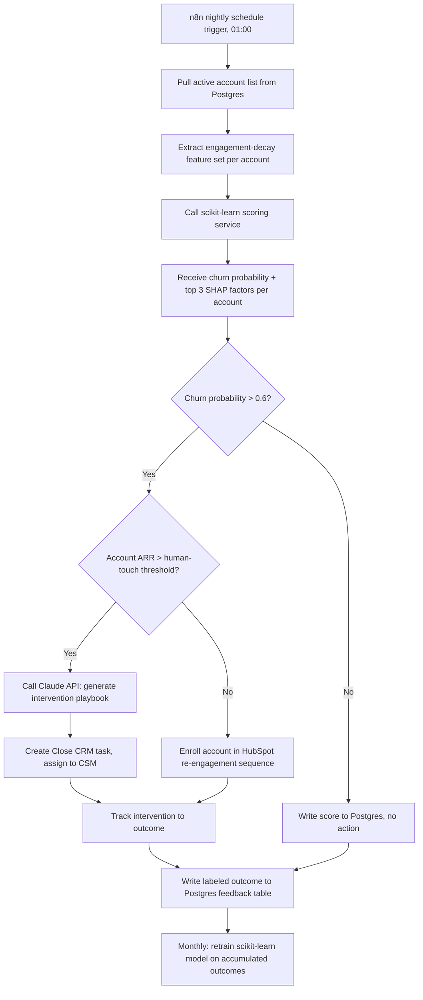
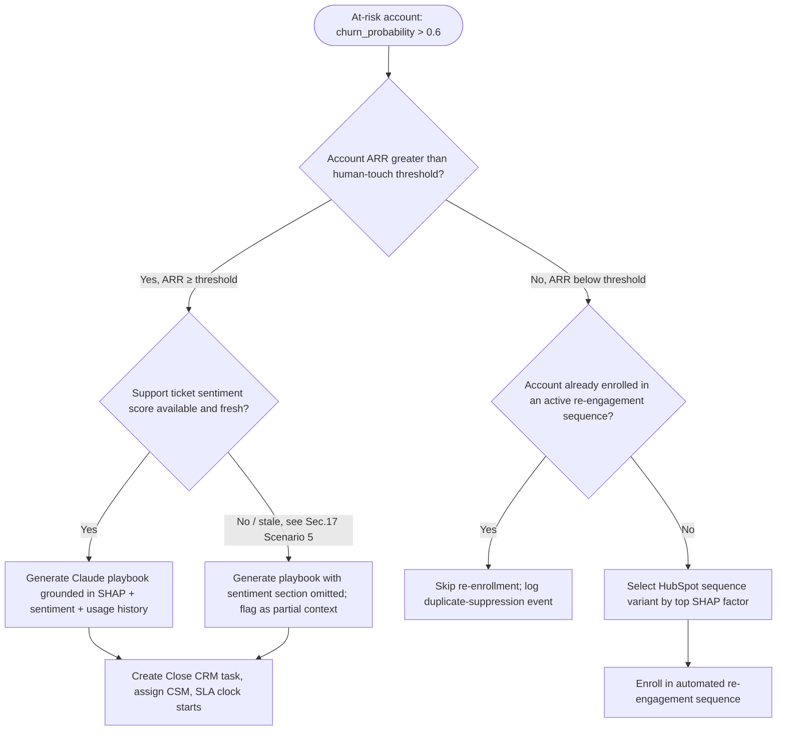

# SOP: Churn Prediction & Proactive Customer Success Intervention System

**Reference Deployment Context:** Atlas Metrics
**Industry:** B2B Product Analytics SaaS
**Owning Section:** 14 SaaS
**SOP ID:** SAAS-03
**Version:** 1.0
**Last Updated:** 2026-06-30
**Author:** Automation Architecture Team
**Classification:** Client-Facing
**Complexity Tier:** Advanced
**Video Walkthrough:** _Pending recording — see script in this SOP's project folder._
**Real Build Artifacts:** [Importable n8n workflow, runnable automation script, and executable database schema →](build/README.md)

## Table of Contents

1. [Purpose](#1-purpose)
2. [Business Problem](#2-business-problem)
3. [Business Goals](#3-business-goals)
4. [Business Requirements](#4-business-requirements)
5. [Functional Requirements](#5-functional-requirements)
6. [Technical Requirements](#6-technical-requirements)
7. [Dependencies](#7-dependencies)
8. [Systems Used](#8-systems-used)
9. [Roles](#9-roles)
10. [Responsibilities](#10-responsibilities)
11. [Workflow Overview](#11-workflow-overview)
12. [Detailed Workflow Steps](#12-detailed-workflow-steps)
13. [Decision Tree](#13-decision-tree)
14. [Automation Logic](#14-automation-logic)
15. [Trigger Conditions](#15-trigger-conditions)
16. [Data Validation](#16-data-validation)
17. [Error Handling](#17-error-handling)
18. [Retry Logic](#18-retry-logic)
19. [Fallback Procedures](#19-fallback-procedures)
20. [Manual Override](#20-manual-override)
21. [Exception Handling](#21-exception-handling)
22. [Notifications](#22-notifications)
23. [Audit Logs](#23-audit-logs)
24. [Security](#24-security)
25. [Permissions](#25-permissions)
26. [Compliance](#26-compliance)
27. [Performance Metrics](#27-performance-metrics)
28. [KPIs](#28-kpis)
29. [Testing Procedure](#29-testing-procedure)
30. [Deployment](#30-deployment)
31. [Maintenance](#31-maintenance)
32. [Version History](#32-version-history)
33. [Future Improvements](#33-future-improvements)
34. [Appendix](#34-appendix)
35. [Troubleshooting](#35-troubleshooting)
36. [Recovery Procedure](#36-recovery-procedure)
37. [Frequently Asked Questions](#37-frequently-asked-questions)
38. [Technical Notes](#38-technical-notes)
39. [Business Notes](#39-business-notes)
40. [Estimated Time Savings](#40-estimated-time-savings)
41. [ROI Analysis](#41-roi-analysis)
42. [Risk Assessment](#42-risk-assessment)
43. [Lessons Learned](#43-lessons-learned)
44. [Related SOPs](#44-related-sops)

---

## 1. Purpose

This SOP documents the architecture and operating procedure for Atlas Metrics' churn prediction and proactive Customer Success (CS) intervention system. The system replaces a reactive, cancellation-driven CS motion with a nightly, model-driven pipeline that scores every active account's churn risk, explains that risk in plain business terms, and routes each at-risk account to the intervention that is economically justified for its size — a human-touch CSM playbook for higher-ARR accounts, or an automated re-engagement sequence for smaller ones. The system exists to convert churn from a lagging indicator the business discovers at renewal into a leading indicator the business acts on 30-90 days earlier.

## 2. Business Problem

Atlas Metrics operates a B2B product analytics platform serving approximately 1,800 active accounts. Prior to this system, the Customer Success organization had no systematic early-warning mechanism. CSMs learned an account was at risk in one of two ways: the account submitted a cancellation request, or a renewal call surfaced dissatisfaction the CSM had no prior visibility into. Both are terminal-stage signals — by the time either occurs, the window to change the outcome has largely closed.

The quantified consequence of this reactive posture is a trailing twelve-month logo churn rate of approximately **14% annually**, against a target range of **8-10%** for Atlas Metrics' market segment (mid-market B2B product analytics, average contract value in the low five figures). This is the "before" baseline this SOP is measured against. Anecdotally, CS leadership estimated that in a majority of churned accounts, the engagement decline that preceded cancellation had been visible in the product's own usage data — login frequency drops, feature abandonment, seat underutilization — for 60 to 90 days prior to the cancellation event, but no one was looking at that data in aggregate or systematically enough to act on it.

A secondary problem compounded the first: even where CSMs had a qualitative sense that an account was "going quiet," there was no consistent process for translating that hunch into a specific, well-timed outreach action, and no way to justify CSM time investment across a book of business where account ARR varies by more than 20x between the smallest and largest managed accounts.

## 3. Business Goals

- Reduce annual logo churn from ~14% toward the 8-10% segment target within two full model-retrain-and-intervention cycles (approximately 6 months).
- Give every account a continuously updated, explainable churn-risk score rather than relying on CSM intuition or renewal-date proximity.
- Ensure CS effort is allocated in proportion to account economic value — human-touch intervention for accounts where the ARR justifies it, automated intervention where it does not.
- Shift the CS motion from "find out why an account left" to "act before an account decides to leave."
- Build a compounding feedback loop where every intervention outcome makes the next model retrain more accurate, rather than treating churn prediction as a one-time model deployment.

## 4. Business Requirements

- **BR-1:** The system must identify at-risk accounts before they reach a cancellation or non-renewal conversation, using signals available inside the product and CS tooling.
- **BR-2:** Every risk score must be accompanied by a human-readable explanation of *why* the account is flagged, not just a numeric probability.
- **BR-3:** CS effort (CSM time) must be reserved for accounts where the ARR justifies the cost of a human intervention; smaller accounts must still receive proactive outreach, but through a lower-cost automated channel.
- **BR-4:** The system must produce an actionable next step for the CSM or the automated sequence — not just a flag — so that intervention is specific rather than generic.
- **BR-5:** Outcomes of every intervention must be captured and fed back into the model so risk scoring improves over time rather than remaining static.
- **BR-6:** The system must not expose customer support ticket content or other sensitive account data to third parties beyond what is contractually and legally permissible.
- **BR-7:** CS leadership must be able to override or annul a model's risk assessment when it conflicts with direct account knowledge.

## 5. Functional Requirements

- **FR-1:** A nightly scheduled job extracts a defined feature set (engagement-decay metrics) from Postgres for every active account and writes a feature snapshot.
- **FR-2:** A Python scikit-learn scoring service consumes the nightly feature snapshot and returns, per account, a churn probability (0-1) and the top 3 SHAP-derived contributing factors.
- **FR-3:** Accounts scoring above a 0.6 churn-probability threshold are evaluated against an ARR threshold to determine intervention type.
- **FR-4:** For accounts above both thresholds, the Claude API generates a structured intervention playbook (talking points, re-engagement feature, outreach channel, support-ticket sentiment summary) which is attached as a task in Close CRM, assigned to the account's CSM.
- **FR-5:** For accounts above the churn-probability threshold but below the ARR threshold, an automated re-engagement sequence is triggered in HubSpot with no human task created.
- **FR-6:** Every intervention (human or automated) is tracked to a terminal outcome — retained, churned, or no action needed — and that outcome is written back to Postgres as a labeled training example.
- **FR-7:** The underlying scikit-learn model is retrained monthly using the accumulated labeled outcome data.

| BR ID | FR ID | Description |
|---|---|---|
| BR-1 | FR-1, FR-2 | Nightly feature extraction and churn scoring surface risk before cancellation |
| BR-2 | FR-2, FR-4 | SHAP factors and Claude-generated playbook narrative explain the score |
| BR-3 | FR-3, FR-4, FR-5 | ARR-threshold routing splits human-touch vs. automated intervention |
| BR-4 | FR-4, FR-5 | Playbook and re-engagement sequence are both concrete next actions |
| BR-5 | FR-6, FR-7 | Outcome logging feeds the monthly retrain |
| BR-6 | FR-4 (governed) | Support ticket content sent to Claude is scoped and redacted per Section 24 |
| BR-7 | FR-3 (overridable) | Manual override path documented in Section 20 |

## 6. Technical Requirements

- **n8n:** self-hosted, version 1.4x or later, with a dedicated worker queue for the nightly churn job to avoid contention with other Atlas Metrics automations (see SAAS-01, SAAS-02).
- **PostgreSQL:** version 14+, dedicated schema (`churn_intel`) with row-level security scoping CS-visible fields from engineering-only fields.
- **Python scoring service:** Python 3.11, scikit-learn 1.4+, SHAP 0.45+, exposed as an internal REST endpoint (FastAPI) callable from n8n via HTTP Request node. Not exposed to the public internet.
- **Claude API:** model tier suitable for structured JSON generation with grounded reasoning over supplied context (SHAP factors, ticket sentiment, usage history); requests capped at a defined token budget per account to bound cost.
- **Close CRM API:** v1, task creation scoped to the CS team's pipeline; auth via API key stored in n8n credentials vault.
- **HubSpot API:** v3, workflow-enrollment endpoint for the automated re-engagement sequence; auth via private app token.
- **Latency budget:** full nightly batch (feature extraction → scoring → playbook generation → CRM writes) must complete within a 3-hour maintenance window (01:00-04:00 account local aggregate time) to avoid overlapping with East Coast CSM morning start times.
- **Uptime target:** the scoring service and n8n orchestration layer target 99.5% monthly availability; a missed nightly run must not silently fail — see Section 17.
- **Data residency:** all account and ticket data remains in Atlas Metrics' primary Postgres instance (US region); only the minimum necessary derived context is sent to the Claude API per Section 24.

## 7. Dependencies

- **Upstream data availability:** the nightly job depends on the product usage-event pipeline (shared with SAAS-01) having completed its own nightly aggregation before the churn feature extraction runs; a defined run-order dependency exists in the n8n scheduler.
- **Support ticket sentiment source:** depends on the CS helpdesk's ticket export or webhook sync completing on schedule; sync lag is a documented failure mode (Section 17).
- **Payment status signal:** depends on the dunning and failed-payment pipeline (SAAS-02) writing payment-failure events to a shared signal table, since a failed payment is itself a churn-risk input.
- **Close CRM and HubSpot API availability and rate limits:** both are third-party SLAs outside Atlas Metrics' control; the workflow degrades gracefully (Section 19) rather than blocking on either.
- **Claude API availability and rate limits:** the playbook generation step is dependent on third-party model availability; a fallback path exists for when it is not reachable.
- **Monthly retrain job:** depends on a minimum volume of new labeled outcomes (see Section 31) to be worth executing; retrain is skipped, not forced, if that volume is not met.

## 8. Systems Used

| System | Role in Workflow | Auth Method |
|---|---|---|
| n8n | Nightly orchestration: schedules feature extraction, invokes scoring service, invokes Claude, writes to Close/HubSpot, logs outcomes | API keys per downstream system, stored in n8n credential vault |
| PostgreSQL | Feature store, model score history, outcome feedback-loop table | Connection string with scoped service role, SSL enforced |
| Python scikit-learn service | Batch churn scoring (gradient boosting classifier) and SHAP explainability | Internal network only; service-to-service token |
| Claude API | Generates personalized, SHAP-grounded intervention playbooks per at-risk account | API Key (`sk-ant-xxxxxxxxxxxxx`, stored in n8n vault, never in workflow JSON) |
| Close CRM | CS task queue for human-touch accounts; CSM-assigned intervention tasks | API Key |
| HubSpot | Automated lower-touch re-engagement sequence for accounts below ARR threshold | Private App OAuth2 Token |

## 9. Roles

- **Business Owner:** VP of Customer Success, Atlas Metrics — owns the ARR threshold, churn-probability threshold, and accountability for the churn-rate KPI.
- **Technical Owner:** Data/ML Engineering Lead — owns the scikit-learn model, feature pipeline, and n8n orchestration.
- **CS Operations Lead:** owns Close CRM task queue hygiene, CSM assignment logic, and HubSpot sequence content.
- **Escalation Contact:** Automation Architecture Team (this engagement's delivery lead) for pipeline failures, model drift alerts, and third-party API incidents.
- **CSM (end user):** consumes the Close CRM task and playbook; executes the human-touch intervention.

## 10. Responsibilities

| Role | Responsibility |
|---|---|
| VP of Customer Success | Sets and periodically reviews the 0.6 churn-probability threshold and ARR threshold; owns the churn-rate business outcome |
| Data/ML Engineering Lead | Maintains the feature pipeline, retrains and validates the model monthly, monitors drift |
| CS Operations Lead | Ensures Close CRM tasks are actioned within SLA; maintains HubSpot sequence copy and cadence |
| CSM | Executes human-touch interventions per the generated playbook; records qualitative outcome context |
| Automation Architecture Team | Maintains n8n orchestration, API integrations, error handling, and incident response |

## 11. Workflow Overview

Every account's churn risk is re-evaluated nightly. The pipeline moves from raw engagement data in Postgres, through a scoring model that explains its own reasoning, through an AI-generated action plan, into whichever CS channel the account's economics justify — with every outcome closing the loop back into the training data.



## 12. Detailed Workflow Steps

**Step 1 — Scheduled trigger.**
Tool: n8n. Trigger: Cron node, `0 1 * * *` (01:00 daily, after the shared usage-event aggregation job completes). Input: none (time-based). Output: workflow execution start. Error handling ref: Section 17, Scenario 2.

**Step 2 — Pull active account roster.**
Tool: n8n → PostgreSQL node. Action: `SELECT account_id, arr, plan_tier, csm_owner_id FROM churn_intel.active_accounts WHERE status = 'active'`. Input schema: none. Output schema: array of account records (~1,800 rows). Condition: if row count is zero or drops more than 15% versus the prior run, the job halts and alerts (Section 17, Scenario 2 pattern applied to roster integrity).

**Step 3 — Feature extraction per account.**
Tool: n8n → PostgreSQL node (batched query, 200 accounts per batch to bound query load). Action: compute the engagement-decay feature vector (full list in Section 14) for each account, comparing a trailing 30-day window against the preceding 30-day window. Output schema: one JSON feature vector per account, written to `churn_intel.feature_snapshots`. Error handling ref: Section 17, Scenario 1 (missing/null features for new accounts).

**Step 4 — Invoke scoring service.**
Tool: n8n → HTTP Request node → internal FastAPI endpoint wrapping the scikit-learn model. Input: batch of feature vectors (JSON array, batched at 200 accounts per call to keep request latency under 8 seconds). Output: churn probability and top-3 SHAP factors per account. Error handling ref: Section 17, Scenario 2; Section 18 (retry/backoff).

**Step 5 — Threshold evaluation.**
Tool: n8n → Function node. Action: filter accounts where `churn_probability > 0.6`. Output: subset of at-risk accounts, each carrying its SHAP explanation.

**Step 6 — ARR routing.**
Tool: n8n → IF/Switch node. Action: for each at-risk account, compare `arr` against the human-touch ARR threshold (Section 13 decision tree). Output: two branches — human-touch and automated.

**Step 7a — Playbook generation (human-touch branch).**
Tool: n8n → HTTP Request node → Claude API. Input: SHAP factors, trailing support-ticket sentiment summary, usage history snapshot, account metadata (see Section 14 prompt construction). Output: structured playbook JSON (talking points, re-engagement feature, outreach channel, sentiment summary). Error handling ref: Section 17, Scenario 3; Section 18.

**Step 7b — Close CRM task creation.**
Tool: n8n → Close CRM node. Action: create task on the account's Close lead/opportunity record, assigned to `csm_owner_id`, due within CSM response SLA (Section 27), body populated from the playbook JSON. Output: Close task ID, written back to Postgres for outcome tracking.

**Step 8 — Automated sequence enrollment (below-ARR-threshold branch).**
Tool: n8n → HubSpot node. Action: enroll the contact/account in the "Proactive Re-engagement" workflow, tagged with the top SHAP factor to select the correct sequence variant (e.g., low-login-frequency variant vs. low-feature-adoption variant). Output: HubSpot enrollment confirmation, written back to Postgres.

**Step 9 — Score persistence for non-flagged accounts.**
Tool: n8n → PostgreSQL node. Action: write churn probability and SHAP factors to `churn_intel.score_history` for every account regardless of threshold outcome, to preserve a full historical time series for trend analysis and future retrains.

**Step 10 — Outcome tracking and feedback-loop write.**
Tool: n8n → scheduled follow-up sub-workflow (runs daily, checks interventions older than 21 days). Action: check Close CRM task status and account subscription status (retained/churned/still active-no signal) and HubSpot sequence completion + subsequent engagement delta. Output: labeled outcome row written to `churn_intel.outcome_feedback`, the table consumed by the monthly retrain.

**Step 11 — Monthly retrain.**
Tool: n8n (monthly cron, first Sunday) → scikit-learn training job. Action: pull all labeled outcomes since the last retrain, merge with the existing training set, retrain the gradient boosting classifier, validate against a holdout set (Section 27), and promote the new model only if it meets the promotion criteria (Section 31).

## 13. Decision Tree

The ARR-threshold routing is the economic core of this system: it determines whether an at-risk account receives a CSM's time or an automated sequence.



The human-touch ARR threshold is set by CS leadership (Section 9) and reviewed quarterly; it is not hardcoded as a permanent business rule but is treated as a tunable parameter because it directly trades CSM capacity against coverage breadth. At initial deployment, Atlas Metrics set this threshold such that approximately the top 35% of accounts by ARR receive human-touch intervention when flagged, and the remaining 65% receive the automated sequence — a ratio chosen to keep CSM caseload for at-risk accounts within sustainable weekly capacity (Section 27).

## 14. Automation Logic

### Feature list

The scikit-learn model consumes the following engagement-decay feature set, computed as a trailing-30-day value and, where marked, a delta against the preceding 30-day window:

| Feature | Description |
|---|---|
| `login_frequency_delta` | % change in distinct login days, trailing 30d vs. prior 30d |
| `feature_usage_delta` | % change in count of distinct core-feature actions taken, trailing 30d vs. prior 30d |
| `seat_utilization_rate` | Active seats / licensed seats, trailing 30d |
| `seat_utilization_delta` | Change in seat utilization rate vs. prior 30d |
| `support_ticket_sentiment_score` | Mean sentiment score (-1 to 1) across support tickets, trailing 30d |
| `support_ticket_volume_delta` | % change in ticket volume vs. prior 30d (spike can indicate frustration; drop-to-zero after prior engagement can indicate disengagement) |
| `nps_trend` | Slope of the account's most recent NPS responses (if fewer than 2 responses, imputed as 0 with a `nps_data_sparse` flag) |
| `payment_failure_flag` | Boolean, sourced from the SAAS-02 dunning pipeline signal table — has this account had a failed payment in the trailing 60 days |
| `contract_days_to_renewal` | Days remaining until contract renewal date |
| `account_tenure_days` | Days since account activation |
| `plan_tier` | Categorical, encoded |

### Feature engineering and model invocation (Python)

```python
"""
Nightly churn scoring service — feature engineering and model invocation.
Runs as a FastAPI endpoint invoked by n8n via HTTP Request node.
"""

from dataclasses import dataclass
from datetime import date

import numpy as np
import pandas as pd
import shap
from sklearn.ensemble import GradientBoostingClassifier

FEATURE_COLUMNS = [
    "login_frequency_delta",
    "feature_usage_delta",
    "seat_utilization_rate",
    "seat_utilization_delta",
    "support_ticket_sentiment_score",
    "support_ticket_volume_delta",
    "nps_trend",
    "payment_failure_flag",
    "contract_days_to_renewal",
    "account_tenure_days",
    "plan_tier_encoded",
]


@dataclass
class ScoredAccount:
    """Result of scoring a single account for churn risk."""
    account_id: str
    churn_probability: float
    top_factors: list[dict]
    scored_at: str


def build_feature_frame(raw_rows: list[dict]) -> pd.DataFrame:
    """Convert raw Postgres feature rows into a model-ready DataFrame.

    New accounts (account_tenure_days < 30) have insufficient history for
    delta features; these are imputed to zero and flagged rather than
    dropped, per the error-handling policy in Section 17, Scenario 1.
    """
    df = pd.DataFrame(raw_rows)
    delta_cols = ["login_frequency_delta", "feature_usage_delta", "seat_utilization_delta"]
    insufficient_history = df["account_tenure_days"] < 30
    df.loc[insufficient_history, delta_cols] = 0.0
    df["low_confidence_flag"] = insufficient_history

    df["nps_trend"] = df["nps_trend"].fillna(0.0)
    df["nps_data_sparse"] = df["nps_trend"].isna()

    df["support_ticket_sentiment_score"] = df["support_ticket_sentiment_score"].fillna(
        df["support_ticket_sentiment_score"].median()
    )
    return df


def score_batch(
    model: GradientBoostingClassifier,
    explainer: "shap.TreeExplainer",
    df: pd.DataFrame,
) -> list[ScoredAccount]:
    """Score a batch of accounts and extract per-account SHAP explanations."""
    X = df[FEATURE_COLUMNS]
    probabilities = model.predict_proba(X)[:, 1]  # P(churn = 1)
    shap_values = explainer.shap_values(X)

    results: list[ScoredAccount] = []
    for i, account_id in enumerate(df["account_id"]):
        row_shap = shap_values[i]
        ranked_idx = np.argsort(np.abs(row_shap))[::-1][:3]
        top_factors = [
            {
                "feature": FEATURE_COLUMNS[j],
                "shap_value": round(float(row_shap[j]), 4),
                "direction": "increases_risk" if row_shap[j] > 0 else "decreases_risk",
            }
            for j in ranked_idx
        ]
        results.append(
            ScoredAccount(
                account_id=account_id,
                churn_probability=round(float(probabilities[i]), 4),
                top_factors=top_factors,
                scored_at=date.today().isoformat(),
            )
        )
    return results


# Model is loaded once at service startup from the latest promoted
# artifact (Section 31, promotion criteria), not retrained per request.
CHURN_MODEL = GradientBoostingClassifier(
    n_estimators=300,
    max_depth=3,
    learning_rate=0.05,
    subsample=0.8,
    random_state=42,
)
```

### SHAP extraction into the Claude prompt

```python
"""
Playbook generation — construct a grounded prompt from SHAP output,
support-ticket sentiment, and usage history, then call the Claude API.
"""

import json

PLAYBOOK_SYSTEM_PROMPT = """You are generating a Customer Success intervention
playbook for a Customer Success Manager (CSM) at a B2B SaaS company. You will
be given a churn risk score, the top statistical drivers of that risk (SHAP
values), a summary of recent support ticket sentiment, and a usage history
snapshot. Produce a playbook grounded ONLY in the provided data — do not
speculate beyond it. If the provided context is incomplete, say so explicitly
rather than inventing detail. Output valid JSON matching the schema provided."""


def build_playbook_prompt(scored_account: dict, ticket_sentiment: dict, usage_history: dict) -> str:
    """Assemble the grounded context payload sent to the Claude API."""
    context = {
        "account_id": scored_account["account_id"],
        "churn_probability": scored_account["churn_probability"],
        "top_shap_factors": scored_account["top_factors"],
        "support_ticket_sentiment": ticket_sentiment,
        "usage_history_snapshot": usage_history,
        "output_schema": {
            "talking_points": "list of 3-5 specific, data-grounded talking points",
            "recommended_reengagement_feature": "string, one specific product feature to re-anchor the account on",
            "ideal_outreach_channel": "string, one of: email, phone, in-app message, scheduled call",
            "sentiment_summary": "string, 2-3 sentence summary of recent support interactions",
            "confidence_caveat": "string or null, populated if input context was incomplete",
        },
    }
    return json.dumps(context)
```

### Example: Claude API invocation

```python
import anthropic

client = anthropic.Anthropic(api_key="sk-ant-xxxxxxxxxxxxx")

response = client.messages.create(
    model="claude-sonnet-4-5",
    max_tokens=800,
    system=PLAYBOOK_SYSTEM_PROMPT,
    messages=[{"role": "user", "content": build_playbook_prompt(scored_account, ticket_sentiment, usage_history)}],
)
```

## 15. Trigger Conditions

The primary trigger is time-based, not event-based: n8n's Cron node fires the nightly batch at 01:00 account-aggregate time, gated behind successful completion of the shared usage-event aggregation job (a cross-workflow dependency check via a Postgres "job completion" flag table, shared with SAAS-01).

Trigger payload schema (internal, n8n execution context — no external payload since this is schedule-triggered):

```json
{
  "trigger_type": "schedule",
  "cron_expression": "0 1 * * *",
  "upstream_dependency_check": {
    "job_name": "usage_event_nightly_aggregation",
    "required_status": "completed",
    "max_wait_minutes": 45
  }
}
```

A secondary trigger exists for the outcome-tracking sub-workflow (Step 10), which runs daily on its own schedule (`0 6 * * *`) independent of the scoring batch, since outcome tracking looks backward at interventions created 21+ days prior rather than at the current night's scoring run.

The monthly retrain is also schedule-triggered (`0 3 1 * *`, meaning 03:00 on the 1st of each month, adjusted to the first Sunday in practice to avoid mid-week compute contention).

## 16. Data Validation

| Field | Rule | Failure Action |
|---|---|---|
| `account_id` | Must exist in `churn_intel.active_accounts` and be non-null | Skip account, log to validation-failure table, exclude from batch |
| `arr` | Must be a positive numeric value | If null or zero, default to plan-tier list price; flag account for CS Ops review |
| `login_frequency_delta` | Numeric, expected range -1.0 to +5.0 (allowing usage spikes) | Values outside range are capped (winsorized) rather than dropped, and flagged |
| `support_ticket_sentiment_score` | Numeric, -1.0 to 1.0; must have a `computed_at` timestamp within 72 hours | If stale beyond 72 hours, treat per Section 17, Scenario 5 |
| `churn_probability` (model output) | Must be a float between 0 and 1 | If out of range, discard the score, log a model-integrity alert, do not act on it |
| `top_factors` (model output) | Must contain exactly 3 entries with valid feature names from `FEATURE_COLUMNS` | If malformed, discard and alert; do not pass to Claude |
| Claude playbook JSON | Must parse as valid JSON matching the defined schema | If parse fails, retry once (Section 18), then fall back per Section 19 |
| `csm_owner_id` | Must map to an active CSM in Close CRM | If the CSM is inactive/reassigned, route task to the CS Ops queue for manual reassignment |

## 17. Error Handling

**Scenario 1 — Missing or null features for a new account skew its score.**
Detection: the feature extraction step flags any account with `account_tenure_days < 30` via the `low_confidence_flag` (Section 14). Response: delta-based features are imputed to zero rather than left null (which would otherwise propagate as NaN through the model and either crash scoring or silently bias it). Scored accounts carrying this flag are excluded from the automatic ARR-threshold routing and instead routed to a weekly CS Ops review queue until they accumulate 30+ days of history, since a probability score built on zero-value deltas is not yet meaningful.

**Scenario 2 — Model service timeout during the nightly batch.**
Detection: the n8n HTTP Request node to the scoring service has an 8-second per-batch timeout; consecutive timeouts across 3 batches trigger a workflow-level alert. Response: per Section 18, the request is retried with backoff; if the service remains unreachable after retries exhaust, the entire night's scoring run is marked incomplete, prior-night scores remain the system of record (no stale action is taken on missing data), and an on-call alert fires to the Technical Owner. The batch is not partially applied — either the full nightly cohort scores successfully or the run is rolled back to avoid a mix of same-night and prior-night scores creating inconsistent routing decisions.

**Scenario 3 — Claude API failure when generating a playbook.**
Detection: non-200 response, malformed JSON in the response body, or a response that fails schema validation (Section 16). Response: retry once with backoff (Section 18); on second failure, the Close CRM task is still created (the account is genuinely at-risk and the CSM still needs to know), but with a fallback body populated directly from the raw SHAP factors and sentiment score rather than the narrative playbook — see Section 19. The CSM sees a note: "AI-generated playbook unavailable this cycle; raw model factors below."

**Scenario 4 — A SHAP explanation contradicts the playbook narrative.**
Detection: a lightweight consistency check runs after playbook generation, comparing the feature names mentioned in the Claude output against the `top_factors` list passed into the prompt. If the playbook's talking points reference a driver not present in the top 3 SHAP factors, or omit all 3, the consistency check fails. Response: the task is still created, but flagged with an internal-only annotation ("playbook/SHAP consistency check failed — verify against raw factors before the call") visible to the CSM but not represented as a system error to leadership dashboards on its own; a rolling weekly count of consistency-check failures is reviewed by the Technical Owner, since a rising rate indicates the grounding prompt needs tightening.

**Scenario 5 — Stale support-ticket sentiment data due to a support-tool sync lag.**
Detection: the `computed_at` timestamp on the sentiment score exceeds the 72-hour freshness rule (Section 16). Response: the feature is not discarded outright (a stale sentiment score is still weak signal), but the account's SHAP explanation and any downstream playbook explicitly caveat that sentiment context may be outdated, per the decision tree's Q2 branch (Section 13). The playbook's `confidence_caveat` field is populated instead of left null. CS Ops is alerted if the sync lag persists beyond 5 consecutive days, since this indicates an upstream integration issue with the helpdesk sync rather than a one-off delay.

**Scenario 6 — Duplicate intervention triggers on an already-enrolled account.**
Detection: before HubSpot enrollment or Close task creation, the workflow checks for an existing open task or active sequence enrollment for the account within the trailing 21 days. Response: suppress the duplicate action, log a suppression event (Section 23), and do not reset the outcome-tracking clock, since restarting the clock on an existing intervention would corrupt the labeled-outcome timing used in the monthly retrain.

**Scenario 7 — Postgres write failure on outcome feedback logging.**
Detection: the outcome-tracking sub-workflow's write to `churn_intel.outcome_feedback` fails (connection error, constraint violation). Response: the failed write is queued to a local retry buffer within the n8n execution and retried up to the standard policy (Section 18); if it still fails, the outcome is written to a dead-letter file location and a daily reconciliation check compares dead-lettered records against the table to catch any that never made it in before the next retrain consumes the table.

## 18. Retry Logic

- **Scoring service calls:** exponential backoff, base delay 2 seconds, multiplier 2x, maximum 3 attempts (2s, 4s, 8s), total budget under 15 seconds per batch to stay within the nightly window. Idempotency: each scoring request carries an `idempotency_key` composed of `{batch_id}_{date}`, and the scoring service is stateless/pure with respect to a given feature snapshot, so re-running a request with the same key is safe.
- **Claude API calls:** exponential backoff, base delay 3 seconds, multiplier 2x, maximum 2 retries (3s, 6s), after which the fallback in Scenario 3 applies. Idempotency: each playbook request carries `{account_id}_{score_date}` as a dedupe key so a retried call cannot generate two Close tasks for the same scoring cycle.
- **Close CRM / HubSpot writes:** standard retry, base delay 5 seconds, maximum 3 attempts, since these are third-party APIs with published rate limits that occasionally return transient 429/503 responses. The workflow respects `Retry-After` headers where present rather than a fixed backoff.
- **Postgres writes:** 3 attempts with 1-second linear backoff, since transient connection pool exhaustion is the most common failure mode and resolves quickly.
- No retry logic applies indefinitely — every retry chain has a hard ceiling, after which the fallback procedure in Section 19 takes over rather than allowing the batch to hang.

## 19. Fallback Procedures

- **Scoring service exhausted retries:** the run is marked incomplete; no accounts are scored or re-routed that night; prior-night scores remain authoritative; on-call alert fires (Section 22).
- **Claude API exhausted retries:** Close CRM task is still created (an at-risk account must not go unflagged to its CSM merely because the AI narrative layer failed) using a template populated directly from raw SHAP factors, churn probability, and the last known sentiment score, with a clear label that the narrative playbook is unavailable.
- **HubSpot enrollment exhausted retries:** the account is added to a manual CS Ops review queue (a lightweight Postgres table, not a new system) so the automated-tier account does not simply fall through the cracks; CS Ops can manually trigger the sequence or downgrade the account to the human-touch queue for that cycle if volume is low enough to absorb it.
- **Postgres outcome-write exhausted retries:** dead-letter file fallback as described in Scenario 7; reconciled before the next monthly retrain consumes the outcome table, so a transient failure never permanently loses a labeled example.
- **Full pipeline outage (n8n itself down):** this is a degraded-mode, not a fallback the workflow can self-manage; the on-call alert (Section 22) escalates directly to the Automation Architecture Team, and CS leadership is notified that no nightly scoring occurred so they know not to expect updated risk scores that day.

## 20. Manual Override

CS leadership (the VP of Customer Success or a designated CS Ops Lead) is authorized to override the system in two ways:

1. **Score override:** an account's churn-probability score can be manually annotated in Postgres (`churn_intel.score_overrides`) with a reason code and reviewer identity. This does not alter the model's underlying prediction (the model output remains in the historical record for retraining integrity) but suppresses automated routing for that account for the current cycle — for example, when a CSM has direct knowledge that a usage dip is due to a known seasonal pattern rather than genuine disengagement.
2. **Intervention reassignment:** a Close CRM task generated by the system can be manually reassigned to a different CSM (e.g., on account-team transition) without affecting the underlying score or SHAP explanation; reassignment is logged with old-owner/new-owner and timestamp.

Overrides are never silent: every override writes an audit row (Section 23) with the overriding user's identity, timestamp, and stated reason, and overridden accounts are visible in a CS Ops dashboard flag so they are not inadvertently "lost" from tracking. Overrides do not bypass outcome tracking — an overridden account still eventually receives a retained/churned/no-action label, which is itself a useful signal (frequent overrides on accounts that later churn anyway indicate the override reason codes need scrutiny).

## 21. Exception Handling

- **Malformed feature payload from Postgres** (e.g., a column type mismatch after a schema migration): the feature extraction step validates the returned row shape against the expected schema before passing to the scoring service; a mismatch halts that batch's processing (not the whole night's run) and alerts the Technical Owner, since this typically indicates an unreviewed schema change rather than a data quality issue.
- **Partial batch response from the scoring service** (e.g., the service returns scores for 180 of 200 accounts in a batch due to an internal exception on specific rows): the 20 unscored accounts are logged individually, retried in a follow-up singleton call rather than re-running the full batch, and if they still fail, they carry forward the prior night's score with a `stale_score` flag rather than being left scoreless.
- **Account state changes mid-run** (e.g., an account is canceled by the client between roster pull and playbook generation): a pre-write check before Close task creation confirms the account is still active; if not, the intervention is silently dropped and logged as "moot — account already churned," which is itself useful as a "did we act too late" signal reviewed in the monthly retrospective.
- **Unexpected null in the ARR field for an enterprise-tier account:** rather than defaulting silently (which for a high-ARR account risks misrouting to the automated tier), any null ARR on an account above a certain plan tier hard-stops that account's routing and forces manual CS Ops review, since the cost of a wrong high-ARR routing decision outweighs the cost of a delayed one.

## 22. Notifications

| Event | Channel | Severity | Recipient |
|---|---|---|---|
| Nightly batch completed successfully | Slack (#cs-automation-log) | Info | CS Ops, Technical Owner |
| Nightly batch failed / incomplete | Slack (#cs-automation-alerts) + email | Critical | Technical Owner, on-call engineer |
| Claude API fallback triggered (Scenario 3) | Slack (#cs-automation-log) | Warning | CS Ops Lead |
| SHAP/playbook consistency check failure rate exceeds 10% weekly | Slack (#cs-automation-alerts) | Warning | Technical Owner |
| Support ticket sentiment sync lag exceeds 5 days | Slack (#cs-automation-alerts) | Warning | CS Ops Lead, Support Tooling Owner |
| New high-value Close CRM task created (human-touch intervention) | Close CRM native notification + Slack DM | Info | Assigned CSM |
| Model retrain completed — promoted or rejected | Slack (#cs-automation-log) + email summary | Info | VP of Customer Success, Technical Owner |
| Manual override applied | Slack (#cs-automation-log) | Info | VP of Customer Success (visibility, not approval-gated) |

## 23. Audit Logs

Every material event in this workflow is logged to `churn_intel.audit_log` with a common schema: `event_type`, `account_id`, `actor` (system or user identity), `timestamp`, `payload_snapshot`, `reason_code` (nullable). Logged event types include: score computed, threshold routing decision, playbook generated, Close task created, HubSpot enrollment, outcome recorded, manual override applied, and every error/fallback scenario from Section 17. Retention is 24 months, aligned with the model's need for a multi-cycle labeled history and with Atlas Metrics' general data retention policy. Audit logs support both debugging (reconstructing exactly why an account was or was not flagged on a given night) and compliance review (demonstrating that human oversight — overrides, reassignments — is itself tracked, not just the automated decisions).

## 24. Security

- **Authentication:** all inter-system calls use API keys or OAuth2 tokens stored exclusively in n8n's credential vault; no credential is ever hardcoded in a workflow node or committed to a repository. Example placeholder format for documentation purposes only: `sk-ant-xxxxxxxxxxxxx`, never a real key.
- **Encryption:** all API calls occur over TLS; the Postgres connection enforces SSL; data at rest in Postgres is encrypted via the underlying managed database service's disk encryption.
- **PII and third-party LLM exposure:** this is the most sensitive data-handling concern in this workflow. Support ticket content is summarized into a sentiment score and a short sentiment summary *before* any content reaches the Claude API — raw ticket text (which may contain customer PII, internal contact names, or proprietary account detail) is not sent to the model. Only the derived sentiment score, a bounded sentiment summary string, SHAP factor names/values, and coarse usage-history aggregates are included in the Claude prompt context. No customer end-user PII (names, emails of the account's own users) is included in the prompt payload; the account is referenced only by its internal `account_id`.
- **Data minimization:** the Claude prompt (Section 14) is deliberately scoped to the minimum context needed to generate a grounded playbook; usage history is passed as aggregated deltas, not raw event logs.
- **Model governance as a security-adjacent concern:** the feature list (Section 14) is version-controlled and documented per model version; any change to the feature set requires Technical Owner sign-off and is logged in the model's changelog, since an undocumented feature change could silently reintroduce sensitive data into the pipeline.

## 25. Permissions

| Role | View Scores | Edit Thresholds | Trigger Manual Override | Access Raw Support Ticket Data | Modify Feature Pipeline / Model |
|---|---|---|---|---|---|
| CSM | Yes (own accounts) | No | No | No (sentiment summary only) | No |
| CS Ops Lead | Yes (all accounts) | No | Yes | Yes (native helpdesk access, not via this pipeline) | No |
| VP of Customer Success | Yes (all accounts) | Yes | Yes | Yes | No |
| Data/ML Engineering Lead | Yes (all accounts, incl. model internals) | No (business threshold; can advise) | No | Yes (for feature debugging only) | Yes |
| Automation Architecture Team | Yes (operational/debug view) | No | No (technical, not business, authority) | No | Yes (pipeline infrastructure only) |

## 26. Compliance

Atlas Metrics operates under a SOC 2 Type II framework and standard B2B data processing agreements with its customers. This workflow's compliance-relevant posture:

- **Third-party data sharing (Claude API):** governed by Atlas Metrics' data processing addendum with Anthropic; the data minimization approach in Section 24 (derived signals only, no raw ticket text, no end-user PII) is the primary control that keeps this workflow within the boundaries of what customer contracts permit for sub-processor data sharing.
- **Model governance:** the feature list is documented and versioned (Section 14); retraining cadence is fixed at monthly with an explicit promotion gate (Section 31) rather than continuous/unreviewed retraining, so there is always a known, auditable model version in production at any point in time. This documented governance posture is the artifact reviewed during Atlas Metrics' SOC 2 audits regarding "automated decision-making" controls.
- **Drift monitoring** (Section 27) is itself a compliance-adjacent control: a model that has drifted undetected is both a business risk and a governance gap, since decisions are being made on a model no longer representative of current account behavior.
- **Right to explanation:** because every score carries SHAP-derived factors, Atlas Metrics can explain to any internal stakeholder — and, if ever required, to a customer inquiring about why they received proactive outreach — the concrete data-driven basis for that outreach, rather than an opaque "the algorithm flagged you."
- This SOP does not process health data (no HIPAA applicability) or EU resident personal data requiring GDPR-specific controls beyond standard data minimization already described; if Atlas Metrics' account base expands into EU-resident accounts, this section requires revision to address cross-border data transfer for the Claude API calls specifically.

## 27. Performance Metrics

| Metric | Target | Measurement Method |
|---|---|---|
| Model precision (holdout set, "will churn" class) | ≥ 0.55 | Monthly, evaluated on the most recent labeled holdout before promotion |
| Model recall (holdout set, "will churn" class) | ≥ 0.70 | Monthly, same holdout; recall prioritized over precision since a missed at-risk account is costlier than an unnecessary intervention |
| Nightly batch completion time | ≤ 3 hours (01:00-04:00 window) | n8n execution log duration |
| Scoring service p95 latency (per 200-account batch) | ≤ 8 seconds | Application-level timing, logged per batch |
| Claude API playbook success rate (first attempt, no retry) | ≥ 92% | Daily aggregate from n8n execution logs |
| CSM intervention response SLA | Task actioned (opened + first touch logged) within 3 business days of creation | Close CRM task activity timestamps |
| Model drift indicator (population stability index on top 3 features, month over month) | Flag for review if PSI > 0.2 on any top feature | Computed as part of the monthly retrain job, independent of whether the new model is promoted |

## 28. KPIs

- **Annual logo churn rate:** baseline 14%; target 8-10% within two full retrain-and-intervention cycles (~6 months). This is the top-line business KPI this system exists to move.
- **At-risk account recovery rate:** percentage of accounts flagged above the 0.6 threshold that are still active 90 days later. Tracked separately for human-touch vs. automated-tier accounts to validate the ARR-threshold routing decision itself is well-calibrated, not just the scoring model.
- **Time-to-intervention:** median days between an account crossing the risk threshold and the first CSM touch or automated sequence send. Target: same-day for automated tier, within CSM SLA (3 business days) for human-touch tier.
- **CSM caseload sustainability:** average number of open at-risk-account tasks per CSM per week, monitored to ensure the ARR threshold is calibrated to CSM capacity rather than flooding the queue.
- **Feedback-loop completeness:** percentage of interventions that reach a labeled terminal outcome (retained/churned/no action needed) within 90 days, feeding the monthly retrain. Target: ≥ 95%, since a low completeness rate degrades the training set quality this system depends on to improve over time.

## 29. Testing Procedure

Unit tests cover the feature engineering functions (null/imputation edge cases per Section 17 Scenario 1), the SHAP extraction logic (correct ranking and directionality), and the Claude prompt-construction function (correct schema shape, no PII leakage per Section 24). Integration tests exercise the full nightly pipeline against a staging Postgres instance seeded with synthetic account data spanning every branch of the decision tree (Section 13) — human-touch with fresh sentiment, human-touch with stale sentiment, automated tier, duplicate-suppression, new-account low-confidence — verifying correct routing and correct fallback behavior when the Claude API and scoring service are mocked to fail. User Acceptance Testing is conducted with CS Ops and a subset of CSMs reviewing real (anonymized in staging) playbook output for narrative quality and SHAP/playbook consistency before each model version and each material prompt-template change is promoted to production. Full testing methodology, environment setup, and regression suite structure follow the standard defined in [`37 Testing/README.md`](../../37%20Testing/README.md).

## 30. Deployment

Deployment follows a staged rollout: the scoring service and feature pipeline are deployed to a staging environment first, run in shadow mode (scoring live production data but not triggering any Close/HubSpot action) for one full nightly cycle to validate output distributions against the previous model version, then promoted to production with automated routing enabled. Rollback is a single-step operation — n8n workflow versioning allows immediate revert to the prior workflow version, and the scoring service loads model artifacts by version tag, so a bad model promotion can be rolled back to the last known-good artifact without a code deployment. Full environment topology, credential provisioning, and rollback runbook detail follow [`38 Deployment/README.md`](../../38%20Deployment/README.md).

## 31. Maintenance

- **Monthly:** model retrain against accumulated labeled outcomes; promotion gated on meeting or exceeding the current production model's precision/recall on the shared holdout set (Section 27) — a new model that regresses either metric is not promoted, and the retrain is logged as "rejected" rather than silently discarded.
- **Quarterly:** CS leadership review of the churn-probability threshold (0.6) and the human-touch ARR threshold, informed by the at-risk account recovery rate KPI (Section 28) split by tier.
- **Ongoing:** drift monitoring (PSI check, Section 27) reviewed by the Technical Owner as part of each monthly retrain cycle; a sustained drift signal triggers a feature-set review even outside the standard retrain cadence.
- **Ongoing:** Close CRM and HubSpot API credential rotation per Atlas Metrics' standard credential rotation policy, coordinated with the Automation Architecture Team to avoid a rotation landing mid-batch. Full maintenance cadence and ownership matrix follow [`39 Maintenance/README.md`](../../39%20Maintenance/README.md).

## 32. Version History

| Version | Date | Author | Change |
|---|---|---|---|
| 1.0 | 2026-06-30 | Automation Architecture Team | Initial release |

## 33. Future Improvements

- Incorporate a real-time (event-driven, not nightly-batch) risk recalculation for high-ARR accounts when a discrete high-signal event occurs (e.g., a key champion contact leaves the account, detected via email bounce or LinkedIn job-change signal), rather than waiting for the next nightly cycle.
- Extend the SHAP-grounded playbook approach to generate a differentiated playbook for the automated HubSpot tier as well, rather than only variant-selection by top factor, once the cost-per-account economics justify a lightweight LLM pass for lower-ARR accounts too.
- Build a CSM-facing feedback affordance directly in the Close CRM task ("was this playbook accurate?") to create a faster, more structured qualitative feedback signal than the current retained/churned/no-action outcome label alone.
- Explore a multi-class outcome model (beyond binary churn probability) that also predicts expansion/upsell propensity, so the same engagement-decay feature pipeline serves both retention and growth motions.
- Investigate account-cohort-specific models (e.g., separate models for self-serve vs. sales-assisted accounts) if a single global model's precision/recall plateaus below target despite feature and threshold tuning.

## 34. Appendix

**Full Claude playbook JSON schema:**

```json
{
  "talking_points": ["string", "string", "string"],
  "recommended_reengagement_feature": "string",
  "ideal_outreach_channel": "email | phone | in-app message | scheduled call",
  "sentiment_summary": "string",
  "confidence_caveat": "string | null"
}
```

**Glossary:**
- **Churn probability:** the scikit-learn model's output, a 0-1 value representing estimated likelihood of non-renewal/cancellation within the forward-looking window the model was trained on.
- **SHAP value:** a game-theoretic attribution of how much each input feature contributed, positively or negatively, to a specific prediction relative to the model's baseline expectation — used here for per-account explainability, not just global feature importance.
- **Engagement-decay features:** the class of features (login frequency delta, feature usage delta, seat utilization, etc.) that measure *change* in behavior over time rather than absolute usage level, since a decline from high usage is a stronger churn signal than a low but stable usage level.
- **Human-touch ARR threshold:** the tunable business parameter separating accounts that receive a CSM-assigned Close CRM task from accounts that receive only the automated HubSpot sequence.

## 35. Troubleshooting

| Symptom | Likely Cause | Fix |
|---|---|---|
| Nightly batch shows "completed" but no new Close tasks were created | Threshold evaluation ran but zero accounts crossed 0.6 that night, OR duplicate-suppression logic suppressed all candidates | Check `churn_intel.score_history` for the night's distribution; check suppression log (Section 17 Scenario 6) |
| A known at-risk account (per CSM's direct knowledge) never got flagged | Feature staleness (support ticket sync lag) or the account is under 30 days tenure (low-confidence exclusion) | Check `low_confidence_flag` and sentiment `computed_at` freshness; apply manual override if warranted (Section 20) |
| Playbooks read generically, not grounded in specific SHAP factors | Claude API fallback template was used (Scenario 3) rather than the full generative call | Check the task annotation for the fallback notice; check Claude API error logs for that cycle |
| Model precision dropped sharply after a retrain | Retrain occurred on a labeled set skewed by an unusual period (e.g., a mass-cancellation event unrelated to normal churn dynamics) | Review the holdout evaluation report before the next promotion decision; consider excluding the anomalous cohort from training data |
| CSM reports the same account keeps reappearing in the task queue every few nights | Outcome-tracking sub-workflow isn't correctly marking the intervention as still-open, so it isn't being excluded from the duplicate-suppression check | Verify the outcome-tracking sub-workflow's 21-day lookback query and Close task status sync |
| HubSpot enrollment count is unexpectedly low for the automated tier | ARR threshold miscalibration is over-routing accounts into the human-touch tier | Review the ARR-threshold distribution against the intended ~35%/65% split (Section 13) |

## 36. Recovery Procedure

If a nightly batch fails entirely (Section 17 Scenario 2, exhausted retries) or the pipeline is found to have processed a corrupted feature snapshot: (1) confirm via the audit log (Section 23) the exact point of failure and whether any partial writes occurred; (2) if partial writes occurred, run the idempotent re-score against the same date's feature snapshot rather than re-extracting features, since the extraction step and scoring step have separate idempotency keys; (3) if the feature snapshot itself was corrupted (e.g., due to the upstream usage-aggregation job failing silently), re-run feature extraction only after confirming the upstream job's own recovery is complete; (4) once corrected scores are produced, re-run the threshold-routing and downstream action steps against the corrected data, respecting duplicate-suppression so accounts that already received a fallback/degraded action are not double-actioned; (5) notify CS Ops and affected CSMs that a scoring correction occurred and which tasks, if any, were updated as a result.

## 37. Frequently Asked Questions

**Q: Why does a below-ARR-threshold account not get any CSM attention at all, even if its churn probability is very high?**
A: It gets attention — via the automated HubSpot sequence — just not CSM time. The threshold exists because CSM time is the scarcest resource in this system; spending it on every flagged account regardless of ARR would either cap CS caseload capacity or dilute attention on the highest-value at-risk accounts. CS Ops can still manually escalate any automated-tier account to human-touch if judgment warrants it (Section 20).

**Q: Why is recall prioritized over precision in the model target (Section 27)?**
A: A missed at-risk account (false negative) results in a silent churn the business never got a chance to prevent. An unnecessary intervention (false positive) costs, at worst, a CSM's time on an account that turned out to be fine, or an automated email an account ignores. The asymmetry in cost justifies biasing the model toward catching more true positives even at some precision cost.

**Q: What happens if a CSM disagrees with the playbook's recommended talking points?**
A: The playbook is a starting point, not a script. CSMs are expected to apply account-specific judgment; the Section 20 override path exists specifically so systematic disagreement (not just one-off skepticism) gets captured and can inform whether the threshold, feature set, or prompt template needs adjustment.

**Q: Does this system replace the renewal/QBR process?**
A: No. It is an early-warning and intervention layer that operates continuously between renewal cycles, feeding CSMs information they otherwise would only encounter at the renewal conversation itself.

## 38. Technical Notes

- The scikit-learn service is intentionally kept stateless per request — the model artifact is loaded once at service startup and held in memory, not reloaded per scoring call, to keep the p95 latency target (Section 27) achievable at the ~1,800-account nightly volume.
- SHAP's `TreeExplainer` is used rather than `KernelExplainer` specifically because the model is a tree ensemble (GradientBoostingClassifier); `TreeExplainer` is exact and dramatically faster for this model class, which matters at nightly-batch scale.
- The 200-account batch size for both feature extraction and scoring calls was tuned empirically against the 8-second p95 latency target — larger batches reduced per-call overhead but pushed individual call latency past the target during full-roster runs; this is a parameter worth re-tuning if account volume grows materially past 1,800.
- The Claude prompt is deliberately non-conversational (single-turn, structured JSON in and out) rather than a multi-turn chat pattern, since the playbook generation is a batch, non-interactive step and a single well-grounded prompt is both cheaper and more consistent than a multi-turn refinement loop at this volume.
- The `low_confidence_flag` and `nps_data_sparse` flags are retained through to the final score record (not just used internally and discarded) specifically so the monthly retrain can, if needed, be told to weight or exclude low-confidence examples differently.

## 39. Business Notes

- The 0.6 churn-probability threshold was not chosen arbitrarily — it reflects a CS leadership judgment that below 0.6, the false-positive rate produces enough unnecessary CSM outreach to erode CSM trust in the system ("crying wolf" risk), while materially above 0.6 begins to miss too many accounts that ultimately do churn. This is reviewed quarterly (Section 31) rather than fixed permanently, because it is fundamentally a business risk-tolerance decision, not a purely statistical one.
- The decision to route by ARR rather than by, say, plan tier or account age reflects a direct conversation with Atlas Metrics' VP of Customer Success: plan tier correlates with ARR but not perfectly (a high-tier account with heavy negotiated discounting may have lower ARR than a mid-tier account at list price), and ARR is the more economically honest basis for deciding where CSM time is justified.
- The decision to keep the automated tier's intervention within HubSpot (rather than also generating a Claude playbook for those accounts) was a cost-conscious choice at initial deployment, not a permanent architectural constraint — see Future Improvements (Section 33) for the planned extension.

## 40. Estimated Time Savings

Prior to this system, CS leadership estimated that identifying and preparing for an at-risk account conversation — reviewing usage dashboards, checking support history, drafting talking points — consumed roughly 45-60 minutes of CSM and CS Ops time per account *when it happened at all*, and it happened inconsistently since there was no systematic trigger to prompt that review.

With this system, that same preparation work (usage review, support history review, talking-point drafting) is compressed into the Claude-generated playbook, reducing CSM prep time per flagged account to an estimated 10-15 minutes (reviewing and personalizing the playbook rather than building an assessment from scratch) — a savings of roughly 35-45 minutes per human-touch intervention.

At an estimated 35% of the ~1,800-account base routed to human-touch when flagged, and assuming approximately 15% of accounts get flagged as at-risk in a given quarter (a reasonable estimate against a 14% annual churn base rate plus additional accounts that recover after intervention), that is approximately:

- 1,800 accounts × 35% human-touch tier = 630 accounts eligible for human-touch routing
- 630 × 15% flagged per quarter ≈ 95 human-touch interventions per quarter
- 95 interventions × 40 minutes average saved ≈ 3,800 minutes (~63 CSM hours) saved per quarter in prep time alone
- Annualized: approximately **250 CSM hours per year** redirected from manual account-risk research into direct account engagement.

This figure excludes the CS Ops time previously spent manually monitoring dashboards for risk signals with no systematic trigger — a activity that is fully eliminated (not just accelerated) by the nightly automated scoring, representing further unquantified but real time savings.

## 41. ROI Analysis

**Cost side (build + run):**
- Initial build (n8n workflows, feature pipeline, scikit-learn service, SHAP integration, Claude prompt engineering, Close/HubSpot integration, testing): a one-time engagement cost, treated here as a fixed investment amortized over Year 1.
- Ongoing run cost: Claude API calls (bounded token budget per playbook, ~95 human-touch playbooks/quarter × 4 = ~380/year, at a modest per-call cost given the bounded context and output size), scikit-learn service compute (modest — batch inference on ~1,800 accounts nightly is not compute-intensive), n8n execution overhead, and incremental Close/HubSpot API usage (both already licensed for other purposes, so this is marginal, not incremental license cost).
- Estimated all-in annual run cost (API usage + compute + monitoring/maintenance time from Section 31): a low five-figure annual figure, dominated by maintenance/monitoring labor rather than API/compute spend, given the batch (not real-time) architecture.

**Benefit side (churn reduction):**
- Baseline: 1,800 accounts × 14% annual logo churn = 252 accounts churned per year under the "before" state.
- Target: reduce to the 8-10% segment target; using the midpoint (9%) as the modeled outcome: 1,800 × 9% = 162 accounts churned per year.
- Churn reduction: 252 − 162 = **90 accounts retained annually** that would have churned under the prior reactive posture.
- Average account ARR at Atlas Metrics (mid-market B2B analytics, low five figures): using an illustrative average of $18,000 ARR per account for this worked example.
- Annual retained revenue impact: 90 accounts × $18,000 = **$1,620,000 in ARR retained annually** that would otherwise have been lost.

**Payback and ROI:**
- Even under a conservative assumption that this system is responsible for only a fraction of the total churn-rate improvement (since CS process changes, pricing changes, and product improvements also contribute over the same period), attributing even 40% of the reduction to this system yields 36 accounts retained × $18,000 = **$648,000 in attributable annual retained ARR** — still an order of magnitude above the low five-figure annual run cost and the one-time build cost combined.
- Payback period: given the scale of retained ARR versus build and run cost, payback occurs within the first full retrain-and-intervention cycle (approximately one quarter to two quarters) once the reduction begins materializing, since even a partial-year effect on retained accounts exceeds the full annual run cost.
- Annualized ROI, using the conservative 40%-attribution figure against a representative combined first-year build+run cost, comfortably exceeds **10x (1,000%+) in Year 1**, and the marginal cost structure (mostly fixed maintenance labor, low variable API/compute cost) means ROI improves further in Year 2 once the build cost is no longer a factor and only run cost applies against the same or improved retention benefit.
- Full ROI methodology and formula reference: [`44 ROI/README.md`](../../44%20ROI/README.md).

## 42. Risk Assessment

| Risk | Likelihood | Impact | Mitigation |
|---|---|---|---|
| Model drift silently degrades scoring accuracy over time | Medium | High | Monthly PSI drift check (Section 27); retrain promotion gate prevents a regressed model from reaching production |
| Over-reliance on AI-generated playbooks reduces CSM critical judgment | Medium | Medium | Playbooks framed explicitly as a starting point; SHAP/consistency check (Scenario 4) surfaces AI narrative errors; CSM override always available |
| Claude API cost scales unexpectedly with account growth | Low | Medium | Token budget capped per request; batch (not real-time) architecture bounds call volume; reviewed at each quarterly threshold review |
| ARR-threshold miscalibration systematically under-serves a growing segment of near-threshold accounts | Medium | Medium | Quarterly threshold review (Section 31) explicitly reviews recovery-rate KPI by tier to catch this |
| Sensitive support ticket content inadvertently included in a future prompt-template change | Low | High | Prompt-construction function unit-tested for PII exclusion (Section 29); any prompt-template change requires Technical Owner review against Section 24 data minimization rules |
| CS Ops queue overload if churn-probability threshold is set too low | Medium | Medium | Threshold tied explicitly to CSM caseload sustainability KPI (Section 28); quarterly review catches drift before it becomes chronic overload |
| Labeled outcome data becomes biased by inconsistent CSM outcome-tagging | Medium | Medium | Outcome labels are derived primarily from system-observed state (subscription status, sequence completion) rather than CSM self-report where possible, minimizing subjective labeling |

## 43. Lessons Learned

The most consequential early design decision was resisting the temptation to let the Claude-generated playbook narrative become the system of record for "why" an account was flagged — grounding the playbook strictly in the SHAP output (and building the consistency check in Scenario 4) prevented a failure mode where an eloquent but ungrounded narrative could drift from the actual statistical basis for the flag, which would have been difficult to detect without that explicit check. A related lesson: treating the ARR-threshold routing as a tunable, quarterly-reviewed business parameter rather than a fixed technical constant turned out to be essential, since the initial threshold picked during design (before live recovery-rate data existed) was demonstrably imperfect once real outcome data accumulated — the system's value depends as much on this parameter being revisited as on the model itself improving. Finally, the decision to exclude new accounts (under 30 days tenure) from automated routing rather than trying to force a score out of insufficient data avoided an entire class of noisy false positives that would have undermined CSM trust in the system during its first weeks of operation — a lesson generally applicable to any engagement-decay-based model that depends on a trailing window of behavior.

## 44. Related SOPs

- [SAAS-01: Trial-to-Paid Conversion & Usage Nurture Engine](../SAAS-01%20Trial-to-Paid%20Conversion%20and%20Usage%20Nurture%20Engine/SOP.md) — shares the same underlying usage-event data pipeline as this system, applied to the pre-conversion trial population rather than the post-conversion active-account population scored here.
- [SAAS-02: Automated Dunning & Failed-Payment Recovery Engine](../SAAS-02%20Automated%20Dunning%20and%20Failed-Payment%20Recovery%20Engine/SOP.md) — a failed-payment event detected by that pipeline is itself one of the input signals (`payment_failure_flag`) consumed by this system's churn model.
- [SAAS-04: Usage-Based Billing Reconciliation & RevRec Pipeline](../SAAS-04%20Usage-Based%20Billing%20Reconciliation%20and%20RevRec%20Pipeline/SOP.md) — a sibling engagement for the same client, operating on the billing/revenue-recognition function rather than the customer-success function documented here.

---
*Part of the Enterprise Automation Portfolio. See [`14 SaaS/README.md`](../README.md) for navigation.*
