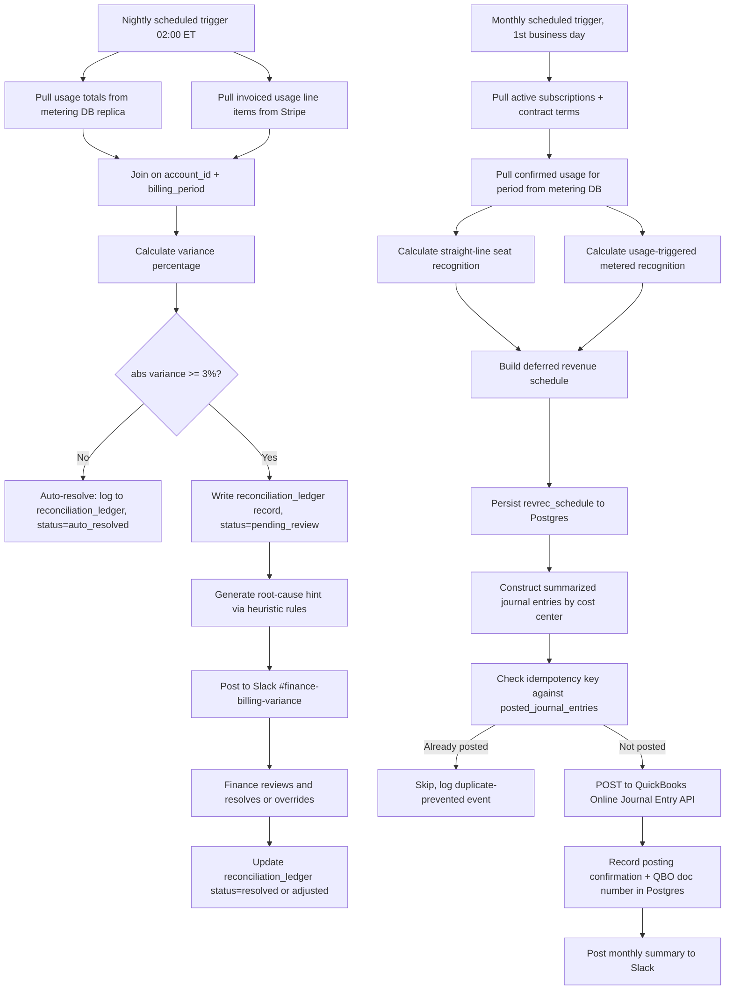
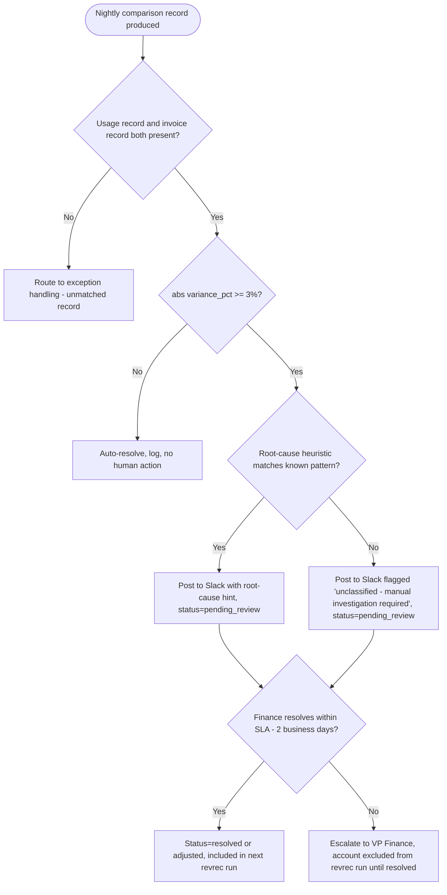
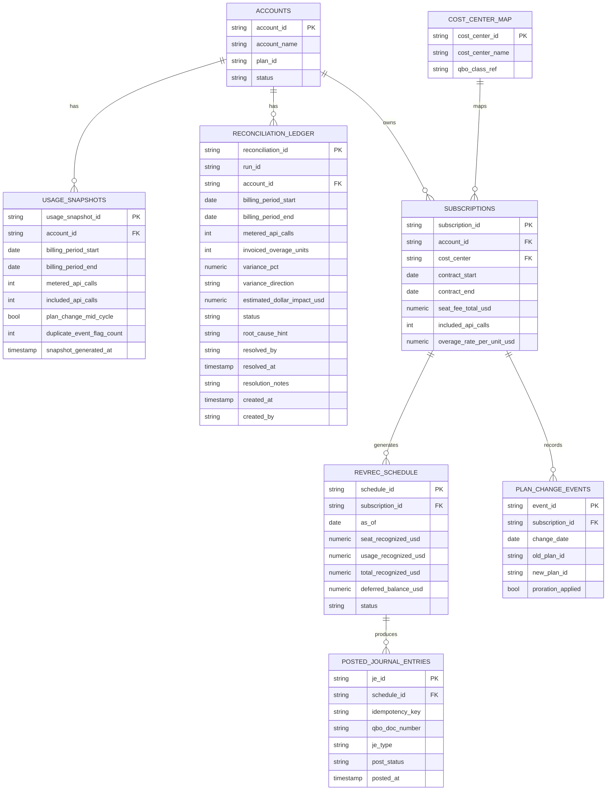
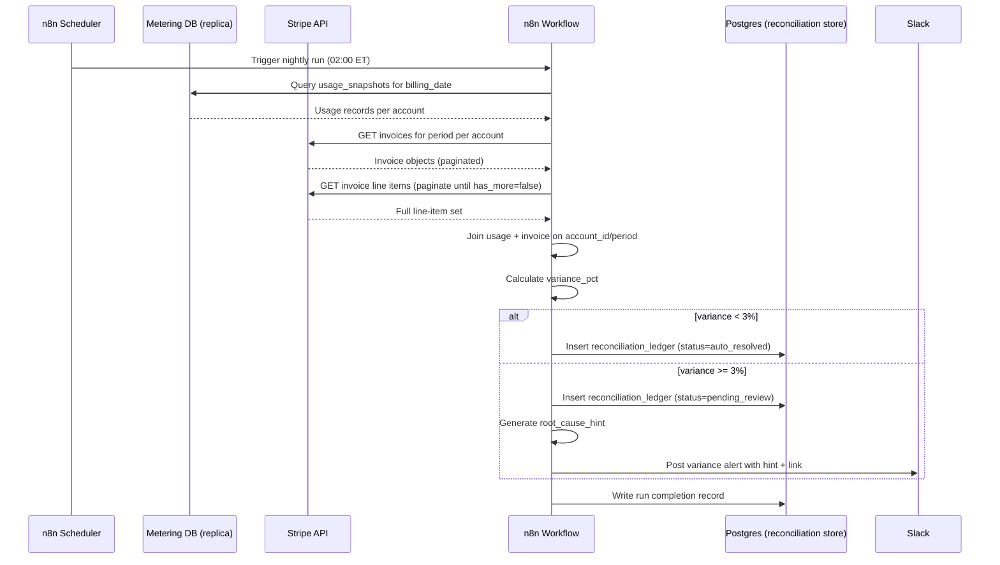
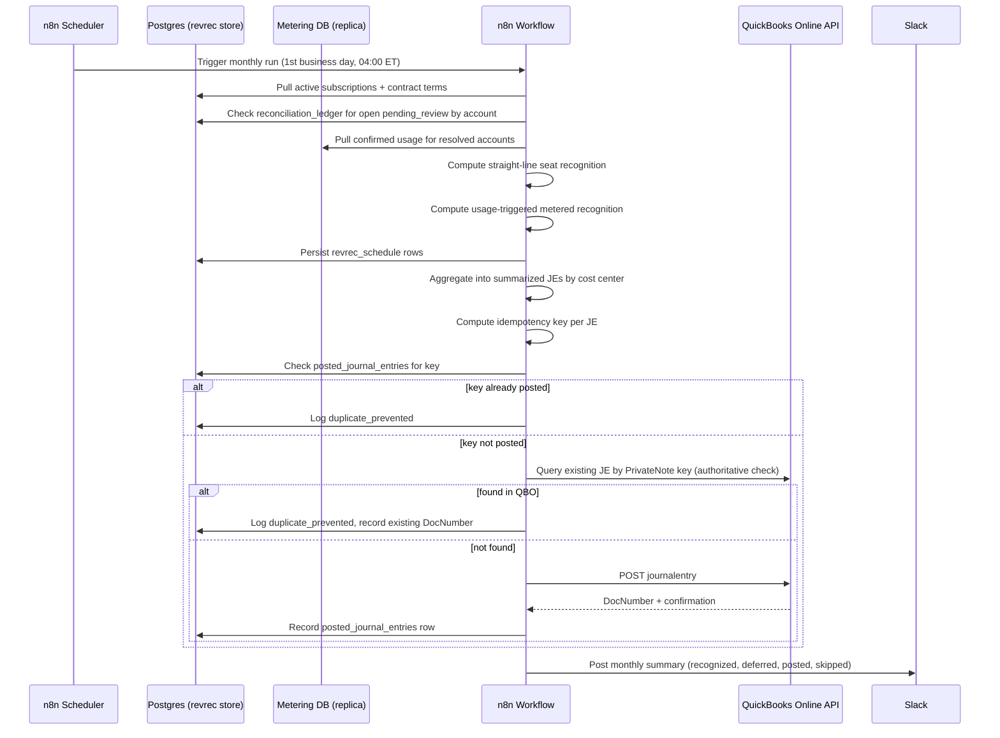

# SOP: Usage-Based Billing Reconciliation & Revenue Recognition Pipeline

**Reference Deployment Context:** Atlas Metrics
**Industry:** B2B Product Analytics SaaS
**Owning Section:** 14 SaaS
**SOP ID:** SAAS-04
**Version:** 1.0
**Last Updated:** 2026-06-30
**Author:** Automation Architecture Practice
**Classification:** Client-Facing
**Video Walkthrough:** _Pending recording — see script in this SOP's project folder._
**Real Build Artifacts:** [Importable n8n workflow, runnable automation script, and executable database schema →](build/README.md)

## Table of Contents

1. [Purpose](#1-purpose)
2. [Business Problem](#2-business-problem)
3. [Business Goals](#3-business-goals)
4. [Business Requirements](#4-business-requirements)
5. [Functional Requirements](#5-functional-requirements)
6. [Technical Requirements](#6-technical-requirements)
7. [Dependencies](#7-dependencies)
8. [Systems Used](#8-systems-used)
9. [Roles](#9-roles)
10. [Responsibilities](#10-responsibilities)
11. [Workflow Overview](#11-workflow-overview)
12. [Detailed Workflow Steps](#12-detailed-workflow-steps)
13. [Decision Tree](#13-decision-tree)
14. [Automation Logic](#14-automation-logic)
15. [Trigger Conditions](#15-trigger-conditions)
16. [Data Validation](#16-data-validation)
17. [Error Handling](#17-error-handling)
18. [Retry Logic](#18-retry-logic)
19. [Fallback Procedures](#19-fallback-procedures)
20. [Manual Override](#20-manual-override)
21. [Exception Handling](#21-exception-handling)
22. [Notifications](#22-notifications)
23. [Audit Logs](#23-audit-logs)
24. [Security](#24-security)
25. [Permissions](#25-permissions)
26. [Compliance](#26-compliance)
27. [Performance Metrics](#27-performance-metrics)
28. [KPIs](#28-kpis)
29. [Testing Procedure](#29-testing-procedure)
30. [Deployment](#30-deployment)
31. [Maintenance](#31-maintenance)
32. [Version History](#32-version-history)
33. [Future Improvements](#33-future-improvements)
34. [Appendix](#34-appendix)
35. [Troubleshooting](#35-troubleshooting)
36. [Recovery Procedure](#36-recovery-procedure)
37. [Frequently Asked Questions](#37-frequently-asked-questions)
38. [Technical Notes](#38-technical-notes)
39. [Business Notes](#39-business-notes)
40. [Estimated Time Savings](#40-estimated-time-savings)
41. [ROI Analysis](#41-roi-analysis)
42. [Risk Assessment](#42-risk-assessment)
43. [Lessons Learned](#43-lessons-learned)
44. [Related SOPs](#44-related-sops)

---

## 1. Purpose

This SOP documents the nightly billing reconciliation and monthly revenue recognition pipeline built for Atlas Metrics, a B2B product analytics SaaS company that bills customers on a hybrid model: a fixed per-seat subscription fee plus metered overage for API calls consumed beyond each plan's included allotment. The workflow closes the gap between what the application's internal usage metering system records as consumed and what Stripe actually invoices, flags material discrepancies for Finance review, and independently drives a defensible, ASC 606-compliant revenue recognition schedule that posts summarized journal entries to QuickBooks Online. The system exists to give Finance a repeatable, auditable answer to two questions every month: "did we bill what customers actually used," and "did we recognize revenue in the period we were contractually entitled to recognize it."

## 2. Business Problem

Atlas Metrics' billing pipeline computes usage totals in the application's metering database, but the actual invoice sent to a customer is generated inside Stripe based on a separate usage-record submission process (Stripe Billing metered subscription items). Any divergence between the two — a usage event double-counted before submission, a plan change mid-cycle that wasn't prorated correctly, a Stripe usage-record push that silently failed and left a period under-reported — produces invoices that don't match actual consumption, and nobody was systematically checking for it. Prior to this engagement, reconciliation was an ad hoc, quarterly spreadsheet exercise performed by a Finance analyst pulling CSV exports from both systems by hand.

Quantified before-state (trailing 6 months prior to engagement, per client-provided billing audit):
- Estimated monthly revenue leakage: **$38,400–$54,000** across ~640 metered accounts, concentrated in accounts with mid-cycle plan changes and enterprise accounts with negotiated overage tiers.
- **17.6%** of metered accounts carried an unreconciled usage-vs-invoice variance greater than 3% in any given billing period, with no systematic detection until the quarterly manual pass.
- Atlas Metrics' external auditor issued a management letter comment during the prior fiscal year-end review flagging that usage-based revenue recognition lacked a documented, repeatable methodology tying recognized revenue back to underlying usage data — a control deficiency under ASC 606, specifically around variable consideration allocation (ASC 606-10-32-40) and the company's ability to demonstrate that recognized revenue in each period reflects actual delivery of the metered service.
- Month-end close took Finance an average of **6.5 business days**, with 2–3 of those days consumed by manual usage-to-invoice tie-outs and manual construction of the deferred revenue schedule in a spreadsheet.

## 3. Business Goals

- Eliminate silent revenue leakage from unbilled or under-billed usage by detecting variance within 24 hours of period close rather than at quarter-end.
- Give Finance a documented, repeatable, system-generated revenue recognition schedule that satisfies auditor requirements for ASC 606 variable consideration support.
- Reduce month-end close time attributable to usage billing tie-outs and revenue schedule construction.
- Create an audit trail connecting every recognized-revenue dollar back to the specific usage records and invoice line items that justify it.
- Reduce the volume of low-value manual reconciliation work (rounding, proration noise) so Finance analyst time is spent only on variances that represent real risk.

## 4. Business Requirements

- **BR-1:** The system must compare, for every metered account and every billing period, the usage recorded internally against the usage actually invoiced by Stripe.
- **BR-2:** The system must distinguish immaterial variance (safe to auto-resolve) from material variance (requires human judgment) using a consistent, documented threshold.
- **BR-3:** Material variances must reach a Finance reviewer with enough context to diagnose the root cause without re-deriving the comparison from scratch.
- **BR-4:** The system must independently produce a revenue recognition schedule for each subscription that separates the straight-line seat component from the usage-triggered metered component.
- **BR-5:** Recognized and deferred revenue must be posted to the general ledger (QuickBooks Online) in a form the auditor can trace back to source usage and billing data.
- **BR-6:** Financial postings must never be duplicated, even if the automation retries after a partial failure.
- **BR-7:** Finance must be able to manually adjust a flagged variance and have that adjustment reflected in downstream reporting and the audit trail.

## 5. Functional Requirements

- **FR-1:** A nightly n8n workflow pulls per-account usage totals from the metering database and per-account invoiced usage from the Stripe Invoice Line Items API for the corresponding billing period.
- **FR-2:** The workflow calculates a variance percentage per account: `(invoiced_usage - metered_usage) / metered_usage`.
- **FR-3:** Variances with `abs(variance_pct) < 3%` are logged as auto-resolved reconciliation records with no human action required.
- **FR-4:** Variances with `abs(variance_pct) >= 3%` are written to the Postgres reconciliation ledger with status `pending_review` and posted to a Slack Finance channel with root-cause hints derived from rule-based heuristics.
- **FR-5:** A monthly n8n workflow computes, for each active subscription, a recognized-revenue-per-day schedule: straight-line allocation for the seat/platform fee across the contract period, and usage-triggered recognition for the metered overage component based on actual consumption in the period.
- **FR-6:** The monthly job persists the resulting deferred revenue schedule to Postgres and posts summarized journal entries (deferred revenue debit/credit, recognized revenue recognition) to QuickBooks Online via the Journal Entry API, tagged by cost center.
- **FR-7:** All QuickBooks postings carry a deterministic idempotency key derived from subscription ID, period, and journal entry type to prevent duplicate postings on retry.
- **FR-8:** Finance can manually override a `pending_review` reconciliation record's resolution and disposition through a documented Postgres update path, with the override attributed to a named user and timestamped.

**Traceability table**

| BR ID | FR ID | Description |
|---|---|---|
| BR-1 | FR-1 | Nightly pull of metering DB and Stripe invoice data per account/period |
| BR-2 | FR-2, FR-3 | Variance calculation and 3% auto-resolve threshold |
| BR-3 | FR-4 | Slack routing to Finance with root-cause hints |
| BR-4 | FR-5 | Straight-line + usage-triggered revenue recognition split |
| BR-5 | FR-6 | Summarized JE posting to QuickBooks Online, tagged by cost center |
| BR-6 | FR-7 | Idempotency key strategy for QBO postings |
| BR-7 | FR-8 | Manual override path for Finance review queue |

## 6. Technical Requirements

- n8n: self-hosted, version 1.4x or later, with the Postgres, HTTP Request, and Slack nodes; scheduled trigger nodes configured in the instance's server timezone (UTC) with explicit conversion to Atlas Metrics' billing timezone (America/New_York) for period-boundary calculations.
- Stripe API: version pinned via `Stripe-Version` header (`2024-06-20` or later); Invoice and Invoice Line Item retrieval via `GET /v1/invoices` and `GET /v1/invoices/{id}/lines`, paginated with `starting_after` cursors — see Section 17 for the pagination failure mode this SOP specifically guards against.
- Metering database: read-only replica access only; the nightly job never queries the primary usage-ingestion database directly, to avoid any lock contention with the live metering pipeline. Replica lag budget: must be under 15 minutes at job run time (see Section 17, Scenario 1).
- PostgreSQL: version 14+, hosts the `reconciliation_ledger` and `revrec_schedule` schemas described in Section 34 (Appendix). Row-level audit columns (`created_at`, `created_by`, `updated_at`, `updated_by`) mandatory on every table.
- QuickBooks Online API: v3, OAuth 2.0 with refresh-token rotation; Journal Entry endpoint `POST /v3/company/{realmId}/journalentry`. Sandbox company used for all testing (see Section 29).
- Rate limits: Stripe (100 read requests/sec in live mode, well above this workflow's volume); QuickBooks Online (500 requests per minute per realm, throttled further by Intuit's per-app fair-use policy — this workflow batches journal entries to stay under 40 requests per monthly run).
- Latency budget: nightly reconciliation job must complete within a 90-minute window (02:00–03:30 America/New_York) to finish before Finance's first login at 07:00.
- Uptime target for the n8n orchestration instance: 99.5% monthly, consistent with the shared platform SLA used across all Atlas Metrics automations.
- Data residency: all usage and billing data remains in the client's existing AWS us-east-1 region; no usage or financial data is processed by n8n nodes configured to call non-US endpoints.

## 7. Dependencies

- Upstream usage-event pipeline (shared with SAAS-01) must have completed its nightly aggregation job before this reconciliation job runs, so per-account usage totals for the closed billing day are finalized in the metering database.
- Stripe's usage-record submission process (a separate, pre-existing internal job not covered by this SOP) must have pushed the current period's metered usage to Stripe before invoices are finalized; this SOP consumes Stripe's invoiced amounts as a given, it does not control how Stripe usage records are submitted.
- QuickBooks Online chart of accounts must have stable account IDs for "Deferred Revenue — Subscription," "Recognized Revenue — Seats," and "Recognized Revenue — Usage" before the monthly job's first run; account ID changes require a corresponding update to the n8n workflow's static mapping table.
- Cost center tagging depends on an accurate, current mapping between Atlas Metrics subscription IDs and internal cost center codes, maintained by Finance in a Postgres reference table (`cost_center_map`).
- Slack workspace channel `#finance-billing-variance` must exist with the correct membership before go-live; channel renames require an update to the n8n Slack node configuration.

## 8. Systems Used

| System | Role in Workflow | Auth Method |
|---|---|---|
| n8n | Orchestrates nightly reconciliation ETL and monthly revenue recognition job; hosts all transformation and branching logic | API Key (internal instance, network-restricted) |
| Metering database (PostgreSQL, internal) | Source-of-truth for internal API call counts per account per billing period | Read-only DB credential via replica connection string |
| Stripe | Billing system of record — actual invoiced amounts and usage line items per account per period | API Key (restricted, read-only scope) |
| PostgreSQL (reconciliation store) | Hosts `reconciliation_ledger` and `revrec_schedule` — the persistent record of every comparison, variance, and recognition schedule | Username/password over TLS, network-restricted to n8n host |
| QuickBooks Online | Journal entry posting for recognized and deferred revenue, tagged by cost center | OAuth 2.0 (refresh-token rotation) |
| Slack | Variance alerts routed to Finance review queue; monthly revrec run summary notifications | OAuth 2.0 (bot token, scoped to `#finance-billing-variance`) |

## 9. Roles

- **Business owner:** VP of Finance, Atlas Metrics — accountable for the accuracy of recognized revenue and for auditor sign-off.
- **Technical owner:** Automation Architecture Practice (this engagement's delivery team) — accountable for the n8n workflow, Postgres schema, and integration health.
- **Escalation contact (Finance):** Senior Revenue Accountant — first responder for the Slack variance queue and the monthly revrec run.
- **Escalation contact (Engineering):** Atlas Metrics platform engineering lead — first responder for metering database issues (replication lag, schema drift) that surface as false variances.

## 10. Responsibilities

| Role | Responsibility |
|---|---|
| VP of Finance | Owns the 3% materiality threshold and approves any change to it; signs off on the monthly revrec journal entry batch before or immediately after posting |
| Senior Revenue Accountant | Triages the Slack variance queue daily; resolves or escalates `pending_review` records; performs manual overrides per Section 20 |
| Platform Engineering Lead | Owns metering database health, replica lag, and schema stability; first point of contact for Scenario 1/2 style false-variance investigations |
| Automation Architecture Practice | Owns the n8n workflow, Postgres reconciliation schema, QuickBooks integration, and this SOP's currency |
| Auditor (external) | Reviews the reconciliation ledger and revrec schedule quarterly as part of ASC 606 substantive testing |

## 11. Workflow Overview

The system runs two independent but related automations against the same underlying usage and billing data: a **nightly reconciliation job** that detects billing drift, and a **monthly revenue recognition job** that produces the GL-facing recognition schedule. Both are documented together because they share data models and because material reconciliation findings from the nightly job can affect the inputs to the monthly job (an under-billed account, once corrected, changes the usage-triggered recognition amount).



## 12. Detailed Workflow Steps

1. **Tool:** n8n Schedule Trigger. **Trigger:** Cron `0 2 * * *` (02:00 America/New_York). **Action:** Initiate nightly reconciliation run. **Input:** none (time-based). **Output:** run context object with `run_id`, `billing_date` (previous calendar day). **Error handling ref:** Section 17, Scenario 1.

2. **Tool:** n8n Postgres node (metering DB replica). **Action:** Query `SELECT account_id, billing_period_start, billing_period_end, api_call_count, plan_id FROM usage_snapshots WHERE billing_period_end = :billing_date`. **Input schema:** `billing_date`. **Transformation:** none at this stage, raw pull. **Output schema:** array of usage records (see Section 34 for full field list). **Condition branches:** if zero rows returned for an expected active account, flag as a data-completeness exception (Section 21). **Error handling ref:** Section 17, Scenario 1.

3. **Tool:** n8n HTTP Request node (Stripe API). **Action:** For each account's Stripe customer ID, call `GET /v1/invoices?customer={id}&status=paid&created[gte]={period_start}&created[lte]={period_end}`, then `GET /v1/invoices/{invoice_id}/lines` paginated. **Input schema:** Stripe customer ID, period bounds. **Transformation:** flatten paginated line items into a single per-invoice array; sum metered usage line items by `price.metadata.usage_type`. **Output schema:** normalized invoice usage object. **Condition branches:** pagination not exhausted (has_more=true not followed) triggers Scenario 2 detection logic. **Error handling ref:** Section 17, Scenario 2.

4. **Tool:** n8n Function node. **Action:** Join metering records to Stripe invoice records on `account_id` + `billing_period`. **Transformation:** compute `variance_pct` per the formula in Section 14. **Output schema:** joined comparison record. **Condition branches:** unmatched records (usage record with no corresponding invoice, or vice versa) routed to Section 21 exception handling rather than silently dropped.

5. **Tool:** n8n IF node. **Action:** Branch on `abs(variance_pct) >= 0.03`. **Output:** two paths — auto-resolve and review-required.

6. **Tool:** n8n Postgres node (reconciliation store). **Action:** Insert into `reconciliation_ledger` with `status = 'auto_resolved'` for the low-variance path, or `status = 'pending_review'` for the high-variance path. **Input schema:** joined comparison record. **Output schema:** persisted reconciliation record with generated `reconciliation_id`.

7. **Tool:** n8n Function node. **Action:** For `pending_review` records, apply root-cause heuristic rules (see Section 14) to generate a `root_cause_hint` string. **Transformation:** pattern-match on plan-change history, usage-event duplication flags, and proration indicators pulled from the metering DB's audit trail.

8. **Tool:** n8n Slack node. **Action:** Post formatted message to `#finance-billing-variance` with account name, variance %, dollar impact, and root-cause hint, linking to the Postgres `reconciliation_id`. **Error handling ref:** Section 22 (Notifications).

9. **Tool:** Finance analyst (manual, Slack + Postgres). **Action:** Reviews flagged variance, resolves or manually adjusts per Section 20. **Output:** `reconciliation_ledger.status` updated to `resolved` or `adjusted`, with `resolved_by` and `resolution_notes` populated.

10. **Tool:** n8n Schedule Trigger. **Trigger:** Cron `0 4 1 * *` (1st of month, 04:00 America/New_York, first business day check via a holiday-calendar lookup table). **Action:** Initiate monthly revenue recognition run.

11. **Tool:** n8n Postgres node. **Action:** Pull all subscriptions active in the closed period with contract value, seat count, and plan terms. **Output schema:** subscription contract array.

12. **Tool:** n8n Postgres node (metering DB replica). **Action:** Pull confirmed, reconciled usage totals for the period (using `reconciliation_ledger.status IN ('auto_resolved','resolved','adjusted')` records only — `pending_review` records block that account from the run; see Section 21).

13. **Tool:** n8n Function node. **Action:** Compute straight-line seat recognition and usage-triggered metered recognition per Section 14's formulas. **Output schema:** per-subscription recognition schedule with daily recognized amounts and remaining deferred balance.

14. **Tool:** n8n Postgres node. **Action:** Persist schedule to `revrec_schedule`.

15. **Tool:** n8n Function node. **Action:** Aggregate per-subscription recognition amounts into summarized journal entries grouped by cost center. **Output schema:** QuickBooks Journal Entry payload (Section 34).

16. **Tool:** n8n Function node. **Action:** Compute idempotency key (`sha256(subscription_batch_id + period + je_type)`), check against `posted_journal_entries` table.

17. **Tool:** n8n HTTP Request node (QuickBooks Online API). **Action:** `POST /v3/company/{realmId}/journalentry` for each unposted summarized entry, only if idempotency check passes. **Error handling ref:** Section 17, Scenarios 4 and 5; Section 18.

18. **Tool:** n8n Postgres node. **Action:** Record QBO `DocNumber` and posting confirmation against the journal entry record. **Output:** closed-loop audit trail linking `revrec_schedule` rows to the QBO `DocNumber`.

19. **Tool:** n8n Slack node. **Action:** Post monthly run summary (total recognized, total deferred, entries posted, entries skipped as duplicate-prevented) to `#finance-billing-variance`.

## 13. Decision Tree



## 14. Automation Logic

### 14.1 Variance calculation

```python
from dataclasses import dataclass
from decimal import Decimal, ROUND_HALF_UP


@dataclass
class UsageRecord:
    account_id: str
    billing_period_start: str
    billing_period_end: str
    metered_api_calls: int
    plan_id: str


@dataclass
class InvoicedUsage:
    account_id: str
    billing_period_start: str
    billing_period_end: str
    invoiced_overage_units: int
    invoiced_overage_amount_usd: Decimal
    invoice_id: str


VARIANCE_THRESHOLD_PCT = Decimal("0.03")  # 3% materiality threshold, VP Finance-approved


def calculate_variance(usage: UsageRecord, invoiced: InvoicedUsage) -> dict:
    """Compare internal metered usage to what Stripe actually invoiced.

    Variance is expressed as (invoiced - metered) / metered. A positive
    variance means Stripe invoiced more than internal metering recorded
    (overbilling risk); a negative variance means Stripe invoiced less
    than metering recorded (revenue leakage — the primary risk this
    workflow was built to catch).
    """
    if usage.metered_api_calls == 0:
        # Avoid division by zero; treat any invoiced overage against zero
        # metered usage as a 100% variance requiring review, not an
        # auto-resolve, regardless of dollar size.
        variance_pct = Decimal("1.00") if invoiced.invoiced_overage_units > 0 else Decimal("0.00")
    else:
        variance_pct = (
            Decimal(invoiced.invoiced_overage_units - usage.metered_api_calls)
            / Decimal(usage.metered_api_calls)
        ).quantize(Decimal("0.0001"), rounding=ROUND_HALF_UP)

    requires_review = abs(variance_pct) >= VARIANCE_THRESHOLD_PCT

    return {
        "account_id": usage.account_id,
        "billing_period_start": usage.billing_period_start,
        "billing_period_end": usage.billing_period_end,
        "metered_api_calls": usage.metered_api_calls,
        "invoiced_overage_units": invoiced.invoiced_overage_units,
        "variance_pct": str(variance_pct),
        "status": "pending_review" if requires_review else "auto_resolved",
    }


def generate_root_cause_hint(account_id: str, variance_pct: Decimal, context: dict) -> str:
    """Rule-based heuristics for the most common known drivers of variance.

    `context` carries flags pulled from the metering DB's audit trail:
    plan_change_mid_cycle, duplicate_event_flag_count, proration_applied.
    """
    if context.get("plan_change_mid_cycle") and not context.get("proration_applied"):
        return "Plan change mid-cycle not prorated — check subscription upgrade/downgrade timestamp against invoice line item split."
    if context.get("duplicate_event_flag_count", 0) > 0:
        return f"Usage event double-counted — {context['duplicate_event_flag_count']} duplicate event IDs detected in metering audit trail."
    if variance_pct < 0:
        return "Metered usage exceeds invoiced amount — possible missed Stripe usage-record submission for this period."
    return "Unclassified variance — no known heuristic matched; manual investigation required."
```

### 14.2 Revenue recognition split (straight-line + usage-triggered)

```python
from dataclasses import dataclass
from datetime import date
from decimal import Decimal, ROUND_HALF_UP


@dataclass
class SubscriptionContract:
    subscription_id: str
    cost_center: str
    contract_start: date
    contract_end: date
    seat_fee_total_usd: Decimal        # total contracted seat/platform fee for the period
    included_api_calls: int
    overage_rate_per_unit_usd: Decimal


def straight_line_seat_recognition(contract: SubscriptionContract, as_of: date) -> Decimal:
    """Recognize the seat/platform component evenly across the contract term.

    ASC 606-10-25-31: recognize revenue for a distinct service transferred
    over time using a measure that depicts performance — for a flat-fee
    access-to-platform obligation, straight-line time elapsed is the
    appropriate output/input method absent evidence of uneven delivery.
    """
    total_days = (contract.contract_end - contract.contract_start).days + 1
    if total_days <= 0:
        raise ValueError(f"Invalid contract term for subscription {contract.subscription_id}")

    daily_rate = (contract.seat_fee_total_usd / Decimal(total_days)).quantize(
        Decimal("0.0001"), rounding=ROUND_HALF_UP
    )
    days_elapsed = max(0, min((as_of - contract.contract_start).days + 1, total_days))
    return (daily_rate * days_elapsed).quantize(Decimal("0.01"), rounding=ROUND_HALF_UP)


def usage_triggered_recognition(
    contract: SubscriptionContract, confirmed_usage_units: int
) -> Decimal:
    """Recognize the metered overage component when the usage event occurs.

    ASC 606-10-32-40 (variable consideration allocated to a series of
    distinct services): overage revenue is recognized in the period the
    usage occurs, not straight-lined, because the customer's consumption
    pattern — not the passage of time — is the faithful depiction of
    performance for the metered component.
    """
    overage_units = max(0, confirmed_usage_units - contract.included_api_calls)
    return (Decimal(overage_units) * contract.overage_rate_per_unit_usd).quantize(
        Decimal("0.01"), rounding=ROUND_HALF_UP
    )


def build_recognition_schedule(
    contract: SubscriptionContract, as_of: date, confirmed_usage_units: int
) -> dict:
    """Combine both components into the period's recognized and deferred amounts."""
    seat_recognized = straight_line_seat_recognition(contract, as_of)
    usage_recognized = usage_triggered_recognition(contract, confirmed_usage_units)
    total_recognized = seat_recognized + usage_recognized
    deferred_balance = (contract.seat_fee_total_usd - seat_recognized).quantize(
        Decimal("0.01"), rounding=ROUND_HALF_UP
    )

    return {
        "subscription_id": contract.subscription_id,
        "cost_center": contract.cost_center,
        "as_of": as_of.isoformat(),
        "seat_recognized_usd": str(seat_recognized),
        "usage_recognized_usd": str(usage_recognized),
        "total_recognized_usd": str(total_recognized),
        "deferred_balance_usd": str(deferred_balance),
    }
```

## 15. Trigger Conditions

Two independent triggers drive this SOP:

- **Nightly reconciliation trigger:** n8n Schedule Trigger, cron `0 2 * * *`, America/New_York. No manual trigger path exists in production; a manual re-run capability is documented in Section 20 for backfill scenarios.
- **Monthly revenue recognition trigger:** n8n Schedule Trigger, cron `0 4 1 * *`, with a holiday-calendar lookup that shifts the run to the next business day if the 1st falls on a weekend or bank holiday.

Trigger payload schema (internal n8n execution context, not an external webhook):

```json
{
  "run_type": "nightly_reconciliation",
  "run_id": "recon-2026-06-29-01",
  "billing_date": "2026-06-29",
  "triggered_at": "2026-06-30T06:00:00Z",
  "trigger_source": "schedule"
}
```

```json
{
  "run_type": "monthly_revrec",
  "run_id": "revrec-2026-06-01",
  "period_start": "2026-06-01",
  "period_end": "2026-06-30",
  "triggered_at": "2026-07-01T08:00:00Z",
  "trigger_source": "schedule"
}
```

## 16. Data Validation

| Field | Rule | Failure Action |
|---|---|---|
| `account_id` (usage record) | Must exist in `accounts` reference table and be status `active` | Route to exception handling; exclude from variance calc, log data-integrity warning |
| `metered_api_calls` | Must be a non-negative integer | Reject record, alert Platform Engineering (likely metering pipeline bug) |
| `invoiced_overage_units` | Must be a non-negative integer | Reject record, flag as Stripe data-quality exception |
| `billing_period_start` / `billing_period_end` | Must form a valid, non-overlapping period consistent with the account's billing cycle | Reject record, route to manual review — likely proration or mid-cycle change |
| `variance_pct` | Must be computable (no division by zero without explicit zero-usage handling) | Apply zero-usage branch logic (Section 14.1); never allow an unhandled exception to kill the batch |
| `seat_fee_total_usd` (contract) | Must be > 0 for any active subscription | Exclude subscription from revrec run, alert Finance — contract data integrity issue |
| `contract_end` | Must be >= `contract_start` | Reject contract record, alert Finance; block that subscription's revrec entry until corrected |
| QBO journal entry payload | Debits must equal credits before submission | Block API call, log internal validation failure — never send an unbalanced JE to QuickBooks |
| Idempotency key | Must be unique per (subscription_batch_id, period, je_type) | If a collision is found against `posted_journal_entries`, skip posting and log duplicate-prevented event |

## 17. Error Handling

**Scenario 1 — Metering database replication lag causes a false variance.**
*Detection:* The nightly job checks replica lag (`pg_stat_replication` lag metric, or an equivalent heartbeat table timestamp) before querying usage data. If lag exceeds 15 minutes, or if a spot-check comparison of a control account's running total against a known checkpoint shows a gap, the run flags a "stale replica" warning.
*Response:* The job aborts the nightly comparison for that run, logs the aborted run to `reconciliation_ledger` with status `deferred_stale_source`, and retries automatically at 03:00 (one retry window before the 03:30 completion deadline). If still stale, the run is skipped entirely for the night and Platform Engineering is paged; no variance records are written from stale data, because a false variance triggered by lag — not real drift — would waste Finance review time and erode trust in the alert queue.

**Scenario 2 — Stripe API pagination bug undercounts invoice line items.**
*Detection:* The invoice line-item fetch step explicitly checks the `has_more` flag on every paginated response. A secondary control sums the `amount` fields of retrieved line items and compares the sum against the invoice's `total` field (from the parent invoice object, not derived from line items) — any mismatch beyond a one-cent rounding allowance indicates an incomplete pull.
*Response:* If `has_more` is true but the loop terminated (e.g., due to a node timeout), or if the sum-check fails, the run does not proceed to variance calculation for that invoice. It logs an `incomplete_source_data` exception, retries the full paginated fetch up to 3 times with backoff, and if still incomplete, excludes that account from the night's variance batch and notifies Finance via Slack that the account's reconciliation is delayed pending a complete data pull — never surfaces a variance calculated against partial invoice data.

**Scenario 3 — Mid-cycle plan change not accounted for in the recognition schedule.**
*Detection:* The monthly revrec job cross-references each subscription's `contract_start`/`contract_end` against a `plan_change_events` table. If a plan change occurred within the period being recognized and the contract record used by the job has not been split into pre-change and post-change sub-periods, the seat fee total used in the straight-line calculation will not match the sum of the two plan tiers' prorated fees — a validation check compares the contract's `seat_fee_total_usd` against the sum of Stripe's actual invoiced seat-fee line items for the period.
*Response:* On mismatch, the subscription is excluded from that month's automated posting, flagged in `revrec_schedule` with status `needs_manual_split`, and routed to Finance with the plan-change date and both tiers' fee amounts so the analyst can manually construct the split recognition entry, which is then loaded back into `revrec_schedule` before the summarized JE is built.

**Scenario 4 — QuickBooks Online API auth/token expiry during posting.**
*Detection:* A `401` response from the Journal Entry endpoint, or a proactive check that the stored OAuth refresh token's last-refreshed timestamp exceeds Intuit's 100-day refresh token lifetime minus a 5-day safety buffer.
*Response:* The workflow attempts an automatic token refresh using the stored refresh token before any posting begins each run (not reactively, to avoid a mid-batch failure). If the proactive refresh itself fails (refresh token expired or revoked), the entire posting batch is halted before any journal entries are sent — partial batches are never posted — and an urgent Slack alert with `@here` is sent to Finance and the technical owner, since this blocks month-end close entirely until re-authorization is completed manually in the QuickBooks admin console.

**Scenario 5 — A journal entry posted twice due to a retried job.**
*Detection:* Every journal entry batch is built with a deterministic idempotency key (Section 18) checked against the `posted_journal_entries` table immediately before the HTTP call. If the workflow crashes or times out after a successful POST but before the confirmation write completes, a re-run would otherwise attempt to post the same entry again.
*Response:* Before every posting attempt, the workflow queries QuickBooks Online for existing journal entries matching the idempotency key stored in the `PrivateNote` field (QBO does not have a native idempotency-key field, so this SOP uses `PrivateNote` as the durable key carrier — see Section 38). If a match is found, the posting is skipped and logged as `duplicate_prevented` rather than retried. This check is the primary control; the local `posted_journal_entries` table is a secondary, faster-path control that avoids the QBO lookup call in the common case.

**Scenario 6 — Unmatched records: usage exists with no corresponding Stripe invoice.**
*Detection:* The join step in the nightly job explicitly checks for orphaned usage records (an active account with metered usage but no invoice found for the period) and orphaned invoice records (an invoice with no corresponding usage snapshot — e.g., a manually created invoice or a credit memo).
*Response:* Orphaned usage records are the highest-priority case, since they represent potential unbilled usage — these are written to `reconciliation_ledger` with status `pending_review` and a root-cause hint of "no invoice found — possible missed billing cycle," regardless of dollar threshold (the 3% rule does not apply when there is nothing to compare against). Orphaned invoice records are logged for informational review but do not block the run.

## 18. Retry Logic

- **Stripe API calls:** exponential backoff starting at 2 seconds, doubling up to a maximum of 5 attempts (2s, 4s, 8s, 16s, 32s), retried only on `429` (rate limit) and `5xx` responses. `4xx` responses other than `429` are not retried — they indicate a request-shape problem that a retry will not fix, and are routed to exception handling instead.
- **Metering database queries:** 3 retry attempts with a fixed 10-second interval, since transient replica connection issues typically resolve within that window; a 4th failure escalates to Scenario 1 handling.
- **QuickBooks Online Journal Entry posting — critical path, idempotency-key governed:**
  - Idempotency key = `sha256(subscription_batch_id + ":" + period_end_date + ":" + je_type)`, where `je_type` is one of `deferred_revenue`, `recognized_revenue_seat`, `recognized_revenue_usage`.
  - The key is written into the JE payload's `PrivateNote` field as `IDEMPOTENCY_KEY:{key}` before every POST attempt.
  - Before posting, the workflow queries `SELECT 1 FROM posted_journal_entries WHERE idempotency_key = :key` (local fast-path check) AND, for the first posting attempt of each run only, a QBO query `SELECT * FROM JournalEntry WHERE PrivateNote LIKE '%{key}%'` (authoritative check, guards against a crash between a successful prior POST and the local table write).
  - If either check finds an existing entry, the POST is skipped, and the run logs `duplicate_prevented` with a reference to the pre-existing `DocNumber`.
  - If no existing entry is found, the workflow posts once. On a network-level failure (timeout, connection reset) where the response status is unknown, the workflow does **not** blindly retry — it re-runs the QBO authoritative existence check first, and only posts if the check confirms no entry exists. This sequencing (check-then-post, re-check-before-retry) is the core control that prevents double-posting; a naive "retry on any failure" strategy is explicitly disallowed for this integration given the financial-statement impact of a duplicate JE.
  - Maximum 3 posting attempts per journal entry per run; after 3 failed attempts (excluding duplicate-prevented outcomes), the entry is left unposted, logged with status `posting_failed`, and escalated per Section 19.
- **Slack notifications:** best-effort, 2 retries with a 5-second fixed interval; a failure to notify does not block or roll back any underlying data operation — the reconciliation or revrec record is always persisted to Postgres regardless of notification delivery success, and a daily digest job cross-checks for any `pending_review` record without a corresponding Slack message and re-sends it.

## 19. Fallback Procedures

- If the nightly reconciliation job cannot complete within its 90-minute window (e.g., due to repeated Stripe pagination retries across many accounts), the job checkpoints progress per account and resumes from the last completed account on the next scheduled run rather than restarting from zero — no account's usage data is re-pulled and re-compared once a comparison record already exists for that `run_id`.
- If the monthly revrec job encounters a subscription it cannot resolve (Scenario 3, or any subscription with `pending_review` reconciliation records still open per Section 21), that subscription is excluded from the current run's journal entry batch and carried to a `revrec_backlog` table. The rest of the batch posts normally — one problem subscription does not block the entire month's close.
- If QuickBooks Online is unreachable for an extended outage (confirmed via Intuit's status page or repeated `5xx` responses across all attempts), the entire monthly posting batch is held in `revrec_schedule` with status `ready_to_post`, and Finance is notified that recognized/deferred revenue figures are available in Postgres for manual review and manual JE entry in QuickBooks if month-end close cannot wait for the automation to recover.
- Degraded mode: if Slack is unavailable, variance detection and auto-resolution continue unaffected (Postgres is the system of record, not Slack); only the human-notification layer degrades, and the daily digest fallback (Section 18) catches up once Slack recovers.

## 20. Manual Override

- Finance (Senior Revenue Accountant or VP of Finance) is the only role authorized to change a `reconciliation_ledger` record's status from `pending_review` to `resolved` or `adjusted`.
- The override path is a documented, audited Postgres update — not a raw SQL free-for-all. The standard override statement is:

```sql
UPDATE reconciliation_ledger
SET status = 'adjusted',
    resolved_by = :finance_user_email,
    resolved_at = now(),
    resolution_notes = :notes,
    adjusted_variance_amount_usd = :corrected_amount
WHERE reconciliation_id = :reconciliation_id
  AND status = 'pending_review';
```

- Every override requires `resolution_notes` to be non-empty — a blank justification is rejected at the application layer (the internal Finance tooling wrapper around this query, not raw psql access for standard users).
- Manual overrides on subscriptions that are also mid-revrec-cycle (Scenario 3-style cases) additionally require the corrected `revrec_schedule` row to be loaded before the monthly job will include that subscription in its posting batch — the override does not automatically recompute the recognition schedule; it unblocks the subscription for inclusion in the next scheduled run.
- A monthly override log is exported and attached to the auditor's quarterly substantive-testing package, so every departure from the automated calculation is visible and justified in the audit trail described in Section 23.
- Direct production database write access outside this documented path is restricted to the technical owner and used only for schema migrations, never for data corrections — data corrections always go through the audited override path above.

## 21. Exception Handling

- **Malformed usage records** (missing `account_id`, negative counts, non-numeric fields) are quarantined into a `usage_ingestion_exceptions` table rather than dropped silently, and excluded from that night's comparison for the affected account; three or more quarantined records for the same account within a rolling 7-day window triggers a Platform Engineering alert, since it suggests a systemic metering bug rather than an isolated bad record.
- **Partial data on Stripe's side** (an invoice in `draft` status at run time, not yet finalized) is treated as "not yet available" rather than as a zero-usage invoice — the account is skipped for that night's run and picked up automatically once the invoice transitions to `open` or `paid` on a subsequent run, since comparing against a draft invoice would produce a meaningless variance.
- **Accounts with `pending_review` reconciliation records at monthly revrec time** are excluded from that month's automated journal entry posting (per Section 12, step 12) until Finance resolves the underlying variance — the system does not guess at a resolution to keep the close on schedule; a subscription entering the `revrec_backlog` is a visible signal, not a silent gap, and is called out by name in the monthly Slack summary.
- **Unexpected subscription states** (e.g., a subscription canceled mid-period with no corresponding `contract_end` update) are caught by the data validation rule in Section 16 (`contract_end >= contract_start`) and routed to Finance rather than allowed to produce a negative-day recognition calculation.
- **Currency or multi-entity edge cases:** Atlas Metrics currently bills exclusively in USD from a single legal entity; the schema and logic in this SOP do not yet handle multi-currency or multi-entity consolidation. Any future expansion into non-USD billing is explicitly out of scope for this version (tracked in Section 33, Future Improvements) and would require a new validation layer before the straight-line/usage-triggered calculations could be trusted.

## 22. Notifications

| Event | Channel | Severity | Recipient |
|---|---|---|---|
| Variance >= 3% detected | Slack `#finance-billing-variance` | Standard | Finance review queue (channel members) |
| Orphaned usage record (unbilled usage) | Slack `#finance-billing-variance` | High (flagged with warning emoji, not blended into standard variance list) | Finance review queue |
| Nightly run aborted (stale replica) | Slack `#finance-billing-variance` + email | High | Finance + Platform Engineering Lead |
| Nightly run fails to complete within window | Slack `#finance-billing-variance` | High | Technical owner |
| QuickBooks auth failure blocking monthly posting | Slack `#finance-billing-variance` with `@here` + email | Urgent | VP Finance + Technical owner |
| Monthly revrec run summary (recognized/deferred totals, entries posted/skipped) | Slack `#finance-billing-variance` | Standard | Finance |
| Subscription excluded from monthly posting (backlog) | Slack `#finance-billing-variance`, named per subscription | Standard | Senior Revenue Accountant |
| Manual override applied | Logged only (no push notification) — visible in weekly override digest | Informational | VP Finance (digest recipient) |

## 23. Audit Logs

- Every reconciliation comparison, whether auto-resolved or flagged, is persisted permanently in `reconciliation_ledger` — no comparison record is ever deleted, only status-transitioned.
- Every revenue recognition calculation is persisted in `revrec_schedule` with the specific usage totals and contract terms used as inputs, so any recognized-revenue figure can be traced back to its source data years after the fact.
- Every QuickBooks Online journal entry posting attempt (successful, duplicate-prevented, or failed) is logged in `posted_journal_entries` with the request payload, response status, `DocNumber` (if successful), and the idempotency key used.
- Every manual override is logged with the acting user's email, timestamp, and free-text justification — never overwritten, only appended to (a new `adjusted` status row is added; the original `pending_review` row's history is preserved via Postgres row versioning triggers, not hard-deleted).
- Retention: reconciliation and revrec audit data is retained for 7 years, aligned to Atlas Metrics' standard financial records retention policy and typical statute-of-limitations exposure for revenue-related disputes.
- This audit trail is the primary artifact reviewed by the external auditor during quarterly ASC 606 substantive testing (Section 26) — the design goal from day one was that the auditor should be able to pick any recognized-revenue dollar on the P&L and trace it to a specific usage snapshot and Stripe invoice line item without asking Finance to reconstruct anything manually.

## 24. Security

- All credentials (Stripe API key, metering DB replica credential, QuickBooks OAuth client secret and refresh token, Slack bot token) are stored in n8n's encrypted credential store, never in plaintext workflow parameters or version-controlled JSON exports.
- The metering database connection is read-only and network-restricted to the n8n host's IP range; no write path exists from this workflow back into the primary metering system.
- Data in transit: all API calls (Stripe, QuickBooks, Slack, Postgres) use TLS 1.2+.
- Data at rest: the Postgres reconciliation store uses disk-level encryption consistent with the client's existing AWS RDS configuration; no additional application-level encryption is applied to the reconciliation or revrec tables, since they contain financial aggregates and account identifiers but no cardholder or full PII payloads.
- PII handling: usage and billing records reference `account_id`, not individual end-user identifiers — this workflow operates at the account/subscription level and does not process customer PII beyond what is already present in Atlas Metrics' Stripe customer records (billing contact name/email), which are not duplicated into the reconciliation ledger beyond a reference ID.
- QuickBooks OAuth refresh tokens are rotated automatically on each use per Intuit's rotation model, and the stored token is re-encrypted on every rotation, not just on initial setup.

## 25. Permissions

| Role | View reconciliation ledger | Trigger manual re-run | Apply manual override | Modify variance threshold | Edit n8n workflow | View QBO postings |
|---|---|---|---|---|---|---|
| VP of Finance | Yes | No | Yes | Yes (approval required) | No | Yes |
| Senior Revenue Accountant | Yes | No | Yes | No | No | Yes |
| Platform Engineering Lead | Yes (read-only) | Yes (for source-data issues only) | No | No | No | No |
| Technical Owner (Automation Practice) | Yes | Yes | No | No | Yes | Yes |
| External Auditor | Yes (read-only, quarterly access grant) | No | No | No | No | Yes (read-only) |

## 26. Compliance

ASC 606 revenue recognition accuracy is the central compliance driver for this SOP's existence — the workflow was commissioned directly in response to the auditor's management letter comment on the prior fiscal year-end review. Specifically:

- **ASC 606-10-25-31** (recognizing revenue as a performance obligation is satisfied over time) governs the straight-line seat-fee recognition: Atlas Metrics' platform access obligation is satisfied continuously over the contract term, and the straight-line method is the appropriate depiction of that pattern absent evidence the customer receives materially more benefit at one point in the term than another.
- **ASC 606-10-32-40** (variable consideration, and the "series" guidance for usage-based fees in a term license) governs the usage-triggered metered recognition: overage revenue is recognized in the period the usage occurs because the customer's consumption — not elapsed time — is what depicts the transfer of value for that component.
- **ASC 606-10-50** (disclosure requirements) is supported by the audit trail in Section 23: the ability to show the auditor a reconciliation between recognized revenue and underlying usage/billing data satisfies the disclosure and substantive-testing expectations the auditor flagged as absent under the prior manual process.
- The workflow does not itself constitute the company's revenue recognition policy — that remains a Finance/accounting policy decision documented separately — but it is the system of record that operationalizes the policy consistently, replacing a spreadsheet process the auditor could not rely on as a repeatable control.
- SOC 2 relevance: this workflow touches financial reporting data and is in scope for Atlas Metrics' SOC 2 Type II control environment under the "Processing Integrity" and "Confidentiality" trust service criteria; the retry/idempotency controls in Section 18 and the audit logging in Section 23 are the primary control evidence presented during SOC 2 audit walkthroughs.
- No GDPR/CCPA-specific handling is required beyond Atlas Metrics' existing baseline, since this workflow does not introduce new categories of personal data collection — it operates on account-level financial aggregates already governed by existing data processing agreements.

## 27. Performance Metrics

| Metric | Target |
|---|---|
| Nightly reconciliation job completion time | Under 90 minutes (02:00–03:30 ET) |
| Nightly job success rate (no aborts/failures) | >= 98% of scheduled runs per rolling 30 days |
| Stripe API call error rate (non-retryable) | < 0.5% of calls per run |
| QuickBooks journal entry posting success rate (first attempt) | >= 95%; remaining resolved within 3 retries |
| Duplicate-posting incidents | Zero, hard requirement — any occurrence triggers an incident review |
| Metering DB replica lag at job start | < 15 minutes, 99% of runs |
| Monthly revrec job completion time | Under 4 hours from trigger to Slack summary |

## 28. KPIs

| KPI | Baseline (pre-engagement) | Target (post-engagement) |
|---|---|---|
| % of billing variance auto-resolved (no Finance touch) | 0% (no systematic detection existed) | >= 85% of flagged comparisons auto-resolved under the 3% threshold |
| % of metered accounts with unreconciled variance > 3% at any point | 17.6% | < 4% steady-state, with detection within 24 hours rather than at quarter-end |
| Estimated monthly revenue leakage | $38,400–$54,000 | < $6,000/month steady-state (residual leakage pending Finance resolution at any given time) |
| Month-end close duration (Finance) | 6.5 business days | 4.0 business days |
| Finance analyst hours spent on manual usage/invoice tie-outs per month | ~28 hours | < 4 hours (exception review only) |
| Auditor management letter comments re: usage revenue recognition | 1 (prior year) | 0 (target for current and future fiscal year-end) |

## 29. Testing Procedure

Full methodology reference: [`37 Testing/`](../../37%20Testing/README.md).

- **Unit tests:** variance calculation function (Section 14.1) tested against fixed input pairs covering zero-usage accounts, exact matches, boundary values at exactly 3.00% and 2.99%/3.01%, and negative-variance (leakage) cases. Revenue recognition functions (Section 14.2) tested against known contract terms with hand-calculated expected outputs, including a leap-year February period and a mid-month contract start.
- **Integration tests:** run against a Stripe sandbox account seeded with test invoices containing deliberately paginated line items (forcing multi-page responses) to validate the Scenario 2 pagination-completeness check; a QuickBooks Online sandbox company used to validate the full JE posting path including a deliberately duplicated retry to confirm the idempotency check prevents a second post.
- **UAT:** Finance walks through a full nightly cycle against a shadow dataset (real anonymized usage/billing shape, non-production data) and confirms the Slack alert content is actionable without needing to open Postgres directly; VP of Finance signs off on one full monthly revrec dry run before the first live posting to QuickBooks.
- **Regression suite:** re-run on every workflow change before deployment, covering all documented Section 17 error scenarios via mocked failure injection (simulated stale replica, simulated Stripe pagination truncation, simulated QBO 401).

## 30. Deployment

Full methodology reference: [`38 Deployment/`](../../38%20Deployment/README.md).

- Deployed to a staging n8n environment pointed at the Stripe and QuickBooks sandbox accounts and a staging Postgres instance seeded from an anonymized production snapshot.
- Cutover sequence: (1) run nightly reconciliation in shadow mode against production data for 2 full weeks, writing to a `_shadow` suffixed table set with no Slack notifications, to validate variance detection accuracy against the prior manual spreadsheet process; (2) enable live Slack notifications once shadow-mode variance findings are validated by Finance against known historical discrepancies; (3) run one full monthly revrec cycle in shadow mode (no QBO posting) and have Finance manually verify the calculated schedule against their existing spreadsheet for the same period; (4) enable live QuickBooks posting only after VP of Finance sign-off on the shadow-mode revrec output.
- Rollback plan: if a deployed change to the reconciliation or revrec logic produces unexpected output in production, the workflow is reverted to the previous version tag in n8n's workflow version history, and any journal entries posted using the faulty logic are reversed via a standard reversing journal entry in QuickBooks (never edited in place, to preserve the audit trail) before the corrected logic is redeployed.

## 31. Maintenance

Full methodology reference: [`39 Maintenance/`](../../39%20Maintenance/README.md).

- Weekly: review the override log (Section 20) for patterns suggesting the 3% threshold or a root-cause heuristic needs adjustment.
- Monthly: reconcile `posted_journal_entries` against QuickBooks Online's actual journal entry list to confirm no drift between the local audit table and QBO (a secondary integrity check beyond the idempotency key itself).
- Quarterly: review Stripe API version pin and QuickBooks Online API changelog for deprecations affecting the Invoice Lines or Journal Entry endpoints; update the cost-center mapping table if Atlas Metrics' chart of accounts changes.
- Annually: full audit trail export and walkthrough with the external auditor ahead of fiscal year-end fieldwork, using this SOP as the control narrative document.

## 32. Version History

| Version | Date | Author | Change |
|---|---|---|---|
| 1.0 | 2026-06-30 | Automation Architecture Practice | Initial release |

## 33. Future Improvements

- Multi-currency and multi-entity support, should Atlas Metrics expand billing beyond a single USD-denominated legal entity.
- Automated root-cause classification via a trained model rather than static heuristic rules, once enough labeled `resolution_notes` history accumulates to train against.
- Real-time (intra-day) variance detection for high-value enterprise accounts, rather than waiting for the nightly batch, to catch large single-account drift faster.
- Self-service Finance dashboard on top of `reconciliation_ledger` and `revrec_schedule`, reducing reliance on direct Postgres queries for ad hoc reporting.
- Automatic contract-split detection and calculation for mid-cycle plan changes (Scenario 3), removing the current manual-split step entirely.

## 34. Appendix

### 34.1 Raw usage metering record (source: metering database)

```json
{
  "account_id": "acct_am_48213",
  "billing_period_start": "2026-06-01",
  "billing_period_end": "2026-06-30",
  "plan_id": "plan_growth_v3",
  "included_api_calls": 500000,
  "metered_api_calls": 612480,
  "overage_units": 112480,
  "usage_event_count_raw": 614102,
  "duplicate_event_flag_count": 0,
  "plan_change_mid_cycle": false,
  "snapshot_generated_at": "2026-07-01T05:10:00Z",
  "source_system": "atlas_metering_v2"
}
```

### 34.2 Stripe invoice line-item data pulled for comparison

```json
{
  "invoice_id": "in_1PxAtlasMetric001",
  "customer_id": "cus_ATLAS4821",
  "account_id_metadata": "acct_am_48213",
  "period_start": 1748736000,
  "period_end": 1751327999,
  "status": "paid",
  "total": 148900,
  "currency": "usd",
  "lines": [
    {
      "id": "il_1PxSeat001",
      "description": "Growth Plan — Seat Fee (12 seats)",
      "amount": 84000,
      "quantity": 12,
      "price": { "id": "price_growth_seat", "metadata": { "usage_type": "seat" } }
    },
    {
      "id": "il_1PxUsage001",
      "description": "API Call Overage — Growth Plan",
      "amount": 64900,
      "quantity": 108160,
      "price": { "id": "price_growth_overage", "metadata": { "usage_type": "metered" } }
    }
  ],
  "has_more_lines": false
}
```

### 34.3 Normalized reconciliation record persisted to Postgres

```json
{
  "reconciliation_id": "rec_20260701_0042",
  "run_id": "recon-2026-06-30-01",
  "account_id": "acct_am_48213",
  "billing_period_start": "2026-06-01",
  "billing_period_end": "2026-06-30",
  "metered_api_calls": 612480,
  "invoiced_overage_units": 108160,
  "variance_pct": "-0.0705",
  "variance_direction": "underbilled",
  "estimated_dollar_impact_usd": "2596.80",
  "status": "pending_review",
  "root_cause_hint": "Metered usage exceeds invoiced amount — possible missed Stripe usage-record submission for this period.",
  "resolved_by": null,
  "resolved_at": null,
  "resolution_notes": null,
  "created_at": "2026-07-01T06:12:04Z",
  "created_by": "n8n_workflow_recon_nightly"
}
```

### 34.4 QuickBooks Online Journal Entry API payload

```json
{
  "Line": [
    {
      "Description": "Deferred revenue release — subscription batch SUB-2026-06-CC-104",
      "Amount": 84000.00,
      "DetailType": "JournalEntryLineDetail",
      "JournalEntryLineDetail": {
        "PostingType": "Debit",
        "AccountRef": { "value": "2400", "name": "Deferred Revenue - Subscription" },
        "ClassRef": { "value": "104", "name": "Cost Center: Product-Analytics-Core" }
      }
    },
    {
      "Description": "Recognized revenue — seat fee, June 2026",
      "Amount": 84000.00,
      "DetailType": "JournalEntryLineDetail",
      "JournalEntryLineDetail": {
        "PostingType": "Credit",
        "AccountRef": { "value": "4100", "name": "Recognized Revenue - Seats" },
        "ClassRef": { "value": "104", "name": "Cost Center: Product-Analytics-Core" }
      }
    },
    {
      "Description": "Recognized revenue — usage overage, June 2026",
      "Amount": 64900.00,
      "DetailType": "JournalEntryLineDetail",
      "JournalEntryLineDetail": {
        "PostingType": "Credit",
        "AccountRef": { "value": "4200", "name": "Recognized Revenue - Usage" },
        "ClassRef": { "value": "104", "name": "Cost Center: Product-Analytics-Core" }
      }
    }
  ],
  "TxnDate": "2026-06-30",
  "PrivateNote": "IDEMPOTENCY_KEY:8f2a9c1e4b7d3f0a6c5e8b1d2f4a7c9e | Batch SUB-2026-06-CC-104",
  "DocNumber": "RR-2026-06-104"
}
```

### 34.5 Postgres schema — entity relationship diagram



### 34.6 Sequence diagram — nightly reconciliation



### 34.7 Sequence diagram — monthly revrec to QuickBooks



### 34.8 Glossary

- **Metered usage / metering database:** the internal system of record for raw API call counts consumed by each Atlas Metrics account, independent of what gets billed.
- **Variance:** the percentage difference between internally metered usage and what Stripe actually invoiced for the same account and period.
- **Straight-line recognition:** revenue recognition method that allocates a fixed fee evenly across the days of a service period.
- **Usage-triggered recognition:** revenue recognition method that recognizes variable/metered revenue in the period the underlying usage event occurs.
- **Idempotency key:** a deterministic identifier used to guarantee a financial posting is never duplicated, even under retry.
- **Cost center:** the internal financial reporting dimension used to segment recognized/deferred revenue in QuickBooks Online via `ClassRef`.

## 35. Troubleshooting

| Symptom | Likely Cause | Fix |
|---|---|---|
| Large number of accounts flagged `pending_review` overnight, spanning unrelated plans | Metering DB replica lag or stale snapshot | Check replica lag metric; re-run once replica catches up (Scenario 1) |
| A single high-value account repeatedly shows a large negative variance | Stripe usage-record submission silently failing for that account | Check Stripe usage-record push logs for that customer ID; verify subscription item is still active |
| Monthly revrec run posts fewer journal entries than expected subscriptions | Subscriptions stuck in `revrec_backlog` due to open `pending_review` reconciliation records | Check `revrec_backlog` table; resolve underlying variances, subscription picks up automatically next run |
| QuickBooks posting fails with 401 partway into a run | OAuth refresh token expired mid-batch despite proactive check | Re-authorize via QuickBooks admin console; re-run posting for the unposted subset only (idempotency key prevents duplicates on the already-posted subset) |
| Slack alert missing for a known `pending_review` record | Slack API transient failure not caught by retry | Check daily digest job output; digest re-sends any un-notified pending_review record automatically within 24 hours |
| Recognized revenue total for a subscription looks off by roughly the seat fee difference | Mid-cycle plan change not split (Scenario 3) | Check `plan_change_events` for the subscription; apply manual split per Section 17 Scenario 3 response |

## 36. Recovery Procedure

- **Full nightly job failure (crash mid-run):** on next scheduled run, the workflow checks `reconciliation_ledger` for the incomplete `run_id` and resumes per-account processing from the last account with a persisted comparison record — completed comparisons are never re-processed, avoiding both wasted API calls and any risk of a duplicate reconciliation record for the same account/period.
- **Corrupted or incorrect revrec_schedule rows discovered after posting:** the incorrect `revrec_schedule` rows are marked `superseded` (never deleted), a corrected set of rows is inserted, and a reversing journal entry is posted to QuickBooks referencing the original `DocNumber`, followed by a corrected journal entry — this preserves a clean, traceable audit history rather than editing a posted JE in place (QuickBooks JEs, once posted, are treated as immutable by this SOP's process even though the API technically permits edits).
- **Full Postgres reconciliation store restore from backup:** standard point-in-time recovery per the client's existing RDS backup policy; upon restore, the workflow's next scheduled run reconciles its own state against QuickBooks Online's actual posted journal entries (via the authoritative idempotency check in Section 18) before resuming normal posting, so a restore to a slightly stale backup cannot cause a duplicate post.
- **Loss of QuickBooks OAuth connection entirely (app disconnected in Intuit admin):** technical owner re-establishes the OAuth connection through the standard Intuit App authorization flow, stores the new refresh token in the n8n credential store, and validates with a single test read call (`GET /v3/company/{realmId}/companyinfo/{realmId}`) before re-enabling the posting step.

## 37. Frequently Asked Questions

**Q: Why is the auto-resolve threshold 3% and not something tighter, like 1%?**
A: The 3% threshold was set by the VP of Finance based on the observed distribution of pure rounding and proration noise in the historical data — variance below 3% was, in the pre-engagement audit sample, almost entirely explained by proration edge cases and floating-point rounding in the legacy billing export, not by real drift. Setting it too tight would flood the Slack queue with noise Finance would learn to ignore, undermining the alert's credibility.

**Q: Does this workflow change what Stripe actually bills the customer?**
A: No. This SOP is purely detective and financial-reporting-facing — it never writes back to Stripe or alters an invoice. If a variance investigation concludes a customer was underbilled, correcting that is a separate, manually initiated billing correction process outside this SOP's scope.

**Q: What happens to revenue recognition for an account stuck in `pending_review` for multiple months?**
A: It remains in `revrec_backlog` and is excluded from posting each month until resolved. This is intentional — the system will not guess at a number for the general ledger. Extended backlog residency for a single account is itself a signal that should escalate to VP of Finance per the standard escalation path.

**Q: Can Finance change the recognition method (e.g., switch usage-triggered to straight-line) for a specific contract?**
A: Not through this workflow's standard path. The recognition method is a function of the performance obligation's nature under ASC 606, not a per-account configuration toggle — a change would require an accounting policy decision and a corresponding code change to `build_recognition_schedule`, reviewed by the auditor.

**Q: Why does the workflow check QuickBooks itself for an existing entry instead of only trusting its own Postgres table?**
A: Because the failure mode that matters most is a crash between a successful POST to QuickBooks and the local confirmation write — in that window, the local table would incorrectly show "not yet posted." Querying QuickBooks directly by the idempotency key embedded in `PrivateNote` is the only check that is authoritative regardless of where the local process failed.

## 38. Technical Notes

- QuickBooks Online's Journal Entry API has no native idempotency-key field; this implementation repurposes `PrivateNote` as the durable key carrier, which works reliably but means any manual edit to a journal entry's `PrivateNote` field inside the QuickBooks UI (e.g., a well-meaning bookkeeper "cleaning up" notes) would break the idempotency check for that entry — this risk is mitigated by a QuickBooks user-permission restriction (Section 25) rather than a technical control, since QBO does not support field-level write protection.
- The metering database replica lag check uses a heartbeat table (`replica_heartbeat`) updated every 60 seconds by the primary, rather than relying solely on `pg_stat_replication`, because the client's managed Postgres provider does not expose replication lag stats to non-superuser roles — the heartbeat table pattern was adopted as a portable workaround.
- Stripe's `has_more` pagination flag is the correct signal to check, but early implementation drafts mistakenly checked `lines.data.length < limit` as a pagination-complete heuristic, which is unreliable when a page happens to return exactly the limit count with no further pages — this was caught in integration testing (Section 29) and is why Scenario 2's detection explicitly uses `has_more`, not an inferred length check.
- Decimal arithmetic throughout (Section 14) uses Python's `Decimal` type exclusively, never `float`, to avoid floating-point rounding drift compounding across thousands of accounts — this is a small but consequential implementation detail for a financial reconciliation system.

## 39. Business Notes

- The 3% materiality threshold is a business judgment call, not a GAAP-mandated number — it was calibrated to Atlas Metrics' specific revenue base and risk tolerance and should be revisited if the company's average contract value or account count changes materially (a threshold appropriate for $40M ARR may not be appropriate at $150M ARR).
- Finance initially wanted the monthly revrec job to "just post everything and fix mistakes later" to keep close timelines aggressive; the decision to exclude unresolved accounts from posting (Section 21) rather than posting a best-guess number was a deliberate tradeoff favoring accuracy and auditability over speed, made explicitly with VP of Finance sign-off given the auditor's prior finding.
- The choice to tag journal entries by cost center (rather than a single consolidated entry) was driven by Atlas Metrics' internal management reporting needs, not by GAAP requirements — it adds implementation complexity (Section 12, step 15) but was judged worth it for the business visibility it gives department heads into their product line's recognized revenue.

## 40. Estimated Time Savings

Worked example, monthly basis, based on the pre-engagement baseline in Section 2 and 28:

- **Manual usage/invoice tie-out labor eliminated:** ~28 hours/month of Finance analyst time (pre-engagement baseline) reduced to ~4 hours/month (exception review only) = **24 hours/month saved**.
- **Manual revenue recognition schedule construction eliminated:** pre-engagement, building the deferred revenue schedule in a spreadsheet consumed an estimated 16 hours/month during close. Post-engagement, this is fully automated with Finance spending ~2 hours/month reviewing the automated output = **14 hours/month saved**.
- **Month-end close reduction:** 6.5 business days to 4.0 business days = 2.5 days of close-cycle compression, which does not map 1:1 to labor hours saved (close involves parallel workstreams) but is separately tracked as a close-velocity KPI (Section 28).
- **Total direct labor hours saved:** approximately **38 hours/month** of Finance analyst and accounting time, at a fully loaded cost basis of $65/hour (mid-level revenue accountant, benefits-loaded) = **$2,470/month in labor cost avoidance**, or **$29,640 annualized**.

## 41. ROI Analysis

Full methodology reference: [`44 ROI/`](../../44%20ROI/README.md).

**Build cost (one-time):**
- Automation architecture, n8n workflow build (nightly reconciliation + monthly revrec), Postgres schema design, QuickBooks and Stripe integration build, testing, and shadow-mode validation: **$42,000** (fixed-fee engagement basis).

**Run cost (ongoing, annualized):**
- n8n hosting/infrastructure allocation: ~$1,800/year (shared instance allocation).
- Postgres storage/compute allocation: ~$960/year.
- Maintenance retainer (per Section 31 cadence): ~$6,000/year.
- **Total annual run cost: ~$8,760/year.**

**Quantified annual benefit:**
- Labor cost avoidance (Section 40): **$29,640/year.**
- Recovered revenue leakage: pre-engagement estimated leakage of $38,400–$54,000/month; using the conservative low end and a steady-state residual leakage target of <$6,000/month (Section 28 KPI), the recovered amount is approximately $38,400 − $6,000 = **$32,400/month recovered**, or **$388,800/year**, attributable directly to detecting and correcting underbilling that previously went unnoticed until (at best) a quarterly manual pass, and in many cases was never caught at all.
- **Total annual quantified benefit: $29,640 + $388,800 = $418,440/year.**

**Payback period:**
- Build cost $42,000 ÷ (monthly benefit of $418,440 / 12 ≈ $34,870/month) ≈ **1.2 months** to full payback on build cost alone.

**Annualized ROI:**
- Year 1: (Benefit − Build cost − Run cost) / (Build cost + Run cost) = ($418,440 − $42,000 − $8,760) / ($42,000 + $8,760) = $367,680 / $50,760 ≈ **724% ROI in year 1.**
- Steady state (year 2+, no build cost): ($418,440 − $8,760) / $8,760 ≈ **4,675% ROI**, reflecting that the dominant cost was the one-time build and the dominant ongoing cost is a modest maintenance retainer against a large, previously-invisible revenue leak.

These figures are illustrative, computed from the stated assumptions for portfolio purposes — this is a reference architecture rather than a documented real client engagement.

## 42. Risk Assessment

| Risk | Likelihood | Impact | Mitigation |
|---|---|---|---|
| Duplicate journal entry posted to QuickBooks | Low (mitigated by design) | High (financial statement misstatement) | Dual-layer idempotency check (local table + authoritative QBO query) per Section 18; hard requirement of zero tolerance tracked as a Section 27 metric |
| False variance flood from metering DB replica lag | Medium | Medium (erodes Finance trust in the alert queue) | Proactive lag check before every run; abort-and-retry rather than proceed on stale data (Section 17, Scenario 1) |
| Auditor disputes the recognition methodology itself | Low | High (restatement risk) | Methodology documented and reviewed with VP of Finance and pre-validated against auditor expectations before go-live; Section 26 ties every calculation to specific ASC 606 guidance |
| QuickBooks or Stripe API breaking change | Medium (over a multi-year horizon) | Medium | API version pinning; quarterly changelog review (Section 31) |
| Finance review queue backlog grows faster than resolution capacity | Medium | Medium (delays close, growing `revrec_backlog`) | Weekly override-log review (Section 31); escalation path to VP Finance for aging `pending_review` records |
| Key person dependency on the technical owner for workflow changes | Medium | Medium | This SOP itself, plus Section 38 technical notes, are the designed mitigation — documentation sufficient for a new engineer to maintain the system without the original builder |

## 43. Lessons Learned

- Early design drafts treated the nightly reconciliation and monthly revrec jobs as fully independent; production behavior showed they needed an explicit dependency (unresolved variances blocking revrec posting for that subscription) to avoid posting financial figures built on known-bad usage data — this coupling was added after the first shadow-mode dry run surfaced the gap.
- The decision to use `PrivateNote` as an idempotency-key carrier in QuickBooks, while effective, is a workaround for a genuine API limitation and should be flagged clearly to any future maintainer (done in Section 38) so it isn't "cleaned up" by someone unaware of its load-bearing role.
- Testing pagination completeness (Scenario 2) against Stripe's sandbox required deliberately constructing invoices with enough line items to force multi-page responses — this doesn't happen naturally in a small sandbox dataset, and the test suite needed purpose-built fixtures rather than relying on organic sandbox data.
- Shadow-mode validation (Section 30) against two full weeks of real production data, before any live Slack alert or QuickBooks posting, was what gave Finance the confidence to trust the automation for something as consequential as GL postings — compressing or skipping this phase on a lower-stakes SOP would be reasonable, but for a financial-reporting workflow it proved essential to the adoption outcome.

## 44. Related SOPs

- [SAAS-01: Trial-to-Paid Conversion & Usage Nurture Engine](../SAAS-01%20Trial-to-Paid%20Conversion%20and%20Usage%20Nurture%20Engine/SOP.md) — the usage-event pipeline this SOP reconciles against originates from the same event stream used in SAAS-01's scoring.
- [SAAS-02: Automated Dunning & Failed-Payment Recovery Engine](../SAAS-02%20Automated%20Dunning%20and%20Failed-Payment%20Recovery%20Engine/SOP.md) — shares the QuickBooks Online integration pattern.
- [SAAS-03: Churn Prediction & Proactive CS Intervention System](../SAAS-03%20Churn%20Prediction%20and%20Proactive%20CS%20Intervention%20System/SOP.md) — sibling engagement, same client, different function.

---
*Part of the Enterprise Automation Portfolio. See [`14 SaaS`](../README.md) for navigation.*
