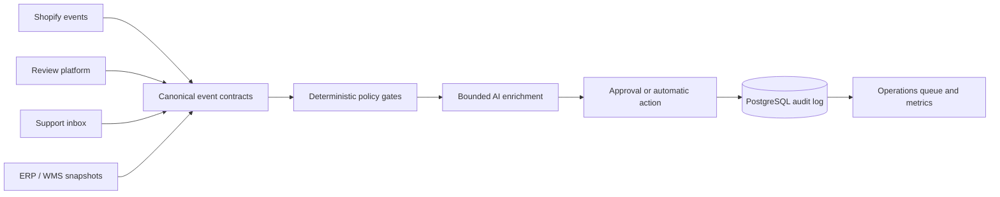

# E-Commerce Automation Suite

> Status: **Flagship suite delivered** — four connected, executable reference projects for a multi-market Shopify brand.

## Reference context

**Northstar Prints** is an illustrative Shopify brand operating in nine markets. It is not presented as a client engagement. The implementations are real reference builds using synthetic fixtures, importable n8n workflows, runnable Python, and PostgreSQL schemas.

## Projects

| ID | Project | Primary proof | Hard constraint | Build |
|---|---|---|---|---|
| [ECOM-01](ECOM-01%20Multi-Market%20Product%20Content%20Governance/SOP.md) | Multi-Market Product Content Governance | Schema-constrained localization and risk gates | Market-specific copy cannot silently change protected product facts | [verified artifacts](ECOM-01%20Multi-Market%20Product%20Content%20Governance/build/README.md) |
| [ECOM-02](ECOM-02%20Review%20Intelligence%20and%20Response%20Queue/SOP.md) | Review Intelligence & Response Queue | Explainable triage with approval routing | Safety and refund claims always require a human | [verified artifacts](ECOM-02%20Review%20Intelligence%20and%20Response%20Queue/build/README.md) |
| [ECOM-03](ECOM-03%20Catalog%20Inventory%20Reconciliation/SOP.md) | Catalog & Inventory Reconciliation | Three-way conflict resolution and idempotency | No stock update when source authority is ambiguous | [verified artifacts](ECOM-03%20Catalog%20Inventory%20Reconciliation/build/README.md) |
| [ECOM-04](ECOM-04%20Support%20Routing%20and%20SLA%20Control/SOP.md) | Support Routing & SLA Control | Deterministic policy engine with safe AI assist | PII is redacted before any model boundary | [verified artifacts](ECOM-04%20Support%20Routing%20and%20SLA%20Control/build/README.md) |

## Shared operating model



The suite chooses deterministic rules for permissions, inventory authority, SLAs, protected facts, and high-risk escalation. AI is used only where language ambiguity adds value: localization proposals, review themes, and support summaries. This division keeps cost and behavior predictable at volume.

## Deliberately excluded

A general autonomous “store manager” agent was cut. It would combine unrelated permissions, make failures harder to isolate, and weaken auditability. Four bounded services with shared contracts are easier to test, own, and replace.

## Run locally

Each project runs with Python 3.11+ and no third-party package:

```powershell
python "ECOM-01 Multi-Market Product Content Governance/build/localization_engine.py"
python "ECOM-02 Review Intelligence and Response Queue/build/review_router.py"
python "ECOM-03 Catalog Inventory Reconciliation/build/reconciliation_engine.py"
python "ECOM-04 Support Routing and SLA Control/build/support_router.py"
```

All outputs are deterministic and use synthetic records. Live credentials are required only when the n8n workflows are connected to real systems.

---
*Part of the Enterprise Automation Portfolio. See the root [README](../README.md) and [internal standards](../49%20Internal%20Standards/README.md).*
