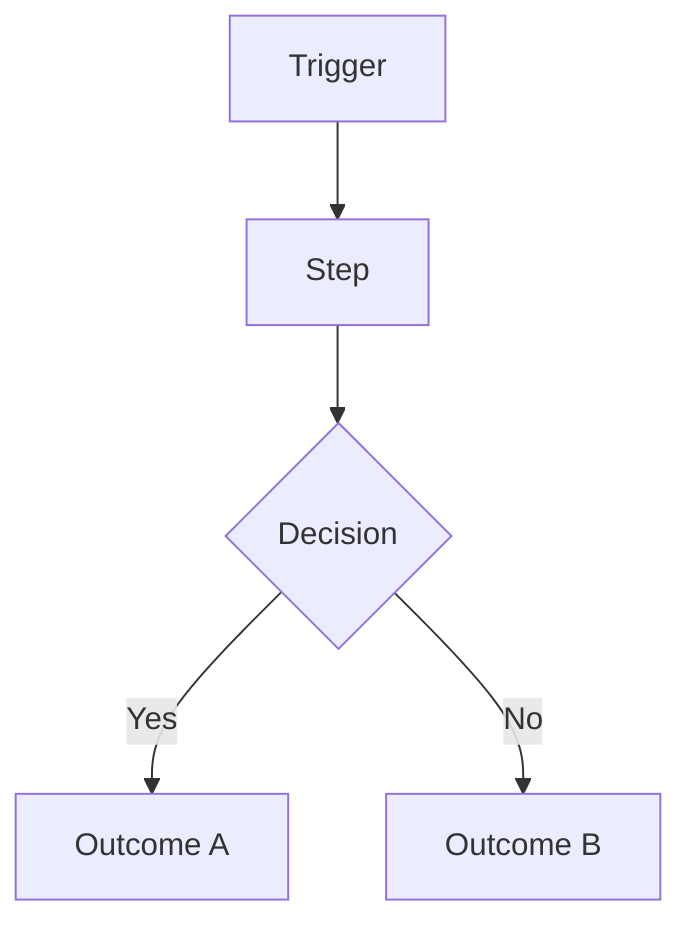
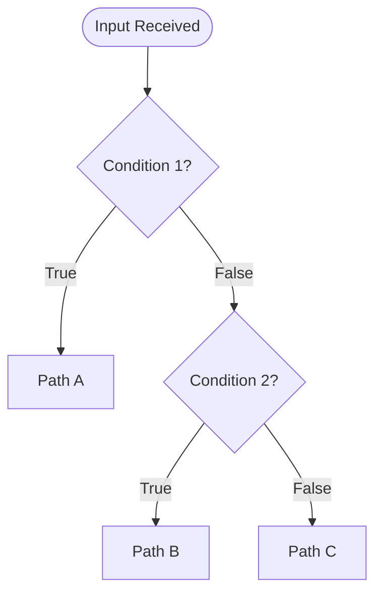

# SOP Master Template

> Status: **Populated** — canonical template. Copy this file when authoring any new SOP; do not edit it in place.

## How to Use This Template

Every SOP in this portfolio — regardless of industry, platform, or complexity — must contain all 44 sections below, in this order, using this exact heading structure. Sections that are genuinely not applicable to a given SOP should still appear, with a one-line justification for why ("N/A — this workflow has no manual override path because...") rather than being omitted. Omission breaks cross-referencing and breaks the consistency reviewers rely on.

Replace all `[bracketed placeholders]` with engagement-specific content. Remove this "How to Use" block from the final SOP.

---

# SOP: [Workflow Name]

**Client (fictionalized):** [e.g., Meridian Properties]
**Industry:** [Vertical]
**Owning Section:** [e.g., 06 Property Management]
**SOP ID:** [e.g., PM-014]
**Version:** [1.0]
**Last Updated:** [YYYY-MM-DD]
**Author:** [Role]
**Classification:** [Internal / Client-Facing / Confidential]
**Video Walkthrough:** [▶ Watch the video walkthrough](VIDEO_URL_PLACEHOLDER) — *[duration, e.g., 8:42]*

> **Video requirement:** Every SOP in this portfolio links a recorded walkthrough of the live automation (screen recording + narration), per [`49 Internal Standards`](../49%20Internal%20Standards/README.md#8-video-walkthroughs). If the video has not been recorded yet, this line must read `**Video Walkthrough:** _Pending recording — see script in this SOP's project folder._` rather than being omitted.

## Table of Contents

1. [Purpose](#1-purpose)
2. [Business Problem](#2-business-problem)
3. [Business Goals](#3-business-goals)
4. [Business Requirements](#4-business-requirements)
5. [Functional Requirements](#5-functional-requirements)
6. [Technical Requirements](#6-technical-requirements)
7. [Dependencies](#7-dependencies)
8. [Systems Used](#8-systems-used)
9. [Roles](#9-roles)
10. [Responsibilities](#10-responsibilities)
11. [Workflow Overview](#11-workflow-overview)
12. [Detailed Workflow Steps](#12-detailed-workflow-steps)
13. [Decision Tree](#13-decision-tree)
14. [Automation Logic](#14-automation-logic)
15. [Trigger Conditions](#15-trigger-conditions)
16. [Data Validation](#16-data-validation)
17. [Error Handling](#17-error-handling)
18. [Retry Logic](#18-retry-logic)
19. [Fallback Procedures](#19-fallback-procedures)
20. [Manual Override](#20-manual-override)
21. [Exception Handling](#21-exception-handling)
22. [Notifications](#22-notifications)
23. [Audit Logs](#23-audit-logs)
24. [Security](#24-security)
25. [Permissions](#25-permissions)
26. [Compliance](#26-compliance)
27. [Performance Metrics](#27-performance-metrics)
28. [KPIs](#28-kpis)
29. [Testing Procedure](#29-testing-procedure)
30. [Deployment](#30-deployment)
31. [Maintenance](#31-maintenance)
32. [Version History](#32-version-history)
33. [Future Improvements](#33-future-improvements)
34. [Appendix](#34-appendix)
35. [Troubleshooting](#35-troubleshooting)
36. [Recovery Procedure](#36-recovery-procedure)
37. [Frequently Asked Questions](#37-frequently-asked-questions)
38. [Technical Notes](#38-technical-notes)
39. [Business Notes](#39-business-notes)
40. [Estimated Time Savings](#40-estimated-time-savings)
41. [ROI Analysis](#41-roi-analysis)
42. [Risk Assessment](#42-risk-assessment)
43. [Lessons Learned](#43-lessons-learned)
44. [Related SOPs](#44-related-sops)

---

## 1. Purpose
One paragraph. What this workflow does and why it exists, in plain business language.

## 2. Business Problem
The specific, quantified pain point this automation solves. Include a before-state metric (e.g., "Average lead response time: 4.2 hours").

## 3. Business Goals
Bulleted, outcome-oriented goals tied to the business problem — not feature lists.

## 4. Business Requirements
Numbered list (BR-1, BR-2, ...) of what the business needs the system to do, independent of implementation.

## 5. Functional Requirements
Numbered list (FR-1, FR-2, ...) mapping each Business Requirement to a specific system behavior. Include a traceability table:

| BR ID | FR ID | Description |
|---|---|---|
| BR-1 | FR-1 | ... |

## 6. Technical Requirements
Platform versions, API rate limits, latency budgets, uptime targets, data residency constraints.

## 7. Dependencies
External and internal dependencies (APIs, prior workflows, data availability, third-party SLAs).

## 8. Systems Used

| System | Role in Workflow | Auth Method |
|---|---|---|
| [System] | [Role] | [OAuth2 / API Key / JWT] |

## 9. Roles
Who is involved: business owner, technical owner, escalation contact.

## 10. Responsibilities

| Role | Responsibility |
|---|---|
| [Role] | [Responsibility] |

## 11. Workflow Overview
High-level narrative plus a Mermaid flowchart.



## 12. Detailed Workflow Steps
Numbered, granular steps. Each step: Tool → Trigger/Action → Input schema → Transformation → Output schema → Condition branches → Error handling reference.

## 13. Decision Tree


## 14. Automation Logic
Pseudo-code or actual code for the core decision/transformation logic.

```python
def classify(payload: dict) -> str:
    """Example automation logic placeholder."""
    raise NotImplementedError
```

## 15. Trigger Conditions
Exact event(s) that start the workflow — webhook, schedule, manual, event bus message. Include the trigger payload schema.

## 16. Data Validation
Validation rules table:

| Field | Rule | Failure Action |
|---|---|---|
| [field] | [rule] | [action] |

## 17. Error Handling
Minimum 5 documented failure scenarios with detection method and response.

## 18. Retry Logic
Backoff strategy, max attempts, idempotency key strategy.

## 19. Fallback Procedures
What happens when retries exhaust — dead-letter queue, manual queue, degraded mode.

## 20. Manual Override
How and when a human can intervene; who is authorized.

## 21. Exception Handling
Handling of malformed payloads, partial data, and unexpected states not covered by standard error handling.

## 22. Notifications
Who gets notified, on what channel (Slack/Email/SMS), at what severity threshold.

## 23. Audit Logs
What is logged, where, retention period, and how it supports compliance/debugging.

## 24. Security
Auth model, secret storage, encryption in transit/at rest, PII handling.

## 25. Permissions
Role-based access control table for who can view/edit/trigger this workflow.

## 26. Compliance
Relevant regulatory frameworks (e.g., GDPR, CCPA, HIPAA, SOC 2) and how this workflow satisfies them.

## 27. Performance Metrics
Latency, throughput, error rate — with target thresholds.

## 28. KPIs
Business-facing KPIs this workflow moves (e.g., lead response time, cost per lead, churn rate).

## 29. Testing Procedure
Unit, integration, and UAT test plan. Reference [`37 Testing/`](../37%20Testing/README.md).

## 30. Deployment
Deployment steps, environments, rollback plan. Reference [`38 Deployment/`](../38%20Deployment/README.md).

## 31. Maintenance
Recurring maintenance tasks and cadence. Reference [`39 Maintenance/`](../39%20Maintenance/README.md).

## 32. Version History

| Version | Date | Author | Change |
|---|---|---|---|
| 1.0 | [date] | [author] | Initial release |

## 33. Future Improvements
Backlog of known enhancements, deprioritized at initial launch.

## 34. Appendix
Supplementary reference material: full API specs, extended payload examples, glossary.

## 35. Troubleshooting
Symptom → likely cause → fix table.

## 36. Recovery Procedure
Steps to restore the system to a known-good state after an incident.

## 37. Frequently Asked Questions
Anticipated questions from operators and stakeholders.

## 38. Technical Notes
Implementation details worth flagging to future engineers (gotchas, platform quirks).

## 39. Business Notes
Context useful to business stakeholders but not engineers (why a threshold was chosen, stakeholder tradeoffs).

## 40. Estimated Time Savings
Quantified labor-hours saved per week/month, with calculation shown.

## 41. ROI Analysis
Cost of build + run vs. quantified savings/revenue impact. Reference [`44 ROI/`](../44%20ROI/README.md).

## 42. Risk Assessment
Risk register: likelihood × impact × mitigation.

## 43. Lessons Learned
What was learned during build/deployment that should inform future engagements.

## 44. Related SOPs
Cross-links to other SOPs that interact with or depend on this one.

---
*Part of the Enterprise Automation Portfolio. Template maintained in [`41 Templates/`](README.md).*
