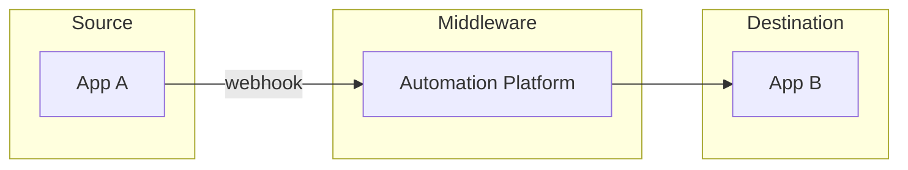
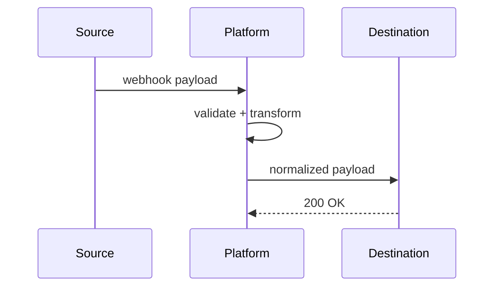

# Workflow Documentation Template

> Status: **Populated** — canonical template for standalone workflow docs (used when a workflow doesn't warrant a full 44-section SOP, e.g. an internal utility automation).

**Video Walkthrough:** [▶ Watch the video walkthrough](VIDEO_URL_PLACEHOLDER) — *[duration]*

## Business Objective
What business outcome this workflow serves.

## Current Manual Process
Describe the process as it exists without automation, including time cost.

## Future Automated Process
Describe the target-state automated process.

## Automation Map

## Apps Involved

| App | Role | Auth |
|---|---|---|
| | | |

## API Calls
List each API call: method, endpoint, purpose.

## Webhook Sequence

## Data Transformations
Before/after JSON.

## Conditions / Loops / Routers / Filters
Document each branching or iteration construct used.

## Error Handlers
Per-node error handling strategy.

## Monitoring / Logging / Notifications
What is observed and who is alerted.

## Security
Auth, secrets, PII handling.

## Performance / Scaling
Expected volume, current headroom, scaling plan.

## Maintenance
Cadence and owner.

---
*Part of the Enterprise Automation Portfolio.*
