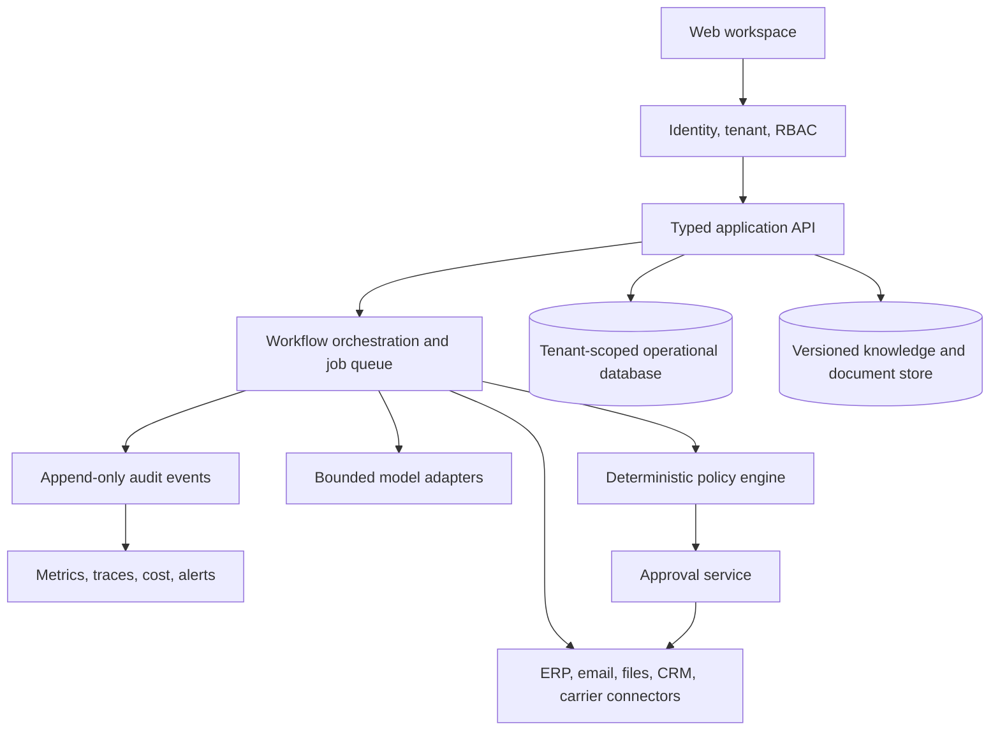

# PORT / OS — B2B SaaS Product, Operator, and Market Expansion Playbook

**Version:** 1.0  
**Prepared:** 25 August 2026  
**Initial market:** Bolivia  
**Expansion scope:** Latin American trade operations and adjacent business verticals  
**Prototype:** [PORT / OS Import Company Agent Network](https://port-os-import-agent-network.gabrielacoata.chatgpt.site/)

> This document distinguishes the working reference prototype from the future production product. Commercial ranges and market priorities are hypotheses to validate through interviews and paid pilots, not claims of existing revenue, market share, or legal advice.

## 1. Executive concept

PORT / OS is a controlled operating layer for companies whose work is fragmented across email, WhatsApp, spreadsheets, PDFs, CRMs, accounting software, and employee memory. It turns a concrete task into a reviewable work packet containing:

1. the evidence used;
2. the steps followed;
3. the decision or recommendation;
4. the rule or constraint that applies; and
5. the person or department that owns the next action.

The prototype represents an import company through 137 narrow agents across Sales, Deals, Marketing, Operations, Intelligence, Customer, and Back Office. The commercial product should not be sold as “137 AI agents.” It should be sold as a way to reduce a specific operational loss: incomplete shipment files, delayed exception handling, inconsistent landed-cost calculations, missed follow-ups, unreliable customer updates, or slow management reporting.

### The one-sentence offer

**English:** PORT / OS gives importers one controlled workspace for shipment evidence, operating decisions, approvals, and cross-department handoffs.  
**Spanish:** PORT / OS convierte correos, documentos y hojas de cálculo dispersas en expedientes operativos verificables, con responsables, alertas y aprobaciones claras.

## 2. What the current prototype proves

The reference implementation already proves these product primitives:

| Primitive | Prototype evidence | Production extension |
|---|---|---|
| Agent registry | Exactly 137 typed agents across seven departments | Tenant-specific catalogs and agent activation |
| Company brain | Twelve versioned reference records across eight domains | Customer data ingestion, permissions, search, and source sync |
| Permission boundary | Every department has explicit read/draft/approval limits | Role-based access, scoped credentials, and policy-as-code |
| Execution contract | `POST /api/run-agent` returns structured results | Durable jobs, retries, model adapters, and observability |
| Evidence grounding | Each run selects relevant knowledge records | Hybrid retrieval, citations, freshness checks, and missing-evidence blocks |
| Handoff | Every result names its next owner and artifact | Queues, notifications, SLA timers, and acceptance/rejection state |
| Human authority | External actions remain behind review | Approval tokens, segregation of duties, and audited side effects |
| Interface | Users can browse departments, select an agent, and run a task | Authentication, tenant settings, inboxes, dashboards, and administration |

### What it does not yet prove

The prototype is not connected to a real importer, customs broker, bank, ERP, carrier, or government system. Its records are fixtures, execution is deterministic, and it has no persistent customer database, authentication, billing, production monitoring, or formal service-level commitment. Those are product-development requirements, not details to hide during a demo.

## 3. How to use the prototype

### 3.1 Basic operating procedure

1. Open the [live prototype](https://port-os-import-agent-network.gabrielacoata.chatgpt.site/).
2. Choose a department based on the owner of the decision—not merely the source of the input.
3. Select the narrowest agent that matches the task.
4. Enter a concrete task with an object, desired output, and constraint.
5. Run the agent.
6. Review the evidence, process steps, decision, constraint, and handoff.
7. Decide whether the work packet is accepted, needs more evidence, or must be escalated.

### 3.2 Good and weak task instructions

| Weak | Better |
|---|---|
| “Check shipment” | “Validate shipment SHP-2048 from Shenzhen to Arica and identify missing documents or approvals before customs readiness review.” |
| “Help with supplier” | “Prepare a supplier risk packet for Pacific Components before approving a USD 28,000 purchase commitment.” |
| “Write customer email” | “Draft a status response using the latest verified milestone, without promising an arrival date beyond the customs buffer.” |
| “Calculate costs” | “Prepare a landed-cost review for SKU ELEC-440 and list every included and excluded assumption.” |

### 3.3 Department selection guide

| User need | Start here | Typical output | Human decision retained |
|---|---|---|---|
| Find and qualify distributors | Sales | sourced account brief and CRM handoff | enrollment and outbound send |
| Prepare a quote or proposal | Deals | margin-checked commercial packet | price, terms, and final quote |
| Produce product/campaign content | Marketing | source-grounded draft and QA results | claim approval and publication |
| Move an order toward inventory | Operations | document checklist, blockers, and owner | booking, customs submission, supplier commitment |
| Monitor external risk | Intelligence | sourced signal with recency/confidence | operating response |
| Resolve an order-status question | Customer | verified response draft and escalation | promise, refund, or settlement |
| Match invoices or forecast cash | Back Office | reconciliation packet and approvals required | payment, journal entry, contract change |

### 3.4 Seven demo tasks

- **Sales:** “Create a qualified distributor handoff for ELEC-440, showing fit evidence and missing fields.”
- **Deals:** “Prepare the review packet for a 1,200-unit opportunity with an 18% gross-margin floor.”
- **Marketing:** “Create a campaign brief for dependable-stock retail buyers using only approved product claims.”
- **Operations:** “Validate an incoming shipment and identify any document, customs, or approval blocker.”
- **Intelligence:** “Assess supplier and lane risks affecting the next purchase order, preserving source and recency.”
- **Customer:** “Prepare an accurate delay explanation without exceeding the latest verified milestone.”
- **Back Office:** “Prepare the approval packet for a supplier commitment and list the required control owners.”

### 3.5 Fifteen-minute sales demo

1. **Minute 0–2 — Problem:** Ask where shipment truth lives today and how managers learn that a document or milestone is missing.
2. **Minute 2–4 — Map:** Show the seven departments and explain that each agent has one job and one permission boundary.
3. **Minute 4–8 — Run:** Use the Operations Document Pack Validator or Landed Cost Calculator on a realistic task.
4. **Minute 8–10 — Control:** Point to evidence, constraint, confidence, and human handoff. Explain what the system refuses to do.
5. **Minute 10–12 — Company brain:** Show how supplier, product, logistics, customs, finance, and policy records ground every department.
6. **Minute 12–15 — Pilot:** Propose one workflow, one owner, one dataset, and one measurable before/after result.

Do not spend the demo clicking all 137 agents. The buyer should remember one expensive problem that became visible and controllable.

## 4. The first commercial product

### Product name

**PORT / OS Control Tower for Importers**

### First paid use case

**Shipment Readiness and Exception Control** should be the initial wedge. It has visible inputs, clear owners, measurable delays, and low risk compared with autonomous purchasing, payments, or customs declarations.

### Inputs

- purchase order;
- commercial invoice;
- packing list;
- transport document or milestone feed;
- supplier and SKU master data;
- broker document checklist;
- internal approval policy; and
- owner/SLA matrix.

### Outputs

- one shipment dossier;
- document-completeness score;
- missing or inconsistent-field list;
- source and timestamp for every status;
- named owner and due date for each exception;
- management status digest; and
- audit history of review and resolution.

### Explicit exclusions from the first pilot

- filing a customs declaration;
- confirming an HS classification without the responsible professional;
- booking or changing freight;
- sending external messages without approval;
- approving supplier payments;
- replacing the customer’s ERP, broker, accountant, or legal adviser; and
- migrating every historical record.

## 5. Six-week paid pilot

### Week 0 — Qualification

Confirm that the prospect has recurring imports, an accountable operations owner, access to representative documents, and at least one measurable pain. Decline a pilot when the company imports only occasionally, cannot provide process ownership, or expects the system to make regulated decisions autonomously.

### Week 1 — Current state and baseline

- map one shipment flow from purchase order to warehouse;
- inventory systems, spreadsheets, inboxes, and documents;
- record baseline handling time, missing-document incidents, status-request volume, and delay escalation time;
- define the system of record for each field; and
- agree which actions require approval.

### Week 2 — Knowledge and contracts

- create supplier, product, lane, document, policy, and owner records;
- define canonical shipment and document contracts;
- configure required evidence and staleness thresholds; and
- load synthetic or redacted samples before using live data.

### Week 3 — Workflow build

- connect one input channel;
- implement document validation and exception routing;
- add idempotency, retries, dead-letter handling, and audit events;
- configure one management digest; and
- test all refusal and approval paths.

### Week 4 — Shadow mode

Run beside the current process. PORT / OS recommends and records, but employees continue executing through existing tools. Compare system findings with the operations team daily.

### Week 5 — Controlled launch

Activate selected queues and notifications. Keep external writes behind explicit review. Train operators on accept, reject, request-evidence, and escalate states.

### Week 6 — Value review

Compare the agreed baseline with pilot results, review false alerts and missed cases, calculate recoverable value, and decide whether to stop, maintain one workflow, or expand.

### Pilot acceptance gates

- 100% of pilot runs have a source, timestamp, decision, and owner;
- zero unauthorized external actions;
- duplicate inputs produce one operational case;
- missing required evidence blocks readiness;
- critical exceptions reach the owner within the agreed SLA;
- users can explain why a decision was made; and
- the customer can export its operational records.

## 6. Production architecture



### Deterministic versus AI responsibility

| Deterministic | AI-assisted |
|---|---|
| permissions and approval thresholds | document type and field extraction |
| required-document checks | summaries and draft communications |
| calculations and tolerance rules | ambiguous intent classification |
| idempotency and state transitions | knowledge retrieval/reranking |
| side effects and credential scope | suggested next step with evidence |
| audit, retention, and deletion rules | multilingual drafting |

### Prototype-to-production backlog

1. Tenant authentication and role-based access.
2. Persistent PostgreSQL operational store and object storage.
3. Customer-specific knowledge ingestion and versioning.
4. Durable workflow queue, retries, dead letters, and idempotency.
5. Scoped integration credentials and secret rotation.
6. Append-only audit records and export.
7. Model gateway with budgets, structured outputs, fallbacks, and evaluations.
8. Approval inbox and segregation-of-duties controls.
9. Operational dashboards, traces, alerts, and cost telemetry.
10. Backup, restore, retention, deletion, and incident procedures.
11. Subscription/usage metering and Bolivian invoicing workflow.
12. Customer onboarding, support, and offboarding runbooks.

### Deployment model

Start with a dedicated single-tenant deployment for each design partner. This is slower to operate than full multi-tenancy but reduces data-isolation risk and allows customer-specific integrations to mature. Move to shared application services only after tenant-scoping tests, export/deletion controls, and noisy-neighbor limits are proven.

## 7. Offering PORT / OS in Bolivia

### Why the import-operations wedge is credible

Bolivia’s INE publishes import statistics with monthly updates and multiple classifications, confirming an active and measurable import economy rather than a hypothetical niche. Aduana Nacional’s current guidance describes digital document submission through SUMA and requires importers to retain supporting documentation. This creates a practical space for a private operating layer that prepares, validates, routes, and audits company records without pretending to replace Aduana, SUMA, or a customs professional.

Bolivia also has increasingly digital payment and invoicing rails. The Banco Central describes an interoperable national QR standard and reported strong 2025 digital-payment growth; the SIN documents online invoicing modalities, validation, contingency handling, and authorized systems. PORT / OS should integrate with those rails through compliant providers and customer-controlled accounts—not attempt to become a bank or tax system.

### Ideal initial customer profile

- importer, wholesale distributor, or importer-manufacturer;
- approximately 10–100 office/operations employees;
- recurring purchase orders and shipments every month;
- two or more suppliers, lanes, warehouses, or sales channels;
- operations coordinated through email, WhatsApp, Excel, Drive, or isolated systems;
- repeated time spent requesting status or correcting document data;
- a named Operations or Finance owner who can approve process changes; and
- willingness to begin with one workflow and share baseline data.

### Poor initial fit

- occasional personal or micro-imports;
- no repeatable process or responsible owner;
- demand for customs, tax, credit, or legal decisions by AI;
- expectation of a full ERP replacement in six weeks;
- inability to provide lawful access to representative data; or
- regulated/high-harm products as the first design partnership.

### Buyer and internal champions

| Role | What they care about | Message |
|---|---|---|
| Owner / General Manager | visibility, margin, fewer surprises | “See every blocked shipment and its owner before it becomes a crisis.” |
| Operations Manager | document readiness, milestones, workload | “One exception queue instead of searching email and WhatsApp.” |
| Finance Manager | landed cost, commitments, cash timing | “Every estimate shows its source, assumptions, and approval state.” |
| Commercial Manager | reliable promises and stock visibility | “Customer updates use the same verified facts as Operations.” |
| IT / Systems | security, ownership, integration load | “PORT / OS sits above current systems and keeps writes scoped and auditable.” |

### Recommended launch packages

These are starting hypotheses for customer discovery, quoted in bolivianos to simplify the local conversation. Final prices should follow scope, integrations, usage, support, taxes, and professional accounting advice.

| Package | Suggested starting range | Includes |
|---|---:|---|
| Operational Diagnosis | Bs 1,800–3,500 one-time | one process map, systems/data inventory, risk map, baseline, pilot proposal |
| Controlled Pilot | Bs 8,500–15,000 setup + Bs 1,900–3,500/month | one workflow, one team, one input channel, approval queue, weekly review, capped usage |
| Operations Control Tower | Bs 18,000–35,000 setup + Bs 4,500–8,500/month | up to three connected workflows, dashboards, integrations, monitoring, monthly optimization |
| Dedicated Company OS | from Bs 40,000 setup + Bs 9,000/month | dedicated deployment, multiple departments, custom connectors, enhanced support and governance |

Do not discount setup to zero. Discovery, data mapping, controls, and integration are the majority of early delivery work. If affordability is a blocker, reduce the workflow scope rather than remove testing and governance.

### ROI model used in the sales conversation

```text
Monthly recoverable value =
  staff hours avoided × loaded hourly cost
  + preventable delay/demurrage/storage cost
  + preventable document rework
  + margin leakage identified
  + faster cash collection attributable to the workflow

Conservative attributable value = monthly recoverable value × confidence factor
ROI = (conservative attributable value - monthly PORT/OS cost) / monthly PORT/OS cost
```

Use customer records for each input. Do not present fabricated percentages. A credible pilot can succeed by proving visibility and control even before it proves a large cash return.

### Payment and invoicing operations

- Quote and contract in the legally appropriate currency and form agreed with the client.
- Invoice through the applicable SIN-compliant modality and an authorized accounting/facturation process.
- QR can be offered as a local collection option through a regulated financial institution.
- Keep subscription status separate from customer operational data; a billing issue must not destroy or silently lock records required for export.
- Obtain Bolivian accounting and legal review for taxes, contracts, data processing, and cross-border cloud/model services before production launch.

### Data and risk position

Until a qualified Bolivian professional confirms the full legal design for a customer and sector, use the stricter operating posture:

- collect only fields required by the selected workflow;
- document the purpose and owner of every integration;
- use contracts covering confidentiality, processing, subprocessors, incident notice, retention, export, and deletion;
- prevent secrets, payment credentials, personal identifiers, and regulated documents from entering model prompts unless explicitly designed and approved;
- separate each customer’s data and credentials;
- preserve source provenance and access logs; and
- require accountable humans for customs, tax, legal, credit, employment, payment, and contract decisions.

This playbook is a product strategy, not legal or tax advice.

## 8. Bolivia go-to-market plan

### First 90 days

#### Days 1–30 — Learn and narrow

- interview 20 importers/distributors in Cochabamba, Santa Cruz, and La Paz;
- speak separately with Operations, Finance, and owners;
- collect the vocabulary, artifacts, and real cost of one recurring problem;
- demonstrate the prototype only after the problem interview;
- choose one workflow that appears in at least five interviews; and
- recruit three design partners, aiming for at least one paid pilot.

#### Days 31–60 — Deliver one proof

- run the six-week scope with the first design partner;
- publish no client name or metric without written permission;
- capture before/after handling time, exception age, missing-document rate, and user adoption;
- turn every implementation decision into reusable configuration; and
- produce a redacted case study and a two-minute demo.

#### Days 61–90 — Build a repeatable channel

- offer a workshop: “Cómo reducir errores y retrasos en operaciones de importación con automatización controlada”;
- approach business associations, logistics events, accountants, ERP implementers, customs/logistics professionals, and IT providers as referral channels;
- publish educational content around document readiness, landed-cost assumptions, and approval controls—not generic AI news;
- standardize the diagnosis, proposal, data-processing annex, pilot scorecard, and handover pack; and
- decide whether the next investment is another connector or another industry only after three comparable pilots.

### Discovery questions

1. Where does your team look to know whether a shipment is actually ready?
2. Which document error or missing field creates the most rework?
3. How many people ask for shipment status each week?
4. What event usually reaches management too late?
5. Who is allowed to approve a booking, quote, supplier commitment, and payment?
6. Which values are copied manually between email, Excel, ERP, broker, and warehouse?
7. What would you need to see in a four-to-six-week pilot to continue paying?

### Short outreach message in Spanish

> Hola, [Nombre]. Estoy trabajando con un sistema para importadores que centraliza documentos, estado, excepciones y responsables sin reemplazar el ERP ni automatizar decisiones sensibles. Estoy entrevistando a responsables de Operaciones para entender dónde se pierde más tiempo entre proveedor, transporte, Aduana y almacén. ¿Tendrías 20 minutos para mostrarme cómo controlan hoy un embarque? Si existe un caso claro, puedo preparar un diagnóstico breve con un piloto acotado.

### Offer paragraph in Spanish

> Implementamos un piloto controlado de PORT / OS sobre un solo proceso de importación. En seis semanas configuramos el expediente operativo, validación de documentos, alertas, responsables y tablero de seguimiento utilizando información del cliente. El sistema trabaja primero en modo sombra y no presenta declaraciones, mueve dinero, confirma clasificaciones ni envía comunicaciones externas sin aprobación. Al cierre comparamos el resultado con una línea base acordada y el cliente decide si detener, mantener o ampliar.

### Common objections

| Objection | Response |
|---|---|
| “Ya usamos Excel/Drive/ERP.” | PORT / OS does not replace them first; it connects evidence, rules, approvals, and ownership across them. |
| “No quiero que la IA se equivoque con Aduana.” | Customs decisions remain with the responsible professional. The system validates completeness, preserves sources, and blocks unsupported readiness. |
| “Nuestros datos son confidenciales.” | Start single-tenant, minimize fields, document every integration, and keep side effects and model boundaries separately controlled. |
| “Es muy caro.” | Compare one scoped workflow against current staff time, rework, delay, and margin leakage. Reduce scope—not controls—if the case is weak. |
| “Quiero todos los agentes.” | Activate only agents attached to a measurable process. Unused agents add training, permissions, and maintenance cost. |

## 9. Expansion into other countries

PORT / OS should expand through **country packs**, not a single universal customs agent. Each pack localizes terminology, required evidence, authority boundaries, tax/currency handling, available integrations, retention rules, and professional-review points.

### Country-pack contract

- canonical import/shipment data model mapped to local terms;
- current document checklist linked to official sources;
- customs/professional authority matrix;
- currency, tax, and landed-cost configuration;
- government and private-system connector inventory;
- Spanish/Portuguese terminology and communication templates;
- data-processing and hosting review;
- country-specific test fixtures and refusal cases; and
- named local professional responsible for regulatory validation.

### Suggested validation sequence

| Market | Why validate | What must change before selling |
|---|---|---|
| Peru | Large neighboring trade market and formal SUNAT import procedures with electronic transmission | SUNAT/VUCE vocabulary, RUC and declaration fields, taxes, local partners, data/contracts |
| Paraguay | Regional importer/distributor profile and electronic import single-window history | DNIT/VUI process mapping, Spanish/Guaraní customer needs, local invoicing and data review |
| Chile | Mature logistics ecosystem and documented import/declaration requirements | Aduanas/VUCE connectors, CLP/tax handling, stricter integration/security expectations |
| Wider Andean region | Shared Spanish and some common trade patterns | country-by-country customs, tax, privacy, and connector packs; never copy Bolivia rules |

This is a validation order, not a claim that any market is already won. Enter a country only after 15–20 discovery interviews, one local implementation/accounting partner, a reviewed country pack, and a paid design partner.

## 10. Expansion into other businesses

The reusable product is not the import vocabulary; it is the controlled work-packet architecture.

### What remains stable

- tenant and user identity;
- agent registry and activation;
- versioned company brain;
- typed task/run/result contract;
- evidence and source provenance;
- deterministic policy gates;
- approvals and segregation of duties;
- queues, SLAs, and handoffs;
- audit, observability, and cost controls; and
- integration/connector framework.

### What changes by vertical

- departments and job catalog;
- knowledge ontology;
- systems of record;
- required evidence;
- policies and professional authority;
- workflow states and SLAs;
- model evaluations; and
- outcome metrics.

### Expansion candidates

| Product configuration | Initial workflow | Buyer | Hard boundary |
|---|---|---|---|
| Freight Forwarder OS | quote-to-booking document and exception control | operations director | no booking or customs submission without approval |
| Wholesale Distributor OS | order, inventory, replenishment, and collections visibility | general manager | no stock or credit override from AI output |
| Procurement OS | requisition-to-supplier comparison and approval packet | procurement/finance | no supplier award or commitment without authority |
| Construction Materials OS | purchase, delivery, site readiness, and change-order evidence | project/operations manager | immutable approval and cost-impact history |
| Agro-Export OS | lot, quality, cold-chain, document, and buyer handoff | export/quality manager | regulated certificates remain with authorized parties |
| Professional Services OS | lead, proposal, onboarding, delivery, and billing handoffs | agency/consulting owner | no contract, scope, or invoice change without approval |
| Multi-Market E-Commerce OS | content, inventory, support, reviews, and ad reporting | ecommerce operations lead | protected product facts and payment actions stay deterministic |

### Vertical selection score

Score each opportunity from 1–5 on:

- recurrence of the workflow;
- cost of delay/error;
- availability of digital inputs;
- clarity of the system of record;
- ability to run in shadow mode;
- identifiable budget owner;
- sales-cycle length;
- regulatory harm; and
- percentage of existing PORT / OS components reusable.

Choose verticals with high recurrence, visible cost, accessible data, and moderate harm. Do not choose the most impressive diagram.

## 11. SaaS business model evolution

### Stage 1 — Productized consulting

Sell diagnosis, implementation, and a managed monthly service. Customer-specific workflows are acceptable, but every difference must become configuration or a documented exception.

### Stage 2 — Managed platform

Standardize onboarding, knowledge ingestion, approval inbox, monitoring, and the first three connectors. Retain dedicated deployments while learning usage and support patterns.

### Stage 3 — Vertical SaaS

Offer self-service tenant administration for a narrow importer/distributor profile, with packaged country configuration, role templates, metered runs, and standard integrations.

### Stage 4 — Platform and partner ecosystem

Allow vetted implementers to build country/vertical packs against stable contracts. Keep permission, audit, evaluation, billing, and marketplace review centralized.

### Metrics that determine readiness

| Question | Metric |
|---|---|
| Is the workflow useful? | weekly active operators and accepted work packets |
| Is it reliable? | successful runs, retry recovery, stale-evidence blocks, incident rate |
| Does it save value? | verified time, delay, rework, or leakage avoided |
| Is AI controlled? | grounded-output rate, escalation rate, override rate, cost per accepted packet |
| Is delivery repeatable? | implementation hours and custom code per new customer |
| Can it become SaaS? | percentage of customer variation represented as configuration |
| Will customers stay? | retained workflows, expansion, and operator adoption after 90 days |

## 12. Product decisions to defend

### Choose workflow first, agent second

Agents are components inside a business process. Starting with the 137-agent catalog encourages demos without operational ownership; starting with one flow produces a buyer, baseline, and acceptance test.

### Choose managed service before self-service SaaS

Bolivian import operations vary by company, product, broker, and software maturity. Managed delivery creates the data needed to discover the stable product. Building self-service first would encode assumptions that have not been tested.

### Choose human authority over apparent autonomy

The product becomes more trustworthy when it clearly refuses customs, payment, legal, tax, and contract decisions. Autonomy is not the outcome; controlled throughput is.

### Feature deliberately killed

Do not build an animated company where agents appear busy or converse indefinitely. Background activity without an accountable input, evidence, decision, and owner increases model cost and makes failures impossible to audit.

## 13. Immediate next build

The next prototype increment should be a **Shipment Readiness workspace** with persistent synthetic data:

1. shipment list and status;
2. document upload/fixture ingestion;
3. required-document matrix;
4. field-level validation findings;
5. exception owner and SLA;
6. approval/rejection action;
7. append-only event history; and
8. pilot metrics dashboard.

This turns PORT / OS from an agent-map demonstration into the exact paid wedge described in this document while preserving the current architecture and honesty boundary.

## 14. Official sources and validation notes

Sources reviewed on 25 August 2026:

- [Bolivia INE — import statistics and monthly tables](https://www.ine.gob.bo/index.php/estadisticas-economicas/comercio-exterior/importaciones-cuadros-estadisticos/)
- [Aduana Nacional — Import Regime and digital documentation through SUMA](https://portal.aduana.gob.bo/aduana7/content/r%C3%A9gimen-de-importaci%C3%B3n)
- [Aduana Nacional — General Customs Law, importer responsibilities and declarations](https://portal.aduana.gob.bo/aduana7/lga-view)
- [Aduana Nacional — current special/customs-regime guidance](https://www.aduana.gob.bo/regimen-aduanero)
- [Servicio de Impuestos Nacionales — online invoicing modalities](https://siatinfo.impuestos.gob.bo/index.php/12-modalidades-de-facturacion)
- [SIN — computerized online invoicing process](https://siatinfo.impuestos.gob.bo/index.php/informacion/modalidades-facturacion/facturacion-computarizada)
- [Banco Central de Bolivia — interoperable QR payments](https://www.bcb.gob.bo/?q=pagos_qr_bcb_bolivia)
- [BCB — 2025 payment-system oversight report](https://www.bcb.gob.bo/?q=informe-vigilancia-sistema-pagos)
- [CAINCO — Bolivia business digital-maturity assessment](https://chequeodigital.cainco.org.bo/)
- [CAINCO — 2026 international logistics forum](https://www.cainco.org.bo/forologistico2026/)
- [Cámara Nacional de Comercio — foreign-trade assistance page](https://www.cnc.bo/ia-cnc-test/)
- [Peru SUNAT — import-for-consumption procedure](https://www.sunat.gob.pe/legislacion/procedim/despacho/importacion/importac/procGeneral/despa-pg.01.htm)
- [Paraguay DNIT — electronic import single-window overview](https://www.dnit.gov.py/documents/20123/1068547/TRIPTICO-VUI.pdf/6ea51cc3-4f40-269b-9d17-972c33c19548?t=1730142653688.pdf)
- [Chile Aduanas — declaration of import supporting documents](https://www.aduana.cl/aduana/site/docs/20070228/20070228014536/1.pdf)

Government procedures and technical endpoints change. A production country pack must be revalidated against current official rules and reviewed by the customer’s responsible customs, accounting, security, and legal professionals before launch.
