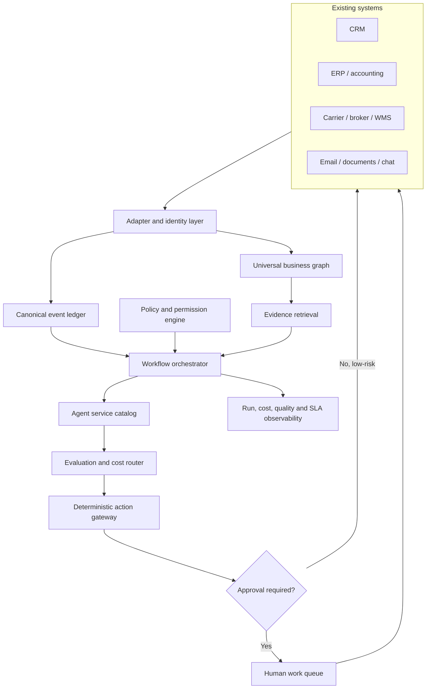

# PORT / OS — CRM Benchmark, Universal Business Architecture, and Portfolio Implementation Plan

> **Research date:** 2026-08-25
> **Purpose:** Define how PORT / OS becomes a useful operating layer for importers first and other businesses later, without forcing a CRM replacement.
> **Evidence standard:** Product facts and list prices are linked to official vendor documentation. Recommendations and architecture decisions are PORT / OS design proposals, not vendor claims.

## 1. Executive conclusion

The market does not need another general-purpose CRM. It needs a control plane that makes the CRM, ERP, spreadsheets, inboxes, logistics tools, accounting system, and AI workflows operate as one governed company.

No reviewed platform covers all seven PORT / OS departments at equal depth:

- Salesforce, HubSpot, Pipedrive, Close, and HighLevel are strongest around customer acquisition, communication, pipeline, and service.
- monday.com and Airtable are flexible human work surfaces, but they should not become the financial or inventory ledger.
- Microsoft Dynamics 365, Zoho, Odoo, SAP Business One, and NetSuite move closer to a combined CRM/ERP operating system.
- SAP Business One and Odoo explicitly model landed costs. Logistics suites such as CargoWise and Descartes go deeper into forwarding, customs, shipment, and trade-compliance execution.

PORT / OS should therefore be sold and built as a **governed business orchestration layer**. It preserves each source system's authority, creates a canonical graph across them, and gives every agent the same evidence, policies, permissions, handoffs, and audit trail.

### The product promise

> Keep the systems that already run the company. PORT / OS gives them one operational brain, one approval model, and a network of narrow agents that can prepare, check, route, and explain work across departments.

## 2. What importers actually need

An importer is not only a sales pipeline. A real operating model crosses commercial, physical, regulatory, and financial states:


The information that makes this flow trustworthy is spread across tools. A CRM may know the opportunity and customer promise. An ERP may know the purchase order, stock, and journal. A broker has customs status. A carrier has milestones. Email contains documents and exceptions. A spreadsheet often contains the only landed-cost forecast.

### Importer value gaps to solve

1. **One shipment truth:** planned, booked, departed, arrived, customs-cleared, received, inspected, and available are different states.
2. **Document readiness:** invoice, packing list, bill of lading, certificates, permits, and broker instructions need completeness and consistency checks.
3. **Planned versus actual landed cost:** unit cost alone is not margin. Freight, insurance, origin charges, duty, brokerage, inland transport, FX, and non-recoverable taxes matter.
4. **Promise control:** sales and support must not promise dates or quantities that operations cannot support.
5. **Exception ownership:** every delay, discrepancy, customs hold, damage report, or missing document needs severity, owner, deadline, and communication plan.
6. **Cross-system reconciliation:** supplier invoice, purchase order, receipt, shipment, customer order, and accounting entries must agree.
7. **Country-specific policy:** tax, customs, privacy, retention, language, and approval rules vary by market.
8. **Explainable automation:** a result must show source evidence, assumptions, confidence, policy checks, and the next human owner.

## 3. CRM and operations platform benchmark

The ratings below describe fit for the PORT / OS use case, not general product quality.

| Platform | What it contributes | Importer fit | What PORT / OS should add | Recommended role |
|---|---|---|---|---|
| **Salesforce Sales Cloud** | Deep CRM, custom objects, APIs, Flow, Apex, quoting extensions, service ecosystem, and Agentforce actions | Medium without ERP; high with Manufacturing/Revenue/Service and integrations | Shipment graph, customs/document controls, landed-cost service, deterministic action gateway, shared operational evidence | Enterprise customer and commercial system of record |
| **HubSpot** | Fast adoption, strong marketing/sales/service timeline, workflows, custom objects and associations, CPQ/revenue features | Medium for distributors; low for physical import execution by itself | Supplier/PO/shipment/customs graph, inventory and finance adapters, exception center | Front-office engagement system |
| **Microsoft Dynamics 365** | Dataverse, Power Automate, role security, virtual tables, CRM plus Supply Chain Management and Finance | High when the customer already uses Microsoft | Simpler agent experience, cross-vendor adapters, evidence packets, country/vertical packs, model routing | Closest enterprise benchmark for unified CRM + ERP |
| **Zoho CRM / One** | CRM, custom modules, inventory objects, purchase/sales orders, invoices, CPQ, portals, AI agents, broad SMB suite | High for SMB importer pilots when paired with Inventory/Books/Flow | Stronger cross-app governance, event ledger, richer shipment/customs states, evaluators and cost controls | Cost-sensitive suite strategy |
| **Odoo** | Native CRM, purchase, inventory, accounting, documents, landed costs, API/customization on Custom plan | High for importer operations | Better external intelligence, agent governance, multi-system overlay, evidence and exception UX | Preferred greenfield SMB/mid-market ERP base |
| **SAP Business One** | Purchasing, inventory, accounting, CRM, landed-cost documents, customs allocation, journal impact | High for established importers | Usable cross-department cockpit, AI-assisted document work, carrier/broker integrations, agent audit/evals | Operational and financial system of record |
| **NetSuite** | Integrated ERP, CRM, inventory, purchasing, multi-currency and landed-cost capabilities | High for mid-market/global companies | Narrow task agents, system-spanning exception management, simpler role-based work packets | Mid-market ERP base |
| **Pipedrive** | Excellent visual sales pipeline, products, activities, custom fields, automations and integrations | Low as importer backbone; useful for sales | All supplier, shipment, customs, inventory and finance objects outside Pipedrive | Lightweight sales system |
| **Close** | Calling, email, SMS, workflows, custom activities, API/event log, AI selling features | Low as importer backbone; strong for outbound sales | Operational graph outside Close; write concise milestones and handoffs back as activities | High-velocity B2B sales system |
| **HighLevel** | CRM, pipelines, messaging, forms, calendars, reputation, marketing, SaaS mode, workflows and custom objects | Low-to-medium for small importer front office | External operational database; strict object mapping; shipment, landed-cost and finance services | Agency-led front-office package |
| **monday CRM / Work Management** | Flexible boards, forms, dashboards, automations, APIs, webhooks, human work queues | Medium as an operations cockpit; low as ledger | Canonical database, transactional controls, idempotent workflows, financial/inventory authority elsewhere | Human queue and exception workspace |
| **Airtable** | Flexible relational bases, interfaces, forms, automations, sync and quick internal apps | Medium for prototype/pilot; lower at transactional scale | Strong schemas, event store, policy engine, volume controls, external system of record | Rapid pilot data and interface layer |
| **CargoWise / Descartes** | Deep forwarding, customs, warehouse, booking, tracking, trade content and compliance capabilities | Very high for logistics execution | CRM/customer context, cross-department agent UX, business-specific approvals and knowledge | Specialist logistics/trade source system |

### 3.1 What to copy from each platform

PORT / OS should learn from proven interaction patterns, not clone complete products:

| Source pattern | Keep | Extend in PORT / OS |
|---|---|---|
| Salesforce custom objects + Flow actions | Extensible data and governed action primitives | Vendor-neutral object graph and action gateway; evidence requirements before action |
| HubSpot associations and timeline | Easy relationship navigation and user adoption | Physical and financial events on the same timeline as customer activity |
| Dynamics Dataverse + virtual tables | Standard/custom objects, security and external data without forced copying | Portable adapters and lower-complexity configuration packs |
| Zoho modules and broad suite | SMB breadth and fast all-in-one deployment | Unified policy, audit and exception semantics across every module |
| Odoo/SAP landed cost | Cost allocation linked to purchasing and inventory | Planned/actual variance, confidence, FX scenarios, quote impact, and approval workflow |
| Pipedrive/Close pipeline UX | Clear next step and low-friction commercial execution | Equivalent queues for documents, shipments, exceptions, claims, and approvals |
| HighLevel snapshots | Repeatable industry deployment packages | Versioned country × vertical × CRM × role packs with migrations and tests |
| monday/Airtable flexibility | Quick operator-owned views | Typed schemas, source authority, transactional actions and scale boundaries |
| CargoWise/Descartes trade depth | Compliance and logistics specialization | Connect specialist truth to the commercial and financial operating graph |

### 3.2 What not to copy

- Do not turn every operational record into a deal stage.
- Do not put all company data in one vendor merely to claim a “single source of truth.”
- Do not allow an AI answer to become a shipment booking, payment, refund, contract change, customs declaration, or destructive write without deterministic validation.
- Do not charge customers for a visible “agent count.” Price the outcomes, work packets, integrations, reliability, and governed usage.
- Do not create one general company agent with unrestricted tools.

## 4. The PORT / OS universal business model

The importer version is the first vertical pack. The platform underneath must use stable business primitives that work across industries.

### 4.1 Canonical object families

| Family | Canonical objects | Examples in other businesses |
|---|---|---|
| Parties | Organization, Person, Team, Role, Supplier, Partner, Customer | Patient/provider, tenant/owner, candidate/employer, subscriber/account |
| Offer | Product, Service, SKU, Price Book, Bundle, Entitlement | Property unit, insurance policy, SaaS plan, legal matter type |
| Demand | Lead, Opportunity, Request, Quote, Contract, Order | Job application, support ticket, project bid, subscription trial |
| Supply | Requisition, Purchase Order, Work Order, Supplier Commitment | Contractor assignment, content production, clinical referral |
| Movement | Shipment, Package, Milestone, Route, Receipt, Transfer | Project phase, onboarding journey, service delivery milestone |
| Inventory/capacity | Stock Position, Reservation, Availability, Capacity | Consultant hours, rooms, licenses, appointment slots |
| Money | Invoice, Payment, Expense, Cost Component, Margin, Budget, Journal Reference | Dunning event, retainer, claim reserve, commission |
| Evidence | Document, Message, Call, Attachment, Source, Knowledge Record | Consent, identity proof, inspection, signed agreement |
| Control | Policy, Rule, Approval, Permission, Exception, Risk, SLA | Clinical escalation, credit limit, legal review, publishing approval |
| Automation | Workflow, Agent Definition, Agent Run, Tool Call, Evaluation, Handoff | Any vertical |
| Audit | Event, Actor, Before/After State, Decision, Citation, Retention Class | Any regulated or operational environment |

### 4.2 Source-of-truth registry

Every canonical field needs an authority rule. “Last write wins” is not a governance strategy.

| Data | Typical authority | PORT / OS behavior |
|---|---|---|
| Contact and opportunity | CRM | Read and enrich; write only validated fields through CRM adapter |
| Purchase order and receipt | ERP | Never overwrite from a CRM shadow copy |
| Carrier milestone | Carrier/logistics platform | Preserve raw event, normalized state and received timestamp |
| Customs status/classification | Broker/customs source | Suggestions remain advisory until authorized confirmation |
| Inventory available to promise | ERP/WMS | Sales/support consume verified value plus freshness timestamp |
| Invoice/payment/journal | Accounting/ERP | Prepare and reconcile; posting requires deterministic controls |
| Policy | Versioned PORT / OS policy store | Apply effective date, jurisdiction and owner |
| Agent run | PORT / OS event ledger | Immutable execution and evaluation trail |

Each mapped field should carry:

```text
canonical_field
source_system
source_record_id
source_updated_at
observed_at
freshness_sla
confidence
transformation_version
write_policy
data_classification
```

### 4.3 Event model

PORT / OS should react to business events, not poll every application blindly.

```text
event_id        immutable and globally unique
tenant_id       company boundary
event_type      e.g. shipment.eta.changed
subject_type    shipment
subject_id      canonical identifier
occurred_at     source business time
observed_at     PORT / OS receipt time
source          carrier.adapter.v2
payload_ref     encrypted raw payload location
dedupe_key      idempotency control
correlation_id  end-to-end process trace
causation_id    event or action that produced this event
policy_version  controls effective during processing
```

Events enter an append-only ledger. Projected views power dashboards; adapters write approved changes back to systems. This separates audit history from current state.

## 5. PORT / OS architecture: “CRM, but crazier” in a defensible way

The product becomes more ambitious through control and interoperability, not through pretending that 137 prompts are 137 autonomous employees.



### 5.1 Eleven product services

1. **Connector Hub** — OAuth/API/webhook adapters, credential isolation, rate-limit handling, retries, dead-letter queues and schema versioning.
2. **Identity and Mapping Service** — canonical IDs, deduplication, field lineage, source authority and conflict resolution.
3. **Business Graph** — cross-system relationships among customer, supplier, order, shipment, document, invoice, exception and decision.
4. **Event Ledger** — immutable normalized events with correlation and causation IDs.
5. **Company Brain** — versioned facts, policies, SOPs, contracts and records; retrieval respects tenant, role, recency and data classification.
6. **Policy Kernel** — machine-readable approval thresholds, forbidden actions, segregation of duties, jurisdiction and effective dates.
7. **Workflow Engine** — deterministic state machines for processes, timers, idempotency, retries, compensation and human tasks.
8. **Agent Runtime** — narrow language/reasoning tasks with typed inputs and outputs, minimum required evidence, tool allowlists and model budgets.
9. **Action Gateway** — the only route to external side effects; validates schema, permissions, policy, freshness, duplicate risk and approvals.
10. **Evaluation and Cost Router** — rules first, smallest sufficient model, confidence thresholds, sampled review, regression suites and budget enforcement.
11. **Operator Cockpit** — personal queues, exceptions, approvals, timelines, evidence, cost, SLA, health and cross-department handoffs.

### 5.2 Deterministic workflow versus AI agent

| Use deterministic logic when | Use an AI capability when |
|---|---|
| Formula, threshold or state transition is known | Text/image meaning must be extracted or classified |
| Exact repeatability is required | Evidence must be summarized for a human |
| Money, inventory or legal state changes | A draft, explanation or recommendation is needed |
| Idempotency and compensation matter | Inputs vary too much for brittle templates |
| A regulator/auditor needs the exact rule | Multiple sourced facts require bounded synthesis |

An AI capability can participate in a deterministic workflow. It does not own the workflow state or the external action.

## 6. Personalization engine

Personalization is configuration with inheritance, not a separate prompt copied 137 times.

### 6.1 Resolution order

```text
platform baseline
→ country pack
→ vertical pack
→ company policy pack
→ department pack
→ role pack
→ individual preferences
→ case/task context
```

Higher-specificity settings may narrow authority but cannot silently expand it. A deny rule wins over an allow. Every resolved agent run stores the configuration versions used.

### 6.2 Personalization dimensions

| Dimension | Examples | Effect |
|---|---|---|
| Country | Bolivia, Peru, Chile | currency, language, document names, tax/customs references, retention and data location |
| Vertical | importer, ecommerce, SaaS, recruiting, accounting, real estate | object aliases, workflow states, evidence requirements and KPIs |
| Company | approval matrix, margin floor, preferred carriers, SLA | local policy and operational thresholds |
| Department | sales, finance, operations | accessible data, queue, tools and downstream owner |
| Role | sales rep, broker liaison, CFO, warehouse lead | vocabulary, detail level, decision rights and notifications |
| User | language, timezone, preferred digest | presentation only; cannot override permissions |
| Risk | low, controlled, high, prohibited | model tier, review level, logging, fallback and action boundary |
| Volume | event frequency and peak concurrency | batching, queue priority, caching and budget |
| Integration | Salesforce vs HubSpot; Odoo vs SAP | object mapping, write routes and rate-limit policy |

### 6.3 Agent service contract

Every one of the 137 agents must resolve to this schema:

```yaml
identity:
  agent_id: operations-016
  name: Landed Cost Calculator
  version: 1.0.0
job:
  outcome: Produce planned or actual landed cost with explicit assumptions.
  trigger_events: [shipment.cost.updated, broker.invoice.received]
input_contract:
  required: [purchase_order, shipment, cost_components, currency_rates]
  optional: [broker_invoice, insurance, allocation_policy]
evidence:
  minimum: [purchase_order_source, rate_timestamp, cost_source]
logic:
  deterministic: [currency_conversion, allocation, variance, margin_threshold]
  ai_assisted: [document_extraction, exception_explanation]
authority:
  reads: [erp.purchase_order, logistics.shipment, finance.fx_rate]
  writes: [portos.cost_work_packet]
  forbidden: [post_journal, approve_payment, confirm_customs_value]
output_contract:
  schema: landed_cost_work_packet.v1
  states: [ready_for_review, blocked_missing_evidence, exception]
handoff:
  owner_role: finance_controller
  approval_policy: finance.landed_cost.v3
quality:
  checks: [components_complete, allocation_balances, rate_fresh, source_cited]
  kpis: [variance_accuracy, review_time, correction_rate]
operations:
  sla: PT15M
  cost_budget_usd: 0.10
  retries: 2
  fallback: deterministic_only
```

The complete 137-agent mapping lives in [PORT-OS-AGENT-SERVICE-CATALOG.md](PORT-OS-AGENT-SERVICE-CATALOG.md).

## 7. CRM adapter blueprints

### 7.1 Salesforce adapter

**Use Salesforce for:** Account, Contact, Opportunity, Quote, Case, activities, approvals and commercial reporting.

**Create or map:** Supplier, Shipment, Shipment Milestone, Document Requirement, Exception, Landed Cost Snapshot and Customer Promise as custom objects only when Salesforce is intentionally the operator surface. Otherwise expose summaries and deep links.

**Action pattern:** Salesforce Flow/Apex invokes a PORT / OS endpoint with a correlation ID. PORT / OS returns a typed work packet. A reviewed action returns through a dedicated integration user with field-level permissions.

**Tradeoff:** Maximum enterprise extensibility, but licensing and customization can make it the most expensive place to store every operational event.

### 7.2 HubSpot adapter

**Use HubSpot for:** Company, Contact, Deal, Ticket, Quote/revenue context, marketing activity and customer communication.

**Create or map:** Shipment and Supplier as custom objects when the subscription supports the necessary object model. Associate them to companies, deals, tickets and line items. Write only customer-relevant milestones and exception summaries to the timeline.

**Tradeoff:** Excellent adoption; not the right authoritative ledger for inventory, landed cost or accounting.

### 7.3 Dynamics 365 adapter

**Use Dynamics for:** sales/service records and, when licensed, Supply Chain Management/Finance. Use Dataverse tables for PORT / OS configuration and virtual tables for external records that should not be replicated.

**Tradeoff:** Closest native architecture to the vision, but PORT / OS must win on implementation speed, cross-vendor portability, explainability and a clearer operator experience.

### 7.4 Zoho adapter

**Use Zoho for:** Accounts, Contacts, Deals, Products, Vendors, Quotes, Sales Orders, Purchase Orders and Invoices; pair with Inventory, Books and Flow when appropriate.

**Create:** Shipment, Customs Case, Document Requirement and Exception modules. Keep a PORT / OS event ledger because cross-application history and policy evaluation need one trace.

**Tradeoff:** Strongest price-to-breadth option for many Bolivian SMBs; governance must be deliberately designed across suite applications.

### 7.5 Odoo adapter

**Use Odoo for:** native CRM, purchase, inventory, accounting, documents and landed-cost postings. PORT / OS should add pre-document estimates, document intelligence, broker/carrier events, sourced recommendations and cross-department queues.

**Tradeoff:** Excellent greenfield operational base. Custom modules can become an upgrade burden, so prefer supported APIs and narrowly scoped extensions.

### 7.6 SAP Business One / NetSuite adapter

**Use the ERP for:** purchasing, receipt, inventory valuation, landed cost, invoices and accounting. PORT / OS should never duplicate or autonomously post these ledgers.

**Add:** AI document extraction, exception work packets, planned/actual variance, customer-safe status, supplier risk and executive summaries.

**Tradeoff:** Deep operational truth with higher implementation dependency on specialists and partners.

### 7.7 Pipedrive / Close / HighLevel adapter

**Use for:** sales pipeline, communication, tasks, appointments and lightweight commercial automation.

**Keep external:** supplier, shipment, customs, landed-cost, inventory, payment and audit objects. Write back a compact activity: current state, risk, owner, next date and PORT / OS deep link.

**Tradeoff:** Lowest adoption friction for commercial teams; attempting to turn it into an ERP creates fragile fields and stages.

### 7.8 monday.com / Airtable adapter

**Use for:** pilot forms, work queues, human review, flexible views and dashboards. PORT / OS owns IDs, schemas, source lineage and action controls.

**Tradeoff:** Fastest proof of value; migrate high-volume transactional history to Postgres/event storage before boards or bases become unmaintainable.

## 8. How the current portfolio becomes the product

PORT / OS does not start from zero. Existing portfolio builds become production modules after they are converted from vertical examples into shared contracts.

| Existing portfolio asset | Reusable PORT / OS module | Agent families served | Required productization |
|---|---|---|---|
| `ECOM-01 Multi-Market Product Content Governance` | Product evidence and localization service | Marketing, Sales, Customer | Replace Shopify-only fields with Product/Market adapters; add approval and version registry |
| `ECOM-02 Review Intelligence and Response Queue` | Voice-of-customer and review service | Customer, Marketing, Intelligence | Generalize source adapters; add policy-based response authority |
| `ECOM-03 Catalog Inventory Reconciliation` | Cross-system reconciliation engine | Operations, Deals, Customer, Back Office | Add source-authority map, reservations and shipment/receipt states |
| `ECOM-04 Support Routing and SLA Control` | Universal case router and SLA engine | Customer, Operations | Add role/region calendars, escalation policies and incident correlation |
| `SAAS-01 Trial-to-Paid Conversion` | Lifecycle signal and next-best-action service | Sales, Deals, Customer | Replace SaaS usage events with a generic behavioral-signal contract |
| `SAAS-02 Dunning` | Receivables state machine | Back Office, Customer | Add jurisdiction/payment adapters and promise-to-pay evidence |
| `SAAS-03 Churn Prediction` | Health/risk scoring framework | Customer, Deals, Intelligence | Add model registry, reason codes, calibration and vertical features |
| `SAAS-04 Billing Reconciliation` | Usage/charge/revenue reconciliation | Back Office, Operations | Generalize to orders, shipment charges and broker/freight invoices |
| `ACC-01 AP Match and Cash Control` | Three-way match and payment-control kernel | Back Office, Operations | Add importer PO/receipt/landed-cost references and approval matrix |
| `CS-01 Support Quality and Knowledge Feedback` | Evaluation and knowledge-gap service | Customer and all drafting agents | Make evaluator schemas task-specific; connect failures to knowledge owners |
| `2026 Research-to-Production/AtlasGraph` | Graph-based retrieval | Every department | Implement tenant-aware entity graph and relationship-sensitive retrieval |
| `ChronosRank` | Time-aware ranking | Intelligence, Operations, Customer | Apply recency/freshness decay to signals and evidence |
| `TrustGate` | Tool/action security | Every action-capable agent | Make it the action gateway and policy decision point |
| `DocksideSLM` | Small-model routing | High-volume extraction/classification | Benchmark narrow models and deploy only where eval gates pass |
| `VeilRAG` | Privacy-aware retrieval | Sensitive customer, finance and contract work | Enforce data-classification-aware chunks and redaction |
| Security, Monitoring, Testing and ROI frameworks | Cross-cutting platform controls | All 137 agents | Replace placeholder sections with implemented standards and dashboards |

### 8.1 Recommended repository modules

```text
port-os-platform/
├── contracts/          # canonical JSON Schemas and event versions
├── adapters/           # CRM, ERP, logistics, document and messaging connectors
├── identity/           # canonical IDs, dedupe and source authority
├── graph/              # business graph and retrieval projections
├── policies/           # machine-readable rules and approval matrices
├── workflows/          # deterministic state machines
├── agents/             # versioned agent service definitions
├── action-gateway/     # external side-effect validation
├── evals/              # golden sets, regression and production sampling
├── observability/      # run, SLA, quality and cost telemetry
├── packs/
│   ├── countries/
│   ├── verticals/
│   ├── crms/
│   └── roles/
└── cockpit/            # queues, evidence, approvals and dashboards
```

## 9. Vertical packs beyond importing

The seven departments remain stable. The pack changes objects, triggers, evidence, controls and KPIs.

| Vertical | Replaces shipment with | High-value first workflow | Critical control |
|---|---|---|---|
| Distributor/wholesaler | replenishment and delivery | stock-risk → supplier order → customer promise | available-to-promise freshness |
| Ecommerce | fulfillment/order lifecycle | catalog → order → exception → support | market/product claim approval |
| SaaS | subscription lifecycle | usage signal → intervention → renewal | entitlement and billing authority |
| Recruiting | candidate journey | source → screen → interview → placement | consent, fairness and human hiring decision |
| Real estate/property | lead + property/service lifecycle | inquiry → qualification → showing → lease/sale | fair-housing and document controls |
| Construction | project/procurement milestone | requisition → quote → PO → delivery → site exception | budget, safety and change-order approval |
| Professional services | engagement/work-product lifecycle | lead → scope → delivery → invoice | confidentiality and scope authority |
| Accounting/BPO | document/close lifecycle | intake → classify → match → approve → post | segregation of duties and journal approval |
| Customer support operation | case lifecycle | classify → retrieve → resolve → QA → improve KB | promise/refund authority and SLA |
| Agro-export | lot/export lifecycle | source → certify → ship → receive → settle | traceability, certification and quality |

## 10. Operator experience by role

The interface should not show 137 agents as a menu to every employee. It should show work.

| Role | Default home | Agent presentation |
|---|---|---|
| Sales representative | accounts needing action, promise risks, prepared briefs | agents appear as “prepare brief,” “check availability,” and “package handoff” actions |
| Operations coordinator | shipments, missing documents, ETA exceptions, approvals | document and milestone agents run from each shipment timeline |
| Finance controller | unmatched invoices, margin variance, payment approvals | calculations and matches show evidence and deterministic checks |
| Customer support | cases with verified order/shipment facts | status and explanation agents draft within authority limits |
| Executive | health, margin, cash, SLA and exception trends | weekly brief agents produce drillable sourced summaries |
| System owner | connector health, runs, costs, eval failures, policy versions | full catalog and control-plane administration |

### Work packet UI contract

Every agent result should present, in this order:

1. status: ready, blocked, exception or approval required;
2. proposed outcome in one sentence;
3. source evidence and freshness;
4. deterministic checks passed/failed;
5. assumptions and confidence;
6. proposed action and irreversible effects;
7. required reviewer and deadline;
8. downstream handoff;
9. run cost, latency and agent/configuration versions.

## 11. Build sequence

### Phase 0 — Design partner and truth map (2 weeks)

- Select one importer with an active CRM and one recurring high-cost workflow.
- Inventory systems, objects, fields, volumes, owners, failure history and current manual cost.
- Define source authority, event taxonomy and approval matrix.
- Capture 50–100 historical cases for evaluation.

### Phase 1 — Controlled overlay (4–6 weeks)

- Connect CRM plus one operational source and document inbox.
- Implement 8–12 canonical objects and an event ledger.
- Launch one work queue and 5–10 agents in shadow mode.
- Require human approval for every external action.
- Measure cycle time, correction rate, missed exceptions and operator adoption.

### Phase 2 — Import operations pack (6–10 weeks)

- Add PO, shipment, document, customs, landed-cost, receipt and exception contracts.
- Add broker/carrier adapters and customer-safe milestones.
- Implement AP match, actual margin and shipment incident workflows.
- Add run/eval/cost dashboards and failure runbooks.

### Phase 3 — Repeatable CRM packs (8–12 weeks)

- Productize the first two CRM adapters, starting with the design partner's stack and either Zoho/Odoo for SMB or HubSpot/Salesforce for front office.
- Version mapping templates, migration scripts, webhooks, rate-limit policies and contract tests.
- Make country/vertical/company configuration separable from code.

### Phase 4 — Multi-tenant managed platform

- Tenant-isolated identity, secrets, data and queues.
- Provisioning, metering, quotas, billing and support tooling.
- Partner certification and extension SDK only after internal adapters are stable.

## 12. Acceptance metrics

| Dimension | Metric | Pilot target hypothesis |
|---|---|---:|
| Reliability | successful deterministic workflow completion | ≥ 99% excluding upstream outage |
| Recovery | mean time from failed run to owned incident | < 15 minutes during supported hours |
| Quality | agent work packets accepted without material correction | ≥ 85% before expanding authority |
| Evidence | recommendations with required sources and freshness | 100% |
| Control | prohibited side effects executed without approval | 0 |
| Operations | document exceptions found before freight/customs deadline | baseline + measurable improvement |
| Finance | planned versus actual landed-cost visibility | 100% of pilot shipments |
| Adoption | assigned work packets reviewed within SLA | ≥ 80% |
| Cost | runs within agent budget | ≥ 95% |
| Maintainability | workflow/agent with owner, version, runbook and tests | 100% before production |

Targets must be finalized from the customer's baseline. A model quality target is not a business outcome by itself.

## 13. Decisions and tradeoffs

### Decision: overlay before replacement

**Why:** replacing an established CRM/ERP creates migration risk before PORT / OS has proved value.
**Tradeoff:** more connector work and temporary data duplication.

### Decision: canonical graph, not universal database ownership

**Why:** a business needs cross-system identity and lineage, but the ERP should continue to own inventory and journals.
**Tradeoff:** queries and debugging are more complex than a monolith.

### Decision: agents as governed services, not personas

**Why:** inputs, outputs, permissions, evidence, KPIs and fallback behavior can be tested.
**Tradeoff:** less theatrical than autonomous employee simulations.

### Decision: vertical pack before horizontal self-service

**Why:** importer workflows create a specific measurable wedge and reusable physical/financial object model.
**Tradeoff:** early sales market is narrower.

### Feature deliberately killed: autonomous cross-agent loops

Agents will not freely delegate to one another and execute until they decide they are finished. A deterministic workflow owns state and routing; each agent receives a bounded job and returns a typed packet. This removes impressive-looking activity, but prevents runaway cost, circular delegation and unauditable side effects.

## 14. Research sources

Pricing changes frequently and varies by region, currency, billing term, tax, implementation partner and add-ons. See the dated snapshot and cost scenarios in [PORT-OS-COST-MODEL.md](PORT-OS-COST-MODEL.md).

### CRM and work platforms

- [Salesforce Sales Cloud and Agentforce](https://www.salesforce.com/sales/cloud/)
- [Salesforce Agentforce actions](https://developer.salesforce.com/docs/ai/agentforce/guide/ascript-ref-actions.html)
- [HubSpot custom objects API](https://developers.hubspot.com/docs/api-reference/latest/crm/objects/custom-objects/guide)
- [HubSpot product and services catalog](https://legal.hubspot.com/hubspot-product-and-services-catalog)
- [Dynamics 365 Supply Chain Management](https://learn.microsoft.com/en-us/dynamics365/supply-chain/)
- [Microsoft Dataverse introduction](https://learn.microsoft.com/en-us/power-apps/maker/data-platform/data-platform-intro)
- [Dataverse virtual tables](https://learn.microsoft.com/en-us/power-apps/maker/data-platform/create-edit-virtual-entities)
- [Zoho CRM inventory management](https://help.zoho.com/portal/en/kb/crm/manage-inventory/overview/articles/inventory)
- [Zoho CRM editions](https://www.zoho.com/crm/complete-feature-list.html)
- [Odoo landed costs](https://www.odoo.com/documentation/saas-17.4/applications/inventory_and_mrp/inventory/product_management/inventory_valuation/landed_costs.html)
- [Odoo Purchase](https://www.odoo.com/documentation/17.0/applications/inventory_and_mrp/purchase.html)
- [SAP Business One imported-goods landed costs](https://help.sap.com/docs/SAP_BUSINESS_ONE/68a2e87fb29941b5bf959a184d9c6727/44f8c616445241aae10000000a114a6b.html)
- [SAP Business One web-client landed costs](https://help.sap.com/docs/SAP_BUSINESS_ONE_WEB_CLIENT/2554bf7e9aa347729b0547a737e123ac/4c7e66b351004031982c71630669aec8.html)
- [Pipedrive custom fields](https://support.pipedrive.com/en/article/custom-fields)
- [Close workflows](https://help.close.com/feature-guide/workflows)
- [Close custom activities API](https://developer.close.com/api/resources/activities/custom-activities/create)
- [HighLevel custom objects](https://help.gohighlevel.com/support/solutions/articles/155000003897-creating-and-editing-custom-objects)
- [monday.com items API](https://developer.monday.com/api-reference/reference/items)
- [monday.com webhooks](https://developer.monday.com/api-reference/reference/webhooks)
- [Airtable platform](https://airtable.com/product)

### Import and logistics specialization

- [Descartes Global Trade Intelligence](https://www.descartes.com/resources/knowledge-center/global-trade-intelligence)
- [CargoWise platform](https://www.cargowise.com/solutions/cargowise/)
- [SAP landed-cost allocation methods](https://help.sap.com/docs/SAP_BUSINESS_ONE/68a2e87fb29941b5bf959a184d9c6727/4507dde4cc1a2462e10000000a1553f7.html)

## 15. Immediate next engineering backlog

1. Extract the existing TypeScript registry into versioned YAML/JSON agent definitions.
2. Add the agent service contract fields defined in section 6.3.
3. Implement canonical `Organization`, `Opportunity`, `Product`, `PurchaseOrder`, `Shipment`, `Document`, `Exception`, `Invoice`, `Approval`, `AgentRun` and `AuditEvent` schemas.
4. Build one CRM adapter and one ERP/spreadsheet adapter with contract tests.
5. Add Postgres event ledger, idempotency keys and dead-letter queue.
6. Turn the deterministic reference executor into a workflow runtime with blocked/approval/exception states.
7. Integrate `ACC-01`, `ECOM-03`, `ECOM-04` and `CS-01` as the first reusable services.
8. Add TrustGate-style action policy, VeilRAG-style retrieval controls and ChronosRank-style evidence freshness.
9. Build operator queues for Operations Coordinator and Finance Controller before a universal agent browser.
10. Add per-run model, token, tool, infrastructure and human-review cost telemetry.

This backlog creates a tangible progression from the current portfolio prototype to a product that can be piloted, measured, maintained and expanded.
