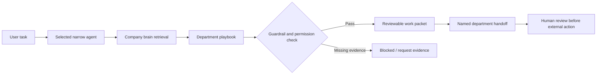
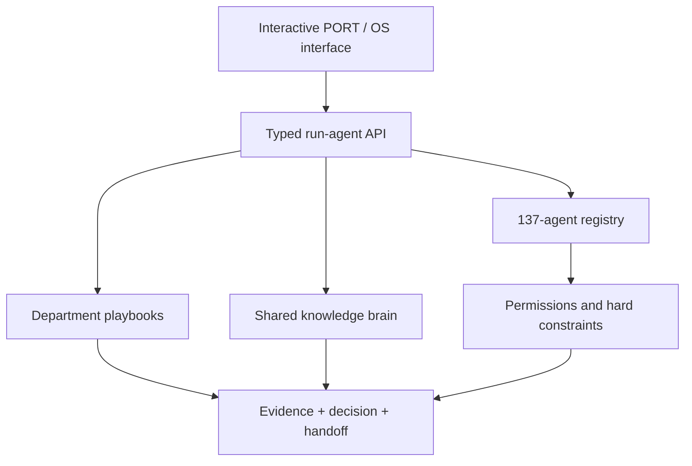

# IMP-01 — PORT / OS: Import Company Agent Operating System

> **Status:** Executable reference implementation  
> **Deployment context:** Illustrative import-company operations; not a client engagement  
> **Runtime mode:** Deterministic reference engine; no external model or company system is connected

## Concept

PORT / OS is a working map of 137 narrow agents across seven departments. A reviewer can open any agent, give it a task, and receive a structured result containing the evidence used, the process followed, the decision made, the hard constraint applied, and the next departmental owner.

The center of the system is a shared company brain containing versioned supplier, product, logistics, customs, finance, customer, market, and policy records. The same knowledge and control rules therefore ground every department instead of each agent improvising from a separate prompt.

## Product and commercialization guide

The complete [PORT / OS B2B SaaS Playbook](PORT-OS-B2B-SAAS-PLAYBOOK.md) explains:

- how to operate and demonstrate the current prototype;
- how to convert it into a six-week paid pilot;
- the production architecture and prototype-to-product backlog;
- a Bolivia-focused offer, pricing hypotheses, outreach, and 90-day launch plan;
- country-pack expansion into Peru, Paraguay, Chile, and wider Latin America; and
- reuse of the control-plane architecture for logistics, distribution, procurement, construction, agro-export, professional services, and ecommerce.

The [Spanish six-week pilot proposal](PORT-OS-PILOT-OFFER-ES.md) is a ready-to-customize commercial template for Bolivian prospects, with scope, exclusions, controls, acceptance criteria, pricing placeholders, and next steps.

## What is real

- A typed registry that asserts exactly **137 agents** at runtime
- Seven departments with explicit purposes, permissions, guardrails, and downstream owners
- Twelve representative knowledge records across eight operational domains
- A working `POST /api/run-agent` endpoint
- Evidence selection, process steps, decision, confidence, constraint, and handoff output
- An interactive responsive interface for browsing and running every registered agent
- Honest labeling of reference data and deterministic execution mode

The current engine is intentionally deterministic. It proves the orchestration, permissions, evidence flow, API contract, and interface without hiding behavior behind a model call. A model adapter can be added later at the language-heavy steps while keeping the same control plane.

## The seven departments

| Department | Agents | Operational tree |
|---|---:|---|
| Sales | 21 | ICP → sourcing → enrichment → outreach → call prep → CRM handoff |
| Deals | 18 | reply triage → qualification → booking → proposal → negotiation → debrief |
| Marketing | 20 | performance → strategy → creation → repurposing → distribution → QA |
| Operations | 24 | PO → supplier → documents → customs → freight → warehouse → incident response |
| Intelligence | 17 | company → supplier → market → regulatory → logistics → risk signals |
| Customer | 19 | support → order status → claims → health → churn → escalation → reporting |
| Back Office | 18 | invoicing → matching → cash → contracts → controls → close → audit |
| **Total** | **137** | |

## The flow



## The system



## Hard constraint

No agent can autonomously send a message, book freight, promise a customer date, move money, change a contract, or perform a destructive write. Those actions require deterministic validation and a human approval boundary even after a future LLM adapter is connected.

## Defensible decision

The reference release uses a deterministic executor rather than calling an LLM for every agent. This produces less impressive prose, but it makes runs reproducible, keeps the control flow inspectable, avoids fake autonomy, and lets the API and permission model be tested before language intelligence is introduced.

The future model boundary is narrow: classification, extraction, summarization, and drafting may use a model; policy checks, approvals, calculations, idempotency, and side effects remain deterministic.

## Something deliberately killed

The first release does **not** animate agents pretending to work in the background and does not run autonomous agent-to-agent loops. Those features create activity without proving value. Every implemented run starts with a concrete task and ends with a visible, reviewable artifact and owner.

## Repository structure

```text
IMP-01 Import Company Agent Operating System/
├── README.md
├── PORT-OS-B2B-SAAS-PLAYBOOK.md
├── PORT-OS-PILOT-OFFER-ES.md
└── site/
    ├── app/
    │   ├── api/run-agent/route.ts
    │   ├── lib/agent-system.ts
    │   ├── page.tsx
    │   └── globals.css
    ├── .openai/hosting.json
    └── package.json
```

## Verification

1. The registry throws during startup unless the generated catalog contains exactly 137 agents.
2. The production build compiles the interactive interface and API endpoint.
3. A representative Operations run returns three evidence records, four playbook steps, an explicit constraint, and a named Customer handoff.
4. Reference fixtures and runtime mode are visible in both the source documentation and product interface.

