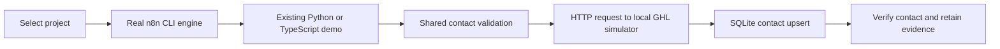

# Local portfolio demo lab

**[Salesforce RevenueOS](SALESFORCE-REVENUEOPS.md):** open **http://127.0.0.1:5680/salesforce** and run the complete local Lead/Opportunity/Case demonstration. Reproduce its acceptance report with `node demo-lab/run-salesforce.mjs`.

**[Reliability workshop](RELIABILITY-WORKSHOP.md):** open **http://127.0.0.1:5680/workshop** for all 27 project passports and interactive durable handoff recovery. The [project roadmap](PORTFOLIO-ROADMAP.md) ranks twelve new builds and deeper extensions.

**27 executable local automation demos:** your 17 cleaned showcase builds plus ten bounded examples: PM-01, EA-01, CON-01, MED-01, LEGAL-01, INS-01, INV-01, CRM-01, AGT-01 and OPS-01. The local runs use bundled synthetic fixtures.

Select **Life and data** for a separate [20-prototype collection](HUMAN-COLLECTION.md), including six data-analysis tools and three travel tools. Edit examples, inspect calculated charts and export JSON results. Inputs stay in the browser; these tools do not call n8n, a hosted model or external APIs. PORT / OS opens the public IMP-01 example. PaceAtlas AI's original repository remains unverified.

## Open and run

With the server running, open **http://127.0.0.1:5680**. Select a project and click **Run demo in n8n**. The screen shows original business output, a verified local contact and source/workflow hashes. Click **Verify all projects** to run the entire suite. Repeat a project to show the same contact being updated without duplication.

From the portfolio root, after installing Python dependencies from `requirements-dev.txt`:

```sh
npm ci --prefix demo-lab
node demo-lab/generate.mjs
node demo-lab/server.mjs
```

In another terminal:

```sh
node --test demo-lab/test.mjs
node demo-lab/verify.mjs
node demo-lab/audit-originals.mjs
```

Node 24 is required. n8n is pinned to **2.38.1** in the lockfile. Its upstream optional AI packages require legacy peer resolution here, recorded in `.npmrc`. The demo itself uses built-in Manual Trigger, Code and HTTP Request nodes; no model provider is called. Stop the server with Ctrl+C. Its database persists under `.runtime`, excluded from Git.

## What is actually verified



The existing Python demo entry point runs in a credential-free subprocess. IMP-01 calls its original TypeScript `executeAgent` function. PM-01 and EA-01 execute new deterministic scenario functions. The contact fixture is a separate synthetic relationship record; it is not extracted from every business demo's output.

These are showcase integration wrappers around original business logic. They do **not** execute all nodes in the original 16 business workflows, replace PostgreSQL with SQLite, or prove hosted GHL behavior. The original node/version/credential types are checked against installed n8n classes in [original-node-compatibility.json](../reports/original-node-compatibility.json).

Real n8n execution evidence is in [n8n-local-executions.json](../reports/n8n-local-executions.json). Wall duration includes CLI import/startup; engine duration measures only workflow execution. These are one-run functional timings, not a load benchmark or an SLO.

## GHL simulator boundary

The simulator implements a narrow contact-upsert subset with a unique location/email constraint and preserved contact ID. Tests exercise updates, 20 concurrent replays, invalid location/email, missing credential, wrong API version, cross-origin rejection, 429 with Retry-After, and a timeout after a committed write. It uses SQLite persistence and a clearly local-only demonstration credential.

It is **not** the HighLevel product, its UI, its full duplicate policy, a native snapshot, its workflow engine, or an OAuth server. It never sends messages. Hosted GHL verification still needs an authorized test sub-account. See the [GHL setup runbook](../integrations/ghl-n8n/README.md) for the account-dependent acceptance steps and the [official upsert contract](https://marketplace.gohighlevel.com/docs/ghl/contacts/upsert-contact/index.html).

## Inspect in the n8n editor

The CLI imports a workflow before each execution using its stable `local-PROJECT` ID. You can inspect the generated JSON in `workflows/`, or run `node demo-lab/n8n.mjs start` and finish n8n's local owner setup yourself. Do not run editor executions and the lab verification simultaneously: the default local runner broker uses port 5679. The lab at 5680 can remain available for viewing.

The CLI logs a missing optional internal Python-runner warning. All n8n Code nodes here use JavaScript; Python business logic runs through the dedicated local service, so that optional runner is not required for these demos.

## New demo examples

- **PM-01:** deterministic emergency phrases route to a human emergency operator; routine requests without access consent wait for access confirmation. No automatic vendor dispatch.
- **EA-01:** duplicate IDs collapse, unauthorized commitments are excluded, and unconfirmed items wait for owner review. No outgoing reminders.

These are newly built local examples, not additional historical client engagements or completed roadmap flagships.

## Recording script

1. Open the lab and identify the cleaned client build or new example.
2. Run one project. Show the original logic output and source hash.
3. Show the contact ID and rerun to demonstrate an update.
4. Run the simulator tests to demonstrate failures and uncertain-write recovery.
5. State the exact boundary: real local n8n, synthetic data, simulated GHL, original full production integrations not connected.

**Video Walkthrough:** Pending recording. The walkthrough above is ready to record.

---
Part of the [Enterprise Automation Portfolio](../README.md).

## Build Studio dashboard

The local interface now includes project stories, industry color themes, a server-observed execution timeline, per-node timing evidence, run history, thirteen-part presentations with graphical workflow diagrams, and downloadable standalone case studies. See [BUILD-STUDIO.md](BUILD-STUDIO.md) for the walkthrough and measurement definitions.
