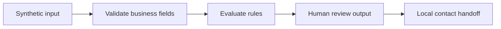
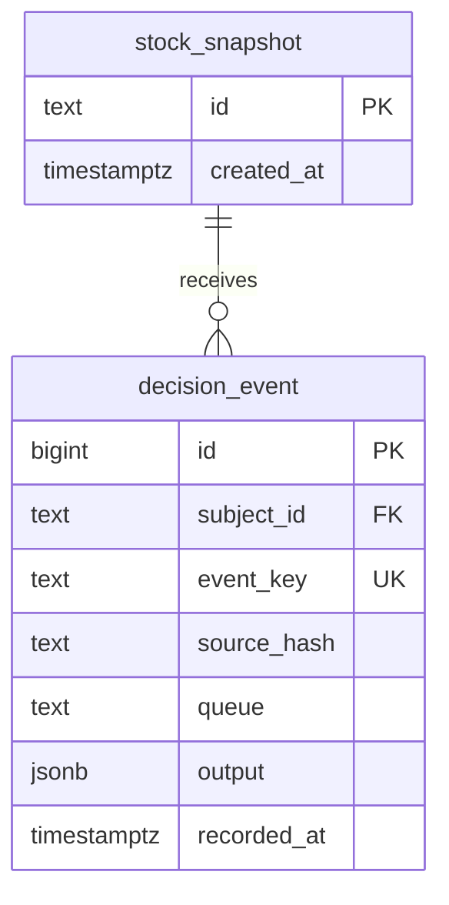

# INV-01 Bolt Supply Wholesale Reorder Desk

Status: **Populated — bounded local implementation; integration acceptance pending.**
Version: 1.0 · Owner: portfolio maintainer

**Video Walkthrough:** _Pending recording — see script in this SOP's project folder._
**Real Build Artifacts:** [Runbook and build files →](build/README.md)

## 1. Purpose

A buyer reviews the proposal; stale stock must be refreshed and no purchase is sent.

## 2. Business Problem

Stock snapshot → reservations and pack rounding → buyer review. Manual review remains explicit.

## 3. Business Goals

Make administrative decisions reproducible and inspectable; demonstrate the decision boundary before hosted deployment.

## 4. Business Requirements

Show 48 proposed units, stale-stock refresh and no-order paths; no purchase is sent.

## 5. Functional Requirements

Validate synthetic input, calculate the decision, retain review requirements and return machine-readable evidence.

## 6. Technical Requirements

Node.js 24+, repository source modules, n8n dependencies for the dashboard. PostgreSQL is a separate proposed persistence target.

## 7. Dependencies

[Shared runtime](../../server.mjs), [source modules](../../catalog.mjs) and [build runbook](build/README.md).

## 8. Systems Used

JavaScript business rules, n8n orchestration, local HTTP endpoints and SQLite evidence store. GHL is simulated; PostgreSQL is proposed.

## 9. Roles

Presenter operates the local demo; a domain reviewer evaluates the decision; an integration owner handles hosted acceptance.

## 10. Responsibilities

The presenter distinguishes source assertions from live provider evidence. The reviewer owns approvals and business outcomes.

## 11. Workflow Overview

Stock snapshot → reservations and pack rounding → buyer review.

## 12. Detailed Workflow Steps

Run the standalone script; inspect each assertion; start the lab; run the selected n8n demo; inspect node results, business output and saved evidence.

## 13. Decision Tree

Show 48 proposed units, stale-stock refresh and no-order paths; no purchase is sent.

## 14. Automation Logic

Source is [business-expansion.mjs](../../business-expansion.mjs). The build runner imports it without duplicating business logic.

## 15. Trigger Conditions

Explicit manual script execution or dashboard run. No background schedule, public webhook or autonomous external action is installed.

## 16. Data Validation

The imported function validates its typed fields; evaluation fixtures cover accepted and rejected cases. PostgreSQL constraints protect the proposed storage shape, not every domain rule.

## 17. Error Handling

Assertion failures exit nonzero. The dashboard records failed runs. Preserve the failing input and source revision for diagnosis.

## 18. Retry Logic

No business-action retry worker exists. Review uncertain external outcomes before adding any future retry.

## 19. Fallback Procedures

Stop at human review and retain the failed evidence. The standalone script can isolate business logic from n8n/API issues.

## 20. Manual Override

No administrative bypass is implemented. Change reviewed source or synthetic fixtures explicitly; never edit saved evidence to convert a failure into a pass.

## 21. Exception Handling

Show 48 proposed units, stale-stock refresh and no-order paths; no purchase is sent.

## 22. Notifications

No messages are sent. Future notifications require a recipient policy and provider acceptance tests.

## 23. Audit Logs

The current runtime records run IDs, source hashes, node evidence and output in SQLite. The proposed SQL decision_event table is not yet a runtime audit trail.

## 24. Security

Local synthetic inputs and loopback API reduce exposure. Production deployment requires authenticated intake, secret storage and least-privilege provider access.

## 25. Permissions

No production role-based access control is claimed. Human review queues describe responsibility; they do not authenticate a reviewer.

## 26. Compliance

No legal, clinical, insurance or regulatory certification is asserted. Domain professionals must approve real operating rules.

## 27. Performance Metrics

Report observed local execution duration and case counts separately from throughput, availability and production latency, which remain unmeasured.

## 28. KPIs

Buyer review time and stockout frequency

## 29. Testing Procedure

Run [demo.js](build/demo.js); parse the workflow JSON; confirm its copy matches the generated local workflow; structurally inspect SQL. Engine execution and hosted acceptance remain separate gates.

## 30. Deployment

Follow [build runbook](build/README.md). Complete PostgreSQL execution, adapter tests and dedicated provider test-location acceptance before hosted release.

## 31. Maintenance

When source rules change, rerun assertions and regenerate local workflows before refreshing copied build artifacts. Review fictional rule assumptions with domain owners.

## 32. Version History

| Version | Date | Change |
|---|---|---|
| 1.0 | 2026-09-10 | Added bounded build artifacts, proposed SQL and operating procedure. |

## 33. Future Improvements

Wire durable persistence; add authenticated intake and reviewer actions; prove provider recovery; record the walkthrough; collect measured outcomes.

## 34. Appendix

Domain columns are specified in [schema.sql](build/schema.sql). Diagram shows key relationships; SQL is authoritative for additional fields and constraints.

## 35. Troubleshooting

Connection refused: start the local server on port 5680. Missing module: run from the intact repository with Node 24+. Assertion failure: inspect the named case before changing expectations.

## 36. Recovery Procedure

Keep the failed run and correct configuration or source. Rerun synthetic inputs; compare saved evidence. Hosted uncertainty must be reconciled at the provider before retry.

## 37. Frequently Asked Questions

Does this execute hosted GHL? No. Does proposed SQL replace SQLite? No. Does the local n8n workflow execute source code through HTTP? Yes, when the local server is running.

## 38. Technical Notes

Workflow artifact is copied exactly from demo-lab/workflows. Local contact deduplication does not establish business-event idempotency. SQL event keys need a future writer to enforce them operationally.

## 39. Business Notes

The business scenario is bounded and demonstrable. No specific client delivery history, production scale or financial result is inferred.

## 40. Estimated Time Savings

Unmeasured. Collect manual review time and comparable assisted review time before making a savings claim.

## 41. ROI Analysis

No ROI value is claimed. Calculate benefit from observed volume and net time saved, subtracting infrastructure and review costs.

## 42. Risk Assessment

Primary risks: treating a review proposal as an executed action, stale domain rules, conflating synthetic fixtures with production evidence and treating proposed SQL as deployed persistence.

## 43. Lessons Learned

Expose decisions, exceptions and evidence separately so a reviewer can inspect the implementation boundary.

## 44. Related SOPs

[Portfolio verification](../../VERIFICATION.md), [build status](../../BUILD-ARTIFACT-STATUS.md) and [project overview](README.md).
---
*Part of the Enterprise Automation Portfolio. See [project build index](../README.md).*
